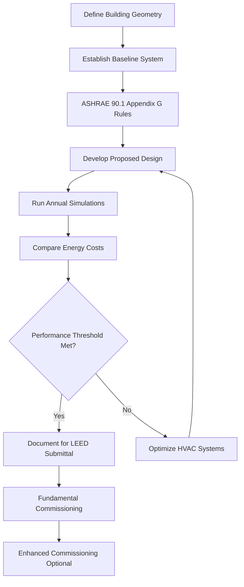
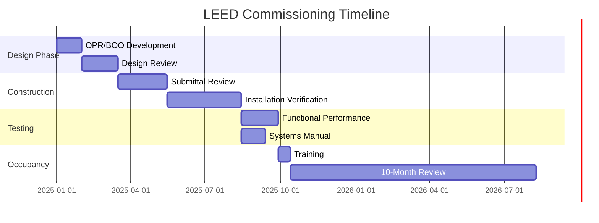

## Overview

The Leadership in Energy and Environmental Design (LEED) Accredited Professional credential validates expertise in sustainable building design and operation. For HVAC professionals, LEED AP certification demonstrates competency in integrating mechanical systems with green building strategies, optimizing energy performance, and achieving indoor environmental quality objectives within the USGBC rating system framework.

HVAC systems typically account for 40-60% of building energy consumption and directly impact multiple LEED credit categories, making mechanical engineering knowledge critical to high-performance building certification.

## LEED Rating Systems and HVAC Impact

LEED v4.1 and LEED v5 encompass multiple rating systems, each with specific mechanical system considerations:

| Rating System | Primary HVAC Focus | Key Challenges |
|---------------|-------------------|----------------|
| BD+C (Building Design & Construction) | Energy optimization, commissioning, refrigerant management | Meeting EAc2 energy performance thresholds |
| O+M (Operations & Maintenance) | Operational efficiency, preventive maintenance, ongoing commissioning | Maintaining performance over building lifecycle |
| ID+C (Interior Design & Construction) | Ventilation effectiveness, thermal comfort, acoustics | Coordinating with base building systems |
| ND (Neighborhood Development) | District systems, reduced heat island effect | Large-scale thermal infrastructure |

## Energy Performance Modeling

The Energy and Atmosphere (EA) credit category drives HVAC system selection and design optimization. Energy performance is quantified through whole-building simulation comparing proposed design against ASHRAE 90.1 Appendix G baseline.

### Performance Cost Index

The percentage improvement over baseline determines points awarded:

$$
\text{PCI} = \frac{C_{\text{baseline}} - C_{\text{proposed}}}{C_{\text{baseline}}} \times 100\%
$$

where $C_{\text{baseline}}$ represents baseline building energy cost and $C_{\text{proposed}}$ represents proposed design energy cost.

For new construction under LEED v4.1 BD+C, point thresholds are:

| Points | Required Performance Improvement |
|--------|----------------------------------|
| 1-2 | 6-10% better than baseline |
| 3-5 | 12-18% better than baseline |
| 6-10 | 20-30% better than baseline |
| 11-18 | 32-50% better than baseline |

### Energy Modeling Methodology

ASHRAE 90.1 Appendix G establishes baseline HVAC system types based on building characteristics:

- System 1-2: Residential systems (furnace/AC or heat pump)
- System 3-4: PSZ systems for small commercial (< 25,000 ft²)
- System 5-6: Packaged VAV for mid-size buildings (25,000-150,000 ft²)
- System 7-8: VAV with central plant for large buildings (> 150,000 ft²)

## Indoor Environmental Quality Credits

LEED IEQ prerequisites and credits establish minimum ventilation rates, thermal comfort standards, and contaminant control measures directly affecting mechanical design.

### Ventilation Rate Procedure

EQ Prerequisite 1 mandates compliance with ASHRAE 62.1 Ventilation for Acceptable Indoor Air Quality. The required outdoor air intake combines zone requirements:

$$
V_{ot} = \sum_{i=1}^{n} \left( R_p \times P_z + R_a \times A_z \right) \times E_z
$$

where:
- $V_{ot}$ = total outdoor air requirement (CFM)
- $R_p$ = people outdoor air rate (CFM/person)
- $P_z$ = zone population
- $R_a$ = area outdoor air rate (CFM/ft²)
- $A_z$ = zone floor area (ft²)
- $E_z$ = zone air distribution effectiveness

### Enhanced Indoor Air Quality Strategies

| Strategy | LEED Credits | Implementation Approach |
|----------|--------------|-------------------------|
| Increased Ventilation | EQc2 | 30% above ASHRAE 62.1 minimum |
| CO₂ Monitoring | EQc1 | DCV systems with 1,050 ppm setpoint |
| Air Filtration | EQc3 | MERV 13 minimum, MERV 14 preferred |
| Thermal Comfort | EQc7 | ASHRAE 55 compliance verification |

## Refrigerant Management

EAc6 penalizes refrigerants with high global warming potential (GWP) and ozone depletion potential (ODP). The environmental impact is calculated:

$$
\text{LCGWP} + \text{LCODP} = \left[ \left( GWP \times L_r \times L \right) + \left( ODP \times L_r \times L \right) \right] \times M
$$

where:
- $GWP$ = global warming potential (kg CO₂ equivalent/kg refrigerant)
- $ODP$ = ozone depletion potential (kg CFC-11 equivalent/kg refrigerant)
- $L_r$ = refrigerant leakage rate (%/year)
- $L$ = equipment life (years)
- $M$ = refrigerant charge (kg)

Low-GWP refrigerants (R-32, R-454B, R-1234ze) and refrigerant-free technologies (evaporative cooling, radiant systems) maximize credit achievement.

## Commissioning Requirements

Fundamental Commissioning (Cx) is a LEED prerequisite ensuring HVAC systems operate as designed. Enhanced Commissioning extends this process.

Enhanced Commissioning (EAc1) includes:
- Commissioning authority engagement during design development
- Review of contractor submittals
- Development of systems manual
- Verification of operator training
- Post-occupancy review within 10 months

## Certification Pathway

LEED AP with specialty requires:
1. Passing LEED Green Associate exam (prerequisite)
2. Passing specialty exam (BD+C, O+M, ID+C, or ND)
3. Professional experience in green building (documented via application)
4. Continuing education: 30 hours every 2 years

For HVAC professionals, BD+C and O+M specialties align most directly with mechanical engineering practice.

## Strategic Value for HVAC Engineers

LEED AP certification enables mechanical engineers to:
- Lead integrated design charrettes focusing on energy optimization
- Conduct trade-off analyses between first cost and LEED point achievement
- Navigate energy modeling software (eQUEST, EnergyPlus, IES-VE)
- Specify equipment meeting performance and environmental criteria
- Coordinate commissioning activities ensuring operational performance
- Document technical submissions for USGBC review

Buildings pursuing LEED certification require mechanical engineers who understand the credit structure, modeling requirements, and documentation procedures. This credential differentiates professionals in the sustainable building marketplace.

## Integration with ASHRAE Standards

LEED references multiple ASHRAE standards forming the technical foundation:

- **ASHRAE 90.1**: Energy Standard for Buildings (baseline for EA credits)
- **ASHRAE 62.1**: Ventilation for Acceptable Indoor Air Quality (IEQ prerequisite)
- **ASHRAE 55**: Thermal Environmental Conditions for Human Occupancy (IEQ credits)
- **ASHRAE 189.1**: Standard for Design of High-Performance Green Buildings
- **ASHRAE Guideline 0**: The Commissioning Process (Cx activities)

Understanding these standards and their application within LEED framework constitutes core competency for the LEED AP credential.
