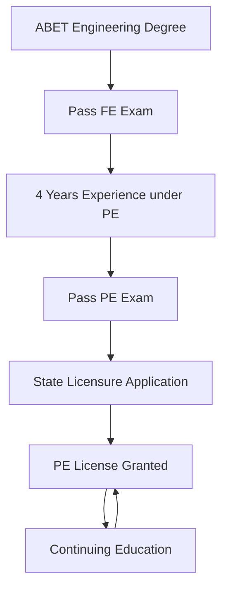
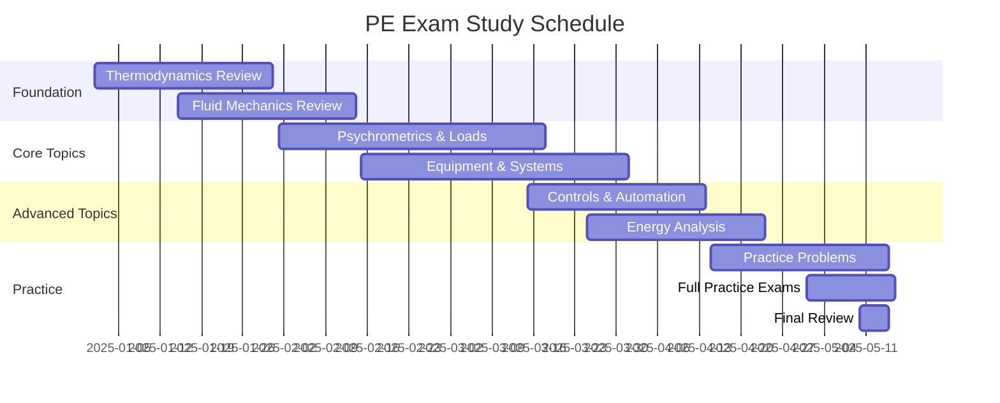

## Overview of Professional Engineer Licensure

The Professional Engineer (PE) license represents the highest standard of competence in the engineering profession. For HVAC mechanical engineers, PE licensure signifies mastery of thermodynamic principles, system design methodologies, and legal authority to approve engineering documents for public use. The license is regulated at the state level but follows nationally standardized examination protocols administered by the National Council of Examiners for Engineering and Surveying (NCEES).

PE licensure is legally required for engineers who offer services directly to the public, sign and seal engineering plans, or act as the responsible engineer of record. In HVAC practice, this applies to consulting engineers, system designers for building permits, and professionals providing expert testimony.

## Licensure Requirements

### Education Requirements

Candidates must possess a bachelor's degree from an ABET-accredited engineering program. Mechanical engineering degrees provide the strongest foundation for HVAC practice, covering thermodynamics, fluid mechanics, heat transfer, and system dynamics. Alternative pathways exist for degrees from non-accredited programs, typically requiring additional documentation and experience verification.

### Experience Requirements

Most states require four years of progressive engineering experience under licensed PE supervision. Qualifying experience includes:

- **Design work**: Load calculations, equipment selection, duct and piping design
- **Analysis tasks**: Energy modeling, psychrometric analysis, system optimization
- **Project management**: Construction administration, specification development, commissioning oversight
- **Research and development**: Advanced HVAC technologies, computational modeling

Experience must demonstrate increasing responsibility and technical complexity, documented through detailed work records reviewed by the licensing board.

### Examination Pathway

## Fundamentals of Engineering (FE) Exam

The FE exam serves as the first step toward PE licensure. The Mechanical FE exam contains 110 questions covering:

| Subject Area | Approximate Questions | Relevance to HVAC |
|--------------|----------------------|-------------------|
| Mathematics | 7-11 | Differential equations for transient analysis |
| Probability and Statistics | 4-6 | Uncertainty analysis, reliability |
| Computational Tools | 4-6 | Simulation software fundamentals |
| Ethics and Professional Practice | 4-6 | Code compliance, professional responsibility |
| Engineering Economics | 4-6 | Life-cycle cost analysis |
| Electricity and Magnetism | 6-9 | Motor selection, electrical loads |
| Statics | 5-8 | Equipment mounting, structural loads |
| Dynamics | 6-9 | Vibration analysis, rotating equipment |
| Mechanics of Materials | 6-9 | Stress analysis, thermal expansion |
| Material Properties | 6-9 | Refrigerant properties, material selection |
| Fluid Mechanics | 6-9 | Pressure drop, pump and fan selection |
| Thermodynamics | 9-12 | Cycle analysis, psychrometrics |
| Heat Transfer | 9-12 | Conduction, convection, radiation |
| Measurements | 5-8 | Instrumentation, sensor calibration |
| Mechanical Design | 9-12 | Component sizing, system integration |

Passing score typically requires 50-60% correct answers, with adaptive scoring based on question difficulty.

## PE Mechanical HVAC and Refrigeration Exam

The PE exam focuses exclusively on HVAC and refrigeration systems for candidates choosing this depth module. The exam structure includes 80 questions over 8 hours, divided into breadth (40 questions) and depth (40 questions) sections.

### Breadth Section Topics

**Equipment and Systems (20-25%)**

This section tests knowledge of HVAC equipment selection, sizing, and application. Key calculation types include:

Cooling capacity for vapor compression systems:

$$Q_c = \dot{m}_r (h_1 - h_4)$$

where $\dot{m}_r$ is refrigerant mass flow rate, $h_1$ is enthalpy at evaporator outlet, and $h_4$ is enthalpy at expansion device inlet.

Coefficient of performance for cooling cycles:

$$COP_c = \frac{Q_c}{W_{comp}} = \frac{h_1 - h_4}{h_2 - h_1}$$

**Energy Analysis (15-20%)**

Energy consumption calculations follow ASHRAE Standard 90.1 methodologies. Annual energy use for variable-volume systems:

$$E_{annual} = \int_0^{8760} \left[ \dot{m}_{sa}(t) c_p \Delta T(t) \right] dt$$

Part-load efficiency requires bin method analysis or detailed simulation incorporating equipment performance curves.

**Codes and Standards (10-15%)**

PE exam questions reference ASHRAE Standards 15, 34, 62.1, 90.1, and 189.1, along with International Mechanical Code (IMC) requirements. Understanding code-mandated ventilation rates, safety requirements, and energy efficiency thresholds is necessary.

Minimum ventilation per ASHRAE 62.1:

$$V_{oz} = R_p P_z + R_a A_z$$

where $R_p$ is occupant ventilation rate, $P_z$ is zone population, $R_a$ is area ventilation rate, and $A_z$ is zone floor area.

**Heat Transfer and Fluid Flow (20-25%)**

Problems involve heat exchanger effectiveness-NTU method, pressure drop through distribution systems, and transient thermal analysis.

Heat exchanger effectiveness:

$$\epsilon = \frac{Q_{actual}}{Q_{max}} = \frac{C_h(T_{h,in} - T_{h,out})}{C_{min}(T_{h,in} - T_{c,in})}$$

Pressure drop in ductwork per ASHRAE Fundamentals:

$$\Delta P = f \frac{L}{D} \frac{\rho V^2}{2}$$

where $f$ is friction factor from Moody diagram, $L$ is duct length, $D$ is hydraulic diameter, $\rho$ is air density, and $V$ is velocity.

**Psychrometrics and Load Calculations (15-20%)**

Sensible heat ratio calculations and cooling coil performance analysis are core competencies:

$$SHR = \frac{q_s}{q_s + q_l}$$

Mixed air conditions for economizer operation:

$$h_{ma} = \frac{\dot{m}_{oa} h_{oa} + \dot{m}_{ra} h_{ra}}{\dot{m}_{oa} + \dot{m}_{ra}}$$

### Depth Section Focus Areas

The depth section provides 40 questions specifically on HVAC and refrigeration design and analysis:

**System Design and Selection**
- All-air systems: VAV, CAV, multizone, dual-duct
- Hydronic systems: Chilled water, hot water, primary-secondary pumping
- Refrigeration systems: Direct expansion, flooded evaporators, cascade cycles
- Special applications: Clean rooms, laboratories, data centers

**Controls and Automation**
- Control loop fundamentals: P, PI, PID tuning parameters
- Sequence of operations for complex systems
- Energy management strategies: Optimal start/stop, load reset, demand limiting
- Building automation system architecture

**Commissioning and Testing**
- Test and balance procedures per ASHRAE Standard 111
- Functional performance testing protocols
- Acceptance criteria and documentation requirements

## Exam Preparation Strategies

### Technical Reference Materials

NCEES provides a digital reference handbook containing equations, tables, and charts. Successful candidates supplement this with:

- **ASHRAE Handbooks**: Fundamentals, HVAC Systems and Equipment, HVAC Applications, Refrigeration
- **ASHRAE Standards**: 62.1 (Ventilation), 90.1 (Energy), 15 (Refrigerant Safety)
- **Steam Tables and Psychrometric Charts**: For property determination
- **Carrier HAP or Trane TRACE manuals**: System design methodologies

### Study Timeline

A structured 6-month preparation schedule yields optimal results:

### Problem-Solving Methodology

Time management during the 8-hour exam requires efficient problem-solving:

1. **Read question completely**: Identify what is being asked before examining given information
2. **Extract relevant data**: Note units and convert to consistent system if needed
3. **Select appropriate equations**: Reference handbook or recalled fundamental principles
4. **Solve systematically**: Show intermediate steps for complex calculations
5. **Check reasonableness**: Verify answer magnitude and units make physical sense

Average time per question is 6 minutes. Skip difficult problems initially and return after completing straightforward questions.

## Career Impact and Professional Advancement

PE licensure provides multiple career benefits:

**Legal Authority**
- Sign and seal engineering documents for permit submission
- Serve as engineer of record for building projects
- Provide expert witness testimony in legal proceedings

**Career Mobility**
- Qualify for senior design positions in consulting firms
- Meet requirements for government engineering roles
- Establish independent consulting practice

**Compensation Premium**
PE-licensed engineers earn 10-20% higher salaries than unlicensed counterparts with equivalent experience. Principal and partner positions in consulting firms typically require PE licensure.

**Professional Recognition**
State licensure demonstrates commitment to professional standards and technical excellence. PE credentials enhance client confidence and professional credibility.

## Continuing Education and License Maintenance

Most states require continuing professional development (CPD) to maintain active licensure. Typical requirements range from 15-30 professional development hours (PDH) annually. Qualifying activities include:

- **Technical coursework**: ASHRAE seminars, university courses, online training
- **Professional society participation**: Technical committee membership, conference attendance
- **Technical publications**: Peer-reviewed papers, engineering articles
- **Teaching**: University instruction, professional training delivery

ASHRAE membership provides extensive CPD opportunities through Learning Institute courses, chapter presentations, and technical committee work. Many states accept ASHRAE continuing education units (CEU) directly toward license renewal.

## Integration with Other Credentials

PE licensure complements specialized HVAC certifications:

| Credential | Focus Area | Relationship to PE |
|------------|------------|-------------------|
| LEED AP BD+C | Green building design | Enhances sustainable system knowledge |
| BEMP | Building energy modeling | Supports energy analysis expertise |
| CEM | Energy management | Provides operational perspective |
| HFDP | Healthcare facility design | Specializes PE application |
| CxA | Commissioning | Validates system performance verification |

Holding multiple credentials demonstrates breadth of expertise and commitment to professional development. Many firms seek engineers with PE plus specialized certifications for complex projects.

## Conclusion

Professional Engineer licensure represents the cornerstone credential for HVAC mechanical engineering careers. The rigorous examination process validates thermodynamic fundamentals, system design proficiency, and code compliance knowledge. PE licensure provides legal authority, career advancement opportunities, and professional recognition that distinguish engineers in competitive markets. Systematic preparation focusing on fundamental principles, practice problems, and reference material familiarity ensures examination success. The investment in PE licensure yields career-long benefits through enhanced credibility, expanded responsibilities, and increased compensation potential.