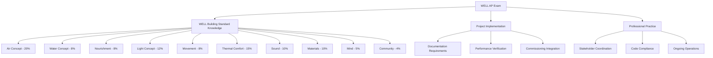

## Overview

The WELL Accredited Professional (WELL AP) credential demonstrates expertise in designing, constructing, and operating buildings that advance human health and wellness. For HVAC professionals, this certification bridges the gap between traditional environmental control and occupant-centric design, requiring deep understanding of air quality, thermal comfort, acoustic performance, and lighting interactions with mechanical systems.

The WELL Building Standard operates on ten core concepts, with HVAC systems directly influencing Air, Thermal Comfort, Sound, and indirectly affecting Light, Water, and Mind concepts through system design choices.

## HVAC-Relevant WELL Concepts

### Air Quality Management

WELL's Air concept establishes stringent requirements beyond minimum code compliance, focusing on contaminant reduction and ventilation effectiveness.

**Particulate Matter Control**

The relationship between ventilation rate and particle concentration follows first-order decay when outdoor concentrations remain constant:

$$\frac{dC_{in}}{dt} = \frac{Q}{V}(C_{out} - C_{in}) + \frac{S}{V} - kC_{in}$$

Where:
- $C_{in}$ = indoor particle concentration (μg/m³)
- $C_{out}$ = outdoor particle concentration (μg/m³)
- $Q$ = ventilation rate (m³/h)
- $V$ = space volume (m³)
- $S$ = internal generation rate (μg/h)
- $k$ = deposition/removal coefficient (h⁻¹)

WELL requires PM₂.₅ concentrations below 15 μg/m³ and PM₁₀ below 50 μg/m³, necessitating MERV 13+ filtration in most applications.

**Ventilation Standards Comparison**

| Standard | Outdoor Air Requirement | CO₂ Limit | VOC Requirements |
|----------|------------------------|-----------|------------------|
| ASHRAE 62.1 | 17 cfm/person (office) | None specified | Source control |
| WELL v2 | 40 cfm/person minimum | 800 ppm above outdoor | Total VOC < 500 μg/m³ |
| Passive House | 30 cfm/person | 1000 ppm max | Material restrictions |
| LEED v4.1 | ASHRAE 62.1 + 30% | None specified | Low-emitting materials |

### Thermal Comfort Physics

WELL requires thermal comfort compliance using the predicted mean vote (PMV) model from ASHRAE Standard 55, targeting -0.5 < PMV < +0.5 for at least 90% of occupied hours.

The PMV equation integrates six factors:

$$PMV = [0.303e^{-0.036M} + 0.028] \times L$$

Where $L$ represents the thermal load on the body:

$$L = (M - W) - H - E_{sk} - C_{res} - E_{res}$$

Terms include:
- $M$ = metabolic rate (W/m²)
- $W$ = external work (W/m²)
- $H$ = sensible heat loss (W/m²)
- $E_{sk}$ = evaporative heat loss from skin (W/m²)
- $C_{res}$ = convective heat loss from respiration (W/m²)
- $E_{res}$ = evaporative heat loss from respiration (W/m²)

**Individual Thermal Control**

WELL emphasizes personal control, requiring operable windows or individual temperature adjustments within 10 feet of 30% of workstations. For HVAC design, this translates to:

1. Zone-level VAV boxes with individual thermostats
2. Radiant panels with local controls
3. Underfloor air distribution with diffuser control
4. Dedicated outdoor air systems allowing local temperature adjustment

### Sound and Vibration Control

Acoustic performance directly impacts mechanical system design. WELL specifies maximum background noise levels and reverberation times.

**Background Noise Criteria**

| Space Type | WELL Requirement | ASHRAE Guideline | Typical HVAC Contribution |
|------------|------------------|------------------|---------------------------|
| Private Office | NC 35 / 40 dBA | NC 30-35 | 28-32 dBA |
| Open Office | NC 40 / 45 dBA | NC 35-40 | 33-37 dBA |
| Conference Room | NC 30 / 35 dBA | NC 25-30 | 23-27 dBA |
| Classroom | NC 30 / 35 dBA | NC 25-30 | 23-27 dBA |

Achieving these levels requires attention to:
- Duct velocity limitations (1200-1800 fpm for low-pressure systems)
- Equipment vibration isolation per ASHRAE Applications Chapter 49
- Duct silencers at fan discharges and branches
- Proper diffuser selection to avoid regenerated noise

## WELL AP Examination Structure

## Integration with HVAC Design Process

### Demand-Controlled Ventilation Considerations

While ASHRAE 62.1 permits DCV based on occupancy sensing, WELL's enhanced ventilation rates (40 cfm/person minimum) increase the baseline airflow, reducing DCV energy savings potential.

The effective ventilation rate accounting for air distribution effectiveness:

$$V_{oz} = \frac{R_p \times P_z + R_a \times A_z}{E_v}$$

Where:
- $V_{oz}$ = outdoor air requirement for zone (cfm)
- $R_p$ = outdoor air per person (40 cfm for WELL)
- $P_z$ = zone population
- $R_a$ = outdoor air per area (cfm/ft²)
- $A_z$ = zone area (ft²)
- $E_v$ = ventilation effectiveness (0.8-1.2)

### Energy Recovery Integration

WELL's increased ventilation loads make energy recovery economically attractive. The sensible effectiveness drives heating/cooling load reduction:

$$\varepsilon_s = \frac{T_{supply} - T_{outdoor}}{T_{return} - T_{outdoor}}$$

For a 10,000 cfm system in a climate with 40°F design temperature difference, 75% effective heat recovery reduces annual heating energy by approximately:

$$Q_{saved} = 1.08 \times 10000 \times 0.75 \times 40 \times HDD \times 24 = \text{~650,000 kBtu/year}$$

## Certification Pathway

**Eligibility Requirements:**
- Professional involvement in building design, construction, or operations
- No prerequisite certifications required
- Recommended 2+ years experience with building systems

**Examination Format:**
- 100 multiple-choice questions
- 2-hour time limit
- Passing score: 77/100
- Computer-based testing at Prometric centers

**Continuing Education:**
- 20 WELL CE hours every 2 years
- ASHRAE conferences and seminars applicable
- Project documentation experience counts toward renewal

## Strategic Value for HVAC Professionals

WELL AP certification positions HVAC engineers to lead health-focused building projects by:

1. **Quantifying health impacts** of mechanical system decisions through metrics like air changes per hour, filtration efficiency, and thermal comfort compliance
2. **Optimizing first costs** by integrating WELL requirements during design development rather than retrofitting
3. **Differentiating services** in markets where building wellness drives tenant attraction and retention
4. **Bridging disciplines** between architecture, interior design, and MEP engineering through shared health objectives

The credential complements PE licensure and LEED AP credentials, particularly for projects pursuing multiple certifications where HVAC system optimization serves both energy and health goals.

## Alignment with ASHRAE Standards

WELL explicitly references and extends multiple ASHRAE standards:

- **ASHRAE 55**: Thermal comfort baseline, extended with stricter PMV requirements
- **ASHRAE 62.1**: Ventilation rates increased; 40 cfm/person vs. 17 cfm/person
- **ASHRAE 90.1**: Energy compliance required, despite higher ventilation loads
- **ASHRAE 188**: Legionella risk management for water systems
- **ASHRAE 189.1**: High-performance building standard alignment

HVAC professionals pursuing WELL AP should maintain strong ASHRAE Standard 62.1 and 55 knowledge, as exam questions frequently test the distinction between minimum code compliance and WELL's enhanced requirements.

## Practical Application

WELL AP knowledge enables HVAC designers to specify systems meeting both wellness and energy objectives. Key strategies include:

- **Dedicated outdoor air systems (DOAS)** with energy recovery to handle elevated ventilation loads efficiently
- **Displacement ventilation** or underfloor air distribution for improved ventilation effectiveness (Ev > 1.0)
- **High-efficiency filtration** (MERV 13-16) with proper fan selection accounting for increased pressure drop
- **Individual thermal controls** through radiant systems, VAV terminals, or personal environmental modules
- **Low-velocity duct design** (< 1500 fpm) to achieve acoustic performance targets

The certification validates the technical capability to transform building codes' minimum requirements into health-optimized environments through physics-based mechanical system design.
