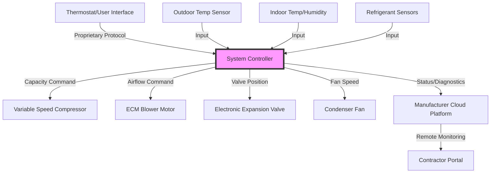

## Overview

Manufacturer certifications represent product-specific credentials that validate contractor competency in installing, servicing, and maintaining particular equipment brands. Unlike industry-wide certifications (NATE, EPA), manufacturer programs focus on proprietary system designs, diagnostic procedures, control sequences, and warranty compliance requirements specific to individual equipment lines.

These programs serve dual purposes: ensuring proper equipment installation and service while establishing marketing differentiation for certified contractors. Manufacturers invest significantly in training infrastructure to reduce warranty claims, improve customer satisfaction, and build contractor loyalty within competitive markets.

## Certification Structure and Tiers

### Dealer Authorization Levels

Most manufacturers employ tiered certification structures that reward higher performance with enhanced benefits and exclusivity rights.

**Entry Level Dealer**
- Basic product knowledge training completed
- Minimum sales volume requirements met
- General liability and workers compensation insurance verified
- EPA Section 608 certification for all technicians
- Standard warranty processing authorization

**Preferred/Premier Dealer**
- Advanced training completion across multiple product lines
- Higher annual sales thresholds achieved
- Customer satisfaction scores exceeding manufacturer benchmarks
- Inventory stocking requirements met
- Extended warranty offerings available

**Elite/Factory Authorized Dealer**
- Comprehensive training on complete product portfolio
- Significant market presence and sales performance
- Factory-certified lead technicians on staff
- Priority technical support access
- Co-marketing fund participation
- Exclusive product access (advanced equipment, beta programs)

### Manufacturer-Specific Programs

| Manufacturer | Program Name | Key Requirements |
|--------------|--------------|-----------------|
| Carrier | Factory Authorized Dealer | Infinity system training, minimum sales quota, customer satisfaction ratings |
| Trane | Comfort Specialist | Training on communicating controls, comfort analysis certification |
| Lennox | Premier Dealer | PureComfort system certification, diagnostic tool proficiency |
| York | Affinity Dealer | Affinity series training, online certification completion |
| Mitsubishi Electric | Diamond Contractor | Ductless system installation certification, performance standards |
| Daikin | Comfort Pro | VRV/VRF training, inverter technology certification |
| Bosch | Certified Installer | Geothermal system design and installation training |
| Rheem | Pro Partner | Heat pump technology certification, customer service standards |

## Training Requirements and Technical Content

### Refrigeration Cycle Application

Manufacturer training emphasizes brand-specific refrigerant circuit designs and operating characteristics that deviate from generic vapor-compression principles.

**Capacity Modulation Technology**

Variable-speed compressor operation fundamentally alters traditional refrigeration analysis. For inverter-driven scroll compressors, capacity modulates based on motor frequency:

$$Q_{cooling} = \dot{m}_{ref} \cdot (h_{evap,out} - h_{evap,in}) \cdot \frac{f_{actual}}{f_{rated}}$$

Where:
- $Q_{cooling}$ = instantaneous cooling capacity (Btu/h)
- $\dot{m}_{ref}$ = refrigerant mass flow rate at rated conditions (lbm/h)
- $h_{evap,out}$ = enthalpy leaving evaporator (Btu/lbm)
- $h_{evap,in}$ = enthalpy entering evaporator (Btu/lbm)
- $f_{actual}$ = actual compressor frequency (Hz)
- $f_{rated}$ = rated compressor frequency (Hz)

Training covers the relationship between frequency modulation, compression ratio, and coefficient of performance across operating ranges.

### Control System Architecture

Modern communicating systems require understanding of proprietary communication protocols and control logic.

Training programs teach technicians to navigate manufacturer-specific diagnostic interfaces, interpret fault codes unique to each platform, and understand control algorithms governing system operation.

### Heat Transfer Optimization

Equipment-specific heat exchanger designs affect installation and service procedures.

**Microchannel Condensers**

Aluminum microchannel heat exchangers used by several manufacturers require modified service approaches compared to traditional copper-tube, aluminum-fin designs:

$$\frac{1}{UA_{overall}} = \frac{1}{h_i A_i} + \frac{t_{wall}}{k_{Al} A_{wall}} + \frac{1}{h_o A_o}$$

Where:
- $UA_{overall}$ = overall heat transfer coefficient-area product (Btu/h·°F)
- $h_i$ = refrigerant-side heat transfer coefficient (Btu/h·ft²·°F)
- $A_i$ = internal surface area (ft²)
- $t_{wall}$ = wall thickness (ft)
- $k_{Al}$ = aluminum thermal conductivity (Btu/h·ft·°F)
- $h_o$ = air-side heat transfer coefficient (Btu/h·ft²·°F)
- $A_o$ = external surface area (ft²)

Manufacturer training addresses brazing restrictions, leak detection challenges, and cleaning procedures specific to microchannel geometries.

## Diagnostic Tools and Equipment

### Manufacturer-Specific Diagnostic Platforms

Each major manufacturer provides proprietary diagnostic tools that interface with their equipment.

**Tool Categories**
- Handheld system analyzers (wired and wireless connectivity)
- Laptop-based diagnostic software
- Smartphone applications with Bluetooth/WiFi connectivity
- Cloud-based remote monitoring platforms
- Refrigerant charging calculators and superheat/subcooling analyzers

**Training Competencies**
- Downloading and interpreting system operating data
- Accessing fault history and error code libraries
- Performing forced operation tests for component verification
- Updating control board firmware
- Configuring system parameters and dip switch settings

### Airflow Measurement and Verification

Training programs emphasize ASHRAE Standard 37-2009 compliant airflow measurement techniques adapted to specific equipment configurations.

**Temperature Rise Method for Heating**

$$CFM = \frac{Q_{input} \cdot \eta_{AFUE}}{1.08 \cdot \Delta T \cdot 60}$$

Where:
- $CFM$ = airflow rate (ft³/min)
- $Q_{input}$ = furnace input rating (Btu/h)
- $\eta_{AFUE}$ = annual fuel utilization efficiency (decimal)
- $\Delta T$ = temperature rise through furnace (°F)
- $1.08$ = constant for air properties (Btu/ft³·°F)

Manufacturers specify acceptable temperature rise ranges for their equipment, and certification programs verify technician ability to measure and adjust airflow to meet specifications.

## Warranty Authorization and Compliance

### Labor Warranty Programs

Manufacturers increasingly offer labor warranty coverage to certified dealers, transferring financial risk from contractors while ensuring qualified installation and service.

**Authorization Requirements**
- Documented installation training completion
- Proof of proper startup procedures (photos, commissioning reports)
- Registration of equipment within specified timeframe
- Use of manufacturer-approved installation materials
- Compliance with installation manual specifications

### Performance-Based Metrics

Many programs incorporate performance metrics that affect certification status:

| Metric | Measurement Period | Typical Threshold |
|--------|-------------------|-------------------|
| Callback Rate | Rolling 12 months | < 3% of installations |
| Warranty Claim Rate | Annual | < industry average |
| Customer Satisfaction | Per transaction | > 4.5/5.0 average |
| Equipment Registration | Per installation | > 90% compliance |
| Technical Support Escalations | Quarterly | Declining trend required |

Failure to maintain metrics may result in certification downgrade or revocation.

## Advanced Technology Training

### Variable Refrigerant Flow Systems

VRF/VRV certification requires understanding of refrigerant distribution to multiple indoor units from common outdoor systems.

**Refrigerant Piping Design**

Oil return velocity requirements govern pipe sizing in VRF installations:

$$v_{min} = \sqrt{\frac{2 \cdot \Delta P}{\rho_{vapor}}}$$

Where:
- $v_{min}$ = minimum refrigerant velocity for oil entrainment (ft/min)
- $\Delta P$ = pressure drop along pipe segment (lbf/ft²)
- $\rho_{vapor}$ = refrigerant vapor density (lbm/ft³)

Manufacturers specify minimum velocities (typically 500-1000 ft/min in vertical risers) and provide proprietary piping design software that certified contractors must master.

### Geothermal Heat Pump Systems

Ground-source heat pump certification covers loop field design, antifreeze selection, and system commissioning.

**Ground Loop Heat Exchanger Sizing**

The required loop length depends on ground thermal properties and building loads:

$$L_{loop} = \frac{Q_{peak}}{q_{effective}}$$

Where:
- $L_{loop}$ = total loop length required (ft)
- $Q_{peak}$ = peak building load (Btu/h)
- $q_{effective}$ = effective heat transfer per foot of loop (Btu/h·ft)

Manufacturers like Bosch and WaterFurnace provide thermal conductivity testing requirements and loop design certification programs specific to their equipment specifications.

## Marketing and Business Benefits

### Co-Marketing Support

Certified dealers receive marketing resources and financial support:

- Logo usage rights in advertising and vehicle graphics
- Co-op advertising funds (typically 1-3% of equipment purchases)
- Lead generation through manufacturer website contractor locators
- Point-of-sale materials and showroom displays
- Digital marketing assets (social media graphics, email templates)

### Competitive Differentiation

Market research indicates consumers exhibit preference for manufacturer-certified contractors:

- 34% higher close rate on replacement system sales
- 12-18% premium pricing acceptance for certified installation
- Enhanced credibility during competitive bidding
- Access to financing programs with preferential terms
- Priority scheduling for equipment allocation during shortages

## Continuing Education and Recertification

### Annual Training Requirements

Most manufacturer programs require ongoing training to maintain certification status:

**Online Training Modules**
- New product introductions (completed within 90 days of launch)
- Code update seminars (NEC, IMC revisions)
- Safety training refreshers (lockout/tagout, refrigerant handling)
- Customer service and sales technique development

**In-Person Training Events**
- Regional training sessions at manufacturer facilities
- Annual dealer meetings with technical breakout sessions
- Equipment launch events with hands-on training
- Advanced diagnostic workshops

### Technology Update Cycles

Rapid equipment evolution necessitates continuous learning:

- Refrigerant transitions (R-410A to R-32, R-454B)
- Connectivity features (IoT integration, smart home compatibility)
- Efficiency regulation changes (DOE minimum efficiency standards)
- Control algorithm updates requiring firmware management

## Conclusion

Manufacturer certifications provide product-specific expertise that complements industry-standard credentials. The combination of technical training, diagnostic tool proficiency, and warranty authorization creates competitive advantages for contractors while ensuring customers receive qualified service on complex equipment systems. Success in manufacturer programs requires commitment to ongoing education, performance metric achievement, and alignment with manufacturer business objectives.

## Certification Categories

- [Carrier Factory Authorized Dealer](./carrier-factory-authorized/)
- [Trane Comfort Specialist](./trane-comfort-specialist/)
- [Lennox Premier Dealer](./lennox-premier-dealer/)
- [York Affinity Dealer](./york-affinity-dealer/)
- [Mitsubishi Diamond Contractor](./mitsubishi-diamond-contractor/)
- [Daikin Comfort Pro](./daikin-comfort-pro/)
- [Bosch Geothermal Installer](./bosch-geothermal-installer/)
- [Manufacturer Product Training](./manufacturer-product-training/)
- [Warranty Service Authorization](./warranty-service-authorization/)
- [Advanced Diagnostics Training](./advanced-diagnostics-training/)
