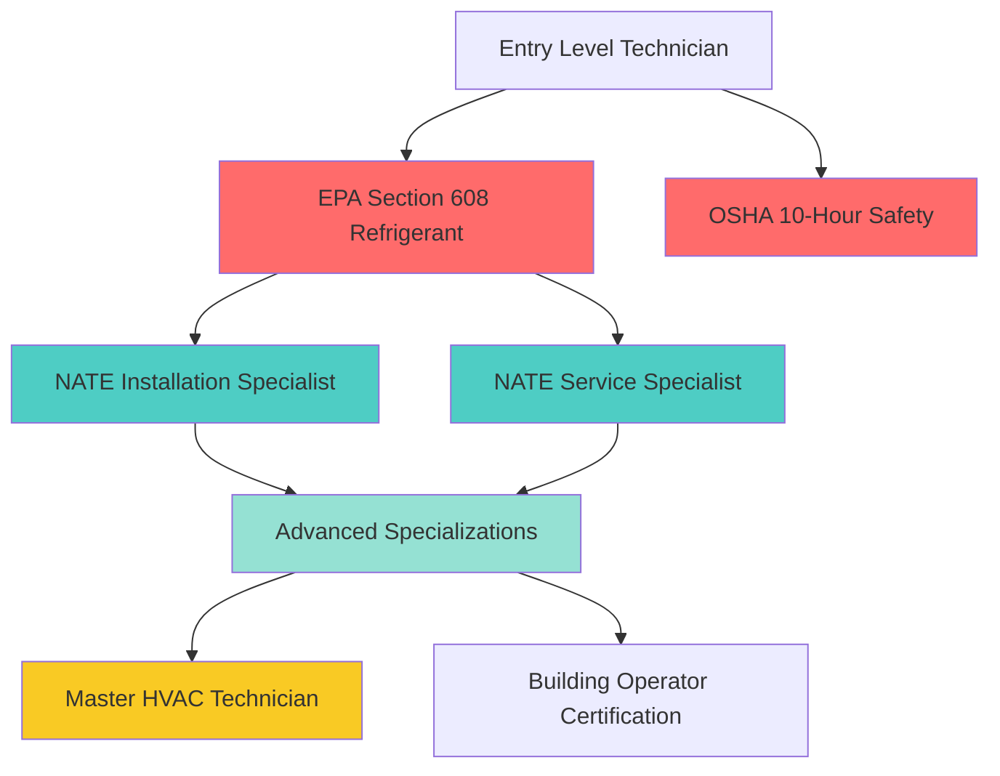
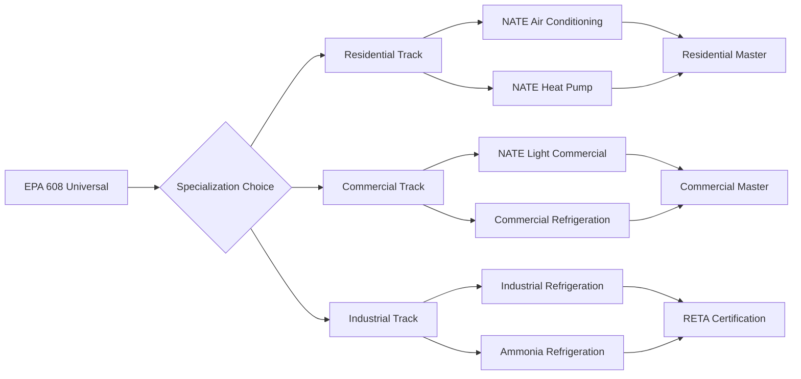

# HVAC Technician Certifications

Professional certification programs establish competency standards for HVAC technicians across installation, service, and diagnostic disciplines. These credentials verify technical knowledge in thermodynamics, electrical systems, refrigeration cycles, and safety protocols required for field operations.

## Certification Framework Structure

HVAC technician certifications follow a hierarchical progression based on skill complexity and regulatory requirements. The framework separates mandatory compliance certifications from voluntary excellence credentials.

## Regulatory vs. Voluntary Certifications

The certification landscape divides into legally mandated credentials and performance-based excellence programs:

| Certification Type | Regulatory Status | Scope | Renewal Period |
|-------------------|------------------|-------|----------------|
| EPA Section 608 | Federally Required | Refrigerant handling | Lifetime (no renewal) |
| EPA Section 609 | Federally Required | Mobile A/C systems | Lifetime (no renewal) |
| NATE Certification | Voluntary | Technical competency | 2 years |
| HVAC Excellence | Voluntary | Knowledge assessment | 2 years |
| State Contractor License | State-Dependent | Business operations | 1-3 years (varies) |
| OSHA Safety Cards | Industry Standard | Workplace safety | 5 years (10-hour), 3 years (30-hour) |

## Core Competency Areas

Technician certifications assess proficiency across fundamental HVAC disciplines:

### Refrigeration Cycle Mastery

Understanding vapor-compression refrigeration requires quantitative analysis of thermodynamic state points. The coefficient of performance (COP) determines system efficiency:

$$COP_{cooling} = \frac{Q_L}{W_{comp}} = \frac{h_1 - h_4}{h_2 - h_1}$$

Where:
- $Q_L$ = cooling capacity (Btu/hr or kW)
- $W_{comp}$ = compressor work input (Btu/hr or kW)
- $h_1, h_2, h_4$ = refrigerant enthalpy at evaporator outlet, compressor discharge, and expansion valve inlet (Btu/lb or kJ/kg)

Technician examinations test superheat and subcooling calculations to verify proper refrigerant charge. For a direct expansion system:

$$Superheat = T_{suction} - T_{sat,evap}$$

$$Subcooling = T_{sat,cond} - T_{liquid}$$

Proper refrigerant charge maintains superheat between 8-12°F for fixed-orifice systems and 5-8°F for thermal expansion valve (TXV) systems per manufacturer specifications.

### Electrical Diagnostics

Electrical troubleshooting certifications verify Ohm's Law application and power calculations. For three-phase compressor motors:

$$P_{3\phi} = \sqrt{3} \times V_{L-L} \times I_L \times PF$$

Where:
- $P_{3\phi}$ = three-phase power (watts)
- $V_{L-L}$ = line-to-line voltage (volts)
- $I_L$ = line current (amperes)
- $PF$ = power factor (dimensionless, typically 0.85-0.95)

Technicians must interpret motor nameplate data and apply National Electrical Code (NEC) Article 440 requirements for overcurrent protection sizing.

### Airflow and Psychrometrics

Certification programs assess static pressure measurement and airflow calculations. Total external static pressure (TESP) determines fan performance:

$$TESP = SP_{supply} + SP_{return}$$

For residential systems, ASHRAE recommends maximum TESP of 0.5 in. w.g. for standard efficiency and 0.8 in. w.g. for high-efficiency equipment.

Sensible heat ratio (SHR) calculations verify dehumidification performance:

$$SHR = \frac{Q_{sensible}}{Q_{sensible} + Q_{latent}}$$

Typical residential cooling applications require SHR between 0.70-0.80 to maintain 40-60% relative humidity in humid climates.

## Certification Progression Pathways

Professional advancement follows specialized tracks based on technician focus areas:

## Knowledge Domain Testing

Certification examinations assess theoretical understanding and practical application:

### Installation Competencies
- Heat load calculation methodology (ACCA Manual J)
- Duct design principles (ACCA Manual D)
- Refrigerant line sizing per ASHRAE Standard 15
- Combustion analysis and venting requirements
- Electrical service sizing and disconnect placement

### Service Competencies
- Systematic troubleshooting procedures
- Refrigerant charging techniques (superheat, subcooling, approach)
- Airflow measurement and adjustment
- Control sequence verification
- Performance testing and documentation

### Safety Protocols
- Refrigerant handling per EPA regulations
- Electrical safety and lockout/tagout procedures
- Confined space entry requirements
- Personal protective equipment (PPE) selection
- Hazardous material identification and response

## Continuing Education Requirements

Most voluntary certifications mandate ongoing technical education to maintain credential validity. NATE requires 12 continuing education hours (CEUs) per renewal cycle focusing on:

- Emerging refrigerant technologies and regulations
- Advanced diagnostic techniques
- Energy efficiency optimization
- Indoor air quality improvements
- Smart control integration

## Economic Value of Certification

Industry data demonstrates measurable wage premiums for certified technicians:

| Certification Level | Average Wage Premium | Career Impact |
|---------------------|---------------------|---------------|
| EPA 608 Only | Baseline | Entry-level positions |
| EPA + NATE (1 specialty) | +12-18% | Lead technician roles |
| Multiple NATE Specialties | +22-28% | Senior technician, supervisor |
| Master Level | +35-45% | Technical specialist, trainer |

Certified technicians report higher job placement rates, reduced warranty callbacks, and increased customer satisfaction scores compared to non-certified peers.

## Standards References

Certification programs align with industry standards including:
- ASHRAE Standard 15: Safety Standard for Refrigeration Systems
- ASHRAE Standard 62.1/62.2: Ventilation for Acceptable Indoor Air Quality
- ACCA Quality Installation Standards
- NEC Article 440: Air-Conditioning and Refrigerating Equipment
- International Mechanical Code (IMC) Chapter 3: General Regulations

Professional certification establishes minimum competency baselines while encouraging continuous technical development throughout HVAC careers.
