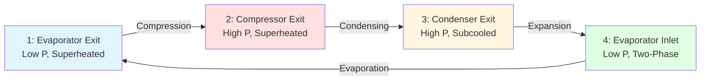
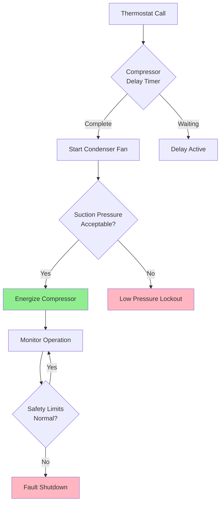

## Overview of RSES Certification

The Refrigeration Service Engineers Society (RSES) provides industry-recognized certifications that validate technical competency in refrigeration and HVAC systems. RSES certifications cover comprehensive refrigeration theory, system analysis, and practical troubleshooting skills essential for professional technicians.

RSES offers multiple certification levels ranging from entry-level technician credentials to master specialist designations, each requiring demonstrated knowledge of thermodynamic principles, electrical systems, and mechanical components.

## Certification Levels and Requirements

### Certified Refrigeration Service Technician (CRST)

Entry-level certification demonstrating fundamental refrigeration knowledge:

- Refrigeration cycle thermodynamics
- Component identification and function
- Basic electrical circuits and controls
- Safety procedures and EPA regulations
- System charging and evacuation procedures

### Certified Heating and Air Conditioning Technician (CHACT)

Focuses on heating and cooling system competency:

- Heat pump operation and troubleshooting
- Furnace combustion analysis
- Air distribution system design
- Psychrometric calculations
- Energy efficiency optimization

### Certified HVAC Designer (CHD)

Advanced certification for system design professionals:

- Load calculation methodologies per ASHRAE standards
- Equipment selection and sizing
- Duct and piping system design
- Energy modeling and analysis
- Code compliance verification

### Certified Master Service Technician (CMST)

Highest technical certification level requiring:

- Comprehensive system diagnostics
- Complex troubleshooting scenarios
- Advanced refrigeration applications
- Supervisory and training competencies
- 5+ years documented field experience

## Refrigeration Cycle Thermodynamics

RSES certification programs emphasize fundamental thermodynamic principles governing vapor-compression refrigeration systems.

### Energy Balance Equations

The refrigeration effect represents heat absorbed at the evaporator:

$$Q_e = \dot{m} \cdot (h_1 - h_4)$$

Where:
- $Q_e$ = refrigeration capacity (kW)
- $\dot{m}$ = refrigerant mass flow rate (kg/s)
- $h_1$ = enthalpy leaving evaporator (kJ/kg)
- $h_4$ = enthalpy entering evaporator (kJ/kg)

Compressor work input:

$$W_{comp} = \dot{m} \cdot (h_2 - h_1)$$

Coefficient of performance:

$$COP = \frac{Q_e}{W_{comp}} = \frac{h_1 - h_4}{h_2 - h_1}$$

### Pressure-Enthalpy Relationships

The refrigeration cycle analysis uses pressure-enthalpy diagrams to visualize state point transitions:

## System Component Analysis

### Compressor Performance

Compressor capacity varies with operating conditions according to:

$$\dot{Q}_{actual} = \dot{Q}_{rated} \cdot \left(\frac{P_{evap,actual}}{P_{evap,rated}}\right)^{0.75} \cdot \left(\frac{P_{cond,rated}}{P_{cond,actual}}\right)^{0.25}$$

Volumetric efficiency decreases with compression ratio:

$$\eta_v = 1 - C \cdot \left(\frac{P_{discharge}}{P_{suction}} - 1\right)$$

Where $C$ is the clearance volume percentage.

### Expansion Device Sizing

Thermostatic expansion valve capacity:

$$\dot{m} = C \cdot A \cdot \sqrt{\rho \cdot \Delta P}$$

Where:
- $C$ = flow coefficient
- $A$ = valve orifice area (m²)
- $\rho$ = refrigerant density (kg/m³)
- $\Delta P$ = pressure differential (Pa)

## Certification Comparison

| Certification | Focus Area | Experience Required | Exam Format | Renewal Period |
|--------------|------------|---------------------|-------------|----------------|
| CRST | Basic Refrigeration | 0-2 years | Written | 3 years |
| CHACT | Heating/Cooling | 2+ years | Written + Practical | 3 years |
| CHD | System Design | 3+ years | Written + Project | 3 years |
| CMST | Master Technician | 5+ years | Comprehensive | 3 years |

## Electrical Systems and Controls

### Three-Phase Power Analysis

Total power consumption for commercial equipment:

$$P_{total} = \sqrt{3} \cdot V_{line} \cdot I_{line} \cdot PF \cdot \eta$$

Where:
- $V_{line}$ = line voltage (V)
- $I_{line}$ = line current (A)
- $PF$ = power factor
- $\eta$ = motor efficiency

### Control Logic Fundamentals

## Troubleshooting Methodologies

### Systematic Diagnostic Approach

RSES training emphasizes methodical troubleshooting procedures:

1. **Symptom verification** - Confirm reported problem through measurement
2. **System observation** - Inspect operating conditions and parameters
3. **Component isolation** - Test individual components systematically
4. **Root cause analysis** - Identify underlying failure mechanism
5. **Corrective action** - Implement repair and verify resolution

### Superheat and Subcooling Analysis

Proper refrigerant charge verification:

$$\text{Superheat} = T_{suction} - T_{sat,evap}$$

$$\text{Subcooling} = T_{sat,cond} - T_{liquid}$$

Target values vary by system type and ambient conditions per manufacturer specifications.

## ASHRAE Standard Alignment

RSES certification content aligns with key ASHRAE standards:

- **ASHRAE 15** - Safety Standard for Refrigeration Systems
- **ASHRAE 34** - Designation and Safety Classification of Refrigerants
- **ASHRAE 62.1** - Ventilation for Acceptable Indoor Air Quality
- **ASHRAE 147** - Reducing the Release of Halogenated Refrigerants

## Professional Development Benefits

RSES certification provides measurable career advantages:

- Enhanced technical competency validation
- Increased earning potential (15-25% premium)
- Professional networking opportunities
- Access to continuing education resources
- Industry recognition and credibility
- Competitive advantage in employment market

Certification maintenance requires ongoing education through RSES training programs, manufacturer courses, and industry seminars to maintain current knowledge of evolving technologies and code requirements.

## Exam Preparation Strategy

Effective preparation includes:

- Study RSES educational materials thoroughly
- Practice pressure-enthalpy diagram analysis
- Review electrical circuit troubleshooting
- Master psychrometric chart applications
- Complete practice exams under timed conditions
- Participate in hands-on training sessions
- Join RSES study groups for peer learning

RSES certifications represent comprehensive technical knowledge validated through rigorous examination, establishing professional credentials recognized throughout the HVAC industry.
