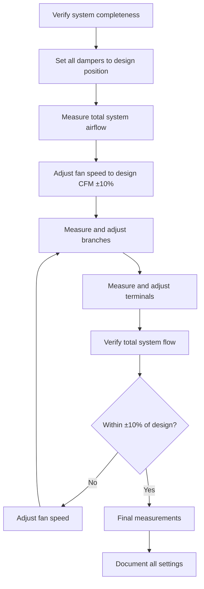

Testing, Adjusting, and Balancing Bureau (TABB) certification represents the professional standard for validating competency in HVAC system performance verification. TABB-certified professionals ensure systems operate according to design specifications through systematic measurement, adjustment, and documentation procedures. This certification distinguishes practitioners who possess both theoretical knowledge and practical field skills in air and hydronic system balancing.

## TABB Certification Structure

TABB offers a tiered certification system recognizing progressive levels of expertise and responsibility in testing and balancing operations.

### TABB Certified Technician (TCT)

Entry-level certification for technicians performing field measurements and adjustments under supervision. TCT certification validates competency in:

- **Instrument operation**: Proper use of manometers, pitot tubes, anemometers, hydronic flow meters, and sound level meters
- **Measurement procedures**: Traversing ductwork, measuring coil pressure drops, and recording system performance data
- **System adjustment**: Damper positioning, balancing valve adjustment, and fan speed modification
- **Data recording**: Accurate documentation of field measurements and system conditions
- **Safety protocols**: Confined space entry, fall protection, and electrical safety awareness

TCT candidates must demonstrate proficiency in field measurement techniques through practical examination and written testing covering fundamental principles.

### TABB Certified Supervisor (TCS)

Advanced certification for professionals who plan, supervise, and certify testing and balancing projects. TCS certification requires:

- **Project management**: Scheduling field work, allocating personnel resources, and coordinating with construction teams
- **Report preparation**: Compiling comprehensive TAB reports with measured performance data and certification statements
- **Quality assurance**: Reviewing technician work, verifying measurement accuracy, and ensuring procedural compliance
- **Problem diagnosis**: Identifying system deficiencies, recommending corrective actions, and verifying repairs
- **Client communication**: Explaining test results, discussing system performance issues, and presenting findings

TCS candidates must hold TCT certification and demonstrate minimum field experience (typically 3-5 years) in testing and balancing operations.

## Technical Competencies

### Air System Balancing

Air system balancing ensures each space receives design airflow through systematic measurement and adjustment procedures.

**Airflow Measurement Methods**

| Method | Application | Accuracy | Equipment |
|--------|-------------|----------|-----------|
| Pitot tube traverse | Duct mains and branches | ±5% with proper technique | Pitot tube, manometer, traverse positions per ASHRAE 111 |
| Flow hood | Diffusers and grilles | ±10% | Calibrated flow capture hood |
| Vane anemometer | Large grilles, louvers | ±5-10% | Rotating vane or thermal anemometer |
| Hot wire anemometer | Low velocity applications | ±3% at calibrated range | Thermal anemometer |

**Duct Traverse Calculations**

Velocity pressure at each traverse point converts to velocity using:

$$V = 4005 \sqrt{\frac{VP}{\rho}}$$

Where:
- $V$ = velocity (fpm)
- $VP$ = velocity pressure (inches w.g.)
- $\rho$ = air density (lbm/ft³)

Average velocity across the duct cross-section multiplied by area yields volumetric flow:

$$Q = V_{avg} \times A$$

Standard density (0.075 lbm/ft³ at sea level, 70°F) simplifies to:

$$V = 4005 \sqrt{VP}$$

**Balancing Sequence**

### Hydronic System Balancing

Hydronic balancing ensures proper flow distribution through water-side equipment using calibrated balancing valves and flow measurement instruments.

**Flow Measurement Techniques**

Balancing valves with calibrated pressure drop curves enable non-intrusive flow measurement. The pressure differential across the valve relates to flow rate through manufacturer-provided charts or formulas:

$$Q = C_v \sqrt{\frac{\Delta P}{SG}}$$

Where:
- $Q$ = flow rate (GPM)
- $C_v$ = flow coefficient at valve position
- $\Delta P$ = pressure drop across valve (PSI)
- $SG$ = specific gravity (dimensionless, water = 1.0)

**Temperature Method Verification**

Energy balance calculations verify measured flow rates using temperature differential and heat transfer rate:

$$Q = \frac{\dot{Q}}{500 \times \Delta T}$$

Where:
- $Q$ = flow rate (GPM)
- $\dot{Q}$ = heat transfer rate (BTU/hr)
- $\Delta T$ = temperature difference entering minus leaving (°F)
- 500 = constant (specific heat × density × unit conversions)

**Proportional Balancing Method**

Systems balance using proportional flow distribution:

1. Measure all circuit flows with all valves fully open
2. Calculate design flow ratios for all circuits
3. Throttle highest flow circuit to design flow
4. Adjust remaining circuits proportionally
5. Verify total system flow equals design
6. Fine-tune individual circuits to ±10% of design

### Sound and Vibration Testing

TABB-certified professionals perform acoustic measurements to verify compliance with design criteria and identify mechanical noise sources.

**Sound Level Measurements**

| Parameter | Measurement Standard | Target Criteria |
|-----------|---------------------|-----------------|
| Background NC | ASHRAE 111 Section 7 | Per ASHRAE App. Handbook |
| Equipment sound power | AHRI 260/AHRI 370 | Manufacturer ratings ±3 dB |
| In-space NC levels | ASTM E1574 | Design NC curves ±2 NC |
| Break-in/break-out | ASTM E477 | Attenuation per design |

**Vibration Analysis**

Vibration measurements identify mechanical problems before component failure:

- **Displacement**: Total movement distance (mils peak-to-peak)
- **Velocity**: Rate of vibration (inches/second RMS)
- **Acceleration**: Rate of velocity change (g's)

Velocity measurements provide optimal diagnostic information across typical HVAC equipment speeds (600-3600 RPM). Vibration severity charts (ISO 10816) establish acceptable limits based on equipment type and mounting.

## Certification Requirements

### Education and Experience

**TABB Certified Technician:**
- High school diploma or equivalent
- Completion of TABB technician training course (40 hours)
- 6 months field experience in testing and balancing operations
- Passing score on written and practical examinations

**TABB Certified Supervisor:**
- TCT certification in good standing
- 3 years documented field experience as testing and balancing technician
- Completion of TABB supervisor training course (40 hours)
- Passing score on comprehensive written examination
- Submission of sample TAB report demonstrating professional competency

### Examination Content

**Written Examination Topics:**
- Psychrometrics and thermodynamics fundamentals
- Fluid mechanics principles applied to HVAC systems
- Instrumentation theory and calibration requirements
- ASHRAE Standard 111 (Field Testing of HVAC Systems)
- System types: VAV, CAV, DDC controls, primary-secondary pumping
- Report documentation standards
- Professional ethics and business practices

**Practical Examination (TCT only):**
- Pitot tube traverse of rectangular and round ducts
- Flow hood measurements at supply and return terminals
- Balancing valve adjustment and flow measurement
- Temperature and pressure measurements
- Instrument calibration verification
- Data recording and calculation accuracy

## Industry Standards and References

TABB procedures align with established industry standards:

- **ASHRAE Standard 111**: Methods of Testing for Rating and Balancing of HVAC Systems
- **ASHRAE Standard 62.1**: Ventilation for Acceptable Indoor Air Quality (verification of outdoor air delivery)
- **NEBB Procedural Standards**: Testing, Adjusting, Balancing of Environmental Systems
- **AABC National Standards**: Associated Air Balance Council requirements
- **SMACNA HVAC Systems Testing**: Adjusting and Balancing manual

## Continuing Professional Development

**Recertification Requirements:**
- Certification renewal every 5 years
- 40 hours of continuing education during renewal period
- Active employment in testing and balancing field
- Maintenance of professional liability insurance (TCS)
- Adherence to TABB Code of Ethics

**Continuing Education Topics:**
- Advanced measurement techniques and instrumentation
- Building automation system integration
- Commissioning process participation and documentation
- Energy efficiency verification and measurement
- Emerging HVAC technologies (dedicated outdoor air systems, radiant systems, displacement ventilation)

## Professional Practice

### Project Execution Sequence

Successful TAB projects follow systematic procedures from mobilization through certification:

1. **Pre-start conference**: Review design documents, identify special requirements, coordinate access schedules
2. **System verification**: Confirm equipment installation completeness, control functionality, and safe operation
3. **Preliminary measurements**: Document as-found conditions before adjustments
4. **Balancing procedures**: Execute systematic air and water balancing per ASHRAE 111
5. **Deficiency reporting**: Document system deficiencies preventing design performance achievement
6. **Final testing**: Verify corrected systems meet design specifications
7. **Report preparation**: Compile comprehensive documentation with certification statements
8. **Owner training**: Explain system operation, adjustment procedures, and maintenance requirements

### Equipment and Instrumentation

TABB-certified professionals maintain calibrated instrumentation traceable to NIST standards. Annual calibration ensures measurement accuracy:

**Required Instruments:**
- Pitot tubes (standard and averaging types)
- Differential pressure gauges (0-5" w.g. minimum)
- Rotating vane anemometers
- Thermal anemometers
- Psychrometers (sling or electronic)
- Sound level meters (Type 2 minimum)
- Tachometers for rotational speed
- Thermometers (digital, accuracy ±0.5°F)
- Manometers (digital, accuracy ±1% of reading)

## Career Applications

TABB certification qualifies professionals for specialized roles:

- **Testing and balancing contractor**: Independent firms specializing in system performance verification
- **Commissioning agent**: Third-party verification of new construction and retrofit projects
- **Energy auditor**: Measuring system performance for efficiency improvement programs
- **Design engineer support**: Field verification of design assumptions and calculated performance
- **Building operations specialist**: Ongoing system optimization in facility management organizations

TABB-certified professionals command premium compensation reflecting specialized knowledge and critical role in building system performance verification. The certification provides objective third-party validation essential for contractual compliance and warranty activation on major HVAC installations.

## Certification Categories

- [TABB Certified Supervisor](./tabb-certified-supervisor/)
- [TABB Certified Technician](./tabb-certified-technician/)
- [Air Systems Balancing Certification](./air-systems-balancing-certification/)
- [Hydronic Systems Balancing Certification](./hydronic-systems-balancing-certification/)
- [Sound Vibration Testing Certification](./sound-vibration-testing-certification/)
- [Cleanroom Performance Testing](./cleanroom-performance-testing/)
- [NEBB National Environmental Balancing Bureau](./nebb-national-environmental-balancing-bureau/)
- [NEBB Building Systems Commissioning](./nebb-building-systems-commissioning/)
- [AABC Associated Air Balance Council](./aabc-associated-air-balance-council/)
