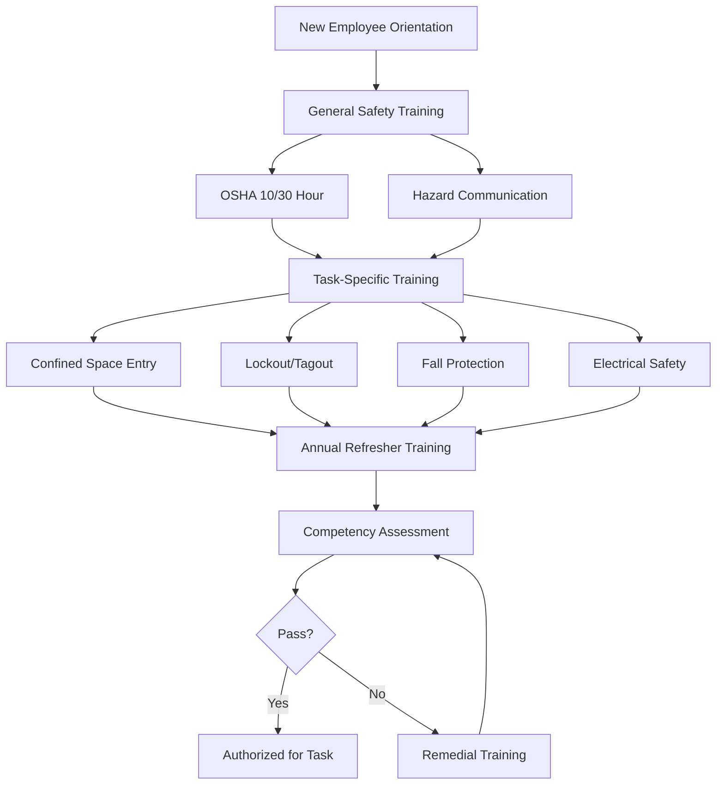

Safety training represents a fundamental professional requirement for HVAC technicians and engineers, protecting personnel from the inherent hazards present in mechanical systems work. The HVAC environment presents multiple simultaneous hazards including high voltage electricity, pressurized refrigerants, confined spaces, elevated work locations, rotating machinery, and hazardous atmospheres. Comprehensive safety training reduces injury rates, ensures regulatory compliance, and establishes the systematic hazard recognition and mitigation protocols required for sustainable industry practice.

## Regulatory Framework

HVAC safety training requirements derive from multiple regulatory authorities and industry standards establishing minimum competency thresholds for hazardous work activities.

### Primary Regulatory Sources

**Occupational Safety and Health Administration (OSHA):**

Federal regulations under 29 CFR establish enforceable workplace safety standards. OSHA requirements applicable to HVAC work include confined space entry (1926.1200 series), lockout/tagout (1910.147), fall protection (1926.500 series), respiratory protection (1910.134), and hazard communication (1910.1200). State-administered OSHA programs may establish requirements exceeding federal minimums.

**Environmental Protection Agency (EPA):**

Section 608 of the Clean Air Act mandates refrigerant handling certification demonstrating competency in proper refrigerant recovery, recycling, and disposal procedures. Section 609 addresses mobile air conditioning systems requiring separate certification.

**National Fire Protection Association (NFPA):**

NFPA 70 (National Electrical Code) and NFPA 70E (Electrical Safety in the Workplace) establish electrical safety requirements including qualified person training, arc flash hazard assessment, and energized work permits. Many jurisdictions adopt NFPA standards as enforceable code requirements.

## Safety Training Categories

HVAC professionals require multiple specialized safety training programs addressing distinct hazard categories encountered throughout system installation, service, and maintenance activities.

### OSHA Construction Safety Training

Foundation-level safety training providing comprehensive overview of construction hazards and OSHA regulatory requirements.

**OSHA 10-Hour Construction:**

Entry-level certification covering fall hazards, electrical hazards, caught-in/between hazards, struck-by hazards, personal protective equipment, and health hazards. Required completion time: 10 hours over minimum 2 days. Designed for field technicians and installers.

**OSHA 30-Hour Construction:**

Comprehensive training for supervisors and project managers including all 10-hour topics plus advanced subjects: scaffolding systems, cranes and rigging, excavations, concrete and masonry, welding and cutting, materials handling, and site-specific safety planning.

### Hazard-Specific Training Requirements

| Training Program | OSHA Standard | Renewal Period | Typical Duration | Target Audience |
|-----------------|---------------|----------------|------------------|-----------------|
| Confined Space Entry | 1926.1200 | Annual | 8 hours | Entrants, attendants, supervisors |
| Lockout/Tagout | 1910.147 | Annual | 4 hours | Authorized, affected employees |
| Fall Protection | 1926.500 | Annual | 4 hours | Workers above 6 feet |
| Respiratory Protection | 1910.134 | Annual | 4 hours | Respirator users |
| Electrical Safety | NFPA 70E | 3 years | 8 hours | Qualified electrical workers |
| Hot Work Permits | 1926.352 | Annual | 2 hours | Welding, cutting operations |
| Hazard Communication | 1910.1200 | Annual | 2 hours | All employees |
| First Aid/CPR | ANSI/ILCOR | 2 years | 8 hours | Designated responders |

## Refrigerant Safety Training

Refrigerant handling presents unique hazards including asphyxiation risk, chemical toxicity, thermal decomposition products, and high-pressure system failures. Comprehensive refrigerant safety training extends beyond EPA certification requirements to address emergency response procedures and health hazard recognition.

### Pressure-Temperature Relationships

Understanding refrigerant thermodynamic behavior enables hazard assessment and safe system management. The Clausius-Clapeyron equation describes vapor pressure temperature dependence:

$$\frac{dP}{dT} = \frac{L}{T(V_g - V_l)}$$

Where $L$ represents latent heat of vaporization, $T$ is absolute temperature, and $V_g$, $V_l$ represent gas and liquid specific volumes. This relationship quantifies rapid pressure increase with temperature rise in sealed systems.

For practical refrigerant cylinder storage calculations, the simplified Antoine equation provides vapor pressure estimation:

$$\log_{10}(P) = A - \frac{B}{C + T}$$

Where $P$ represents vapor pressure (mmHg), $T$ is temperature (°C), and $A$, $B$, $C$ are refrigerant-specific constants. This enables pressure relief device sizing and storage temperature limit establishment.

### Refrigerant Exposure Limits

| Refrigerant | ASHRAE 34 Class | TWA (ppm) | IDLH (ppm) | Primary Hazards |
|-------------|-----------------|-----------|------------|-----------------|
| R-410A | A1 | 1000 | N/A | Asphyxiant, high pressure |
| R-134a | A1 | 1000 | N/A | Asphyxiant |
| R-717 (NH₃) | B2 | 25 | 300 | Toxic, flammable |
| R-32 | A2L | 1000 | N/A | Mildly flammable |
| R-600a | A3 | 1000 | 1600 | Highly flammable |

TWA = Time-Weighted Average (8-hour); IDLH = Immediately Dangerous to Life or Health

ASHRAE Standard 15-2022 establishes refrigerant concentration limits (RCL) based on toxicity class and occupancy type, requiring ventilation system design preventing refrigerant accumulation exceeding safe thresholds.

## Electrical Safety Training

HVAC systems operate across voltage ranges from 24V control circuits through 480V three-phase power distribution. Electrical safety training establishes qualified person status per NFPA 70E definitions, requiring demonstrated knowledge of electrical hazards, safe work practices, and protective equipment selection.

### Arc Flash Hazard Analysis

Arc flash incidents release intense thermal energy following electrical fault conditions. Incident energy calculations determine personal protective equipment (PPE) requirements:

$$E = \frac{5.271 \times 10^6 \times V \times I_{bf} \times t}{D^2}$$

Where $E$ represents incident energy (cal/cm²), $V$ is system voltage (kV), $I_{bf}$ is bolted fault current (kA), $t$ is arc duration (seconds), and $D$ is working distance (inches). Results determine arc-rated clothing and face protection requirements.

Working distance for HVAC applications typically ranges from 18 inches (480V motor starters) to 36 inches (switchgear), significantly affecting incident energy exposure.

## Safety Training Program Structure

Effective safety training programs combine regulatory compliance with practical hazard recognition and mitigation skill development.

## Training Delivery Methods

Safety training effectiveness depends on appropriate delivery methodology matching learning objectives and skill requirements.

**Classroom Instruction:**

Traditional lecture format effective for regulatory overview, hazard recognition theory, and written procedure review. Typical duration: 4-8 hours per topic. Advantages include instructor-student interaction and group discussion. Limitations include passive learning and limited hands-on practice.

**Hands-On Practical Training:**

Essential for equipment operation competency including lockout device application, confined space monitoring equipment, fall arrest systems, and electrical testing instruments. Requires actual equipment and simulated work environments. Critical for psychomotor skill development.

**Online/Computer-Based Training:**

Flexible delivery enabling self-paced learning and standardized content delivery. OSHA accepts online training for awareness-level programs but requires hands-on demonstration for applied skills. Effective for refresher training and regulatory updates.

**Jobsite-Specific Training:**

Site-specific hazard orientation addressing unique conditions at particular facilities. Required before beginning work at new locations. Covers emergency procedures, facility-specific hazards, and local safety policies.

## Competency Assessment

Training completion alone does not establish workplace competency. Formal assessment verifies knowledge retention and practical skill demonstration.

### Assessment Methods by Training Type

**Written Examinations:**

Multiple-choice or short-answer tests measuring regulatory knowledge, hazard recognition, and procedural understanding. Minimum passing scores typically 70-80%. Required for OSHA training documentation.

**Practical Demonstrations:**

Observed performance of actual tasks under supervision including lockout procedure execution, confined space monitoring, PPE selection and donning, and equipment inspection. Evaluated using standardized checklists.

**Field Observations:**

Periodic jobsite safety audits assessing real-world application of safety training principles. Identifies gaps between training and actual practice requiring corrective action.

## Documentation Requirements

OSHA regulations mandate training documentation demonstrating compliance with safety training requirements.

**Required Documentation Elements:**

- Employee name and identification
- Training date and duration
- Training topic and OSHA standard reference
- Instructor name and qualifications
- Assessment results and passing scores
- Certification card or certificate issuance
- Refresher training schedule and completion records

Documentation retention period: Duration of employment plus 3 years minimum per OSHA requirements. Electronic recordkeeping systems acceptable with appropriate backup and access controls.

## Safety Culture Integration

Safety training effectiveness multiplies when integrated into comprehensive safety culture emphasizing hazard awareness, incident reporting, and continuous improvement.

**Pre-Job Safety Briefings:**

Daily or task-specific safety discussions reviewing anticipated hazards, required PPE, emergency procedures, and hazard mitigation strategies. Typical duration: 5-15 minutes. Reinforces formal training and addresses site-specific conditions.

**Toolbox Talks:**

Weekly short-duration safety topics maintaining awareness between formal training cycles. Subjects include seasonal hazards, recent incidents, regulatory updates, and procedural changes.

**Incident Investigation and Lessons Learned:**

Root cause analysis of incidents and near-misses identifying training gaps and procedural deficiencies. Findings incorporated into revised training programs preventing recurrence.

## Industry Safety Statistics

Bureau of Labor Statistics data demonstrates HVAC mechanic injury rates significantly exceed all-industry averages. Primary injury causes include falls from elevation, electrical contacts, caught-in/between incidents involving rotating equipment, and strains from material handling. Comprehensive safety training programs reduce injury frequency rates by 40-60% compared to untrained populations.

The investment in systematic safety training yields measurable returns through reduced workers compensation costs, improved regulatory compliance, enhanced workforce retention, and reputation enhancement with safety-conscious clients. Professional HVAC practitioners recognize safety competency as foundational to technical excellence and career longevity.

*Version: 1.0*
