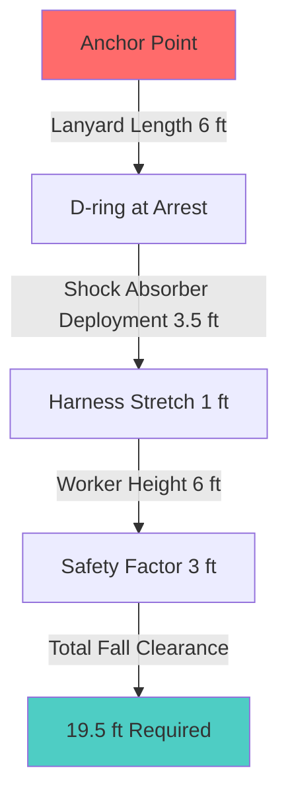

## Fall Hazards in HVAC Work

HVAC technicians face significant fall hazards during routine operations. Rooftop equipment installation, maintenance on elevated platforms, and work from ladders create exposure to falls from heights exceeding 6 feet, triggering OSHA fall protection requirements under 29 CFR 1926.501. The primary hazards include unprotected roof edges, skylights, roof openings for penetrations, and unstable work surfaces on mechanical equipment.

Fall protection training addresses these specific exposures through systematic hazard recognition, appropriate equipment selection, and correct use of personal fall arrest systems (PFAS). Understanding the physics of fall arrest enables technicians to evaluate system adequacy and make informed safety decisions.

## Fall Arrest Physics and Impact Forces

When a falling worker is arrested by a personal fall arrest system, deceleration creates impact forces that the human body and equipment must withstand. The maximum arresting force (MAF) depends on fall distance, deceleration distance, and worker mass.

The energy balance during fall arrest:

$$E_{kinetic} = E_{absorbed} = \frac{1}{2}mv^2 = mgh$$

where m represents worker mass (kg), v is velocity at arrest (m/s), g is gravitational acceleration (9.81 m/s²), and h is free fall distance (m).

The average arresting force during deceleration:

$$F_{avg} = \frac{mgh}{d}$$

where d represents the deceleration distance (m) provided by the shock absorber and harness stretch.

OSHA limits maximum arresting force to 8 kN (1,800 lbf) for body harnesses and 4 kN (900 lbf) for body belts. This limitation drives shock absorber design, which must provide sufficient deceleration distance to maintain forces below these thresholds.

For a 100 kg worker (220 lb) experiencing a 1.8 m (6 ft) free fall, the required deceleration distance:

$$d = \frac{mgh}{F_{max}} = \frac{100 \times 9.81 \times 1.8}{8000} = 0.22 \text{ m (8.7 inches)}$$

This calculation excludes harness and lanyard stretch, which contribute additional deceleration distance and reduce peak forces.

## Personal Fall Arrest System Components

A complete PFAS consists of three integrated components: anchorage, body support, and connector. Each component must meet specific strength requirements and compatibility standards.

### Body Harness Selection

Full-body harnesses distribute arresting forces across shoulders, thighs, and pelvis, preventing the concentration of forces that causes injury in body belts. Harness selection criteria include:

- **D-ring configuration**: Dorsal (back) D-rings for vertical lifeline systems, shoulder D-rings for leading edge work
- **Sizing**: Proper fit prevents slippage during arrest; adjustable straps accommodate clothing layers
- **Load rating**: Minimum 5,000 lbf (22.2 kN) per ANSI Z359.11

### Shock Absorbers and Lanyards

Shock-absorbing lanyards limit peak forces through controlled tearing of webbing or extension of compact units. Standard 6-foot lanyards with integral shock absorbers deploy approximately 3.5 feet during activation, creating total fall clearance requirements.

### Anchorage Requirements

Anchorage points must support 5,000 lbf (22.2 kN) per attached worker, or demonstrate a safety factor of 2 when certified by a qualified person. Rooftop anchorage systems for HVAC applications include:

| Anchorage Type | Capacity | Application | Installation Requirement |
|----------------|----------|-------------|-------------------------|
| Permanent roof anchors | 5,000 lbf | Fixed equipment locations | Structural attachment to roof framing |
| Temporary roof anchors | 5,000 lbf | Mobile work positions | Weight-based or penetrating attachment |
| Horizontal lifelines | 5,000 lbf per worker | Multiple worker access | Engineered system with sag calculations |
| Guardrail systems | 200 lbf top rail | Passive protection | Posts at 8 ft maximum spacing |

Horizontal lifeline systems require engineering analysis to account for increased forces from sag under load. The tension in a horizontal cable supporting a fall arrest load:

$$T = \frac{F}{2\sin\theta}$$

where T is cable tension (N), F is the arresting force (N), and θ is the angle from horizontal to the cable at the arrest point.

For small sag angles, cable tension significantly exceeds the arresting force. A 5° sag angle produces cable tension:

$$T = \frac{8000}{2\sin(5°)} = 45,900 \text{ N (10,300 lbf)}$$

This amplification requires robust anchorage and intermediate supports to prevent system failure.

## Fall Clearance Calculations

Adequate fall clearance prevents workers from striking lower levels or obstructions during fall arrest. The total fall distance comprises:

$$D_{total} = L_{lanyard} + D_{deployment} + D_{stretch} + H_{worker} + SF$$

where:
- L_lanyard = lanyard length before activation
- D_deployment = shock absorber deployment distance
- D_stretch = harness and rope elongation
- H_worker = distance from harness D-ring to worker's feet
- SF = safety factor (typically 3 feet)

For a 6-foot shock-absorbing lanyard on a 6-foot tall worker:

$$D_{total} = 6 + 3.5 + 1 + 6 + 3 = 19.5 \text{ feet}$$

This calculation establishes minimum working height above lower levels or the ground.

## Ladder Safety for HVAC Applications

Portable ladders provide access to rooftop equipment and elevated components. OSHA 1926.1053 specifies ladder safety requirements including:

- **Ladder angle**: 75° from horizontal (4:1 horizontal-to-vertical ratio)
- **Extension above landing**: 3 feet minimum
- **Load capacity**: Type I (250 lb industrial) or Type IA (300 lb extra heavy duty)
- **Tie-off requirements**: Secured at top and bottom to prevent displacement

The optimal ladder angle provides stability against sliding and tipping. The force balance at the ladder base:

$$\mu N \geq F_{horizontal}$$

where μ is the coefficient of friction between ladder feet and surface, N is the normal force, and F_horizontal is the horizontal reaction force at the base.

For a 75° ladder angle with a worker at mid-height, the base experiences higher horizontal forces than steeper configurations, requiring adequate friction or physical restraint.

## Rescue Planning and Suspension Trauma

Fall arrest systems create secondary hazards if workers remain suspended following a fall. Suspension trauma (orthostatic intolerance) develops when immobilized workers cannot activate muscle pumps that return venous blood from the legs. Blood pools in the lower extremities, reducing cardiac preload and potentially causing syncope within minutes.

Rescue plans must enable victim recovery within 15-20 minutes to prevent suspension trauma progression. Options include:

1. **Self-rescue devices**: Descent systems allowing workers to lower themselves
2. **Assisted rescue**: Co-worker intervention using rescue equipment
3. **Emergency services**: Fire department technical rescue teams

Harness-integrated suspension relief straps allow workers to stand in loops, activating leg muscles and maintaining circulation during extended suspension.

## Training Documentation and Competency Verification

OSHA requires fall protection training before workers engage in activities with fall hazards, with retraining when conditions change or workers demonstrate knowledge deficiencies. Training documentation must include:

- Worker identification and training date
- Training content summary covering equipment, systems, and procedures
- Competent person signature verifying successful completion
- Practical demonstration of equipment donning and use

Competent persons conducting training must demonstrate ability to identify fall hazards, select appropriate protection methods, and supervise equipment use. This designation requires knowledge of fall protection standards, equipment limitations, and rescue procedures beyond basic user training.

## Equipment Inspection Protocols

Visual inspection before each use identifies damage that compromises fall protection equipment integrity. Inspection criteria include:

- **Webbing and rope**: Cuts, abrasion, chemical damage, UV degradation, burns
- **Hardware**: Cracks, deformation, corrosion, sharp edges, proper function
- **Shock absorbers**: Deployment indicators, housing damage, manufacturing date
- **Anchorage**: Structural integrity, corrosion, secure attachment

Equipment demonstrating any deficiency must be removed from service immediately. Manufacturers specify service life limits, typically 5-10 years from date of manufacture depending on component type and usage conditions.

## Integration with HVAC-Specific Hazards

HVAC work introduces unique fall protection challenges beyond general construction. Equipment-specific considerations include:

- **Hot surfaces**: Rooftop units with surface temperatures exceeding 150°F can damage synthetic webbing on contact
- **Rotating equipment**: Fan guards and belt guards prevent entanglement with fall protection equipment
- **Electrical hazards**: Non-conductive lanyards (rope rather than cable) for work near energized components
- **Weather exposure**: Ice formation on anchors and equipment requires assessment before use

Integrating fall protection with lockout-tagout procedures, confined space protocols, and electrical safety creates comprehensive protection addressing the combined hazards present in HVAC maintenance environments.
