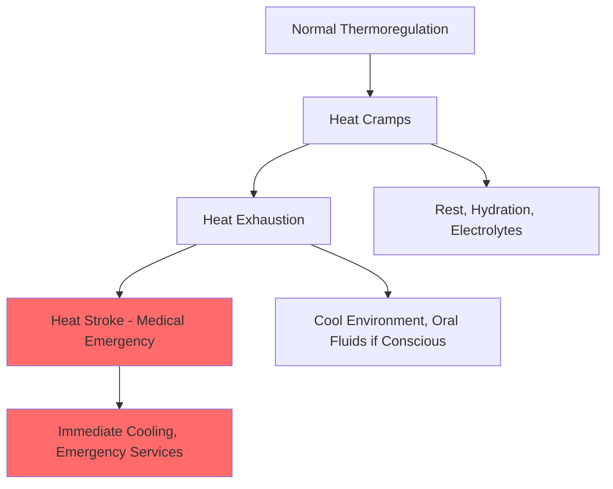

## Overview of HVAC-Specific First Aid Requirements

HVAC technicians face unique occupational hazards requiring specialized first aid knowledge beyond standard workplace protocols. The nature of HVAC work—involving electrical systems, chemical refrigerants, extreme temperatures, confined spaces, and elevated work platforms—necessitates immediate response capabilities for industry-specific emergencies.

OSHA 29 CFR 1910.151 mandates that employers ensure the availability of first aid supplies and trained personnel. For HVAC operations, this extends to specific hazard recognition and treatment protocols addressing electrical contact, chemical exposure, thermal injuries, and respiratory emergencies.

## Electrical Shock Response Protocols

Electrical shock represents the most critical immediate hazard in HVAC work. Contact with energized conductors in condensing units, air handlers, and control panels can cause cardiac arrest, respiratory paralysis, or severe burns.

### Immediate Response Sequence

1. **Scene safety assessment** - De-energize the circuit or remove the victim using non-conductive materials
2. **Assess consciousness and breathing** - Check for responsiveness within 10 seconds
3. **Activate emergency services** - Call 911 immediately for any electrical contact
4. **Begin CPR if indicated** - Start compressions within 30 seconds of cardiac arrest recognition

The physiological effect of electrical current depends on magnitude, path, and duration. The threshold of perception occurs at approximately 1 mA, while ventricular fibrillation can occur at currents exceeding 100 mA. The relationship between current, voltage, and body resistance follows Ohm's law:

$$I = \frac{V}{R}$$

Where typical dry skin resistance ranges from 1,000 to 100,000 Ω, but wet conditions reduce this to as low as 500 Ω, dramatically increasing current flow and injury severity.

### Electrical Burn Assessment

Electrical burns present unique characteristics due to internal tissue damage along the current pathway. Surface injury may appear minimal while deep tissue necrosis progresses. Monitor victims for cardiac arrhythmias up to 24 hours post-exposure, as delayed ventricular fibrillation can occur.

## Refrigerant Exposure Emergency Response

Modern refrigerants pose distinct toxicity profiles requiring specific treatment protocols. High-concentration exposure in confined spaces can cause asphyxiation through oxygen displacement or direct toxicity.

### Common Refrigerant Exposure Scenarios

| Refrigerant Type | Primary Hazard | Immediate Response | Secondary Concerns |
|------------------|----------------|--------------------|--------------------|
| R-410A | Asphyxiation, frostbite | Remove from area, oxygen if available | Cardiac sensitization |
| R-134a | Oxygen displacement | Fresh air, monitor breathing | Cold burns from liquid contact |
| R-22 | Respiratory irritation | Ventilate, flush skin/eyes | Decomposition products if heated |
| R-717 (Ammonia) | Severe respiratory damage | Remove victim, decontaminate | Pulmonary edema (delayed) |
| R-744 (CO₂) | Asphyxiation, frostbite | Extract to fresh air immediately | Hypercapnia, acidosis |

### Frostbite from Refrigerant Contact

Liquid refrigerant contact causes rapid tissue freezing due to evaporative cooling. The heat transfer rate during phase change is described by:

$$Q = m \cdot h_{fg}$$

Where $m$ is the refrigerant mass and $h_{fg}$ is the latent heat of vaporization. For R-410A, $h_{fg}$ = 276 kJ/kg at atmospheric pressure, producing immediate severe cold burns on contact.

**Treatment protocol:**
- Remove contaminated clothing
- Warm affected tissue gradually with body-temperature water (37-40°C)
- Never rub frozen tissue
- Cover with sterile dressing
- Seek immediate medical evaluation

## Heat-Related Illness Response

HVAC technicians working in attics, mechanical rooms, and rooftop installations face significant heat stress risk. Core body temperature regulation becomes compromised when heat production and environmental heat load exceed dissipation capacity.

### Heat Illness Progression

### Heat Stroke Emergency Protocol

Heat stroke represents a true medical emergency with mortality rates approaching 10-50% depending on response time. Core temperature exceeding 40°C (104°F) with altered mental status defines this condition.

**Immediate actions:**
1. Activate emergency medical services
2. Move victim to cool environment
3. Remove excess clothing
4. Apply aggressive cooling—immerse in cold water if possible, or apply ice packs to groin, axillae, and neck
5. Monitor airway and breathing
6. Position in recovery position if unconscious but breathing

Target cooling rate should achieve 0.15-0.20°C per minute to reduce core temperature below 39°C within 30 minutes.

## CPR and AED Application in HVAC Settings

Cardiac arrest in HVAC workers often results from electrical contact, cardiac sensitization by refrigerants (particularly halogenated hydrocarbons), or heat stroke. Immediate high-quality CPR significantly improves survival rates.

### Compression-Only CPR Protocol

Current American Heart Association guidelines emphasize continuous chest compressions for lay rescuers:

- **Rate:** 100-120 compressions per minute
- **Depth:** 5-6 cm (2-2.4 inches) in adults
- **Recoil:** Allow complete chest recoil between compressions
- **Interruptions:** Minimize to less than 10 seconds

The mechanical work performed during CPR can be approximated as:

$$W = F \cdot d \cdot n$$

Where $F$ is applied force (approximately 400-500 N for adequate depth), $d$ is compression depth (0.05-0.06 m), and $n$ is number of compressions. Over 30 minutes, this represents substantial physical demand, requiring rescuer rotation every 2 minutes to maintain compression quality.

### AED Deployment in Field Settings

Automated external defibrillators should be available on HVAC service vehicles and at job sites involving multiple technicians. Early defibrillation within 3-5 minutes of collapse improves survival rates from 5-10% to 50-70% for shockable rhythms.

**AED application sequence:**
1. Power on device and follow voice prompts
2. Bare the chest and ensure dry skin
3. Apply pads as indicated on diagrams
4. Ensure no contact during rhythm analysis
5. Deliver shock if advised, immediately resume CPR
6. Continue until emergency services arrive

## Confined Space Medical Emergencies

HVAC work in equipment rooms, crawl spaces, and utility vaults introduces confined space hazards including oxygen deficiency, toxic atmospheres, and engulfment risks. OSHA 29 CFR 1910.146 requires permit-required confined space programs including rescue procedures.

### Atmospheric Hazards

| Hazard | Normal Level | IDLH Level | Physiological Effect | First Aid Response |
|--------|--------------|------------|----------------------|---------------------|
| Oxygen (O₂) | 20.9% | <19.5% | Hypoxia, unconsciousness | Remove, oxygen, CPR if needed |
| Carbon Dioxide (CO₂) | 0.04% | 40,000 ppm | Asphyxiation, acidosis | Extract, ventilate, oxygen |
| Carbon Monoxide (CO) | 0 ppm | 1,200 ppm | Tissue hypoxia | 100% oxygen, hyperbaric therapy |
| Refrigerant vapor | 0 ppm | Varies | Asphyxiation | Fresh air, monitor cardiac rhythm |

### Non-Entry Rescue Priority

First aid protocols for confined space incidents emphasize non-entry rescue to prevent multiple casualties. The atmospheric condition that incapacitated the initial victim remains present. Retrieval systems, ventilation, and emergency services must be employed rather than untrained rescuer entry.

## Training Certification and Renewal Requirements

OSHA recommends first aid certification from organizations using evidence-based protocols including American Red Cross, American Heart Association, or National Safety Council. HVAC-specific training should address:

- Electrical injury recognition and treatment
- Chemical exposure response (refrigerants, combustion products)
- Thermal injury management (heat illness, cold exposure, burns)
- Respiratory emergencies (asphyxiation, toxic inhalation)
- Musculoskeletal trauma (falls, crushing injuries)

Certification validity typically extends 2 years for CPR/AED and 3 years for first aid, though annual refresher training maintains competency more effectively. Employers should document training and ensure adequate coverage of certified personnel across all work shifts and field operations.

## Integration with Emergency Action Plans

First aid capabilities function as one component within comprehensive emergency preparedness. ASHRAE Standard 15 Section 8.12 requires emergency procedures for refrigeration system incidents. Effective emergency action plans incorporate:

1. **Hazard-specific response protocols** for anticipated incidents
2. **Communication systems** to alert emergency responders and evacuate personnel
3. **Equipment availability** including first aid supplies, AEDs, emergency eyewash/shower stations
4. **Designated roles** with trained individuals assigned as first responders
5. **Post-incident procedures** including medical evaluation, incident investigation, and corrective actions

Regular emergency drills validate the effectiveness of training and identify system deficiencies before actual incidents occur.

---

**References:**
- OSHA 29 CFR 1910.151 - Medical Services and First Aid
- OSHA 29 CFR 1910.146 - Permit-Required Confined Spaces
- ASHRAE Standard 15 - Safety Standard for Refrigeration Systems
- American Heart Association CPR and Emergency Cardiovascular Care Guidelines
- ACGIH Threshold Limit Values for Chemical Substances
