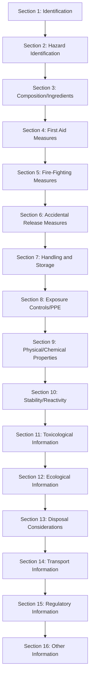

## Overview

Hazard Communication (HazCom) training ensures HVAC technicians can identify, understand, and safely handle the diverse chemical hazards encountered during equipment installation, maintenance, and repair. OSHA's Hazard Communication Standard (29 CFR 1910.1200) requires employers to inform workers about chemical hazards through comprehensive programs incorporating labeling, Safety Data Sheets (SDS), and effective training.

HVAC work involves exposure to refrigerants, lubricating oils, cleaning solvents, brazing fluxes, refrigerant leak sealants, combustion products, and building materials containing hazardous substances. Understanding these chemical hazards through proper HazCom training reduces injury rates, prevents chronic health effects, and ensures regulatory compliance.

## OSHA Hazard Communication Standard

The HazCom Standard (1910.1200) establishes three fundamental requirements for chemical safety:

1. **Chemical hazard classification** using standardized criteria
2. **Communication of hazard information** through labels and SDS
3. **Worker training** on hazard recognition and protective measures

The standard applies to all workplaces where employees may be exposed to hazardous chemicals under normal conditions or foreseeable emergencies. HVAC technicians working in manufacturing facilities, hospitals, commercial buildings, and residential settings fall under this protection.

### Employer Responsibilities

Employers must establish a written Hazard Communication Program that includes:

- Chemical inventory listing all hazardous substances in the workplace
- SDS collection and maintenance system accessible to all workers
- Labeling procedures for all chemical containers
- Employee training on hazards and protective measures
- Procedures for informing contractors about chemical hazards

## Globally Harmonized System (GHS)

The GHS provides international standardization of chemical classification and communication. OSHA's adoption of GHS in 2012 aligned U.S. practices with global standards, improving consistency in hazard identification and communication.

### GHS Hazard Classes Relevant to HVAC Work

**Physical Hazards:**
- Flammable gases (refrigerants R-290, R-32)
- Gases under pressure (all refrigerants, nitrogen)
- Flammable liquids (solvents, degreasers, alcohol-based cleaners)
- Corrosive to metals (acidic cleaners, flux removers)

**Health Hazards:**
- Acute toxicity (refrigerant overexposure, solvent inhalation)
- Skin corrosion/irritation (alkaline cleaners, flux residues)
- Eye damage/irritation (refrigerant liquid contact, chemical splashes)
- Respiratory sensitization (isocyanate foam insulation)
- Carcinogenicity (asbestos in old insulation, silica dust)
- Reproductive toxicity (certain solvents)
- Simple asphyxiants (nitrogen purging, CO₂ refrigerants)

**Environmental Hazards:**
- Hazardous to aquatic environment (certain refrigerants, cleaning agents)

### GHS Classification System

Chemical hazards are classified into categories indicating severity, with Category 1 representing the highest hazard level. This classification determines the label elements required.

## Safety Data Sheets (SDS)

SDS provide comprehensive hazard information in a standardized 16-section format. HVAC technicians must know how to access and interpret SDS before using any chemical product.

### SDS 16-Section Format

### Critical SDS Sections for Field Technicians

**Section 2: Hazard Identification**
- GHS classification and label elements
- Pictograms showing hazard types at a glance
- Signal word (Danger or Warning) indicating severity
- Hazard statements describing specific hazards
- Precautionary statements providing safety guidance

**Section 4: First Aid Measures**
- Immediate treatment for exposure routes (inhalation, skin, eyes, ingestion)
- Symptoms of exposure requiring medical attention
- Special treatment notes for emergency responders

**Section 8: Exposure Controls/Personal Protection**
- Occupational exposure limits (PEL, TLV, REL)
- Engineering controls (ventilation requirements)
- PPE specifications (respirator type, glove material, eye protection)

**Section 9: Physical and Chemical Properties**
Critical properties for HVAC refrigerants and chemicals:

| Property | Significance for HVAC Work |
|----------|---------------------------|
| Vapor pressure | Indicates evaporation rate and inhalation hazard potential |
| Vapor density | Determines if vapor rises or settles (>1 settles in low areas) |
| Boiling point | Predicts behavior at ambient conditions |
| Flash point | Flammability risk during brazing and hot work |
| Explosive limits (LEL/UEL) | Flammable concentration range in air |
| Specific gravity | Refrigerant weight for charge calculations |
| Decomposition temperature | Temperature at which toxic decomposition begins |

## Hazard Pictograms and Recognition

GHS uses nine pictograms with red borders and black symbols on white backgrounds to convey hazard information visually.

### HVAC-Relevant Pictograms

| Pictogram | Hazard Category | HVAC Examples |
|-----------|----------------|---------------|
| Flame | Flammable materials | R-290 refrigerant, acetylene, solvents, alcohol-based coil cleaners |
| Gas Cylinder | Gases under pressure | All refrigerants, nitrogen, acetylene, oxygen |
| Corrosion | Corrosive to skin/metals | Acidic/alkaline coil cleaners, flux removers, descaling agents |
| Skull and Crossbones | Acute toxicity | Highly concentrated cleaning agents, pesticides in air handlers |
| Exclamation Mark | Less severe hazards | Skin irritants, eye irritants, mild toxicity |
| Health Hazard | Serious health effects | Carcinogens (asbestos), reproductive toxins, respiratory sensitizers |
| Environment | Aquatic toxicity | High-GWP refrigerants, certain cleaning agents |

### Signal Words

**Danger:** Used for more severe hazard categories (requires immediate attention)

**Warning:** Used for less severe hazard categories

A chemical label may contain only one signal word, representing the most severe hazard present.

## Chemical Labeling Requirements

Every chemical container in the workplace must have a compliant label containing six elements:

1. **Product identifier** matching SDS name
2. **Signal word** (Danger or Warning)
3. **Hazard statement(s)** describing hazards
4. **Pictogram(s)** showing hazard types
5. **Precautionary statement(s)** providing safety guidance
6. **Supplier information** (name, address, phone)

### Workplace Labeling for Transferred Chemicals

When transferring chemicals from original containers to secondary containers (spray bottles, service cans), labels must include:

- Product identifier or chemical name
- Hazard warnings appropriate to the hazard class

Many HVAC contractors use the National Fire Protection Association (NFPA) diamond or Hazardous Materials Identification System (HMIS) for workplace labeling, which is acceptable if it conveys required hazard information.

### Refrigerant Cylinder Labeling

Refrigerant cylinders contain specific labeling beyond GHS requirements:

- Refrigerant designation (R-410A, R-32, etc.)
- ASHRAE safety classification (A1, A2L, A3, B1, etc.)
- DOT hazard class (Class 2.2 non-flammable or Class 2.1 flammable)
- Color coding (voluntary, not standardized internationally)
- Weight and pressure specifications

## HVAC-Specific Chemical Hazards

### Refrigerants

**Physical Hazards:**
All refrigerants are gases under pressure. A2L and A3 classifications indicate flammability hazards requiring special handling:

$$\text{Vapor Density} = \frac{\text{Molecular Weight}_{\text{refrigerant}}}{28.97 \text{ (air MW)}}$$

Refrigerants with vapor density >1 settle in low areas, displacing oxygen and creating asphyxiation hazards. R-410A has a molecular weight of 72.6 g/mol:

$$\text{Vapor Density}_{\text{R-410A}} = \frac{72.6}{28.97} = 2.51$$

This indicates R-410A is 2.51 times heavier than air and will accumulate in pits, basements, and confined spaces.

**Health Hazards:**
- Simple asphyxiation through oxygen displacement
- Cardiac sensitization at high concentrations (increased heart rhythm irregularity risk)
- Frostbite from liquid refrigerant skin contact (boiling points -60°F to -50°F)
- Thermal decomposition products when exposed to open flames or hot surfaces (>800°F)

**Decomposition Products:**
When refrigerants contact flames or hot metal surfaces, they decompose into highly toxic substances:

- Hydrogen fluoride (HF) - corrosive acid gas
- Carbonyl fluoride (COF₂) - toxic gas
- Phosgene (COCl₂) - chemical warfare agent, extremely toxic

The decomposition reaction for R-410A exposed to open flame:

$$\text{CHF}_2\text{CF}_3 + \text{O}_2 + \text{heat} \rightarrow \text{HF} + \text{COF}_2 + \text{CO}_2 + \text{H}_2\text{O}$$

### Cleaning Agents and Solvents

**Coil Cleaners:**
- Alkaline cleaners (pH 11-14): corrosive, cause chemical burns
- Acidic cleaners (pH 1-3): corrosive, react with metals releasing hydrogen gas
- Require PPE: chemical-resistant gloves, safety goggles, face shield for concentrated forms

**Degreasers and Solvents:**
- Flammable (flash points 50°F-100°F typical)
- Health hazards: narcotic effects, liver/kidney damage from chronic exposure
- Adequate ventilation required (≥25 CFM per square foot of evaporating surface)
- Skin absorption risk necessitates nitrile or neoprene gloves

### Brazing and Welding Materials

**Flux Materials:**
- Contain fluoride compounds that release hydrogen fluoride when heated
- Irritation to eyes, skin, respiratory tract
- Adequate ventilation required during brazing operations

**Silver Brazing Alloys:**
- Cadmium-containing alloys (BCuP-7) generate toxic cadmium fumes
- OSHA PEL for cadmium fumes: 0.005 mg/m³ (very low)
- Recommend cadmium-free alternatives (BCuP-3, BCuP-4)

**Brazing Atmosphere:**
Nitrogen purging during brazing prevents oxidation but creates asphyxiation hazard:

$$\text{Required Ventilation Rate (CFM)} = \frac{\text{N}_2\text{ Flow Rate (CFM)} \times 100}{80 - 20.9}$$

For a nitrogen flow of 5 CFM, minimum ventilation to maintain 19.5% oxygen:

$$\text{Ventilation} = \frac{5 \times 100}{80 - 20.9} = \frac{500}{59.1} = 8.5 \text{ CFM}$$

### Combustion Products

Furnaces, boilers, and gas-fired equipment produce combustion gases requiring hazard awareness:

**Carbon Monoxide (CO):**
- Colorless, odorless toxic gas from incomplete combustion
- OSHA PEL: 50 ppm TWA
- Symptoms: headache, dizziness, nausea, confusion, death at high levels
- Binds to hemoglobin 200 times more readily than oxygen:

$$\text{COHb\%} = \frac{[\text{CO}]}{[\text{CO}] + [\text{O}_2]/200}$$

**Nitrogen Dioxide (NO₂):**
- Reddish-brown gas with pungent odor
- OSHA PEL: 5 ppm ceiling limit
- Causes pulmonary edema, respiratory irritation
- Produced at high combustion temperatures (>2800°F)

**Sulfur Dioxide (SO₂):**
- Forms when sulfur-containing fuels combust
- OSHA PEL: 5 ppm TWA
- Severe respiratory irritant

## Exposure Limits and Dose Calculations

OSHA establishes Permissible Exposure Limits (PELs) for regulated chemicals. ACGIH publishes Threshold Limit Values (TLVs) as recommended guidelines.

### Time-Weighted Average (TWA)

The average concentration over an 8-hour workday:

$$\text{TWA} = \frac{(C_1 \times T_1) + (C_2 \times T_2) + \cdots + (C_n \times T_n)}{8 \text{ hours}}$$

Where:
- $C_n$ = concentration during time period
- $T_n$ = time duration in hours

**Example:** A technician is exposed to solvent vapors at 75 ppm for 3 hours and 40 ppm for 2 hours. If the PEL is 50 ppm TWA:

$$\text{TWA} = \frac{(75 \times 3) + (40 \times 2)}{8} = \frac{225 + 80}{8} = \frac{305}{8} = 38.1 \text{ ppm}$$

The exposure is below the PEL of 50 ppm TWA, indicating compliance.

### Short-Term Exposure Limit (STEL)

Maximum concentration for 15-minute periods, not to exceed 4 times per day with at least 60 minutes between exposures.

### Ceiling Limit

Concentration that must never be exceeded at any time during the workday.

## Personal Protective Equipment Selection

SDS Section 8 specifies required PPE based on hazard classification. HVAC technicians must understand PPE selection criteria.

### Respiratory Protection

Required when engineering controls cannot reduce exposure below PEL/TLV:

| Hazard Type | Respirator Selection |
|-------------|---------------------|
| Particulate matter (dust, fibers) | N95 filtering facepiece (APF 10) or half-face elastomeric (APF 10) |
| Organic vapors (solvents) | Half-face with organic vapor cartridge (APF 10) |
| Acid gases (HF, HCl) | Half-face with acid gas cartridge (APF 10) |
| Ammonia refrigerant leak | Full-face with ammonia cartridge (APF 50) or SCBA for high concentrations |
| IDLH atmosphere | Self-contained breathing apparatus (SCBA) or supplied-air respirator |

**Assigned Protection Factor (APF):** The expected level of respiratory protection provided:

$$\text{Effective Exposure} = \frac{\text{Actual Concentration}}{\text{APF}}$$

If solvent concentration is 200 ppm and PEL is 50 ppm, required APF:

$$\text{Required APF} = \frac{200}{50} = 4$$

A half-face respirator (APF 10) provides adequate protection.

### Chemical-Resistant Gloves

Glove material must resist permeation by the specific chemical:

| Chemical Class | Recommended Glove Material |
|----------------|---------------------------|
| Refrigerants | Neoprene, nitrile |
| Petroleum oils | Nitrile, PVC |
| Acidic cleaners | Neoprene, butyl rubber |
| Alkaline cleaners | Neoprene, nitrile |
| Solvents (alcohols, ketones) | Nitrile, butyl rubber |

**Breakthrough Time:** Duration until chemical permeates glove material. Replace gloves before breakthrough time expires.

### Eye and Face Protection

- Safety glasses with side shields: minimum for all chemical work
- Chemical splash goggles: when pouring or mixing concentrated chemicals
- Face shield (with safety glasses): when handling corrosive materials

## Training Requirements

OSHA requires HazCom training at the time of initial assignment and whenever a new chemical hazard is introduced.

### Required Training Elements

1. **Overview of HazCom Standard requirements**
2. **Chemical hazards present in the work area**
3. **Location and availability of SDS**
4. **Methods to detect chemical presence** (odor, monitoring, visual)
5. **Physical and health hazards** of chemicals
6. **Protective measures** (engineering controls, PPE, work practices)
7. **Label elements and GHS pictograms**
8. **SDS format and how to obtain hazard information**

### HVAC-Specific Training Topics

- Refrigerant classifications and handling procedures
- Cleaning agent hazards and dilution procedures
- Combustion product recognition and carbon monoxide response
- Brazing flux hazards and ventilation requirements
- Asbestos recognition in existing buildings
- Emergency procedures for chemical spills and exposures

## Chemical Inventory Management

Maintaining an accurate chemical inventory ensures SDS availability and facilitates hazard assessment.

### Inventory Development

1. **Survey all work areas** for chemical products
2. **Record product names** matching SDS identifiers
3. **Document quantities and storage locations**
4. **Obtain SDS for each product** from manufacturer or supplier
5. **Review SDS annually** for updates
6. **Remove obsolete chemicals** from inventory and workplace

### Mobile Service Vehicles

HVAC service vehicles contain numerous chemicals requiring inventory:

- Refrigerants (multiple types)
- Lubricating oils
- Brazing flux and alloys
- Leak sealants
- Cleaning agents
- Nitrogen cylinders
- Acetylene/oxygen

Maintain SDS binder or electronic access in vehicles for field technician reference.

## Emergency Response Procedures

HazCom training includes emergency procedures for chemical spills, fires, and exposure incidents.

### Small Spill Response (Incidental Releases)

For spills employees can safely clean up without specialized training:

1. Alert others in the area
2. Ventilate if vapors present
3. Don appropriate PPE (gloves, goggles)
4. Contain spill with absorbent material
5. Collect contaminated material in appropriate container
6. Dispose per SDS guidance and regulations

### Large Spill Response (Emergency Releases)

Spills requiring specialized cleanup or evacuation:

1. Evacuate the area
2. Isolate the hazard zone
3. Contact emergency response team
4. Provide SDS to responders
5. Do not attempt cleanup without proper training and equipment

### Refrigerant Release Response

Large refrigerant releases in enclosed spaces create immediate hazards:

- **Evacuate** if oxygen deficiency suspected
- **Activate mechanical ventilation** to maximum capacity
- **Eliminate ignition sources** for flammable refrigerants (A2L, A3)
- **Monitor oxygen levels** before reentry (19.5% minimum)
- **Repair leak** after area is safe

Effective Hazard Communication training protects HVAC technicians from chemical hazards encountered throughout their careers. Understanding GHS classifications, interpreting SDS information, recognizing label elements, and implementing protective measures ensures safe chemical handling and compliance with OSHA requirements.

## Components

- Hazcom Standard Osha
- Globally Harmonized System Ghs
- Safety Data Sheets Sds Understanding
- Hazard Classification Categories
- Hazard Pictograms Recognition
- Signal Words Interpretation
- Hazard Statements Understanding
- Precautionary Statements Application
- Container Labeling Requirements
- Workplace Labeling Systems
- Chemical Inventory Maintenance
