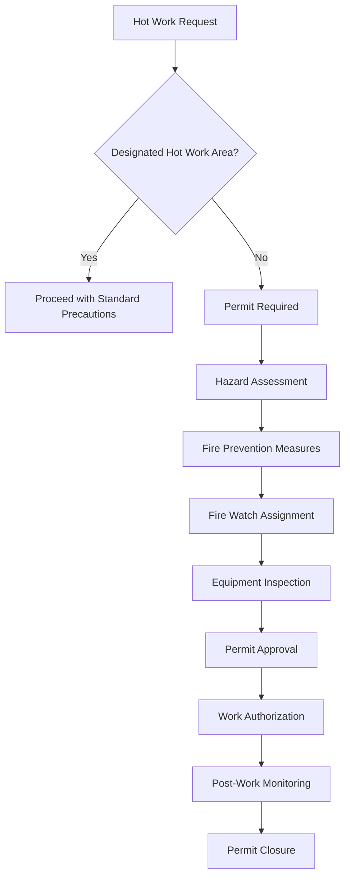

# Hot Work Safety in HVAC Operations

Hot work operations represent one of the highest-risk activities in HVAC installation, maintenance, and repair. These operations involve brazing refrigerant lines, welding ductwork, cutting metal components, and soldering connections—all processes that generate sufficient heat to ignite combustible materials and create fire hazards.

## Definition and Scope of Hot Work

Hot work encompasses any operation that produces flames, sparks, or heat sufficient to ignite ordinary combustible materials. In HVAC contexts, this includes:

- **Brazing operations**: Joining copper refrigerant lines at temperatures between 840°F and 2,000°F
- **Welding processes**: Fusing metal ductwork, supports, and structural components
- **Cutting operations**: Using torches, plasma cutters, or abrasive wheels to modify metal
- **Soldering**: Lower-temperature joining of water lines and electrical connections
- **Grinding**: Generating sparks through abrasive contact with metal surfaces

The thermal energy released during these operations creates ignition sources capable of starting fires in materials located significant distances from the work area.

## Physics of Hot Work Hazards

### Heat Transfer and Ignition Risk

The hazard from hot work stems from three heat transfer modes:

**Conduction through metal components:**

$$Q_{cond} = \frac{kA(T_1 - T_2)}{L}$$

Where:
- $Q_{cond}$ = conductive heat transfer rate (W)
- $k$ = thermal conductivity of metal (W/m·K)
- $A$ = cross-sectional area (m²)
- $T_1 - T_2$ = temperature difference (K)
- $L$ = conduction path length (m)

Copper tubing (k = 385 W/m·K) conducts heat rapidly, potentially igniting materials 10-15 feet from the brazing point. Steel ductwork (k = 50 W/m·K) transfers heat more slowly but still presents hazards.

**Convection from hot gases:**

$$Q_{conv} = hA(T_s - T_\infty)$$

Where:
- $Q_{conv}$ = convective heat transfer (W)
- $h$ = convection coefficient (W/m²·K)
- $T_s$ = surface temperature (K)
- $T_\infty$ = ambient temperature (K)

Hot exhaust gases from cutting torches can reach 3,000°F and ignite materials in their flow path.

**Radiation from incandescent surfaces:**

$$Q_{rad} = \epsilon \sigma A(T_s^4 - T_{surr}^4)$$

Where:
- $\epsilon$ = emissivity (0-1)
- $\sigma$ = Stefan-Boltzmann constant (5.67×10⁻⁸ W/m²·K⁴)
- $T_s$ = surface temperature (K)
- $T_{surr}$ = surrounding temperature (K)

Radiant heat from glowing metal can ignite combustibles at distances exceeding 35 feet.

## Hot Work Permit System

NFPA 51B and OSHA 29 CFR 1910.252 require formal hot work permits for operations outside designated areas. The permit system ensures systematic hazard evaluation before work begins.

### Permit Components

### Pre-Work Inspection Checklist

| Requirement | Inspection Distance | Verification Method |
|-------------|---------------------|---------------------|
| Combustible materials removed | 35 ft radius | Visual inspection |
| Flammable liquids removed | 50 ft radius | Check containers, drains |
| Floors swept clean | Work area | Remove dust, debris |
| Wall/floor openings covered | All openings | Metal shields installed |
| Fire extinguisher available | Within 30 ft | Proper type, charged |
| Fire watch assigned | Continuous | Trained personnel |
| Ventilation adequate | Work area | Measure air changes |
| Gas cylinders secured | Storage area | Chains, stands verified |

## Brazing Safety in Refrigeration Work

Brazing copper refrigerant lines represents the most common hot work in HVAC. The process requires temperatures of 1,200-1,500°F to melt phosphor-copper or silver brazing alloys.

### Temperature Control

The melting point of brazing alloys determines minimum torch temperature:

| Alloy Type | Melting Range | Typical Application | Joint Strength |
|------------|---------------|---------------------|----------------|
| 15% Silver | 1,190-1,495°F | General refrigeration | 40,000 psi |
| 5% Silver | 1,205-1,475°F | Low-cost applications | 35,000 psi |
| 0% Silver (Phos-Copper) | 1,310-1,475°F | Copper-to-copper only | 30,000 psi |
| 45% Silver | 1,125-1,295°F | Thin-wall tubing | 50,000 psi |

Excessive heat weakens the joint and increases fire risk. The optimal brazing temperature exceeds the melting point by only 50-150°F.

### Nitrogen Purging

During brazing, introducing nitrogen at 3-5 psig through the refrigerant circuit prevents oxide scale formation:

$$\dot{m}_{N_2} = \frac{P_{gage} \cdot V_{pipe}}{RT}$$

Where:
- $\dot{m}_{N_2}$ = nitrogen mass flow requirement
- $P_{gage}$ = gauge pressure (3-5 psig)
- $V_{pipe}$ = pipe volume being brazed
- $R$ = specific gas constant for nitrogen
- $T$ = absolute temperature

Nitrogen flow also provides cooling and reduces internal temperatures, minimizing ignition risk to nearby insulation.

## Fire Prevention Strategies

### Combustible Material Management

The ignition temperature of common HVAC materials establishes clearance requirements:

| Material | Ignition Temperature | Required Clearance | Protection Method |
|----------|----------------------|--------------------|--------------------|
| Cellulose insulation | 300-400°F | 35 ft | Remove or wet down |
| Fiberglass duct insulation | 450-550°F | 20 ft | Cover with metal |
| Rubber pipe insulation | 500-600°F | 15 ft | Remove completely |
| Wood framing | 400-500°F | 35 ft | Cover with wet blankets |
| Ceiling tiles | 350-450°F | 20 ft | Remove or cover |
| Electrical cables | 300-400°F | 10 ft | Shield with metal |

### Welding Blankets and Shields

Fire-resistant materials protect combustibles that cannot be removed:

- **Fiberglass blankets**: Withstand temperatures to 1,000°F, block radiant heat
- **Carbon fiber shields**: Resist temperatures to 1,500°F, reflect 95% of radiant energy
- **Ceramic blankets**: Handle temperatures to 2,300°F for extreme applications

The required thickness for thermal protection:

$$t = \frac{k(T_1 - T_2)}{q''_{max}}$$

Where $t$ is blanket thickness to maintain safe temperature $T_2$ on the protected side.

## Fire Watch Requirements

NFPA 51B mandates fire watch personnel during and after hot work. The fire watch serves as the final line of defense against ignition.

### Fire Watch Duration

Post-work monitoring continues for minimum durations based on fire risk:

```mermaid
gantt
    title Fire Watch Timeline
    dateFormat HH:mm
    axisFormat %H:%M
    section Standard Operations
    Hot Work Period           :active, 00:00, 1h
    Fire Watch During Work    :active, 00:00, 1h
    Post-Work Monitoring      :crit, 01:00, 30m
    section High-Risk Areas
    Hot Work Period           :active, 00:00, 1h
    Fire Watch During Work    :active, 00:00, 1h
    Extended Monitoring       :crit, 01:00, 3h
```

High-risk areas include those with concealed spaces, combustible wall materials, or limited visibility where smoldering could develop undetected.

### Fire Watch Equipment

Required equipment for effective fire watch:

- Class ABC fire extinguisher (minimum 10 lb capacity)
- Direct communication to emergency services
- Flashlight for inspecting dark areas
- Thermal imaging camera (recommended for concealed spaces)
- Water supply for cooling hot surfaces

## Gas Cylinder Safety

Acetylene and oxygen cylinders used in cutting and welding operations require specific handling:

### Storage and Handling Requirements

| Requirement | Specification | Basis |
|-------------|---------------|-------|
| Cylinder securing | Chain or strap at 2/3 height | Prevent tipping |
| Separation distance | 20 ft or 5-inch barrier | Acetylene-oxygen separation |
| Storage orientation | Vertical, valve up | Acetylene acetone distribution |
| Cap installation | When not in use | Valve protection |
| Transport method | Cylinder cart only | Prevent damage |
| Valve operation | 1/4 to 1/2 turn open | Emergency shutoff capability |

### Pressure Regulation

Acetylene becomes unstable above 15 psig. Regulators must limit delivery pressure:

$$P_{safe} = P_{cylinder} \times \frac{A_{orifice}}{A_{diaphragm}}$$

Proper regulation prevents decomposition reactions that can cause cylinder explosion.

## Ventilation Requirements for Hot Work

Welding and brazing generate metal fumes requiring ventilation to maintain safe exposure levels.

### Fume Generation Rates

The mass of fume produced during welding:

$$\dot{m}_{fume} = F_r \times \dot{m}_{rod}$$

Where:
- $F_r$ = fume generation factor (0.01-0.03 for typical electrodes)
- $\dot{m}_{rod}$ = electrode consumption rate (g/min)

### Required Ventilation Rate

To maintain concentrations below threshold limit values (TLV):

$$Q = \frac{\dot{m}_{fume} \times 10^6}{TLV \times \rho_{air}}$$

Where:
- $Q$ = required ventilation rate (CFM)
- $TLV$ = threshold limit value (mg/m³)
- $\rho_{air}$ = air density

For confined spaces, OSHA requires minimum 100 CFM per welder plus adequate makeup air.

## Emergency Response Procedures

Despite precautions, hot work fires occur. Immediate response procedures:

1. **Activate alarm**: Alert building occupants and fire department
2. **Attempt extinguishment**: Use appropriate extinguisher if safe to do so
3. **Evacuate if necessary**: When fire exceeds extinguisher capacity
4. **Shut off gas supply**: Close cylinder valves to remove fuel source
5. **Meet emergency responders**: Provide information on hazards, building layout

### Extinguisher Selection

| Fire Class | HVAC Hot Work Application | Extinguisher Type | Minimum Rating |
|------------|---------------------------|-------------------|----------------|
| Class A | Wood, paper, insulation | Water, ABC | 2-A |
| Class B | Cutting oils, lubricants | ABC, BC, CO₂ | 10-B |
| Class C | Electrical panels, motors | ABC, BC, CO₂ | C-rated |
| Class D | Magnesium, titanium dust | Special powder | Manufacturer spec |

## Regulatory Framework

Multiple standards govern hot work safety in HVAC operations:

- **NFPA 51B**: Standard for Fire Prevention During Welding, Cutting, and Other Hot Work
- **OSHA 29 CFR 1910.252**: General welding, cutting, and brazing requirements
- **OSHA 29 CFR 1926.352**: Construction industry fire prevention
- **ASHRAE 15**: Refrigerant safety provisions affecting brazing operations
- **International Fire Code**: Municipal hot work permit requirements

Compliance requires understanding the specific provisions applicable to each work location and operation type.

## Training Certification

Effective hot work safety training covers:

- Fire triangle and combustion principles
- Heat transfer mechanisms and ignition hazards
- Permit system procedures and documentation
- Pre-work inspection techniques
- Fire watch responsibilities and duration
- Gas cylinder handling and storage
- Emergency response and extinguisher use
- Regulatory compliance requirements

Training should include hands-on demonstration of fire extinguisher use and practice completing permit forms. Refresher training is recommended annually, with retraining required after any hot work incident.
