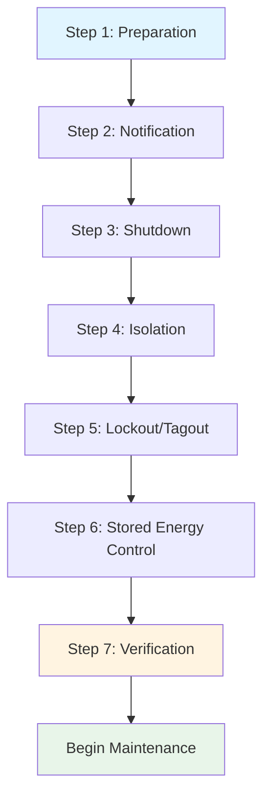
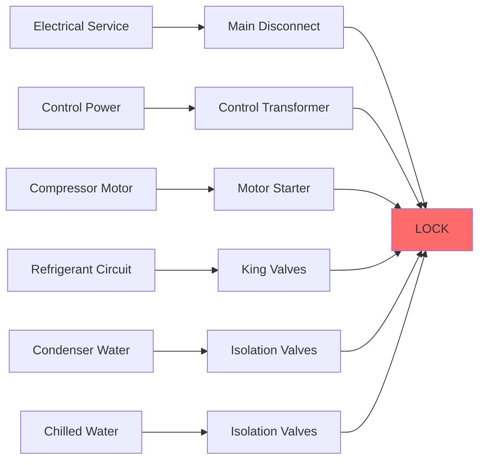

## Fundamentals of Lockout-Tagout

Lockout-Tagout (LOTO) procedures control hazardous energy during servicing and maintenance of HVAC equipment. The process ensures equipment reaches a zero-energy state before technicians begin work, preventing unexpected energization, startup, or release of stored energy that causes approximately 120 fatalities and 50,000 injuries annually in industrial settings.

### Energy Types in HVAC Systems

HVAC equipment contains multiple energy forms requiring isolation:

| Energy Type | HVAC Sources | Hazard Mechanism | Isolation Method |
|-------------|--------------|------------------|------------------|
| Electrical | Motors, controls, heaters | Arc flash, electrocution | Circuit breakers, disconnects |
| Mechanical | Rotating equipment, belts | Entanglement, impact | Shaft locks, belt guards |
| Pneumatic | Compressed air lines | High-velocity release | Valve closure, bleed-down |
| Hydraulic | Pump systems, actuators | Pressurized fluid injection | Valve isolation, depressurization |
| Thermal | Hot surfaces, refrigerant | Burns, frostbite | Cool-down period, insulation |
| Potential (Gravity) | Suspended components | Falling objects | Mechanical support, blocks |
| Stored Energy | Capacitors, springs, accumulators | Sudden discharge | Grounding, compression release |

## OSHA 1910.147 Requirements

The Control of Hazardous Energy standard mandates specific procedures for equipment isolation. Compliance requires written energy control programs, employee training, and periodic inspections at minimum annual intervals.

### Six-Step LOTO Procedure

**Step 1 - Preparation**: Identify all energy sources and isolation points. For a packaged rooftop unit, this includes electrical service, gas supply, refrigerant circuits, and control air lines.

**Step 2 - Notification**: Inform affected personnel of shutdown. Critical for occupied buildings where HVAC interruption impacts operations.

**Step 3 - Shutdown**: Use normal operating procedures to shut down equipment. Avoid emergency stops that may leave energy stored in the system.

**Step 4 - Isolation**: Physically disconnect all energy sources. Close valves, open circuit breakers, and remove fuses as specified in equipment-specific procedures.

**Step 5 - Application of Devices**: Apply lockout devices and tags. Each authorized employee applies their personal lock, creating a multiple-lock scenario for group servicing.

**Step 6 - Stored Energy Control**: Release or restrain all stored energy. This step prevents the majority of LOTO-related injuries.

**Step 7 - Verification**: Test equipment to confirm zero-energy state before beginning work.

## Stored Energy Calculations

Quantifying stored energy determines the hazard level and appropriate control measures.

### Capacitive Energy Storage

Electrical capacitors in motor drives and power factor correction equipment store energy according to:

$$E_c = \frac{1}{2}CV^2$$

Where:
- $E_c$ = stored energy (joules)
- $C$ = capacitance (farads)
- $V$ = voltage (volts)

A 500 μF capacitor at 480V stores:

$$E_c = \frac{1}{2}(500 \times 10^{-6})(480)^2 = 57.6 \text{ J}$$

This energy level delivers lethal current if discharged through a technician. Grounding procedures must dissipate this energy before contact.

### Pneumatic Pressure Energy

Compressed air systems store energy in receiver tanks and piping:

$$E_p = \frac{P_1V}{k-1}\left[1-\left(\frac{P_2}{P_1}\right)^{\frac{k-1}{k}}\right]$$

Where:
- $E_p$ = pneumatic energy (joules)
- $P_1$ = initial absolute pressure (Pa)
- $P_2$ = final absolute pressure (Pa)
- $V$ = volume (m³)
- $k$ = specific heat ratio (1.4 for air)

For a 0.5 m³ receiver at 690 kPa (100 psig) venting to atmosphere:

$$E_p = \frac{(690,000)(0.5)}{1.4-1}\left[1-\left(\frac{101,325}{690,000}\right)^{\frac{0.4}{1.4}}\right] = 387,000 \text{ J}$$

This 387 kJ release creates explosive decompression hazards requiring controlled bleed-down through valves, not instant disconnection.

### Rotational Kinetic Energy

Flywheel effects in large fans and blowers store kinetic energy:

$$E_k = \frac{1}{2}I\omega^2$$

Where:
- $E_k$ = kinetic energy (joules)
- $I$ = moment of inertia (kg·m²)
- $\omega$ = angular velocity (rad/s)

A centrifugal fan with moment of inertia 50 kg·m² operating at 1200 RPM stores:

$$\omega = 1200 \times \frac{2\pi}{60} = 125.66 \text{ rad/s}$$

$$E_k = \frac{1}{2}(50)(125.66)^2 = 395,000 \text{ J}$$

The 395 kJ stored requires complete rotational stop verification, as coasting equipment can restart unexpectedly from bearing friction reduction or air current changes.

## Equipment-Specific LOTO Procedures

### Chiller Lockout Protocol

Critical isolation points for water-cooled chillers include:

1. **Electrical**: 480V main disconnect, control transformer primary (120V), starter contacts
2. **Refrigerant**: Compressor suction and discharge service valves (king valves)
3. **Hydronic**: Condenser water and chilled water isolation valves with drain points
4. **Pneumatic**: Control air supply if used for valve actuation
5. **Thermal**: Allow refrigerant pressures to equalize, verify oil heater de-energization

### Boiler Lockout Protocol

High-pressure boilers present extreme thermal and pressure hazards:

1. **Fuel Supply**: Natural gas valve lockout with bleeding downstream pressure
2. **Electrical**: Burner motor, ignition system, and control power isolation
3. **Feedwater**: Pump isolation and check valve verification
4. **Steam**: Main steam valve closure with atmospheric vent
5. **Thermal**: Cool-down to below 60°C (140°F) before entry

The thermal cool-down follows Newton's Law of Cooling:

$$T(t) = T_a + (T_0 - T_a)e^{-kt}$$

Where:
- $T(t)$ = temperature at time $t$
- $T_a$ = ambient temperature
- $T_0$ = initial temperature
- $k$ = cooling constant

For a 150°C boiler cooling to 60°C in 30°C ambient with cooling constant 0.05 h⁻¹:

$$60 = 30 + (150-30)e^{-0.05t}$$

$$t = \frac{\ln(\frac{30}{120})}{-0.05} = 27.7 \text{ hours}$$

This 28-hour cool-down period cannot be bypassed for complete isolation safety.

## Verification Testing Methods

Zero-energy verification prevents the majority of LOTO failures.

### Electrical Verification

Three-step verification process:

1. **Test instrument on known live circuit** - Confirms meter functionality
2. **Test locked-out circuit** - Must show zero voltage
3. **Re-test instrument on known live circuit** - Confirms meter still functional

Acceptable voltage readings must be below 50V AC or 120V DC, the NFPA 70E threshold for shock hazard.

### Mechanical Verification

Attempt to start equipment using normal controls. Zero response confirms proper isolation. For variable frequency drives, this includes verification that the DC bus voltage has dissipated below 40V.

### Pressure Verification

Install calibrated gauges at isolation points. Pneumatic systems must reach atmospheric pressure (0 psig), hydraulic systems must show zero gauge pressure with consideration for fluid column head pressure:

$$P = \rho g h$$

Where vertical fluid columns create residual pressure requiring drain point opening, not just valve closure.

## Group Lockout Procedures

Multiple technicians working on the same equipment require coordinated LOTO:

**Group Lockbox Method**: Primary isolation devices receive a group lockout, with individual technician locks applied to a lockbox containing the group lock keys. Each technician must remove their personal lock before the primary isolation can be restored.

**Craft Sequence Protocol**: When multiple trades (electrical, mechanical, controls) work simultaneously, establish a defined sequence:

1. Electrical isolation and verification
2. Mechanical isolation and verification
3. Process isolation (refrigerant, water, air)
4. Stored energy dissipation
5. Final verification by each craft

## Training and Documentation

OSHA requires three training levels:

**Authorized Employees**: Personnel who perform LOTO receive comprehensive training in energy source recognition, isolation methods, and equipment-specific procedures. Annual retraining minimum.

**Affected Employees**: Personnel who operate equipment receive training in LOTO purpose, prohibition against removing locks/tags, and how to recognize when LOTO is in place.

**Other Employees**: General awareness training that LOTO devices must not be tampered with.

Documentation requirements include:

- Written energy control procedures for each equipment type
- Employee training records with dates and topics
- Annual periodic inspection records
- Equipment-specific energy isolation diagrams

### Inspection Requirements

Annual authorized inspections verify procedure effectiveness:

| Inspection Element | Verification Method | Documentation Required |
|--------------------|---------------------|------------------------|
| Energy source identification | Physical walkdown | Updated isolation diagrams |
| Isolation device adequacy | Lock fit verification | Device inventory |
| Stored energy control | Measurement procedures | Test equipment calibration |
| Verification testing | Witnessed procedure | Inspection checklist |
| Employee knowledge | Interview affected workers | Interview records |

## Consequences of Non-Compliance

LOTO violations carry severe penalties under OSHA enforcement:

- **Serious Violation**: $13,653 per violation (2023 rates)
- **Willful Violation**: $136,532 per violation
- **Repeat Violation**: $136,532 per violation

Beyond regulatory consequences, inadequate LOTO causes equipment damage, production losses, and catastrophic personnel injuries. The physics of stored energy release demonstrates why procedural discipline is non-negotiable in HVAC maintenance operations.

## References

- OSHA 1910.147: The Control of Hazardous Energy (Lockout/Tagout)
- ASHRAE Standard 15: Safety Standard for Refrigeration Systems
- NFPA 70E: Standard for Electrical Safety in the Workplace
- ANSI Z244.1: Control of Hazardous Energy - Lockout/Tagout and Alternative Methods
