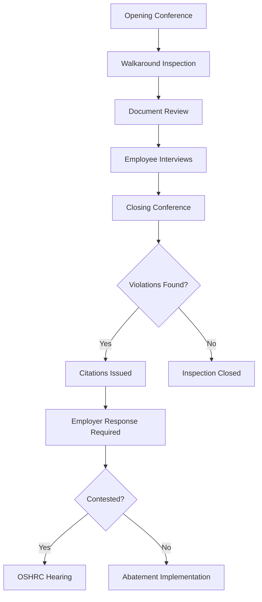

## Overview

OSHA (Occupational Safety and Health Administration) safety training provides HVAC technicians and contractors with essential knowledge of workplace hazards, regulatory requirements, and safe work practices mandated under the Occupational Safety and Health Act of 1970. HVAC professionals face unique risks spanning both construction (29 CFR 1926) and general industry (29 CFR 1910) standards, requiring comprehensive training that addresses installation, maintenance, and service activities across diverse environments.

OSHA's outreach training programs deliver standardized safety education recognized nationwide, satisfying many state and municipal job site access requirements while reducing injury rates, workers' compensation costs, and regulatory violations.

## Regulatory Framework

### OSHA Authority and Enforcement

OSHA operates under the General Duty Clause requiring employers to provide workplaces "free from recognized hazards that are causing or are likely to cause death or serious physical harm." For HVAC operations, this encompasses:

- Installation activities governed by construction standards (29 CFR 1926)
- Service and maintenance work under general industry standards (29 CFR 1910)
- Refrigerant handling per ASHRAE Standard 15 (referenced by OSHA)
- State-specific regulations in states with OSHA-approved State Plans

### Inspection and Citation Process

OSHA conducts workplace inspections triggered by fatalities, catastrophes, worker complaints, referrals, and programmed inspections of high-hazard industries. The inspection process follows a defined sequence:

### Citation Categories and Penalties

OSHA violations carry escalating penalties based on severity and employer history:

| Violation Type | Definition | Base Penalty Range | HVAC Examples |
|----------------|------------|-------------------|---------------|
| **De Minimis** | No direct safety/health relationship | No penalty | Housekeeping minor issues |
| **Other-Than-Serious** | Could cause injury but unlikely to cause death/serious harm | $0 - $16,131 | Missing safety data sheets |
| **Serious** | Substantial probability of death or serious harm | $1,000 - $16,131 | Missing fall protection |
| **Willful** | Intentional or knowing violation | $11,524 - $161,323 | Deliberately bypassing safety devices |
| **Repeat** | Violation of previously cited standard | $0 - $161,323 | Same fall protection violation after citation |
| **Failure to Abate** | Not correcting prior violation | $16,131 per day beyond abatement date | Not installing required guardrails |

*Penalty amounts adjusted annually for inflation (2024 figures)*

## OSHA Outreach Training Programs

### Construction vs. General Industry Training

HVAC professionals require both construction and general industry knowledge based on work activities:

**Construction Standards (29 CFR 1926) Apply When:**
- Installing new HVAC systems in buildings under construction
- Performing major renovations or equipment replacements
- Working on rooftops during initial installation
- Rigging and setting equipment using cranes or aerial lifts
- Creating duct penetrations through structural elements

**General Industry Standards (29 CFR 1910) Apply When:**
- Servicing existing HVAC equipment in occupied buildings
- Performing preventive maintenance and filter changes
- Troubleshooting and repairing operational systems
- Working in established mechanical rooms and equipment spaces
- Conducting routine inspections and testing

Many HVAC companies require both 10-Hour Construction and 10-Hour General Industry training to ensure comprehensive coverage.

### Training Level Comparison

| Feature | 10-Hour Course | 30-Hour Course |
|---------|----------------|----------------|
| **Target Audience** | Entry-level workers | Supervisors, safety personnel |
| **Duration** | 10 contact hours | 30 contact hours |
| **Core Topics** | Introduction, Focus Four | All 10-Hour topics plus advanced modules |
| **Elective Hours** | 4-6 hours | 16-18 hours |
| **Competent Person Qualification** | No | Partial (additional training required) |
| **Typical Cost** | $75-150 | $250-450 |
| **Completion Timeframe** | 2 days or 6 months online | 4 days or 6 months online |
| **Card Validity** | No expiration (refresher recommended every 5 years) | No expiration (refresher recommended every 5 years) |

### HVAC-Specific Hazard Categories

OSHA training for HVAC professionals must address industry-specific exposures organized by severity and frequency:

**Priority 1: Focus Four Hazards (73% of construction fatalities)**

1. **Falls** - Rooftop equipment work, ladder access, elevated installations
2. **Electrocution** - High-voltage connections, energized circuit work
3. **Struck-By** - Equipment rigging, moving machinery, dropped tools
4. **Caught-In/Between** - Rotating equipment, pinch points, trenches

**Priority 2: HVAC-Critical Exposures**

5. **Confined Spaces** - Mechanical rooms, plenums, equipment vaults
6. **Refrigerant Hazards** - Asphyxiation, chemical burns, pressure releases
7. **Thermal Stress** - Heat exhaustion on rooftops, cold exposure in refrigeration
8. **Respiratory Hazards** - Combustion gases, refrigerant decomposition, mold
9. **Noise Exposure** - Mechanical equipment rooms, compressor areas
10. **Ergonomic Strains** - Equipment lifting, overhead work, repetitive motions

## Physics-Based Hazard Analysis

### Fall Energy Calculations

Fall protection systems must arrest falls before the worker contacts lower levels. The total fall distance determines required clearance:

$$
D_{total} = D_{free} + D_{decel} + D_{harness} + D_{sag} + SF
$$

Where:
- $D_{free}$ = Free fall distance before system engagement (6 ft maximum per OSHA)
- $D_{decel}$ = Deceleration distance (maximum 3.5 ft for personal fall arrest systems)
- $D_{harness}$ = Harness stretch and D-ring slide (typically 1 ft)
- $D_{sag}$ = Vertical line sag or elongation (varies by system)
- $SF$ = Safety factor (minimum 2 ft recommended)

For a typical HVAC technician (6 ft tall) working on a rooftop with a 6-ft shock-absorbing lanyard attached to an anchor at working level:

$$
D_{total} = 6 + 3.5 + 1 + 0 + 2 = 12.5 \text{ ft minimum clearance required}
$$

This calculation reveals that rooftop work often requires elevated anchor points or shorter lanyards to prevent ground contact.

### Electrical Arc Flash Energy

Arc flash incidents during HVAC electrical work release thermal energy proportional to fault current and clearing time:

$$
E = \frac{4.184 \times C_f \times V \times I \times t}{D^2}
$$

Where:
- $E$ = Incident energy (cal/cm²)
- $C_f$ = Calculation factor (varies by equipment, typically 1.0-1.5)
- $V$ = System voltage (V)
- $I$ = Bolted fault current (kA)
- $t$ = Arc duration/clearing time (sec)
- $D$ = Working distance from arc source (inches)

For 480V three-phase equipment common in commercial HVAC:

$$
E = \frac{4.184 \times 1.5 \times 480 \times 25 \times 0.1}{18^2} = 23.3 \text{ cal/cm}^2
$$

This energy level requires Category 3 arc-rated PPE (minimum 25 cal/cm² rating), demonstrating why de-energizing equipment via lockout/tagout remains the preferred safe work practice.

### Refrigerant Displacement Hazard

Refrigerant leaks in confined spaces displace oxygen due to higher molecular weight. The minimum ventilation rate to maintain safe oxygen levels (19.5%) follows:

$$
Q = \frac{\dot{m}_r \times \frac{MW_{air}}{MW_{ref}}}{0.21 \times \rho_{air}}
$$

Where:
- $Q$ = Required ventilation rate (CFM)
- $\dot{m}_r$ = Refrigerant leak rate (lb/min)
- $MW_{air}$ = Molecular weight of air (28.97 g/mol)
- $MW_{ref}$ = Molecular weight of refrigerant (e.g., 86.2 g/mol for R-410A)
- $\rho_{air}$ = Air density (0.075 lb/ft³ at standard conditions)

For a catastrophic R-410A leak of 1 lb/min in a mechanical room:

$$
Q = \frac{1 \times \frac{28.97}{86.2}}{0.21 \times 0.075} = \frac{0.336}{0.01575} = 21.3 \text{ CFM}
$$

ASHRAE 15 requires mechanical ventilation when refrigerant quantity exceeds the Room Volume Limit (RVL), calculated as:

$$
RVL = \frac{m_{ref}}{h_c} \times 1000
$$

Where $m_{ref}$ is total refrigerant charge (lb) and $h_c$ is refrigerant concentration limit (lb/1000 ft³).

## Training Program Components

### Course Structure Requirements

OSHA-authorized outreach training must include:

**Mandatory Elements:**
- Introduction to OSHA (minimum 2 hours for 10-Hour, 4 hours for 30-Hour)
- Walking-Working Surfaces and Fall Protection (minimum 2 hours)
- Electrical Safety (minimum 1 hour)
- Personal Protective Equipment (minimum 1 hour)

**HVAC-Recommended Electives:**
- Confined Space Entry (1-2 hours)
- Hazard Communication and GHS (1-2 hours)
- Materials Handling and Rigging (1-2 hours)
- Respiratory Protection (1 hour)
- Machine Guarding (1 hour)
- Bloodborne Pathogens (for service technicians entering residences)

### Competent Person vs. Qualified Person

OSHA standards frequently require "competent" or "qualified" persons for specific tasks. Understanding these designations is critical:

**Competent Person:**
- Capable of identifying existing and predictable hazards
- Has authorization to take prompt corrective measures
- Designated by employer based on training and experience
- Required for: fall protection supervision, scaffolding erection, confined space monitoring, excavations

**Qualified Person:**
- Possesses degree, certificate, or professional standing
- Has extensive knowledge and training in the subject
- Required for: energized electrical work, crane operations, structural inspections

OSHA 10-Hour and 30-Hour training alone do NOT qualify individuals as competent or qualified persons. Additional task-specific training and employer designation are required.

### Trainer Authorization

Only OSHA-authorized outreach trainers may deliver 10-Hour and 30-Hour courses and issue completion cards. Authorization requires:

1. Completion of OSHA trainer course for respective area (construction or general industry)
2. Maintenance of authorization through continuing education
3. Adherence to OSHA course requirements and curriculum
4. Use of current OSHA-provided student materials

HVAC contractors should verify trainer credentials before enrolling employees.

## Implementation and Documentation

### Training Records

OSHA requires employers to maintain training documentation demonstrating:

- Employee name and identification
- Training date and course title
- Trainer name and credentials
- Course content summary
- Proof of employee comprehension (test scores, participation records)
- Retraining dates when required

Records must be retained for the duration of employment plus 30 years for certain exposures (asbestos, lead, bloodborne pathogens).

### Refresher Training Triggers

While OSHA outreach cards do not expire, retraining is required when:

- Employee demonstrates inadequate knowledge during supervision
- Changes in workplace render previous training obsolete
- New equipment or processes introduce novel hazards
- Regulatory standards are updated
- Following a serious incident or near-miss

Best practice recommends comprehensive refresher training every 3-5 years minimum.

### Integration with Safety Programs

OSHA outreach training forms the foundation of comprehensive safety programs that must also include:

## Regulatory Compliance Resources

**Primary OSHA Standards for HVAC:**

- 29 CFR 1926.501-503 - Fall Protection (Construction)
- 29 CFR 1926.1200-1213 - Confined Spaces in Construction
- 29 CFR 1910.146 - Permit-Required Confined Spaces (General Industry)
- 29 CFR 1910.147 - Lockout/Tagout of Hazardous Energy
- 29 CFR 1926.416-417 - Electrical Safety in Construction
- 29 CFR 1910.132-138 - Personal Protective Equipment
- 29 CFR 1926.1053 - Ladders (Construction)
- 29 CFR 1910.178 - Powered Industrial Trucks (Forklifts)

**Related Industry Standards:**

- ANSI/ASHRAE Standard 15 - Safety Standard for Refrigeration Systems
- ANSI/ASHRAE Standard 62.1 - Ventilation for Acceptable Indoor Air Quality
- NFPA 70 - National Electrical Code
- ANSI Z359 Fall Protection Code
- ANSI/ASSE Z117.1 - Safety Requirements for Confined Spaces

## Return on Investment

OSHA training delivers measurable financial benefits beyond regulatory compliance:

**Direct Cost Reductions:**
- Lower workers' compensation insurance premiums (5-15% reduction typical)
- Reduced medical and indemnity costs from injuries
- Avoidance of OSHA citations and penalties
- Decreased equipment damage from incidents

**Indirect Benefits:**
- Improved productivity through efficient safe work practices
- Reduced absenteeism and turnover
- Enhanced company reputation and competitive bidding advantage
- Lower legal liability exposure

Studies indicate that comprehensive safety training reduces injury rates by 20-40% within the first year of implementation, with ongoing improvements through sustained programs.

## Components

- OSHA 10-Hour Construction
- OSHA 30-Hour Construction
- OSHA General Industry
- Recordkeeping Requirements
- Inspection Procedures
