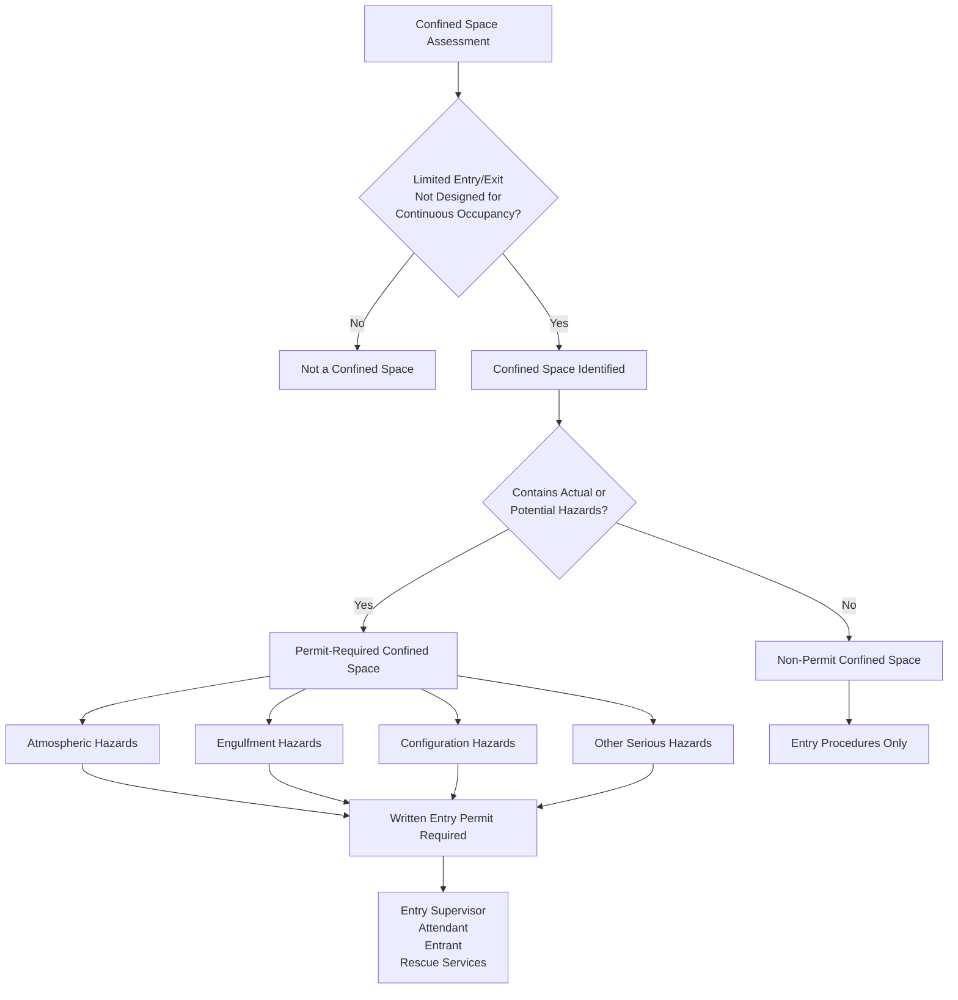

## Overview

The OSHA 30-Hour Construction Safety Training provides advanced-level instruction for HVAC supervisors, foremen, project managers, and safety coordinators. This comprehensive program expands upon the foundational 10-Hour course by emphasizing hazard recognition, avoidance, and control techniques essential for managing construction site safety.

Designed for personnel with supervisory responsibilities, the 30-hour curriculum prepares HVAC professionals to fulfill "competent person" and "qualified person" roles as defined throughout 29 CFR 1926. The training addresses complex scenarios encountered during large-scale HVAC installations, mechanical system commissioning, and multi-trade coordination on construction projects.

## Program Structure and Duration

The 30-hour course must be completed within three months and delivered by an OSHA-authorized outreach trainer. Content is divided between mandatory core topics and elective modules tailored to HVAC construction operations.

### Mandatory Core Topics (20 hours minimum)

- Introduction to OSHA and the Construction Industry (2 hours)
- Managing Safety and Health Programs (2 hours)
- Fall Protection Systems (4 hours expanded coverage)
- Electrical Safety (3 hours expanded coverage)
- Personal Protective Equipment (2 hours)
- Health Hazards in Construction (2 hours)
- Stairways and Ladders (1 hour)
- Concrete and Masonry Construction (1 hour)
- Confined Spaces in Construction (2 hours)
- Recordkeeping and Reporting (1 hour)

### HVAC-Relevant Elective Topics (10 hours minimum)

- Excavations and Trenching (underground piping systems)
- Steel Erection (structural supports for equipment)
- Welding, Cutting, and Brazing (refrigerant piping fabrication)
- Materials Handling and Storage (equipment rigging)
- Cranes, Derricks, and Hoists (rooftop unit placement)
- Fire Protection and Prevention
- Scaffolding Systems (elevated work platforms)

## Advanced HVAC Construction Hazards

### Excavation and Trenching Safety (29 CFR 1926 Subpart P)

Underground HVAC applications require excavations for:
- Geothermal heat pump loop fields
- Chilled water distribution piping
- Underground refrigerant lines between remote condensers
- Steam and condensate return piping
- Building service water lines to cooling towers

**Soil Classification and Protection Systems**

OSHA requires competent person soil classification before entry into excavations ≥4 feet deep. The three soil types dictate protective system design:

| Soil Type | Unconfined Compressive Strength | Maximum Allowable Slope | HVAC Applications |
|-----------|----------------------------------|-------------------------|-------------------|
| Type A (Clay, hardpan) | ≥1.5 tons/ft² | 3/4:1 (53°) | Rare in excavation work due to fissuring |
| Type B (Silt, sandy loam) | 0.5-1.5 tons/ft² | 1:1 (45°) | Most common for utility trenching |
| Type C (Gravel, sand, submerged soil) | <0.5 tons/ft² | 1.5:1 (34°) | Water table areas, backfilled zones |

**Protective System Selection**

The soil pressure exerted on trench walls follows:

$$P = \gamma \cdot z \cdot K_a$$

Where:
- $P$ = lateral earth pressure (psf)
- $\gamma$ = soil unit weight (typically 100-130 pcf)
- $z$ = depth below surface (ft)
- $K_a$ = active earth pressure coefficient (0.3-0.5 for granular soils)

For a 10-foot deep trench in Type B soil ($\gamma = 120$ pcf, $K_a = 0.4$):

$$P = 120 \times 10 \times 0.4 = 480 \text{ psf at trench bottom}$$

This pressure necessitates trench boxes, shoring systems, or sloping to prevent cave-ins that kill an average of 40-50 workers annually.

**Competent Person Responsibilities for HVAC Excavations**

- Daily inspections before worker entry and after rain, freeze, or ground disturbance
- Soil testing using pocket penetrometer, shearvane, or thumb penetration
- Utility location verification (call 811 minimum 48 hours before digging)
- Atmospheric testing in trenches >4 feet deep (oxygen 19.5-23.5%, explosive gas <10% LEL)
- Egress placement within 25 feet lateral distance for trenches ≥4 feet deep
- Spoil pile placement minimum 2 feet from excavation edge
- Water accumulation removal and traffic protection implementation

### Confined Space Program Management (29 CFR 1926.1200-1213)

The 2015 OSHA Confined Spaces in Construction standard distinguishes between non-permit and permit-required confined spaces based on hazard severity. HVAC supervisors must establish written programs identifying all confined spaces on projects.

**HVAC Confined Space Classification**

**HVAC Permit-Required Confined Spaces**

| Space Type | Atmospheric Hazards | Physical Hazards | Entry Procedures |
|------------|---------------------|------------------|------------------|
| Chiller vaults | R-123 leak (TLV 10 ppm), oxygen deficiency | Limited egress, flooding potential | Continuous forced ventilation, atmospheric monitoring |
| Boiler rooms (enclosed) | Combustion gases (CO, NO₂), oxygen depletion | High temperature surfaces (>140°F) | Pre-entry atmospheric testing, hot work permits |
| Large ductwork (>42" diameter) | Dust accumulation, low oxygen | Entrapment, configuration asphyxiation | Lockout/tagout, continuous ventilation |
| Cooling tower sumps | Legionella bacteria, hydrogen sulfide from biofilm | Drowning, entrapment | Respiratory protection, retrieval system |
| Penthouse mechanical rooms (single access) | Refrigerant leaks, inadequate ventilation | Equipment entanglement | Attendant monitoring, communication systems |

**Atmospheric Testing Protocol**

Testing sequence follows physics principles of gas stratification based on molecular weight relative to air:

1. **Oxygen** (MW 32, tests first as displaced by heavier/lighter gases): 19.5-23.5% required
2. **Combustible gases** (test second): <10% LEL for entry, <20% LEL triggers evacuation
3. **Toxic gases** (test third): H₂S <10 ppm, CO <35 ppm, refrigerants below TLV

For refrigerant releases, the oxygen displacement can be calculated:

$$\text{O}_2\% = 20.9\% \times \left(1 - \frac{M_{\text{ref}}}{V_{\text{space}} \times \rho_{\text{air}}}\right)$$

Where:
- $M_{\text{ref}}$ = mass of refrigerant released (lbs)
- $V_{\text{space}}$ = confined space volume (ft³)
- $\rho_{\text{air}}$ = air density (0.075 lb/ft³ at standard conditions)

**Entry Permit System Components**

A comprehensive entry permit documents:
- Space identification and location
- Entry purpose and duration
- Authorized entrants, attendants, and entry supervisor
- Pre-entry atmospheric test results
- Equipment list (ventilation, monitoring, PPE, communication, rescue)
- Communication procedures between entrant and attendant
- Rescue service notification and 5-minute response time verification
- Permit expiration conditions

### Steel Erection and Structural Support (29 CFR 1926 Subpart R)

Large HVAC installations require structural steel supports for:
- Rooftop equipment platforms and curbs
- Suspended air handlers and ductwork
- Cooling tower frameworks
- Vibration isolation spring bases
- Seismic bracing systems (required per ASCE 7 and IBC)

**Load Path Analysis for Equipment Supports**

Equipment dead loads and operating loads transfer through:

1. **Equipment base → Isolation springs/pads**
   - Compressor vibration loads: $F_{\text{vib}} = m \cdot e \cdot \omega^2$
   - Where $m$ = unbalanced mass, $e$ = eccentricity, $\omega$ = rotational frequency

2. **Isolation system → Structural frame**
   - Frame deflection verification: $\delta < L/360$ per ASHRAE Applications

3. **Structural frame → Building structure**
   - Point load distribution through beams
   - Concentrated load verification against building capacity

**Fall Protection During Equipment Installation on Steel**

Work on structural steel frames requires:
- Controlled access zones for workers connecting structural members
- Personal fall arrest systems for all work >15 feet (steel erection exemption above 30 feet applies to structural workers only, NOT HVAC installers)
- Fall protection plan when conventional systems create greater hazard
- Designated erection work area restricting non-essential personnel

### Welding, Cutting, and Brazing Safety (29 CFR 1926 Subpart J)

Refrigerant piping fabrication involves:
- **Brazing copper tubing** (phosphor-copper-silver alloys at 1200-1500°F)
- **Welding steel pipe** (steam, chilled water, hot water systems)
- **Cutting operations** (torch cutting supports, ductwork modifications)

**Fire Prevention in Mechanical Spaces**

Hot work ignition sources present severe fire risks in mechanical rooms containing:
- Combustible insulation materials (fiberglass with kraft facing, elastomeric foam)
- Flammable refrigerants (R-290 propane, R-32 with LFL 13.3%)
- Hydraulic fluids and lubricating oils
- Wood blocking and framing materials

**Hot Work Permit Requirements**

OSHA mandates written permits when hot work occurs in locations where:
- Sprinklers are impaired
- Combustible materials exist within 35 feet
- Partition walls conceal combustible construction
- Combustible ducts or conveyor systems present fire spread paths

Fire watch personnel must:
- Hold charged fire extinguisher (minimum 20-BC rating)
- Monitor for 60 minutes after hot work completion
- Understand fire alarm activation procedures
- Verify combustible material removal or protection

**Brazing Fume Hazards**

Cadmium-silver brazing alloys (now largely discontinued) generated toxic cadmium oxide fumes. Modern phosphor-copper-silver alloys still produce:
- Copper oxide fumes (OSHA PEL 0.1 mg/m³ as Cu)
- Silver oxide (OSHA PEL 0.01 mg/m³ as Ag)
- Phosphorus oxides causing respiratory irritation

Adequate ventilation maintains exposure below permissible limits using local exhaust or general dilution:

$$Q = \frac{403 \times G}{\text{TLV}}$$

Where:
- $Q$ = ventilation rate (cfm)
- $G$ = contaminant generation rate (mg/min)
- TLV = threshold limit value (mg/m³)

### Safety and Health Program Management

OSHA's voluntary Safety and Health Program Management Guidelines provide the framework for reducing workplace injuries. Effective programs incorporate:

**Core Program Elements**

**HVAC-Specific Program Components**

1. **Management Leadership**
   - Written safety policy signed by senior management
   - Dedicated safety coordinator for multi-site operations
   - Safety performance metrics in supervisor evaluations
   - Resource allocation for PPE, training, and engineering controls

2. **Worksite Analysis**
   - Pre-job hazard assessments for each installation project
   - Daily safety briefings addressing site-specific hazards
   - Near-miss reporting systems encouraging proactive identification
   - Root cause analysis for incidents and injuries

3. **Hazard Prevention and Control**
   - Engineering controls (machine guarding, ventilation systems, fall protection anchors)
   - Administrative controls (work permits, lockout procedures, rotation schedules)
   - PPE programs with hazard assessments and fit testing
   - Preventive maintenance eliminating equipment hazards

4. **Training Programs**
   - New hire orientation covering company safety policies
   - Task-specific training for confined spaces, fall protection, electrical work
   - Toolbox talks reinforcing safe practices
   - Refresher training annually or when deficiencies observed

5. **Program Evaluation**
   - Monthly safety inspections of equipment and worksites
   - Annual program review updating procedures and training
   - Injury/illness trend analysis identifying systemic issues
   - Employee safety committee feedback integration

### OSHA Recordkeeping and Reporting (29 CFR 1904)

HVAC contractors with 11+ employees must maintain injury and illness records using OSHA Forms 300, 300A, and 301.

**Recordable Incident Criteria**

Work-related injuries and illnesses are recordable if they result in:
- Death
- Days away from work
- Restricted work or job transfer
- Medical treatment beyond first aid
- Loss of consciousness
- Significant injury/illness diagnosed by physician

**HVAC-Specific Recordable Incidents**

| Incident Type | Recordability | OSHA Column |
|---------------|---------------|-------------|
| Refrigerant chemical burn requiring prescription cream | Recordable | Medical treatment |
| Laceration from sheet metal requiring sutures | Recordable | Medical treatment |
| Back strain restricting lifting for 3 days | Recordable | Restricted work |
| Heat exhaustion requiring IV fluids | Recordable | Medical treatment |
| Finger amputation from unguarded fan | Recordable | Days away from work |
| Noise-induced hearing loss (STS ≥10 dB average at 2000, 3000, 4000 Hz) | Recordable | Hearing loss column |

**Incident Rate Calculations**

Total Recordable Incident Rate (TRIR) benchmarks safety performance:

$$\text{TRIR} = \frac{\text{Number of recordable cases} \times 200,000}{\text{Total hours worked by all employees}}$$

The factor 200,000 represents 100 full-time employees working 40 hours/week for 50 weeks.

For an HVAC contractor with 50 employees working 100,000 hours annually and experiencing 6 recordable incidents:

$$\text{TRIR} = \frac{6 \times 200,000}{100,000} = 12.0$$

This rate exceeds the construction industry average of 3.1, indicating need for program improvements.

**Reporting Requirements**

Within prescribed timeframes, employers must report to OSHA:
- **8 hours**: Any work-related fatality
- **24 hours**: Any work-related inpatient hospitalization, amputation, or eye loss

Reporting occurs via OSHA's toll-free number (1-800-321-OSHA), online portal, or to the local area office.

## Competent Person Designations

OSHA standards require "competent persons" for specific high-hazard activities. A competent person possesses:
- Knowledge to identify existing and predictable hazards
- Authority to take prompt corrective measures to eliminate hazards
- Training specific to the operation being supervised

**HVAC Competent Person Requirements**

| Activity | OSHA Standard | Competent Person Duties |
|----------|---------------|-------------------------|
| Excavations >4 feet deep | 1926.651(k) | Daily inspections, soil classification, protective system selection |
| Fall protection systems | 1926.502 | Identify fall hazards, select appropriate systems, inspect equipment |
| Scaffolding erection | 1926.451 | Supervise assembly, conduct inspections, authorize use |
| Confined space entry | 1926.1200 | Classify spaces, test atmospheres, authorize entry permits |
| Ladder safety | 1926.1053 | Inspect ladders, ensure proper use and positioning |

OSHA 30-Hour training provides foundational knowledge but does NOT automatically confer competent person status. Employers must document additional training and demonstrated proficiency.

## Certification and Continuing Education

Upon completing all required modules and passing a final exam, participants receive:
- OSHA 30-Hour Construction wallet card (indefinite validity)
- DOL course completion certificate
- Detailed transcript of covered topics

**Recertification Recommendations**

While OSHA does not mandate refresher training, industry best practices suggest:
- 30-hour refresher every 4-5 years to maintain current knowledge
- Supplemental training when standards change (e.g., confined spaces update in 2015, crane operator certification in 2018)
- Annual review of company-specific safety procedures and lessons learned

## Integration with HVAC Quality and Safety Standards

OSHA construction standards complement industry-specific requirements:

- **ASHRAE 15**: Safety Standard for Refrigeration Systems (machinery room ventilation, refrigerant detection)
- **NFPA 70**: National Electrical Code (electrical installation requirements)
- **NFPA 70E**: Electrical Safety in the Workplace (arc flash protection, energized work procedures)
- **ASME B31.5**: Refrigeration Piping and Heat Transfer Components (pressure testing, materials)
- **SMACNA**: HVAC Systems Duct Design and Installation Standards

## Return on Investment for Safety Training

Comprehensive safety training reduces direct and indirect costs:

**Direct Costs Avoided**
- Workers' compensation premiums (reduced experience modification rate)
- OSHA violation penalties ($15,625 per serious violation, $156,259 per willful/repeat)
- Medical expenses and wage replacement
- Legal fees and litigation costs

**Indirect Costs Avoided**
- Production delays from investigations and corrective actions
- Equipment damage and replacement
- Training and onboarding replacement workers
- Reputation damage affecting bid opportunities
- Employee morale and retention issues

Studies indicate every dollar invested in safety training returns $3-6 through reduced incidents and improved productivity.

## Post-Training Implementation Requirements

OSHA 30-Hour graduates must translate knowledge into action:

1. **Conduct site-specific hazard assessments** before each project phase
2. **Develop written safety plans** addressing identified hazards
3. **Hold regular safety meetings** with all crew members
4. **Perform jobsite inspections** documenting conditions and corrective actions
5. **Maintain training records** demonstrating competent person qualifications
6. **Investigate incidents** identifying root causes and implementing prevention measures
7. **Update safety procedures** based on lessons learned and standard revisions

The knowledge and skills acquired in OSHA 30-Hour Construction training position HVAC supervisors to create safer worksites, reduce regulatory exposure, and protect the most valuable asset: workers returning home safely each day.

## Components

- Osha 10 Topics Expanded
- Excavations Trenching
- Concrete Masonry Construction
- Steel Erection
- Welding Cutting Brazing
- Confined Spaces Construction
- Safety Health Program Management
- Recordkeeping Reporting
