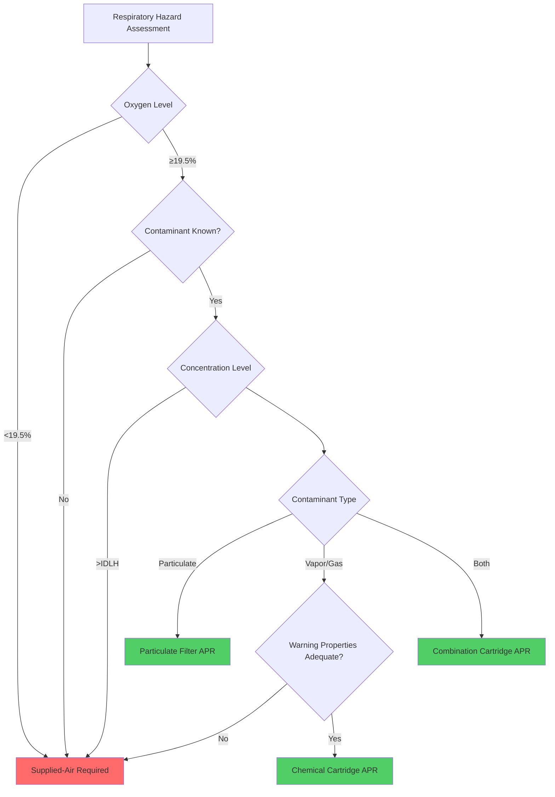

## Overview of Respiratory Hazards in HVAC Work

HVAC technicians encounter diverse respiratory hazards requiring proper protection: refrigerant vapors, particulate matter from insulation and demolition, mold spores, combustion byproducts, confined space atmospheres, and chemical vapors from cleaning agents. Respiratory protection training ensures technicians understand hazard assessment, respirator selection, proper use, and physiological limitations.

OSHA Standard 1910.134 mandates comprehensive respiratory protection programs for workplaces where respiratory hazards cannot be eliminated through engineering controls. HVAC work frequently requires respirators as primary or supplementary protection.

## Filtration Physics and Particle Capture Mechanisms

Respirator filters capture airborne particles through five distinct physical mechanisms, each dominant at different particle sizes:

**Interception** occurs when particles following airflow streamlines pass within one particle radius of a filter fiber and adhere due to Van der Waals forces. This mechanism dominates for particles 0.3-1.0 μm.

**Impaction** captures larger particles (>1.0 μm) that cannot follow airflow streamlines around fibers due to inertia. Particle momentum carries them into contact with fibers.

**Diffusion** governs capture of ultrafine particles (<0.1 μm) exhibiting Brownian motion. Random thermal movement causes particles to deviate from streamlines and contact fibers.

**Gravitational settling** affects large particles (>5 μm) settling onto filter media under gravity's influence during low-velocity flow.

**Electrostatic attraction** enhances capture across all particle sizes when filters carry electrostatic charge, creating Coulombic forces that attract particles to fibers.

The **Most Penetrating Particle Size (MPPS)** occurs at approximately 0.3 μm where interception and diffusion mechanisms are least effective. Filter efficiency ratings target this critical size:

| Filter Class | Minimum Efficiency at MPPS | Typical Applications |
|--------------|----------------------------|----------------------|
| N95 | 95% | General particulate exposure |
| N99 | 99% | High particulate concentrations |
| N100 | 99.97% | Toxic dusts, asbestos |
| P95 | 95% (oil-resistant) | Oil mist environments |
| P100 | 99.97% (oil-resistant) | Maximum particulate protection |

## Respirator Types and Selection Criteria

### Air-Purifying Respirators (APR)

APRs remove contaminants from ambient air through filters or sorbent cartridges. Selection depends on contaminant type, concentration, and oxygen availability.

**Particulate respirators** use mechanical filtration for dusts, mists, and fumes. The pressure drop across the filter increases with loading:

$$\Delta P = \frac{128 \mu L Q}{\pi d^4 N} + \rho \frac{Q^2}{2 A^2}$$

Where:
- $\Delta P$ = pressure drop across filter (Pa)
- $\mu$ = air dynamic viscosity (Pa·s)
- $L$ = filter thickness (m)
- $Q$ = volumetric flow rate (m³/s)
- $d$ = mean fiber diameter (m)
- $N$ = number of pores
- $\rho$ = air density (kg/m³)
- $A$ = filter face area (m²)

**Chemical cartridge respirators** use activated carbon or chemical sorbents for vapor/gas removal. Breakthrough time depends on cartridge capacity and contaminant concentration:

$$t_b = \frac{W \cdot \eta}{C \cdot Q}$$

Where:
- $t_b$ = breakthrough time (min)
- $W$ = sorbent weight (g)
- $\eta$ = adsorption efficiency (dimensionless)
- $C$ = contaminant concentration (g/m³)
- $Q$ = breathing rate (m³/min)

### Supplied-Air Respirators (SAR)

SARs deliver breathing air from an uncontaminated source, providing higher protection factors. Types include:

- **Airline respirators**: Continuous flow or pressure-demand from compressed air source
- **Self-Contained Breathing Apparatus (SCBA)**: Portable air supply for IDLH atmospheres

## Assigned Protection Factors and Fit Testing

The **Assigned Protection Factor (APF)** represents the workplace level of respiratory protection a properly functioning respirator provides to properly fitted and trained users:

$$APF = \frac{C_{ambient}}{C_{inhaled}}$$

Where:
- $C_{ambient}$ = contaminant concentration outside respirator
- $C_{inhaled}$ = contaminant concentration inside facepiece

| Respirator Type | APF | Maximum Use Concentration |
|-----------------|-----|---------------------------|
| Half-mask APR | 10 | 10 × PEL |
| Full-facepiece APR | 50 | 50 × PEL |
| Powered APR (loose-fitting) | 25 | 25 × PEL |
| Powered APR (tight-fitting) | 50-1000 | Varies by type |
| Supplied-air (pressure-demand) | 1000 | 1000 × PEL |
| SCBA (pressure-demand) | 10,000 | IDLH conditions |

**Quantitative fit testing** measures actual facepiece-to-face seal using particle counting or controlled negative pressure:

$$FF = \frac{C_{ambient}}{C_{facepiece}}$$

Where $FF$ = fit factor (dimensionless). OSHA requires minimum fit factors of 100 for half-masks and 500 for full-facepieces.

## Respiratory Physiology and Work-of-Breathing

Respirators impose additional breathing resistance affecting respiratory mechanics. The work of breathing increases with filter resistance:

$$W = \int P \, dV$$

Where:
- $W$ = work of breathing (J)
- $P$ = pressure differential (Pa)
- $V$ = volume of air moved (m³)

Maximum inhalation resistance standards limit worker strain:

- **Initial resistance**: ≤35 mm H₂O at 85 L/min for half-masks
- **Initial resistance**: ≤45 mm H₂O at 85 L/min for full-facepieces
- **End-of-service resistance**: Must not exceed these values by >25%

**Metabolic demand** during HVAC work varies significantly:

| Activity | Metabolic Rate | Breathing Rate | Minute Volume |
|----------|----------------|----------------|---------------|
| Light work (diagnostics) | 150-200 W | 15-20 breaths/min | 20-30 L/min |
| Moderate work (installation) | 200-350 W | 20-30 breaths/min | 30-50 L/min |
| Heavy work (equipment handling) | 350-500 W | 30-40 breaths/min | 50-75 L/min |

## Medical Evaluation and Limitations

OSHA requires medical evaluation before respirator use. Physiological factors affecting respirator tolerance include:

**Cardiovascular capacity**: Respirators increase cardiac workload by 5-15% due to breathing resistance. Workers with cardiac conditions require medical clearance.

**Pulmonary function**: Reduced lung capacity (FVC <80% predicted) may preclude tight-fitting respirator use. Spirometry testing evaluates respiratory reserve.

**Psychological factors**: Claustrophobia affects approximately 10% of workers. Loose-fitting powered respirators may provide alternatives.

**Heat stress**: Respirators reduce evaporative cooling and increase core temperature. In high-temperature environments:

$$Q_{stored} = M - W - E - C - R - K$$

Where respirator use primarily reduces $E$ (evaporative heat loss), increasing heat stress risk.

## Program Elements and Documentation

Comprehensive respiratory protection programs include:

1. **Written program**: Procedures for respirator selection, medical evaluation, fit testing, use, and maintenance
2. **Hazard assessment**: Documented evaluation of workplace respiratory hazards
3. **Respirator selection**: Appropriate devices for identified hazards
4. **Medical evaluation**: Physician assessment before initial use and periodic reevaluation
5. **Fit testing**: Annual quantitative or qualitative testing for tight-fitting respirators
6. **Training**: Initial and annual refresher covering proper use, limitations, and emergency procedures
7. **Maintenance**: Inspection, cleaning, disinfection, storage, and repair procedures
8. **Program evaluation**: Regular assessment of program effectiveness

## Refrigerant-Specific Considerations

Refrigerant exposures present unique challenges. Many refrigerants are heavier than air and displace oxygen in confined spaces. R-744 (CO₂) at concentrations >3% causes respiratory distress even with adequate oxygen.

**Exposure limits** for common refrigerants:

| Refrigerant | 8-hr TWA | STEL | Respirator Requirement |
|-------------|----------|------|------------------------|
| R-134a | 1000 ppm | — | APR if >1000 ppm |
| R-410A | 1000 ppm | — | APR if >1000 ppm |
| R-717 (Ammonia) | 25 ppm | 35 ppm | APR if >25 ppm, SAR if >300 ppm |
| R-744 (CO₂) | 5000 ppm | 30,000 ppm | Monitor O₂, SAR if <19.5% O₂ |

Refrigerant vapor detection methods inform protection requirements. Direct-reading monitors enable real-time assessment of exposure levels and respirator selection.

## Confined Space and IDLH Environments

HVAC work in mechanical rooms, pits, and equipment enclosures often involves permit-required confined spaces. Atmosphere testing precedes entry:

1. **Oxygen**: Must be 19.5-23.5% by volume
2. **Flammability**: Must be <10% of Lower Explosive Limit (LEL)
3. **Toxicity**: Must be below PEL for identified contaminants

**Immediately Dangerous to Life or Health (IDLH)** atmospheres require supplied-air respirators or SCBA with escape provisions. IDLH conditions exist when contaminant concentrations could cause irreversible health effects or death within 30 minutes, or prevent escape.

## Maintenance and Service Life

Respirator service life depends on contaminant concentration, work rate, temperature, and humidity. End-of-service-life indicators include:

- **Increased breathing resistance**: Indicates filter loading
- **Contaminant odor/taste**: Signals cartridge breakthrough (unreliable for many substances)
- **Physical damage**: Cracks, tears, or deformation compromising seal
- **Expiration dates**: Manufacturer-specified shelf life for components

Cleaning procedures following each use prevent microbial growth and material degradation. Components require inspection for damage, distortion, cracks, or deterioration before each use.

Documentation of respirator issuance, fit testing, training, and maintenance ensures program compliance and provides legal protection. Records must be retained per OSHA requirements (medical records: 30 years; training records: 3 years).
