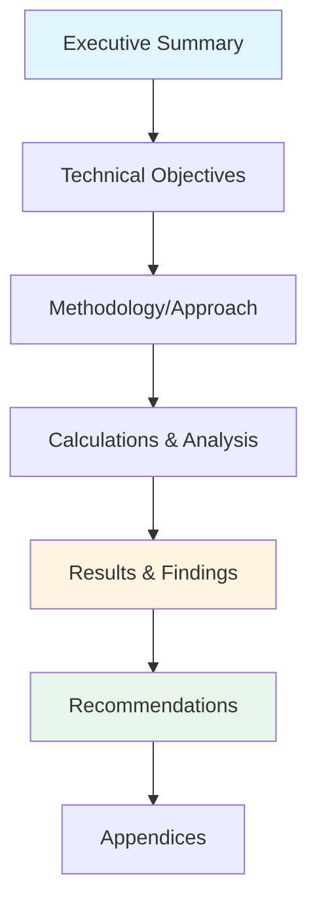
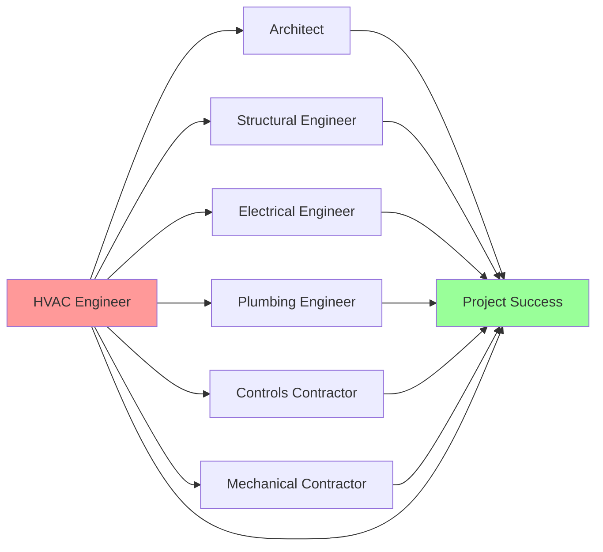
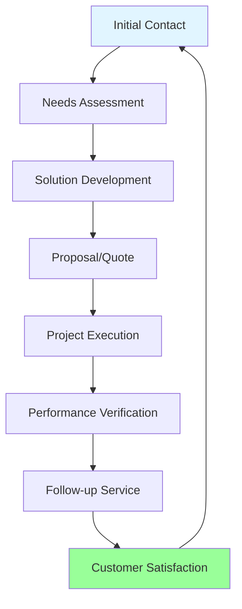
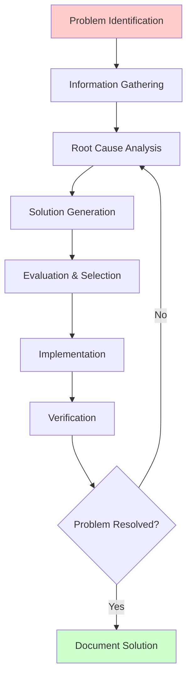

Soft skills development represents the critical complement to technical HVAC competency. While thermodynamic principles and equipment expertise form the foundation of HVAC practice, professional success depends equally on effective communication, leadership capability, and interpersonal effectiveness. Research demonstrates that technical professionals with strong soft skills advance more rapidly, generate higher customer satisfaction, and contribute more effectively to organizational success.

## Communication Skills for Technical Professionals

HVAC professionals must translate complex technical concepts into language appropriate for diverse audiences including building owners, facility managers, architects, contractors, and regulatory officials. Communication effectiveness directly impacts project outcomes, client relationships, and professional credibility.

### Technical Communication Principles

Effective technical communication requires audience analysis, message structuring, and clarity optimization. The communication complexity varies inversely with audience technical knowledge, requiring adaptive strategies.

**Communication Complexity Model:**

The information transfer efficiency ($\eta_{comm}$) can be conceptualized as:

$$\eta_{comm} = \frac{I_{received}}{I_{transmitted}} \times \frac{1}{1 + C_{technical}/K_{audience}}$$

Where:
- $I_{received}$ = Information understood by audience
- $I_{transmitted}$ = Total information presented
- $C_{technical}$ = Technical complexity of content
- $K_{audience}$ = Audience technical knowledge level

This relationship demonstrates that communication efficiency decreases as technical complexity exceeds audience knowledge, necessitating simplified explanations for non-technical stakeholders.

### Audience-Specific Communication Strategies

| Audience Type | Technical Depth | Focus Areas | Communication Approach |
|---------------|-----------------|-------------|------------------------|
| Building Owners | Minimal | Cost, comfort, reliability | Business outcomes, ROI, simple analogies |
| Facility Managers | Moderate | Operations, maintenance, efficiency | Practical implications, procedures, metrics |
| Architects/Engineers | High | Design parameters, specifications | Technical details, calculations, standards |
| Contractors | High | Installation, coordination, schedules | Constructability, sequencing, interfaces |
| Regulatory Officials | Moderate-High | Code compliance, safety, permits | Standards references, documentation, verification |
| End Users | Minimal | Comfort, controls, troubleshooting | Simple operations, comfort adjustment, when to call service |

### Verbal Communication Techniques

**Structured Explanation Framework:**

1. **Context Establishment** - Define the problem or situation clearly
2. **Technical Foundation** - Explain relevant principles at appropriate depth
3. **Application** - Connect principles to specific situation
4. **Recommendation** - Present clear action items or conclusions
5. **Verification** - Confirm audience understanding through questions

**Example Application:** Explaining VFD Benefits to Building Owner

- **Context**: "Your current constant-speed pump system operates at full power regardless of building demand"
- **Foundation**: "Variable frequency drives adjust motor speed to match actual requirements"
- **Application**: "In your system, demand varies from 30% to 100% throughout the day"
- **Recommendation**: "Installing VFDs will reduce pump energy consumption by approximately 45%"
- **Verification**: "Does this approach align with your energy reduction objectives?"

## Technical Writing and Documentation

Technical writing skills enable HVAC professionals to produce clear specifications, comprehensive reports, effective proposals, and accurate documentation. Written communication creates permanent records requiring precision and clarity.

### Technical Report Structure

### Document Types and Applications

| Document Type | Purpose | Key Components | Technical Depth |
|---------------|---------|----------------|-----------------|
| Design Calculations | Engineering documentation | Assumptions, equations, results, references | High |
| Proposals | Business development | Scope, approach, pricing, qualifications | Moderate |
| O&M Manuals | Operational guidance | Procedures, schedules, troubleshooting | Moderate |
| Test Reports | Performance verification | Test procedures, data, analysis, conclusions | High |
| Specifications | Construction requirements | Performance criteria, products, installation | High |
| Service Reports | Customer communication | Findings, actions, recommendations, costs | Low-Moderate |

### Technical Writing Best Practices

**Clarity Principles:**

- Use active voice for direct, clear statements
- Define acronyms at first use (ASHRAE Standard 62.1 requires outdoor air ventilation...)
- Include units with all numerical values (supply airflow = 4,500 CFM)
- Reference applicable standards (per ASHRAE Standard 90.1-2019, Section 6.4.3.1)
- Use consistent terminology throughout document
- Include calculation methodology for verification

**Data Presentation:**

Present numerical data in tables for comparison, graphs for trends, and diagrams for relationships. Each figure must include clear title, axis labels with units, and reference in body text.

## Presentation Skills and Public Speaking

HVAC professionals regularly present technical information at design meetings, client presentations, training sessions, and industry conferences. Presentation effectiveness determines professional influence and career advancement opportunities.

### Presentation Structure Framework

**Opening (10% of time):**
- Establish credibility and context
- State clear objectives
- Preview main points

**Body (75% of time):**
- Present 3-5 key points with supporting evidence
- Use visual aids to reinforce concepts
- Include relevant examples and applications

**Conclusion (15% of time):**
- Summarize key findings
- Present clear recommendations
- Invite questions and discussion

### Visual Communication Principles

Technical presentations benefit from effective visual aids including system diagrams, performance curves, comparison tables, and calculation summaries. Each visual element must serve a specific purpose and be immediately comprehensible.

**Visual Design Guidelines:**

- Limit text to 6 lines per slide with 6 words per line maximum
- Use graphs instead of tables for trend data
- Include system schematics to show component relationships
- Highlight critical information with color or callouts
- Ensure font size readable from maximum audience distance

## Team Collaboration and Leadership

HVAC projects require coordination among multiple disciplines including mechanical, electrical, plumbing, structural, and architectural teams. Effective collaboration skills enable project success and professional advancement.

### Project Team Interaction Model

### Leadership Skills Development

Leadership extends beyond formal authority to include technical influence, team motivation, and project advancement. HVAC professionals develop leadership through progressive responsibility and demonstrated competence.

**Leadership Competency Progression:**

1. **Technical Excellence** - Master HVAC fundamentals and applications
2. **Knowledge Sharing** - Mentor junior staff and document solutions
3. **Project Coordination** - Manage interfaces and resolve conflicts
4. **Strategic Vision** - Contribute to organizational direction and innovation
5. **Team Development** - Build capability and advance team performance

### Conflict Resolution in Technical Environments

Technical conflicts arise from competing objectives, resource constraints, and interpretation differences. Effective resolution requires separating technical facts from opinions and focusing on project objectives.

**Conflict Resolution Framework:**

1. **Identify Core Issue** - Separate symptoms from root cause
2. **Gather Facts** - Collect objective data and calculations
3. **Understand Positions** - Determine each party's constraints and objectives
4. **Generate Options** - Develop multiple solution approaches
5. **Evaluate Objectively** - Apply technical criteria and project requirements
6. **Reach Agreement** - Document resolution and implementation plan

## Customer Relationship Management

HVAC professionals in consulting, contracting, and manufacturing roles depend on effective customer relationships for business success. Customer satisfaction drives repeat business, referrals, and professional reputation.

### Customer Communication Cycle

### Service Excellence Principles

**Customer Expectation Management:**

Customer satisfaction depends on the relationship between expectations and delivered performance. The satisfaction level ($S$) can be represented as:

$$S = P_{actual} - E_{customer}$$

Where:
- $P_{actual}$ = Actual performance delivered
- $E_{customer}$ = Customer expectations

Positive satisfaction requires either exceeding expectations or setting realistic expectations initially. Both technical performance and communication quality contribute to customer perception.

### Managing Difficult Customer Situations

Technical professionals encounter customer dissatisfaction from equipment failures, cost overruns, schedule delays, and performance issues. Effective response requires empathy, clear communication, and solution focus.

**Response Protocol:**

1. **Listen Actively** - Allow customer to fully explain concern without interruption
2. **Acknowledge Impact** - Recognize customer's perspective and concern validity
3. **Investigate Thoroughly** - Gather facts before proposing solutions
4. **Explain Clearly** - Present findings with supporting technical evidence
5. **Offer Solutions** - Provide options with pros, cons, and cost implications
6. **Follow Through** - Execute agreed solution and verify customer satisfaction

## Time Management and Productivity

HVAC professionals manage competing priorities including design deadlines, service calls, meetings, continuing education, and administrative tasks. Effective time management enables professional productivity and work-life balance.

### Priority Management Framework

| Task Category | Urgency | Importance | Action Strategy | Time Allocation |
|---------------|---------|------------|-----------------|-----------------|
| Critical Deadlines | High | High | Immediate focus, dedicate blocks | 40-50% |
| Important Projects | Low | High | Schedule dedicated time | 30-35% |
| Urgent Requests | High | Low | Delegate or minimize time | 10-15% |
| Administrative | Low | Low | Batch process efficiently | 5-10% |

### Productivity Enhancement Techniques

**Time Blocking Strategy:**

Allocate specific time blocks for different activity categories including design work, calculations, meetings, communication, and professional development. Protect design and calculation time from interruptions to maintain concentration and accuracy.

**Engineering Calculation Efficiency:**

Complex HVAC calculations require sustained concentration. Research demonstrates that interruptions increase error rates and reduce efficiency. Schedule 2-4 hour uninterrupted blocks for load calculations, duct sizing, pipe sizing, and equipment selection.

## Critical Thinking and Problem Solving

HVAC troubleshooting, design optimization, and performance analysis require systematic problem-solving approaches. Critical thinking skills enable effective issue diagnosis and solution development.

### Systematic Problem-Solving Process

### Root Cause Analysis Methods

**Five Whys Technique:**

Sequential questioning to identify underlying causes rather than symptoms. Example application for chiller capacity complaint:

1. Why is building too warm? - Chilled water temperature high
2. Why is chilled water warm? - Chiller not meeting setpoint
3. Why isn't chiller meeting setpoint? - Low refrigerant charge
4. Why is refrigerant charge low? - Small leak in condenser
5. Why is there a condenser leak? - Corrosion from inadequate water treatment

Root cause: Water treatment deficiency, not chiller malfunction

### Decision-Making Under Uncertainty

HVAC design involves decisions with incomplete information including future energy costs, occupancy patterns, and climate conditions. Structured decision-making reduces risk and improves outcomes.

**Decision Matrix Application:**

| Design Option | First Cost | Operating Cost | Reliability | Complexity | Weighted Score |
|---------------|-----------|----------------|-------------|------------|----------------|
| Standard Efficiency | 8 | 4 | 7 | 9 | 6.4 |
| High Efficiency | 5 | 9 | 8 | 6 | 7.1 |
| Premium System | 3 | 10 | 9 | 4 | 6.8 |

Weighting factors applied based on project priorities (operating cost 40%, reliability 30%, first cost 20%, complexity 10%)

## Emotional Intelligence in Professional Practice

Emotional intelligence encompasses self-awareness, self-regulation, empathy, and relationship management. Technical professionals with high emotional intelligence navigate workplace dynamics more effectively and build stronger professional relationships.

### Emotional Intelligence Components

**Self-Awareness:**
- Recognize personal emotional states and triggers
- Understand how emotions affect performance and decisions
- Identify strength and development areas objectively

**Self-Regulation:**
- Manage stress during demanding projects and deadlines
- Maintain professional composure during conflicts
- Adapt communication style to situation requirements

**Empathy:**
- Understand customer frustration with equipment failures
- Recognize team member workload and capacity constraints
- Appreciate different perspectives in technical disagreements

**Relationship Management:**
- Build trust through consistent, reliable performance
- Communicate clearly and professionally across all situations
- Develop collaborative relationships with colleagues and clients

## Professional Development Strategy

Soft skills development requires intentional practice, feedback integration, and continuous improvement. Strategic development accelerates career advancement and professional effectiveness.

### Skill Development Pathway

1. **Self-Assessment** - Identify current capability levels and development priorities
2. **Training** - Participate in formal soft skills training programs and workshops
3. **Practice** - Apply skills in professional settings with intentional focus
4. **Feedback** - Seek input from supervisors, colleagues, and customers
5. **Reflection** - Analyze outcomes and adjust approach based on results
6. **Iteration** - Continue development cycle with progressive challenges

### Soft Skills Training Resources

Professional organizations including ASHRAE, ACCA, and RSES offer soft skills development programs alongside technical training. Topics include leadership development, communication skills, customer service excellence, and business management. Many programs qualify for continuing education credits toward professional certifications.

Academic institutions provide professional development courses in technical communication, project management, and leadership. Online platforms offer flexible learning options for communication skills, presentation techniques, and interpersonal effectiveness.

Soft skills development distinguishes exceptional HVAC professionals from merely competent technicians and engineers. Strategic investment in communication, leadership, and interpersonal capabilities accelerates career advancement while enhancing technical effectiveness and professional satisfaction.

*Version: 2.0_enhanced*
