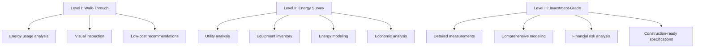
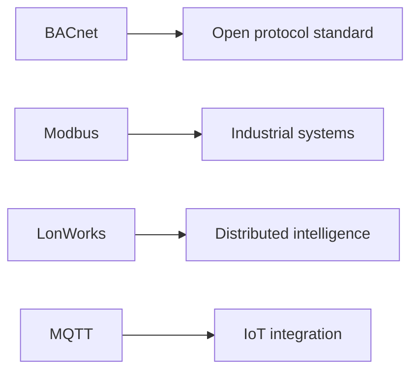

# Specialized Technical Training

Specialized technical training programs provide HVAC professionals with advanced competencies beyond fundamental installation and maintenance skills. These programs address complex system design, performance verification, energy optimization, and emerging technologies that define modern HVAC practice.

## Core Training Domains

### Commissioning Training

Building commissioning represents a systematic process ensuring HVAC systems perform according to design intent and owner requirements. Commissioning training develops competencies in:

**Functional Performance Testing**

Verification protocols examine system behavior under operational conditions:

$$Q_{actual} = \dot{m} c_p (T_{leaving} - T_{entering})$$

Where measured airflow and temperature differentials confirm design capacity delivery.

**Systems Integration Verification**

Modern buildings require coordination between mechanical systems, building automation, and control sequences. Training emphasizes:

- Sequence of operations validation
- Control loop tuning and optimization
- Interlock and safety verification
- Energy management system programming review

**Documentation and Reporting**

Commissioning requires detailed documentation of:

| Document Type | Purpose | Key Elements |
|---------------|---------|--------------|
| Commissioning Plan | Project roadmap | Scope, schedule, responsibilities |
| Functional Test Procedures | Performance verification | Test conditions, acceptance criteria |
| Issues Log | Deficiency tracking | Description, priority, resolution |
| Final Report | Project summary | Results, recommendations, O&M training |

Training programs aligned with ASHRAE Guideline 0 and Guideline 1.1 provide standardized frameworks for commissioning practice across new construction and existing buildings.

### Energy Auditing Training

Energy auditing training equips professionals to identify, quantify, and prioritize energy conservation opportunities in building systems.

**Audit Levels and Methodologies**

ASHRAE Standard 211 defines three audit levels with increasing analytical depth:

**Measurement and Verification**

Quantifying energy savings requires rigorous measurement protocols following IPMVP or ASHRAE Guideline 14:

$$\text{Savings} = \text{Baseline Energy} - \text{Post-Implementation Energy} \pm \text{Adjustments}$$

Adjustments account for weather normalization, occupancy changes, and production variations.

**Economic Analysis Competencies**

Training develops skills in financial evaluation methods:

| Metric | Calculation | Application |
|--------|-------------|-------------|
| Simple Payback | Implementation Cost / Annual Savings | Quick screening |
| NPV | $\sum_{t=0}^{n} \frac{CF_t}{(1+r)^t}$ | Long-term value |
| IRR | NPV = 0 solution | Return comparison |
| SIR | Present Value Savings / Present Value Cost | Prioritization |

### Building Automation and Controls Training

Building automation systems (BAS) govern modern HVAC performance through integrated control strategies.

**Control Theory Fundamentals**

Effective BAS programming requires understanding control modes:

**Proportional-Integral-Derivative (PID) Control**

$$u(t) = K_p e(t) + K_i \int_0^t e(\tau)d\tau + K_d \frac{de(t)}{dt}$$

Where controller output responds to error magnitude, accumulated error, and rate of change. Training emphasizes tuning parameters for stable, responsive performance without hunting or overshoot.

**Advanced Control Strategies**

Modern systems employ sophisticated sequences:

- **Reset Strategies**: Supply air temperature and static pressure reset based on zone demands
- **Demand-Controlled Ventilation**: CO₂-based outdoor air modulation per ASHRAE Standard 62.1
- **Optimal Start/Stop**: Predictive algorithms minimizing runtime while meeting occupancy schedules
- **Free Cooling Optimization**: Economizer and waterside economizer integration

**Network Protocols and Integration**

Training covers communication protocols enabling system interoperability:

### Refrigeration Systems Training

Advanced refrigeration training addresses industrial, commercial, and specialized applications beyond basic comfort cooling.

**System Design and Calculation**

Training develops skills in refrigeration load estimation and equipment selection:

$$Q_{refrigeration} = Q_{product} + Q_{transmission} + Q_{infiltration} + Q_{equipment} + Q_{lights} + Q_{people}$$

Each component requires specific calculation methodology based on application requirements.

**Advanced Refrigeration Cycles**

Specialized applications employ modified cycles for efficiency or temperature requirements:

- **Cascade Systems**: Multiple refrigeration circuits achieving ultra-low temperatures
- **Two-Stage Compression**: Economizer cycles improving efficiency in high-lift applications
- **Multi-Evaporator Systems**: Single compressor serving multiple temperature zones

### Hydronic Systems Training

Hydronic system training addresses design, balancing, and troubleshooting of water-based heating and cooling distribution.

**System Hydraulics**

Flow distribution requires understanding pressure-flow relationships:

$$\Delta P = \frac{8 f L \rho Q^2}{\pi^2 D^5}$$

Where friction factor, pipe length, diameter, and flow rate determine pressure drop through distribution networks.

**Balancing Methodologies**

Training covers proportional balancing procedures ensuring design flow delivery to all terminals while minimizing pump energy.

## Training Delivery Methods

### Hands-On Laboratory Training

Practical training facilities provide experience with:

- Live equipment troubleshooting scenarios
- Control programming and commissioning
- Measurement instrument calibration and use
- System startup and shutdown procedures

### Simulation-Based Learning

Computer-based simulations enable exploration of:

- System response to control changes
- Fault diagnosis scenarios
- Energy optimization strategies
- Equipment sizing and selection

### Field Training Programs

On-site training at operating facilities provides real-world experience under actual operating conditions and constraints.

## Competency Assessment

Rigorous assessment validates training effectiveness through:

- Written examinations testing theoretical knowledge
- Practical demonstrations of technical skills
- Project-based evaluations of applied competencies
- Continuing education requirements maintaining currency

Specialized technical training provides the advanced competencies required for modern HVAC practice, enabling professionals to design, commission, and optimize high-performance building systems.
