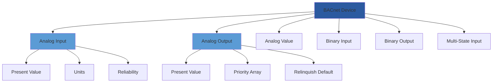
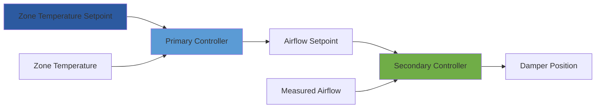

Building automation systems (BAS) represent the integration of HVAC controls, lighting, security, and energy management into unified digital platforms. Professional training in BAS equips technicians and engineers with the skills to design, program, commission, and optimize these increasingly sophisticated systems.

## Fundamental Control Theory

Building automation relies on feedback control loops to maintain environmental conditions. The most common implementation uses proportional-integral-derivative (PID) control algorithms.

### PID Control Mathematics

The PID controller output is calculated as:

$$u(t) = K_p e(t) + K_i \int_0^t e(\tau) d\tau + K_d \frac{de(t)}{dt}$$

Where:
- $u(t)$ = controller output signal
- $e(t)$ = error signal (setpoint - process variable)
- $K_p$ = proportional gain
- $K_i$ = integral gain
- $K_d$ = derivative gain

In discrete time systems (typical for DDC controllers), this becomes:

$$u[n] = K_p e[n] + K_i \sum_{k=0}^n e[k] \Delta t + K_d \frac{e[n] - e[n-1]}{\Delta t}$$

### Proportional Band and Offset

The proportional band (PB) represents the range of input change required for full output response:

$$PB = \frac{100\%}{K_p}$$

Pure proportional control produces steady-state offset:

$$\text{Offset} = \frac{\text{Load Change}}{K_p}$$

The integral term eliminates this offset by continuously accumulating error until the setpoint is achieved.

## Network Protocols and Communication

Modern BAS implementations require proficiency in multiple communication protocols.

| Protocol | Speed | Topology | Application Layer | Market Share |
|----------|-------|----------|-------------------|--------------|
| BACnet/IP | 10-1000 Mbps | Ethernet | BACnet | 45% |
| BACnet MS/TP | 9.6-76.8 kbps | RS-485 | BACnet | 30% |
| Modbus TCP | 10-1000 Mbps | Ethernet | Modbus | 15% |
| LonWorks | 78 kbps | FT-10 | LonTalk | 5% |
| Proprietary | Varies | Varies | Vendor-specific | 5% |

### BACnet Object Model

BACnet structures data using standardized objects. Training emphasizes understanding object types and properties:

## DDC Controller Architecture

Direct digital control (DDC) systems process sensor inputs, execute control algorithms, and command actuators at regular intervals.

### Control Loop Execution Timing

Loop execution frequency affects system stability. The Nyquist criterion requires:

$$f_s \geq 2f_{max}$$

Where $f_s$ is the sampling frequency and $f_{max}$ is the highest frequency component in the process. For HVAC applications:

| Process | Time Constant | Minimum Scan Rate |
|---------|---------------|-------------------|
| Zone Temperature | 15-30 min | 1 minute |
| Supply Air Temperature | 1-3 min | 10 seconds |
| Duct Static Pressure | 5-15 sec | 2 seconds |
| Mixed Air Temperature | 30-60 sec | 5 seconds |

## Advanced Control Strategies

Professional BAS training covers strategies beyond basic feedback control.

### Cascade Control

Cascade control employs multiple nested loops. For a VAV system:

The primary loop operates slowly (1-minute scan), while the secondary loop responds quickly (5-second scan), improving overall response and stability.

### Feedforward Control

Feedforward anticipates disturbances. For economizer control, outdoor air temperature change rate predicts the impact:

$$\dot{Q}_{anticipated} = \dot{m}_a c_p \frac{dT_{oa}}{dt}$$

The controller adjusts the economizer damper position before zone temperature deviates significantly.

## Sequence of Operations Development

Writing sequences requires understanding physical processes and translating them into logical control statements.

### Chilled Water Plant Staging

Chiller staging minimizes energy consumption while meeting load:

$$\text{PLR} = \frac{\dot{Q}_{load}}{\dot{Q}_{capacity}}$$

Where PLR is the part load ratio. Optimal staging maintains each operating chiller between 40-80% PLR, balancing efficiency against excess capacity.

Staging logic:
1. If PLR > 0.85 for 15 minutes → start next chiller
2. If PLR < 0.35 for 30 minutes → stop one chiller
3. Sequence chillers to equalize run hours
4. Prevent short cycling with minimum run timer (20 minutes)

## Energy Optimization Through BAS

Training emphasizes quantifying energy savings from control strategies.

### Optimal Start/Stop

Optimal start calculates the time required to bring a space from unoccupied to occupied setpoint:

$$t_{start} = \frac{C_A (T_{occ} - T_{unocc})}{UA(T_{sa} - T_{unocc}) + \dot{Q}_{internal}}$$

Where:
- $C_A$ = building thermal capacitance (Btu/°F)
- $UA$ = building heat transfer coefficient (Btu/hr-°F)
- $T_{sa}$ = supply air temperature (°F)

Self-learning algorithms refine this calculation over time, reducing pre-conditioning energy by 10-30%.

### Demand-Controlled Ventilation

DCV modulates outdoor air based on occupancy:

$$\dot{V}_{oa} = N_{people} \times V_{per\ person} + A_{floor} \times V_{per\ area}$$

CO₂ sensors infer occupancy. For each 10% reduction in outdoor air, heating/cooling energy decreases approximately 3-5%.

## Commissioning and Troubleshooting

Systematic commissioning verifies BAS performance according to ASHRAE Guideline 0 and Guideline 1.1.

### Functional Performance Testing

Testing validates:
1. Sensor accuracy (±1°F for temperature, ±10% for airflow)
2. Control loop stability (minimal overshoot/oscillation)
3. Sequence logic execution (correct state transitions)
4. Alarm response (appropriate notification and logging)
5. Trending capability (minimum 1-year storage)

### PID Tuning Methodology

Ziegler-Nichols tuning provides starting parameters:

1. Set $K_i = 0$ and $K_d = 0$
2. Increase $K_p$ until sustained oscillation occurs (ultimate gain $K_u$)
3. Measure oscillation period $T_u$
4. Calculate final parameters:

$$K_p = 0.6 K_u$$
$$K_i = 1.2 \frac{K_u}{T_u}$$
$$K_d = 0.075 K_u T_u$$

Fine-tune based on observed response, typically reducing $K_i$ by 50% for HVAC applications to prevent integral windup.

## Integration with Energy Management

Modern BAS training includes enterprise-level energy management integration per ASHRAE Standard 201.

Training programs should cover network fundamentals, control theory, programming languages (typically vendor-specific graphical or IEC 61131-3 structured text), troubleshooting methodology, cybersecurity basics (ASHRAE/NIST guidelines), and energy optimization strategies. Hands-on laboratory exercises with actual DDC hardware, live network troubleshooting, and sequence programming substantially improve retention and professional competence.
