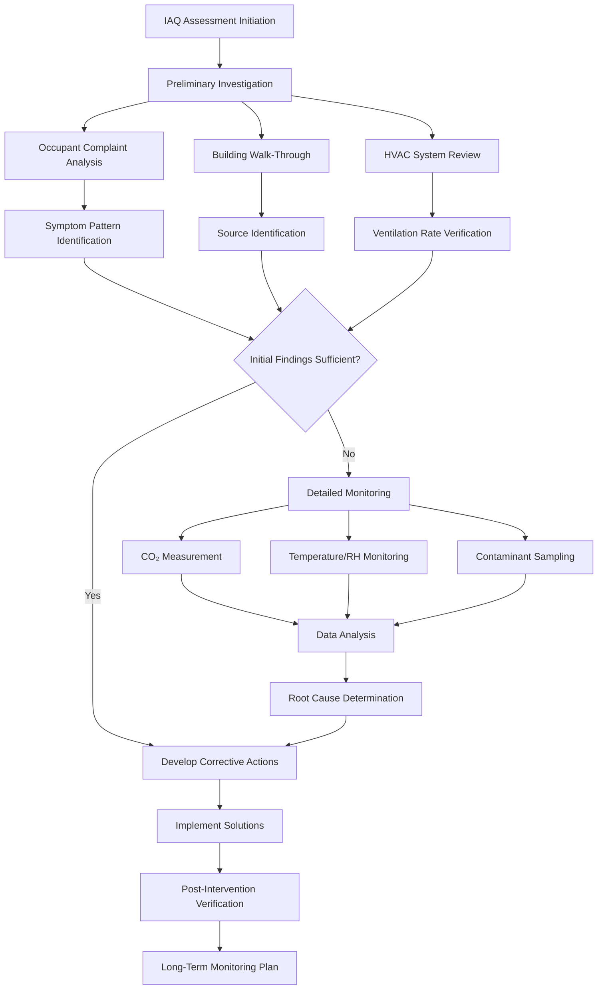

Indoor air quality training equips HVAC professionals with the knowledge and skills to assess, design, and maintain systems that provide healthy indoor environments. This specialized training integrates principles of contaminant control, ventilation effectiveness, filtration technology, and exposure assessment to address the complex interactions between building systems and occupant health.

## Core IAQ Training Components

### Contaminant Source Identification and Control

Effective IAQ management begins with understanding contaminant sources and implementing appropriate control strategies. The hierarchy of control prioritizes source elimination, followed by local exhaust, dilution ventilation, and air cleaning.

**Primary Indoor Contaminant Categories:**

| Contaminant Type | Common Sources | Control Strategy | Typical Concentration Target |
|------------------|----------------|------------------|------------------------------|
| Particulate Matter (PM2.5) | Combustion, outdoor air, occupant activity | Filtration MERV 13-16 | <12 μg/m³ |
| Carbon Dioxide (CO₂) | Occupant respiration | Ventilation rate adjustment | <1000 ppm |
| Volatile Organic Compounds (VOCs) | Building materials, furnishings, cleaning products | Source control, activated carbon | <500 μg/m³ total VOCs |
| Formaldehyde (HCHO) | Composite wood, adhesives | Low-emitting materials, ventilation | <16 ppb (100 μg/m³) |
| Nitrogen Dioxide (NO₂) | Gas appliances, outdoor air | Proper venting, outdoor air filtration | <53 ppb annual |
| Biological Contaminants | Moisture, HVAC systems, occupants | Humidity control, filtration | Dependent on species |

The mass balance equation for indoor contaminant concentration forms the foundation of IAQ analysis:

$$\frac{dC}{dt} = \frac{S}{V} + \frac{Q_{oa}C_{oa}}{V} - \frac{QC}{V} - kC$$

Where:
- C = indoor contaminant concentration (μg/m³ or ppm)
- S = contaminant generation rate (μg/h or m³/h)
- V = building volume (m³)
- Q = total airflow rate (m³/h)
- Q_oa = outdoor airflow rate (m³/h)
- C_oa = outdoor contaminant concentration
- k = contaminant decay/removal rate constant (h⁻¹)

At steady-state conditions (dC/dt = 0), the indoor concentration becomes:

$$C_{ss} = \frac{S/V + (Q_{oa}/V)C_{oa}}{Q/V + k}$$

This relationship demonstrates how indoor concentrations depend on source strength, ventilation rate, outdoor concentration, and removal mechanisms.

### Ventilation Rate Determination

ASHRAE Standard 62.1 provides the framework for determining minimum ventilation rates using the Ventilation Rate Procedure (VRP). The breathing zone outdoor airflow is calculated as:

$$V_{bz} = R_p P_z + R_a A_z$$

Where:
- V_bz = breathing zone outdoor airflow (cfm or L/s)
- R_p = people outdoor air rate (cfm/person or L/s·person)
- P_z = zone population (people)
- R_a = area outdoor air rate (cfm/ft² or L/s·m²)
- A_z = zone floor area (ft² or m²)

For multiple-zone systems, the system ventilation efficiency (E_v) accounts for distribution effectiveness:

$$V_{ot} = \frac{\sum_{all zones} V_{oz}}{E_v}$$

The system ventilation efficiency depends on zone air distribution effectiveness (E_z), occupancy diversity (D), and maximum zone primary airflow fraction.

### Filtration and Air Cleaning

Particulate filtration efficiency follows first-order kinetics. The penetration through a filter is:

$$P = e^{-\eta L}$$

Where:
- P = penetration fraction (dimensionless)
- η = filter coefficient (m⁻¹)
- L = filter depth (m)

Single-pass filter efficiency is:

$$E = 1 - P = 1 - e^{-\eta L}$$

For recirculating systems, the steady-state reduction in particle concentration compared to no filtration is:

$$\frac{C_{filtered}}{C_{unfiltered}} = \frac{1}{1 + \frac{Q_{recir}E}{Q_{oa} + kV}}$$

This demonstrates that both filter efficiency and recirculation rate determine overall particle reduction.

## IAQ Assessment Methodology

### Moisture and Humidity Control

Maintaining appropriate humidity levels prevents both microbial growth and occupant discomfort. The relationship between absolute humidity and relative humidity is:

$$RH = \frac{W}{W_s(T)} \times 100\%$$

Where:
- RH = relative humidity (%)
- W = humidity ratio (lb water/lb dry air or kg/kg)
- W_s = saturation humidity ratio at temperature T

For mold growth prevention, surface relative humidity should remain below 80% and preferably below 60%. The surface temperature where condensation occurs (dew point) is:

$$T_{dp} = \frac{c\gamma(T,RH)}{b - \gamma(T,RH)}$$

Where γ(T,RH) = ln(RH/100) + bT/(c+T), with empirical constants b = 17.67 and c = 243.5°C for typical conditions.

## Ventilation Effectiveness Metrics

The air change effectiveness (ε_a) quantifies how effectively supply air replaces room air:

$$\varepsilon_a = \frac{\tau_n}{\tau} = \frac{\tau_n V}{Q}$$

Where:
- τ_n = nominal time constant (V/Q)
- τ = actual mean age of air in the occupied zone
- V = room volume
- Q = ventilation rate

For perfectly mixed conditions, ε_a = 1.0. Displacement ventilation typically achieves ε_a = 1.2-1.5, while poorly designed systems may have ε_a < 1.0.

The contaminant removal effectiveness (ε_c) evaluates pollutant removal:

$$\varepsilon_c = \frac{C_e - C_s}{C_r - C_s}$$

Where:
- C_e = exhaust concentration
- C_s = supply concentration
- C_r = concentration in occupied zone

## Training Program Structure

**Level 1: Fundamentals (16 hours)**
- Basic IAQ principles and health effects
- ASHRAE 62.1 ventilation requirements
- Common contaminant sources
- Building walk-through techniques
- Basic instrumentation (CO₂ monitors, particle counters)

**Level 2: Advanced Assessment (24 hours)**
- Psychrometrics and moisture analysis
- Tracer gas testing for ventilation rates
- Bioaerosol sampling and interpretation
- VOC measurement and analysis
- Pressure relationship diagnostics
- Computational fluid dynamics fundamentals

**Level 3: System Design and Remediation (32 hours)**
- Advanced filtration system design
- Dedicated outdoor air system (DOAS) applications
- Energy recovery with IAQ considerations
- Source control engineering
- Remediation project management
- Case study analysis and problem-solving

## Instrumentation and Measurement Techniques

**Essential IAQ Measurement Equipment:**

| Parameter | Instrument Type | Typical Range | Accuracy Requirement |
|-----------|----------------|---------------|---------------------|
| CO₂ | NDIR sensor | 0-5000 ppm | ±50 ppm or 3% |
| Temperature | Thermistor/RTD | -20 to 70°C | ±0.5°C |
| Relative Humidity | Capacitive sensor | 0-100% | ±3% RH |
| Airflow | Hot-wire anemometer | 0-50 m/s | ±3% reading |
| Particles | Optical particle counter | 0.3-10 μm | Size resolution ±5% |
| Pressure | Differential manometer | 0-2500 Pa | ±1 Pa or 1% |

Proper calibration intervals maintain measurement accuracy: CO₂ sensors require annual calibration, while airflow instruments need verification before each use against a traceable standard.

## Regulatory and Standards Framework

IAQ training programs reference multiple standards and guidelines:

- **ASHRAE Standard 62.1**: Ventilation for Acceptable Indoor Air Quality
- **ASHRAE Standard 62.2**: Ventilation for Low-Rise Residential Buildings
- **ASHRAE Standard 55**: Thermal Environmental Conditions for Human Occupancy
- **ASHRAE Standard 180**: Practice for Inspection and Maintenance of Commercial Building HVAC Systems
- **EPA IAQ Tools for Schools**: Educational facility guidance
- **OSHA Indoor Air Quality Guidelines**: Occupational exposure limits

Understanding the interplay between these standards enables comprehensive IAQ program development that addresses both regulatory compliance and occupant health protection.

## Emerging IAQ Concerns

Recent training programs increasingly address pandemic preparedness, emphasizing the HVAC system's role in airborne infection control. Equivalent clean airflow (Q_e) combines outdoor air, filtration, and other air cleaning:

$$Q_e = Q_{oa} + Q_{recir}E_{filter} + Q_{UV}E_{UV} + Q_{other}E_{other}$$

Target equivalent clean air delivery rates for infection control typically range from 4-6 air changes per hour for general spaces to 12+ ACH for high-risk areas.

Training emphasizes that comprehensive IAQ management requires integrated thinking across ventilation, filtration, humidity control, source management, and building operations to create healthy, productive indoor environments.
