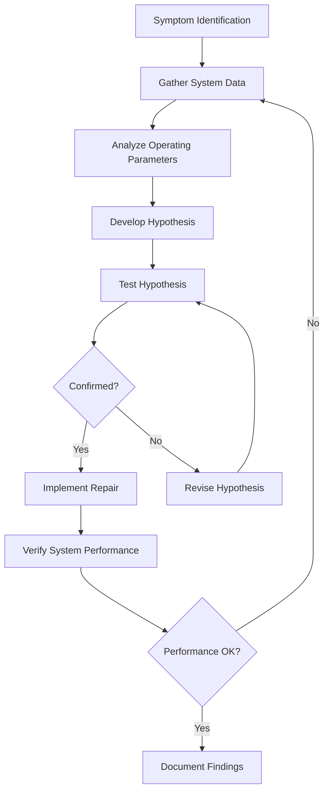

# HVAC Troubleshooting and Diagnostics Training

Effective troubleshooting requires systematic diagnostic methodology grounded in thermodynamic principles, electrical theory, and fluid mechanics. This training develops the analytical framework necessary for rapid fault isolation and cost-effective repair strategies.

## Systematic Diagnostic Methodology

### The Diagnostic Process

Structured troubleshooting follows a logical sequence that minimizes diagnostic time while maximizing accuracy:

### Critical Measurements and Interpretation

Accurate diagnosis depends on proper measurement and interpretation of key parameters:

| Parameter | Measurement Location | Normal Range | Diagnostic Significance |
|-----------|---------------------|--------------|------------------------|
| Suction Pressure | Compressor inlet | Varies by refrigerant | Low: airflow/charge issues; High: overcharge/high load |
| Discharge Pressure | Compressor outlet | Varies by refrigerant | High: condenser issues; Low: low charge/compressor failure |
| Superheat | Evaporator outlet | 8-12°F typical | Low: overfeeding; High: underfeeding/low charge |
| Subcooling | Condenser outlet | 10-15°F typical | Low: undercharge; High: overcharge/restriction |
| Temperature Split | Supply vs. return air | 18-22°F cooling | Low: airflow/capacity issues; High: restricted airflow |
| Static Pressure | Supply/return ducts | Per ACCA Manual D | High: duct restriction; Unbalanced: design issues |

## Refrigeration Cycle Diagnostics

### Superheat Analysis

Superheat quantifies the degree of vapor heating beyond saturation temperature at the evaporator outlet:

$$
\text{Superheat} = T_{\text{suction line}} - T_{\text{saturation at suction pressure}}
$$

Proper superheat ensures complete liquid evaporation while preventing compressor flooding. Low superheat indicates refrigerant overfeeding from:

- Oversized or malfunctioning TXV
- Excessive refrigerant charge
- Restricted liquid line reducing pressure drop
- Bulb mounting issues on TXV installations

High superheat signals underfeeding caused by:

- Undersized or restricted TXV
- Insufficient refrigerant charge
- Restricted filter-drier or liquid line
- Loss of TXV bulb charge

### Subcooling Analysis

Subcooling measures liquid refrigerant temperature below saturation at the condenser outlet:

$$
\text{Subcooling} = T_{\text{saturation at discharge pressure}} - T_{\text{liquid line}}
$$

Subcooling provides a liquid seal preventing flash gas formation in the liquid line. Deviation from manufacturer specifications indicates:

**Low Subcooling (< 5°F):**
- Refrigerant undercharge
- Excessive non-condensables
- Condenser airflow restrictions
- Compressor inefficiency

**High Subcooling (> 20°F):**
- Refrigerant overcharge
- Restricted metering device
- Liquid line restriction
- Condenser oversizing

### Compressor Performance Analysis

Compressor efficiency determines system capacity and energy consumption. The compression ratio affects both:

$$
\text{Compression Ratio} = \frac{P_{\text{discharge absolute}}}{P_{\text{suction absolute}}}
$$

Optimal compression ratios range from 3:1 to 7:1. Ratios exceeding 10:1 indicate severe system problems causing:

- Elevated discharge temperatures
- Reduced volumetric efficiency
- Shortened compressor life
- Increased power consumption

## Electrical Diagnostics

### Motor Analysis

Three-phase motor diagnostics require voltage and current measurements on all phases:

| Measurement | Acceptable Variance | Diagnostic Action |
|-------------|-------------------|-------------------|
| Voltage imbalance | < 2% | Check utility supply and connections |
| Current imbalance | < 10% | Inspect motor windings and bearings |
| Voltage to nameplate | ±10% | Verify transformer taps and wire sizing |
| Current vs. RLA | < 110% | Check mechanical load and voltage |

Voltage imbalance percentage calculation:

$$
\text{Voltage Imbalance} = \frac{\text{Max deviation from average voltage}}{\text{Average voltage}} \times 100\%
$$

Even 2% voltage imbalance causes 8% current imbalance, resulting in overheating and reduced motor life.

### Capacitor Testing

Capacitor failure represents a common HVAC fault. Test capacitors under load when possible, as they may test correctly when disconnected but fail under operating conditions.

Measured capacitance should fall within ±6% of nameplate rating per ASHRAE Standard 37. Calculate expected capacitance tolerance:

$$
\text{Acceptable Range} = C_{\text{nameplate}} \times (1 \pm 0.06)
$$

## Airflow Diagnostics

### Temperature Rise Method

Furnace airflow calculation using temperature rise across the heat exchanger:

$$
\text{CFM} = \frac{\text{Input BTU/hr} \times \eta}{1.08 \times \Delta T}
$$

Where:
- Input BTU/hr = Gas input rate
- η = Combustion efficiency (typically 0.80 for standard furnaces)
- ΔT = Temperature rise (supply - return air)
- 1.08 = Constant for air (0.24 BTU/lb·°F × 4.5 lb/CFM)

### Static Pressure Diagnostics

External static pressure measurement identifies duct system restrictions per ACCA Manual D guidelines:

| ESP Reading | System Condition | Action Required |
|-------------|------------------|-----------------|
| < 0.2 in. w.c. | Undersized ductwork | Verify equipment CFM |
| 0.2-0.5 in. w.c. | Normal operation | Monitor performance |
| 0.5-0.8 in. w.c. | Restricted airflow | Inspect filters and dampers |
| > 0.8 in. w.c. | Severely restricted | Immediate investigation required |

## Advanced Diagnostic Tools

### Refrigerant Analyzers

Modern refrigerant analyzers identify contamination, moisture content, and refrigerant purity. Cross-contamination detection prevents compressor damage from incompatible refrigerant mixtures.

### Combustion Analyzers

Combustion analysis measures:
- O₂ and CO₂ concentrations
- Carbon monoxide levels
- Combustion efficiency
- Excess air percentage
- Stack temperature

Proper combustion produces 8-9% CO₂ with minimal CO (< 100 ppm air-free).

## Fault Detection and Diagnostics (FDD)

Automated FDD systems employ algorithms detecting performance degradation before catastrophic failure. Common FDD rules include:

**Refrigerant Charge Fault:**
- Subcooling outside normal range
- Superheat deviation from target
- Capacity degradation > 10%

**Fouled Coil Detection:**
- Elevated approach temperature
- Increased pressure drop
- Reduced heat transfer effectiveness

**Compressor Degradation:**
- Declining compression ratio efficiency
- Elevated discharge temperature
- Increased power consumption

## Root Cause Analysis

Effective troubleshooting identifies root causes rather than treating symptoms. Apply the "Five Whys" methodology to prevent recurring failures:

1. **Symptom:** Compressor short-cycling
2. **Why?** High discharge pressure cutout activated
3. **Why?** Condenser coil dirty, elevated head pressure
4. **Why?** No maintenance performed
5. **Why?** No service contract established
6. **Root Cause:** Inadequate maintenance program

## Documentation and Reporting

Comprehensive documentation provides historical context for future diagnostics. Record:

- Initial symptoms and customer complaints
- All measurements taken during diagnosis
- Tests performed and results
- Parts replaced with specifications
- System performance after repair
- Recommendations for preventive maintenance

Proper documentation builds diagnostic expertise and supports warranty claims, regulatory compliance, and continuous improvement initiatives.

---

*Systematic troubleshooting methodology combined with physics-based analysis enables rapid fault isolation and cost-effective repair strategies across all HVAC system types.*
