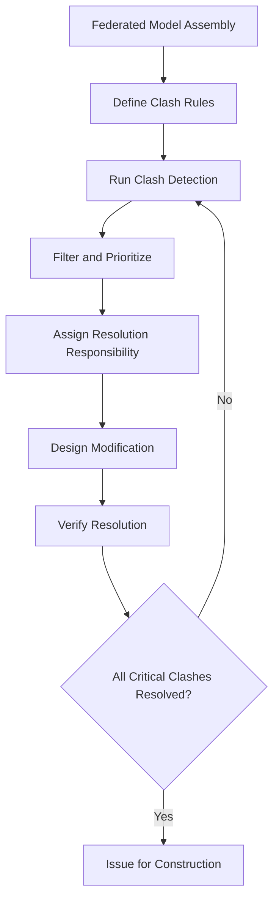

Building Information Modeling (BIM) transforms HVAC design, coordination, and construction through intelligent 3D modeling that integrates geometric, spatial, and performance data. BIM enables multi-disciplinary coordination, clash detection, and construction-phase fabrication with accuracy unattainable through traditional 2D drafting.

## BIM Fundamentals for MEP Systems

BIM represents building components as parametric objects containing:

- **Geometric data:** 3D spatial location, dimensions, orientation
- **Performance attributes:** Thermal properties, flow rates, pressure drops
- **Connectivity information:** System relationships, network topology
- **Specification data:** Manufacturer, model, material properties
- **Cost and schedule:** Unit pricing, installation sequencing

For HVAC systems, BIM objects include air handling units, ductwork, diffusers, piping, pumps, boilers, chillers, and control devices—each with embedded engineering properties enabling automated calculations and performance analysis.

## MEP Coordination and Clash Detection

The primary value of BIM in HVAC projects derives from spatial coordination between mechanical, electrical, plumbing, fire protection, and structural systems within constrained ceiling and shaft spaces.

### Clash Detection Process

Coordination software identifies geometric conflicts:

**Hard clashes:** Physical interference between solid objects (duct intersecting beam)
**Soft clashes:** Objects violating clearance zones (diffuser within minimum distance to sprinkler head)
**Workflow clashes:** Temporal conflicts in construction sequencing

The clash detection workflow:

### Coordination Metrics

Quantify coordination effectiveness through:

$$\text{Clash Density} = \frac{\text{Number of Clashes}}{\text{Building Volume (m}^3\text{)}}$$

Target: < 0.1 clashes/m³ for coordinated models prior to fabrication

$$\text{Resolution Rate} = \frac{\text{Clashes Resolved}}{\text{Total Clashes Identified}} \times 100\%$$

Target: > 95% resolution before construction documents release

## Level of Development (LOD)

LOD defines the geometric detail and information richness of BIM elements at project phases:

| LOD | Geometric Detail | Information Content | HVAC Application |
|-----|-----------------|---------------------|------------------|
| **100** | Conceptual massing | Area-based loads | Space programming, preliminary sizing |
| **200** | Approximate geometry | Generic systems | Schematic design, budget estimation |
| **300** | Specific assemblies | Precise size/performance | Design development, coordination |
| **350** | Interference data | Detailed connections | Construction documents, clash detection |
| **400** | Fabrication detail | Shop-level data | Prefabrication, installation |
| **500** | As-built verification | Operational parameters | Facility management, commissioning |

HVAC systems typically advance from LOD 200 (schematic) to LOD 350 (construction documents) to LOD 400 (fabrication coordination). LOD 500 represents as-built conditions for operations and maintenance.

## BIM Uses in HVAC Projects

### Design Phase Applications

**Energy modeling integration:** Transfer BIM geometry to energy simulation tools (EnergyPlus, IES-VE, TRACE) for load calculations and system sizing

**Airflow analysis:** CFD simulation using BIM spatial data to evaluate distribution patterns, thermal comfort, and ventilation effectiveness

**System sizing and selection:** Automated duct and pipe sizing based on design flow rates and pressure drop calculations:

$$\Delta P = f \frac{L}{D} \frac{\rho V^2}{2}$$

Where: $f$ = friction factor, $L$ = length, $D$ = diameter, $\rho$ = density, $V$ = velocity

### Construction Phase Applications

**Fabrication modeling:** LOD 400 models containing:
- Exact fitting configurations (radius, angles)
- Hanger and support locations
- Connection details (flange, weld, coupling)
- Insulation thickness and jacketing

**4D scheduling:** Link BIM objects to construction schedule activities, visualizing installation sequencing and identifying workspace conflicts

**Quantity takeoff:** Automated material extraction:
  - Linear footage of duct/pipe by size and type
  - Equipment counts by specification
  - Insulation surface area
  - Support and accessory quantities

### Operations Phase Applications

**Digital facility management:** BIM as master record containing:
- Equipment specifications and maintenance schedules
- Space allocation and occupancy data
- Energy consumption by system and zone
- Sensor and control point locations

**Commissioning support:** Verification of as-installed conditions against design intent, integration with building automation systems

## BIM Software Ecosystem

HVAC BIM workflows utilize specialized platforms:

**Authoring tools:** Autodesk Revit MEP, Bentley AECOsim, ArchiCAD MEP—create intelligent 3D models with parametric components

**Coordination platforms:** Autodesk Navisworks, Solibri Model Checker, BIM 360 Glue—federate multi-discipline models, perform clash detection

**Analysis tools:** Carrier HAP, Trane TRACE, IES-VE—energy modeling; Autodesk CFD—airflow simulation

**Fabrication tools:** Autodesk Fabrication CADmep, SysQue—generate shop drawings and CNC cutting files for ductwork and piping

## BIM Implementation Considerations

**Model accuracy requirements:** Define tolerance standards (± 10 mm typical for MEP coordination)

**Data exchange protocols:** IFC (Industry Foundation Classes) for vendor-neutral interoperability, proprietary formats (RVT, DWG) for native workflows

**Coordination frequency:** Weekly clash detection sessions during design development, daily during construction document production

**File management:** Centralized model hosting (BIM 360, ProjectWise) with version control and change tracking

**Quality control metrics:**
- Model element count and completeness
- Clash detection run frequency and resolution rate
- Design-to-fabrication model consistency
- As-built model accuracy verification

## ROI and Performance Benefits

BIM implementation in HVAC projects delivers measurable benefits:

- **Coordination efficiency:** 40-60% reduction in RFIs during construction
- **Schedule compression:** 10-20% reduction in MEP installation duration through prefabrication
- **Cost savings:** 3-5% reduction in material waste, 5-10% reduction in field labor
- **Quality improvement:** 80-90% reduction in field conflicts requiring rework

The investment in BIM software, training, and modeling labor typically yields positive return within 2-3 projects through reduced coordination time, fewer construction issues, and enhanced client value.

---

*Content continues in subsections covering BIM Execution Planning, Software Platforms, Standards and Protocols, and Phase-Specific Applications.*
