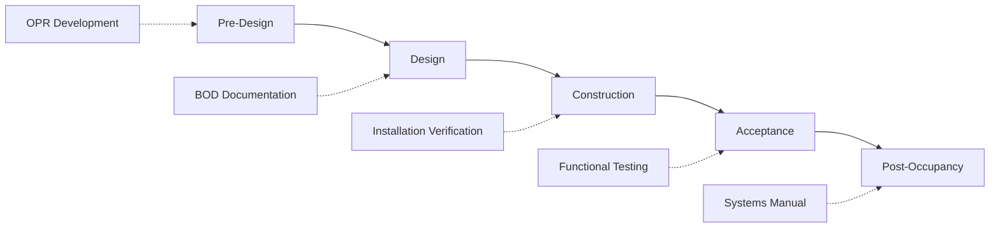
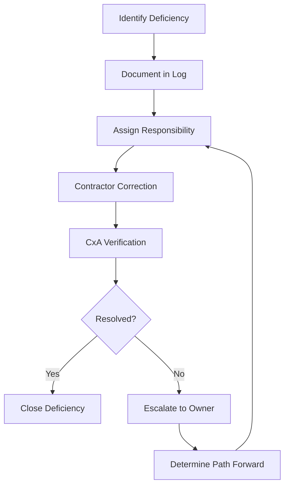

Commissioning (Cx) integrates quality-focused processes throughout project delivery to verify HVAC systems meet owner requirements and design intent. Effective commissioning requires early planning, continuous verification, and systematic documentation from programming through occupancy.

## Commissioning Process Overview

ASHRAE Guideline 0-2019 defines commissioning as a quality-focused process for achieving, verifying, and documenting performance of systems to meet Owner's Project Requirements (OPR) within project budget and schedule.

### Commissioning Phases

**Pre-design phase:**
- Develop Owner's Project Requirements (OPR)
- Establish commissioning scope and budget
- Select commissioning authority (CxA)

**Design phase:**
- Create Basis of Design (BOD)
- Develop commissioning plan
- Review design submissions for OPR compliance
- Develop preliminary test procedures

**Construction phase:**
- Verify installation per construction documents
- Witness factory and startup testing
- Execute functional performance tests
- Document deficiencies and verify corrections

**Acceptance phase:**
- Complete final testing and verification
- Compile systems manual with O&M documentation
- Provide owner training
- Issue final commissioning report

**Post-occupancy phase (ongoing commissioning):**
- Monitor performance 10-12 months post-occupancy
- Verify seasonal operation
- Optimize control sequences
- Re-train facilities staff as needed

## Owner's Project Requirements (OPR)

The OPR documents owner objectives, criteria, and expectations for project performance—the foundation for all design and commissioning activities.

### OPR Content Requirements

**Project goals and objectives:**
- Occupancy type and operational hours
- Critical performance requirements (temperature, humidity, air quality)
- Energy efficiency targets (EUI, LEED certification level)
- Maintainability and operational simplicity preferences

**HVAC system requirements:**

**Space conditioning criteria:**

| Space Type | Temperature Range | Humidity Range | Ventilation Rate | Special Requirements |
|-----------|-------------------|----------------|------------------|---------------------|
| Office | 70-76°F (21-24°C) | 30-60% RH | 17 CFM/person | None |
| Laboratory | 68-75°F (20-24°C) | 30-60% RH | 6-12 ACH | Fume hood exhaust |
| Data Center | 64-80°F (18-27°C) | 40-60% RH | Variable | N+1 redundancy |
| Operating Room | 68-73°F (20-23°C) | 30-60% RH | 20 ACH minimum | HEPA filtration, positive pressure |

**System reliability and redundancy:**
- Uptime requirements (%, hours downtime allowable)
- Redundancy level (N, N+1, 2N)
- Backup power requirements
- Maintenance windows and scheduling constraints

**Energy and sustainability:**
- Energy budget (Btu/ft²-yr or kWh/m²-yr)
- Renewable energy percentage targets
- Water conservation goals
- Refrigerant environmental impact limits (GWP, ODP)

**Measurement and verification:**
- Metering granularity (whole building, system, equipment)
- Monitoring and trending requirements
- Performance metrics and reporting frequency

### OPR Development Process

**Stakeholder workshops:**
1. **Operations staff:** Maintenance capabilities, training needs, spare parts access
2. **Facilities management:** Energy budgets, operational costs, system lifecycle
3. **End users:** Comfort expectations, noise tolerance, control preferences
4. **Executive leadership:** Capital budget, operational budget, sustainability commitments

**OPR documentation format:**
- Narrative requirements organized by system
- Quantitative criteria with measurable metrics
- Prioritization (must have vs. nice to have)
- Budget constraints and lifecycle cost considerations

**OPR updates:**
- Review at design milestones (SD, DD, CD) for owner approval
- Document changes and reasons
- Maintain version control and change log

## Basis of Design (BOD)

The BOD documents design assumptions, criteria, and methodology demonstrating how design satisfies OPR requirements.

### BOD Content Structure

**Design assumptions:**
- Climate data (design temperatures, humidity)
- Occupancy density and schedules
- Lighting and equipment heat gains
- Infiltration and envelope performance

**Load calculations:**
- Methodology (ASHRAE heat balance method, equivalent temperature difference)
- Peak heating and cooling loads by zone
- Diversity factors and safety factors applied
- Load calculation software and inputs

**System selection rationale:**

**Primary HVAC system:**

$$\text{System EUI} = \frac{\sum(\text{Equipment kW} \times \text{Operating Hours})}{1000 \times \text{Floor Area}}$$

Comparison matrix evaluating alternatives:

| System Type | First Cost | Operating Cost | Energy Use | Maintenance | Footprint |
|------------|-----------|----------------|------------|-------------|-----------|
| VAV w/ reheat | Baseline | Baseline | Baseline | Medium | Compact |
| DOAS + radiant | +25% | -15% | -20% | Low | Larger |
| Chilled beam | +15% | -10% | -12% | Low | Compact |
| Fan coils | -10% | +5% | +8% | High | Distributed |

**Equipment sizing and selection:**
- Nameplate capacities with margin analysis
- Part-load performance considerations
- Efficiency ratings (EER, COP, IPLV)
- Manufacturer selection criteria

**Control system design:**
- Control architecture (centralized vs. distributed)
- Sequence of operations narrative
- Sensor locations and accuracy requirements
- User interface and access levels

**Compliance documentation:**
- Energy code compliance (ASHRAE 90.1, IECC)
- Ventilation code compliance (ASHRAE 62.1, IMC)
- Special code requirements (healthcare, laboratory)

### BOD Review Process

**Design milestone reviews:**
- 30% SD: Confirm system selection aligns with OPR
- 60% DD: Verify sizing, performance specifications
- 90% CD: Check details, controls, specifications complete
- 100% CD: Final compliance verification

**CxA review focus:**
- OPR alignment verification
- Design assumptions reasonability
- Equipment performance specifications adequacy
- Controllability and testability of final design
- Maintainability and operational complexity

**Design issues register:**
- Document discrepancies between OPR and BOD
- Track resolution through design iterations
- Obtain owner decisions on conflicts (performance vs. cost)

## Commissioning Plan

The commissioning plan defines the scope, schedule, responsibilities, and procedures governing commissioning activities.

### Commissioning Scope Definition

**Systems included in commissioning:**

**Full commissioning (testing and verification):**
- Central heating and cooling plants
- Air handling units and distribution systems
- Terminal equipment and controls
- Building automation system
- Metering and monitoring systems

**Limited commissioning (verification only):**
- Domestic water heating systems
- Plumbing systems
- Fire protection systems (separate testing authority)

**Excluded systems:**
- Site utilities (outside building envelope)
- Temporary HVAC systems
- Owner-furnished equipment (unless specified)

### Commissioning Schedule

Integration with project schedule:

| Project Phase | Commissioning Activities | Duration | Dependencies |
|--------------|-------------------------|----------|--------------|
| **Design** | BOD review, test plan development | 2-4 weeks per milestone | Design submissions |
| **Submittals** | Equipment review, coordination | Ongoing | Submittal log updates |
| **Installation** | Site observations, installation checks | Weekly | Construction progress |
| **Startup** | Witness startup, initial testing | 2-4 weeks | Substantial completion |
| **Functional Testing** | Execute test procedures | 4-8 weeks | Startup complete |
| **Training** | O&M training sessions | 1-2 weeks | Systems operational |

**Critical path considerations:**
- BAS programming completion enables control testing
- Chiller startup requires cooling tower and pumps operational
- Air balance prerequisite to final functional tests
- Seasonal testing (heating requires winter conditions)

### Roles and Responsibilities

**Owner responsibilities:**
- Provide OPR and approve updates
- Review and approve commissioning plan
- Attend commissioning meetings
- Participate in training sessions
- Accept commissioned systems

**Commissioning authority (CxA) responsibilities:**
- Develop commissioning plan and test procedures
- Review design submissions for OPR compliance
- Attend construction meetings
- Witness startup and conduct functional tests
- Compile systems manual and final report

**Design engineer responsibilities:**
- Develop BOD aligned with OPR
- Support CxA design reviews
- Develop detailed control sequences
- Respond to commissioning observations
- Attend functional testing

**Contractor responsibilities:**
- Install systems per construction documents
- Provide startup services and witness tests
- Correct deficiencies identified during commissioning
- Provide O&M documentation
- Support training activities

**Test agent responsibilities (if separate from CxA):**
- Perform air and water balancing
- Document flow and performance measurements
- Correct deficiencies within scope
- Provide certified TAB reports

## Construction Phase Commissioning

Active verification during construction ensures systems installed correctly and capable of testing.

### Installation Verification

**Prefunctional checklists:**
Equipment-specific verification forms confirming:
- Model number matches specifications
- Installation orientation and location correct
- Connections (electrical, piping, ductwork) complete
- Safety devices and interlocks functional
- Controls wiring and power verified
- Insulation and labeling complete

**Sampling methodology:**

For repetitive equipment (VAV boxes, fan coils):

$$\text{Sample Size} = \max\left(10\%\text{ of population}, 10\text{ units}\right)$$

Example: 75 VAV boxes → sample 10 units minimum

**Site observation frequency:**
- Weekly during rough-in phase
- Bi-weekly during equipment setting
- Daily during startup and testing phases

### Startup Procedures

**Manufacturer startup services:**
- Central plant equipment (chillers, boilers, large AHUs)
- Specialized equipment (energy recovery, building automation)
- Commissioned by factory-trained technicians
- Documented on manufacturer startup forms

**Contractor startup services:**
- Standard equipment (pumps, small fans, unit heaters)
- Executed per manufacturer instructions
- Verified by commissioning authority
- Documented on contractor startup reports

**Startup verification criteria:**
- Equipment runs without abnormal noise or vibration
- Operating parameters within manufacturer limits
- Safety devices test correctly
- Control sequences execute as designed

### Functional Performance Testing

Functional tests verify integrated system performance under actual and simulated load conditions.

**Test procedure components:**
1. **Prerequisites:** Conditions required before test (TAB complete, controls programmed)
2. **Equipment required:** Instrumentation and tools needed
3. **Procedures:** Step-by-step test execution instructions
4. **Expected results:** Performance criteria defining pass/fail
5. **Actual results:** Documented observations and measurements
6. **Deficiencies:** Issues identified requiring correction

**Example functional test: VAV terminal unit with reheat**

| Test Step | Action | Expected Result | Acceptance Criteria |
|-----------|--------|----------------|---------------------|
| 1 | Verify minimum airflow | BAS displays min flow setpoint | ±10% of design minimum |
| 2 | Command zone to heating | Damper modulates to min position, reheat valve opens | Damper ≤ min + 5%, valve > 0% |
| 3 | Satisfy zone temperature | Reheat valve closes | Valve = 0% |
| 4 | Command zone to cooling | Damper modulates toward max | Damper position increases |
| 5 | Verify maximum airflow | BAS displays max flow setpoint | ±10% of design maximum |
| 6 | Simulate space temp above setpoint | Damper remains at max, reheat locked out | Damper = max, valve = 0% |

**Testing sequence strategy:**
1. Component-level testing (individual equipment)
2. System-level testing (integrated operation)
3. Interface testing (inter-system coordination)
4. Seasonal testing (modes not available during initial testing)

### Deficiency Management

**Deficiency classification:**
- **Critical:** System cannot operate, safety issue, code violation
- **Major:** Performance significantly degraded, repeated failures
- **Minor:** Performance slightly impaired, cosmetic issues

**Deficiency resolution workflow:**

**Resolution tracking metrics:**
- Deficiency age (days open)
- Responsible party performance
- Recurring deficiency patterns
- Outstanding critical issues preventing acceptance

## Commissioning Deliverables

**Final commissioning report contents:**
- Executive summary of commissioning process and outcomes
- OPR and BOD documentation with final revisions
- Commissioning plan and schedule
- Installation verification checklists
- Functional test procedures and results
- Deficiency log with resolution documentation
- Training records and attendee lists
- Recommendations for ongoing commissioning

**Systems manual:**
- Equipment documentation (submittals, O&M manuals)
- As-built drawings (architectural, mechanical, electrical, controls)
- Sequence of operations (final, as-programmed)
- Testing and balancing reports
- Warranty documentation
- Recommended maintenance schedules
- Spare parts lists and sources

**Training deliverables:**
- Training curriculum and materials
- Hands-on demonstrations completed
- Competency verification (if required)
- Video recordings of training sessions

Comprehensive commissioning integration ensures HVAC systems perform as intended, reducing energy consumption by 10-20%, improving comfort complaints by 50-80%, and extending equipment life through proper operation and maintenance.

---

*Subsections provide detailed guidance on OPR Development, Basis of Design Documentation, Commissioning Plan Creation, and Construction Phase Commissioning Procedures.*
