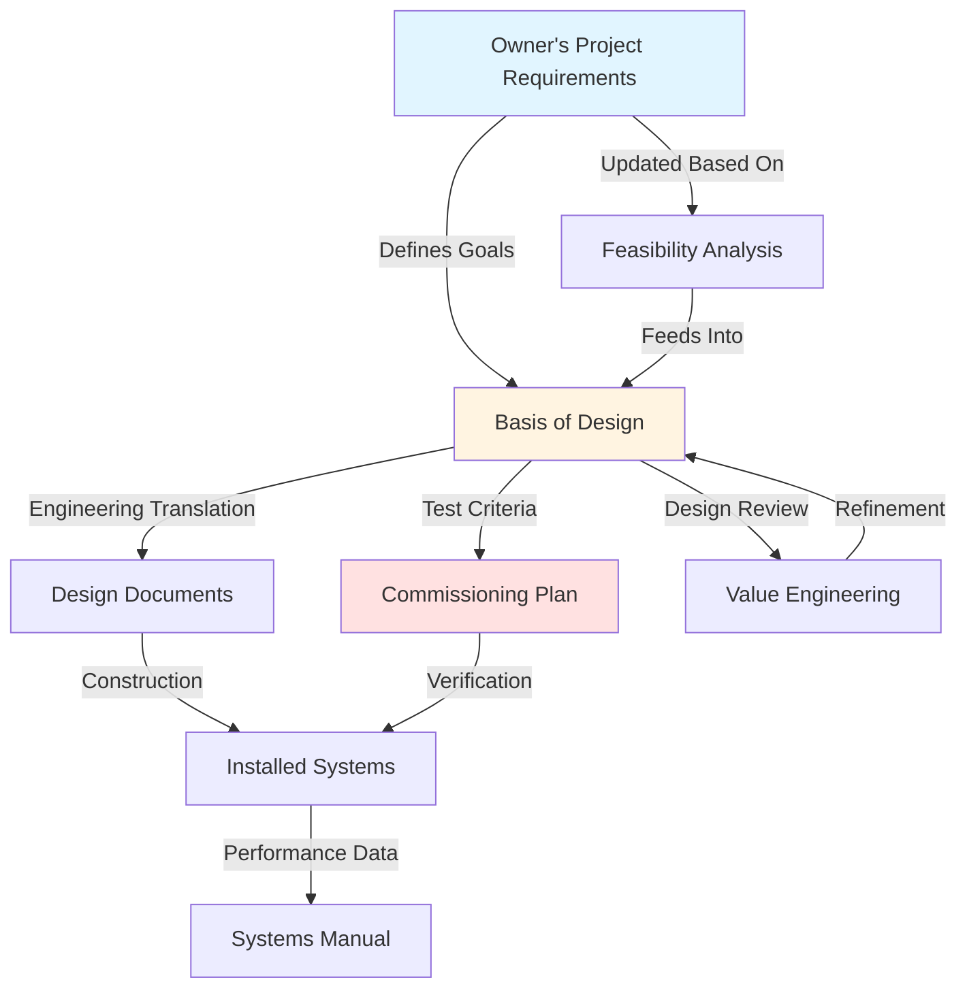

The Basis of Design (BOD) is the foundational engineering document that translates Owner's Project Requirements (OPR) into technical design solutions. BOD provides the rationale, assumptions, calculations, and methodologies that justify all HVAC system selections and configurations throughout the commissioning process.

## BOD Role in Commissioning

BOD serves as the technical bridge between owner requirements and constructed systems. Per ASHRAE Guideline 0-2019, BOD documentation must be developed early in design and updated throughout project phases to maintain alignment with OPR evolution. The commissioning authority uses BOD to verify that design decisions satisfy owner objectives and to develop functional performance test procedures.

BOD differs from design documents in that it explains the engineering logic rather than prescribing construction details. While drawings specify what to build, BOD articulates why those specific systems were selected and how they achieve performance targets.

## BOD-OPR Relationship

The OPR establishes measurable objectives such as temperature tolerances, humidity ranges, air change rates, and energy performance targets. BOD responds by documenting the technical approach selected to meet each requirement, including alternative systems considered and the rationale for rejection.

## BOD Documentation Structure

### Design Assumptions

Design assumptions establish the foundational parameters upon which all calculations and selections depend. These include occupancy densities, operational schedules, plug load estimates, lighting power densities, infiltration rates, and safety factors applied to load calculations.

Document assumptions with sufficient detail to allow independent verification. State whether values derive from ASHRAE standards, local code requirements, actual measurements, or engineering judgment. Identify assumptions that require owner confirmation or validation during construction.

### Climatic Design Conditions

Establish outdoor and indoor design conditions per ASHRAE Fundamentals. Document dry-bulb temperatures, wet-bulb temperatures, humidity ratios, and enthalpy values for cooling and heating design days. Include dehumidification design conditions for humidity-critical applications.

State the percentile basis for outdoor conditions (typically 0.4% for cooling, 99.6% for heating). Document any deviations from standard conditions based on risk analysis or owner requirements for enhanced reliability.

### Load Calculation Methodology

Describe the calculation approach, software tools, and relevant standards applied. For cooling loads, specify whether CLTD/CLF, radiant time series (RTS), or heat balance methods were used. Document diversity factors, simultaneous load analysis, and block versus room-by-room calculation strategies.

Include internal load assumptions with supporting data sources. Document ventilation load calculations per ASHRAE Standard 62.1, including breathing zone outdoor airflow, zone air distribution effectiveness, and system ventilation efficiency.

## System Design Documentation

### System Descriptions

Provide narrative descriptions of each major system explaining configuration, capacity, and operational characteristics. Describe air distribution strategies, zoning approaches, and equipment staging sequences. Explain how systems interact and which components provide backup or redundancy.

Address energy recovery, economizer operation, demand-controlled ventilation, and other efficiency measures. Describe control integration between mechanical, lighting, and building management systems.

### Equipment Selection Criteria

| Selection Factor | Criteria | Justification Basis |
|-----------------|----------|---------------------|
| Capacity | Peak load + safety factor | Load calculations, diversity analysis |
| Efficiency | Minimum performance threshold | Energy code, lifecycle cost analysis |
| Part-Load Performance | IPLV, IEER metrics | Operating profile, annual energy modeling |
| Reliability | MTBF, warranty terms | Maintenance accessibility, owner experience |
| Acoustics | NC/RC criteria | Space function, owner standards |
| Footprint | Spatial constraints | Architectural coordination, serviceability |
| Lifecycle Cost | NPV over analysis period | Energy costs, maintenance costs, replacement |

Document the weighting factors applied when multiple criteria conflict. Explain any equipment selections that prioritize criteria other than first cost.

### Control Strategies

Describe control sequences at the conceptual level rather than point-by-point detail. Explain reset strategies for supply air temperature, chilled water temperature, and hot water temperature. Document setback and setups schedules, optimal start algorithms, and demand limiting approaches.

Address integration with building automation systems, specifying communication protocols and trending requirements. Describe override capabilities and manual control access for operators.

## Energy Analysis Integration

Document energy modeling assumptions including weather data sources, occupancy schedules, process loads, and system efficiencies. Describe baseline systems per ASHRAE Standard 90.1 Appendix G for code compliance or LEED certification.

Report annual energy consumption by end use, peak demand profiles, and energy cost projections. Explain how proposed systems achieve energy performance targets established in OPR.

## BOD Content Requirements

| BOD Section | Required Content | Update Frequency |
|-------------|------------------|------------------|
| Project Overview | Scope, goals, constraints | Initial + major changes |
| Design Criteria | Codes, standards, owner requirements | Initial + code updates |
| Load Calculations | Peak loads, calculation methodology | Design development + revisions |
| System Descriptions | Configuration, capacity, controls | Each design phase |
| Equipment Selection | Performance specs, selection rationale | Design development + substitutions |
| Energy Analysis | Consumption predictions, modeling approach | Design development + final |
| Assumptions Log | All design assumptions with validation status | Continuous updates |

## BOD Development Process

Initiate BOD development during schematic design as soon as preliminary OPR is available. Expand BOD content through design development as calculations are completed and equipment selections finalized. Update BOD to reflect value engineering outcomes, code interpretation clarifications, and owner requirement modifications.

Submit BOD to the commissioning authority for review at each design milestone. Address commissioning comments by revising design or documenting rationale for maintaining current approach. Incorporate BOD into project manuals as a permanent record of design intent for operations staff and future modifications.

The completed BOD provides the technical foundation for commissioning test procedures and performance verification. Without thorough BOD documentation, commissioning becomes subjective assessment rather than objective verification against established engineering criteria.
