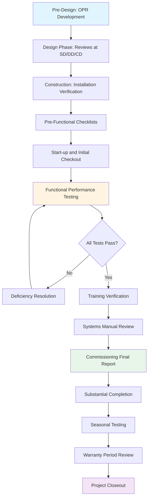

The commissioning plan establishes the roadmap for verifying that HVAC systems meet owner project requirements (OPR) and design intent. Per ASHRAE Guideline 0-2019 and Guideline 1.1-2007, this living document defines scope, responsibilities, schedules, and deliverables throughout project phases.

## Commissioning Phases

ASHRAE Guideline 0 defines commissioning as a five-phase process extending from pre-design through occupancy and operations.

### Pre-Design Phase

The commissioning authority (CxA) reviews owner requirements, develops the commissioning plan framework, and establishes basis of design (BOD) documentation. This phase defines the foundation for all subsequent activities. The CxA evaluates existing facility conditions, utility infrastructure, and operational constraints that influence system selection and performance criteria.

**Key deliverables:**
- Owner project requirements (OPR) documentation
- Initial commissioning plan
- Design phase commissioning budget
- Preliminary systems to be commissioned

### Design Phase

The CxA conducts design reviews at schematic design (SD), design development (DD), and construction documents (CD) stages. Each review verifies alignment between OPR, BOD, and design documentation. The CxA develops detailed test procedures and identifies equipment submittals requiring commissioning review.

**Key deliverables:**
- Design review reports (SD, DD, CD)
- Updated commissioning plan with detailed scope
- Commissioning specifications for contract documents
- Preliminary functional test procedures
- Equipment submittal review log

### Construction Phase

The CxA verifies installation quality, reviews submittals, witnesses factory testing when specified, and coordinates start-up observations. Construction phase activities ensure systems are installed per design intent and ready for functional performance testing.

**Key deliverables:**
- Construction site observation reports
- Submittal review comments
- Issues log tracking deficiencies
- Updated functional test procedures
- Pre-functional checklist verification reports

### Acceptance Phase

Functional performance testing validates that systems operate as designed under various load conditions and control sequences. The CxA executes test procedures, documents results, and tracks deficiency resolution. This phase culminates in system turnover to the owner.

**Key deliverables:**
- Functional performance test reports
- Deficiency tracking and resolution documentation
- Trend log analysis reports
- Systems manual review comments
- Training plan verification
- Commissioning final report

### Post-Occupancy Phase

The CxA conducts seasonal testing and near-end-of-warranty reviews to verify continued performance. This phase addresses issues revealed during actual occupancy loads and operational patterns not evident during initial acceptance.

**Key deliverables:**
- Seasonal functional test reports
- Warranty period review report
- Updated systems manual
- Ongoing commissioning recommendations

## Commissioning Workflow

## Commissioning Team Responsibilities

The commissioning team includes multiple parties with distinct roles and accountability. Clear responsibility assignments prevent gaps in verification activities.

| Role | Organization | Responsibilities |
|------|-------------|------------------|
| **Owner** | Owner/Facility Management | Define OPR; approve commissioning plan; attend key meetings; provide access; review deliverables; accept completed systems |
| **Commissioning Authority** | Independent CxA Firm | Develop and manage commissioning plan; conduct design reviews; verify installation; develop and execute functional tests; document deficiencies; prepare reports |
| **Design Engineer** | MEP Design Firm | Develop BOD; incorporate commissioning specifications; respond to design review comments; attend commissioning meetings; resolve design-related deficiencies |
| **General Contractor** | GC/Construction Manager | Schedule commissioning activities; coordinate subcontractor support; resolve construction deficiencies; provide site access and safety compliance |
| **MEP Contractor** | Mechanical/Electrical Subcontractor | Execute pre-functional checklists; perform start-up; provide technicians for functional testing; resolve installation deficiencies; conduct training |
| **Controls Contractor** | Controls Subcontractor | Program and verify control sequences; provide operator interface access; support functional testing; resolve controls deficiencies; provide controls training |
| **Test and Balance Contractor** | TAB Agency | Execute TAB procedures per ASHRAE Standard 111; provide TAB reports; coordinate with CxA; make adjustments during functional testing |

## Milestone Deliverables Schedule

Commissioning deliverables align with project milestones to ensure timely information flow and decision-making.

| Project Milestone | Commissioning Deliverable | Timeline |
|-------------------|---------------------------|----------|
| Project Award | Commissioning plan (initial) | Within 30 days |
| Schematic Design | SD design review report | Within 15 days of SD submittal |
| Design Development | DD design review report | Within 15 days of DD submittal |
| Construction Documents (90%) | CD design review report; final Cx specs | Within 15 days of CD submittal |
| Bid/Award | Updated commissioning plan | Prior to construction start |
| First MEP Submittal | Submittal review log | Within 15 days of submittal |
| Rough-In Complete | Construction observation report | Ongoing during construction |
| Substantial Completion - 60 days | Pre-functional checklists complete | 60 days prior to SC |
| Substantial Completion - 30 days | Functional testing 80% complete | 30 days prior to SC |
| Substantial Completion | Functional testing 100% complete; training verified | At SC |
| Final Completion | Commissioning final report; systems manual review | Within 30 days of FC |
| 10 Months Post-Occupancy | Seasonal testing report | Opposite season from acceptance |
| End of Warranty - 60 days | Warranty period review report | Prior to warranty expiration |

## Documentation Requirements

The commissioning plan specifies documentation standards to ensure consistent, traceable verification. All reports reference specific OPR and BOD criteria being verified. Issues logs track deficiencies from identification through resolution with assigned responsibility and target dates.

Functional test procedures define initial conditions, step-by-step test sequences, acceptance criteria, and data recording methods. Test procedures undergo review by design engineer and installing contractor prior to execution to identify potential concerns and ensure feasibility.

Trend logs provide objective data demonstrating system response during functional tests. The commissioning plan specifies trend point requirements, logging intervals, and minimum duration to capture transient behavior and control stability.

## Integration with Project Delivery

The commissioning plan adapts to project delivery method while maintaining verification rigor. Design-bid-build projects typically engage an independent CxA reporting to the owner. Design-build and integrated project delivery models may embed commissioning within the delivery team but must maintain objectivity through defined reporting structures and independent test verification.

Early engagement of the CxA during pre-design phase yields maximum value by influencing system selection, simplification opportunities, and performance criteria before design commitment. Late engagement limits the CxA to acceptance testing without design input, reducing effectiveness and potentially requiring value engineering if systems prove difficult to commission.

The commissioning plan budget typically ranges from 0.5% to 1.5% of mechanical and electrical construction costs, varying with project complexity, system types, and phase coverage. This investment returns value through reduced operational issues, enhanced owner understanding, and verified performance rather than assumed compliance.
