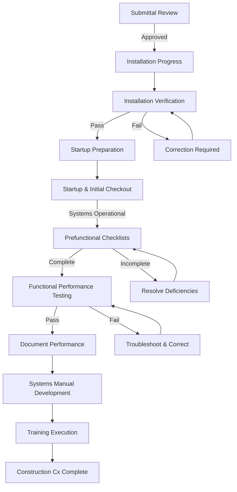

Construction phase commissioning represents the most intensive period of the commissioning process, where documentation transitions to physical verification and equipment performance validation. This phase confirms that installed systems meet design intent and operate as specified before building occupancy.

## Construction Cx Workflow

## Installation Verification

Installation verification confirms that equipment and systems are installed according to approved construction documents and manufacturer requirements. The CxA conducts site observations at critical installation milestones to identify and document deviations before they become embedded in the building fabric.

**Critical verification points:**

- Equipment location, orientation, and clearances
- Pipe and duct routing, sizing, and insulation
- Control sensor placement and calibration
- Electrical connections and voltage verification
- Vibration isolation and seismic restraints
- Equipment nameplate data versus specifications
- Safety device installation and accessibility

Installation verification occurs progressively as construction advances. Early identification of installation deficiencies minimizes rework costs and schedule impacts. The CxA coordinates verification activities with contractor schedules to avoid delaying construction progress while maintaining thorough oversight.

## Startup and Initial Checkout Requirements

Startup establishes baseline system operation under controlled conditions. Each piece of equipment requires systematic startup procedures following manufacturer instructions and industry standards. ASHRAE Guideline 1.1 emphasizes manufacturer-supervised startup for complex equipment including chillers, boilers, and building automation systems.

### Startup Requirements by System

| System Type | Startup Requirements | Critical Checks | Documentation |
|-------------|---------------------|-----------------|---------------|
| **Chillers** | Factory-authorized technician, oil analysis, refrigerant charge verification | Compressor amperage, approach temperatures, safety cutouts | Startup report, oil analysis results |
| **Boilers** | Combustion analysis, gas pressure verification, safety testing | Flue gas CO/CO₂, draft, flame safeguard response | Combustion test report, safety checklist |
| **Air Handlers** | Belt tension, bearing lubrication, rotation verification | Motor amperage, airflow measurement, filter pressure drop | Fan performance data, TAB readings |
| **Pumps** | Rotation verification, seal inspection, pressure testing | Motor amperage, pressure differential, seal operation | Performance curve verification |
| **Cooling Towers** | Fill installation, nozzle verification, fan alignment | Water distribution, drift eliminators, basin chemistry | Water treatment baseline |
| **BAS/DDC** | Point mapping verification, controller programming, network testing | Sensor calibration, control sequences, alarm functions | Point-to-point checkout, sequence verification |

## Prefunctional Checklists

Prefunctional checklists systematically verify that all system components are ready for integrated functional testing. These static and dynamic checks confirm proper installation, startup completion, and basic operational capability before executing functional performance tests.

**Prefunctional checklist components:**

1. **Static inspections** - Visual verification of installation completeness, proper wiring, correct equipment models, and adherence to specifications
2. **Component functional tests** - Individual device operation including dampers, valves, sensors, and safeties under isolated conditions
3. **Calibration verification** - Sensor accuracy checks using calibrated instruments with documented tolerances
4. **Interlocks and safeties** - Verification that protective devices operate at correct setpoints and prevent unsafe conditions
5. **Control logic verification** - Confirmation that control sequences execute as programmed under simulated conditions

Prefunctional checklists bridge the gap between startup and functional performance testing. All checklist items must achieve satisfactory completion before proceeding to FPT. Unresolved deficiencies delay functional testing and extend commissioning schedules.

## Functional Performance Testing Procedures

Functional performance testing validates that systems and assemblies operate as intended under various modes and operating conditions. FPT procedures follow written test protocols that define test conditions, acceptance criteria, and documentation requirements. ASHRAE Guideline 1.1 requires the CxA to develop FPT procedures and witness all testing.

**FPT methodology:**

1. **Test preparation** - Review design intent, control sequences, and acceptance criteria with design team and contractors
2. **Initial conditions** - Establish stable baseline conditions before inducing test scenarios
3. **Operational modes** - Test normal operation, unoccupied mode, warmup, cooldown, economizer operation, and emergency modes
4. **Setpoint testing** - Verify control response to setpoint changes across the control range
5. **Sequence verification** - Confirm proper staging, lead-lag operation, lockouts, and interlocks
6. **Safety testing** - Verify that safety devices prevent unsafe conditions and equipment damage
7. **Integrated operation** - Test interaction between systems including air-side and water-side coordination
8. **Trending analysis** - Capture BAS trend data during testing to verify proper sensor operation and control response
9. **Documentation** - Record test conditions, observations, measured values, pass/fail determination, and deficiency notes

### FPT Documentation Requirements

| Test Element | Required Data | Acceptance Criteria | Deficiency Actions |
|--------------|---------------|---------------------|-------------------|
| **Airflow Verification** | Terminal CFM, static pressures, diversity factors | ±10% of design per ASHRAE 90.1 | Rebalance, adjust dampers, verify fan speed |
| **Temperature Control** | Space temperatures, discharge air temp, control signals | ±2°F of setpoint at design conditions | Calibrate sensors, tune control loops, adjust sequences |
| **Economizer Operation** | OA/RA damper position, mixed air temp, changeover point | Proper modulation, correct changeover per code | Repair actuators, reprogram logic, verify enthalpy sensors |
| **Chilled Water System** | Supply/return temps, flow rates, delta-T, pump speeds | Design delta-T ±10%, flow within 5% | Adjust balancing valves, optimize control valves, verify pumping strategy |
| **Heating System** | Supply/return temps, combustion efficiency, staging | Efficiency per nameplate, proper staging sequence | Tune burner, adjust firing rate, reprogram staging logic |
| **DDC System Response** | Trend logs, control loop tuning, alarm functions | P+I control, alarm notification within 5 minutes | Retune loops, verify alarm routing, adjust deadbands |

## Deficiency Resolution and Retesting

Deficiencies identified during installation verification, prefunctional checklists, or functional testing require formal tracking and resolution. The CxA maintains a deficiency log documenting each issue, responsible party, required correction, and resolution status. Deficiencies are categorized by severity to prioritize resolution efforts.

**Deficiency categories:**

- **Critical** - Prevents system operation or creates safety hazard; requires immediate correction
- **Major** - Significantly degrades performance or violates code requirements; correction before occupancy
- **Minor** - Limited performance impact; correction before final acceptance

After deficiency correction, affected systems undergo retesting using the same test procedures and acceptance criteria. Only systems demonstrating satisfactory performance across all test scenarios achieve commissioning acceptance. Unresolved deficiencies at substantial completion transfer to the deferred/seasonal testing list or remain open pending final correction.

Construction phase commissioning intensity directly correlates with project success. Thorough installation verification, systematic startup procedures, comprehensive prefunctional checklists, and rigorous functional performance testing ensure that building systems meet owner expectations and provide reliable long-term operation. The investment in construction phase commissioning returns measurable benefits through reduced callbacks, lower energy consumption, and improved occupant comfort.
