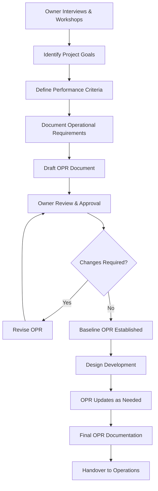

## OPR Foundation and Purpose

The Owner's Project Requirements (OPR) document serves as the foundational commissioning document that defines the owner's objectives, performance expectations, and operational requirements for building systems. As mandated by ASHRAE Guideline 0, the OPR provides the measurable criteria against which all design and construction decisions are evaluated throughout the project lifecycle.

The OPR establishes a clear performance-based framework that translates owner expectations into quantifiable metrics. This document drives the development of the Basis of Design (BOD) and guides verification testing during commissioning. Without comprehensive OPR documentation, the commissioning process lacks objective criteria for success validation.

## OPR Development Process

## Essential OPR Content Categories

| Category | Key Elements | Purpose |
|----------|--------------|---------|
| Project Vision | Mission statement, strategic objectives, building purpose | Establishes overarching goals |
| Performance Requirements | Temperature ranges, humidity levels, air quality metrics, energy targets | Defines measurable success criteria |
| Operational Parameters | Operating schedules, occupancy patterns, load profiles | Guides system sizing and control strategies |
| Maintenance Philosophy | Maintenance approach, equipment accessibility, service life expectations | Informs equipment selection and layout |
| Environmental Goals | Energy performance, water conservation, indoor air quality standards | Sets sustainability benchmarks |
| Budget Framework | First cost limitations, lifecycle cost targets, utility budget constraints | Constrains design options |
| Schedule Constraints | Occupancy dates, phasing requirements, critical milestones | Affects equipment selection and staging |
| Expansion Provisions | Future capacity needs, space reservations, infrastructure oversizing | Ensures adaptability |

## Performance Criteria Specification

Performance criteria must be quantifiable and verifiable through testing. Temperature setpoints require precision: specify 72°F ± 2°F rather than "comfortable temperatures." Humidity control demands similar rigor: 40-60% RH at design conditions with allowable excursions during extreme weather defined explicitly.

Energy performance targets should reference specific metrics aligned with measurement capabilities. Annual energy use intensity (EUI) targets in kBtu/sf/year provide clear benchmarks. Peak demand limits in kW establish electrical infrastructure requirements. Renewable energy percentages or carbon intensity targets define sustainability expectations when applicable.

Ventilation requirements must specify outdoor air delivery rates per ASHRAE Standard 62.1, accounting for occupancy categories and space uses. Indoor air quality parameters beyond ventilation rates—such as CO₂ concentration limits, particulate matter thresholds, or VOC constraints—require explicit documentation when project goals exceed code minimums.

Acoustic performance criteria define maximum noise levels in occupied spaces, typically specified as NC or RC ratings. Mechanical system contribution to background noise requires separation from total ambient noise to establish design targets for equipment selection and isolation measures.

## Operational Requirements Definition

Operational requirements translate owner expectations into system behavior specifications. Operating schedules must detail occupied, unoccupied, and setback periods with precision sufficient for control programming. Seasonal variations, holiday schedules, and special event accommodations require documentation when they deviate from standard patterns.

Occupancy profiles provide the foundation for load calculations and system sizing. Peak occupancy numbers, diversity factors, and occupancy density variations across different zones establish design parameters. Metabolic rates for specific activities, equipment heat gains, and lighting power densities derive from operational requirements documentation.

Control authority and override capabilities reflect operational philosophy. Specify which parameters remain fixed versus user-adjustable. Define override duration limits, reset capabilities, and lockout conditions. Document remote monitoring requirements, alarm notification protocols, and building automation system access levels.

Maintenance access requirements influence equipment placement and space allocation. Minimum clearances for service and replacement must accommodate actual equipment dimensions plus working space. Filter change frequencies, coil cleaning protocols, and refrigerant servicing needs determine accessibility standards.

## Documentation Structure and Format

The OPR document requires organization that facilitates reference throughout design and construction. A hierarchical structure with numbered sections enables precise cross-referencing in BOD documents and commissioning test procedures. Each requirement should carry a unique identifier for tracking through verification testing.

Requirements statements must use clear, unambiguous language. Mandatory requirements use "shall" while recommendations use "should." Avoid vague terms like "adequate," "sufficient," or "appropriate" without quantification. Replace qualitative statements with measurable criteria: "maintenance access panels shall provide 36-inch minimum clearance" rather than "adequate maintenance access."

| Document Section | Typical Content | Detail Level |
|------------------|-----------------|--------------|
| Executive Summary | Project overview, key objectives | High-level narrative |
| Project Description | Building type, size, occupancy, location | Factual parameters |
| Performance Requirements | Specific measurable criteria | Quantitative specifications |
| Operational Requirements | Schedules, occupancy, usage patterns | Detailed operational data |
| Maintenance Requirements | Service philosophy, accessibility, training needs | Qualitative and quantitative |
| Sustainability Requirements | Energy targets, certification goals, environmental criteria | Measurable benchmarks |
| Documentation Requirements | Deliverable specifications, format requirements | Explicit standards |

## OPR Integration with Design Process

The OPR serves as the reference against which designers develop the Basis of Design. Each BOD decision must trace back to specific OPR requirements, creating accountability for design choices. When design solutions cannot meet stated OPR criteria, formal approval from the owner becomes necessary for requirement modification.

OPR updates occur as project understanding evolves, but changes require formal revision control. Version tracking with date stamps and revision descriptions maintains configuration management. Distribute OPR revisions to all project team members simultaneously to prevent working from obsolete criteria.

Commissioning verification tests derive directly from OPR performance criteria. Each testable requirement in the OPR generates corresponding functional performance test procedures. This direct linkage ensures that commissioning validates actual owner needs rather than arbitrary test sequences.

## Post-Occupancy OPR Utilization

The OPR transitions from a design and construction tool to an operational reference document. Facility managers use OPR criteria to evaluate system performance during occupancy. When operational performance deviates from OPR specifications, the documented requirements provide objective evidence for warranty claims or corrective action requests.

Long-term capital planning references OPR sustainability goals and expansion provisions. Equipment replacement decisions should maintain or improve upon original OPR performance criteria. The OPR becomes the baseline for measuring performance degradation and justifying renovation investments.
