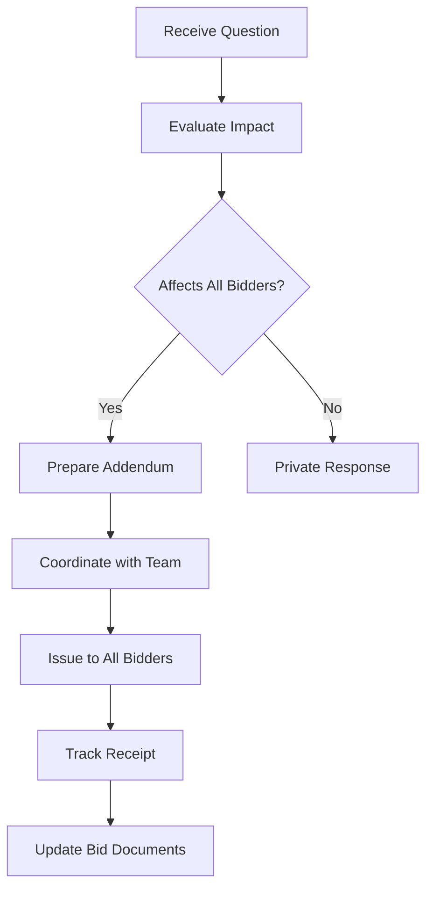
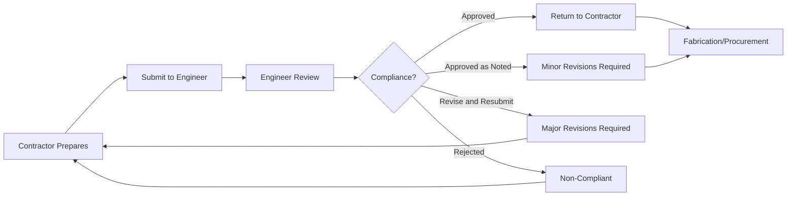
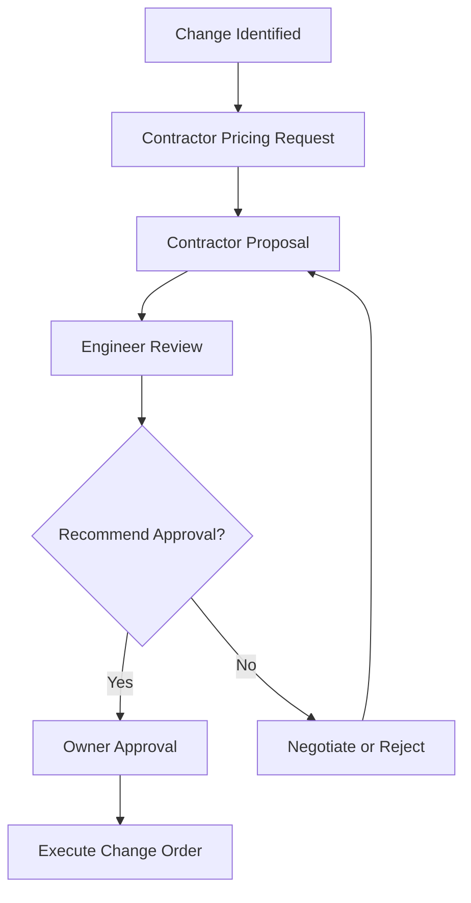

Construction administration (CA) encompasses engineering services during bidding and construction phases, ensuring HVAC systems conform to contract documents and perform per design intent. Effective CA requires systematic processes for document management, contractor coordination, and quality verification.

## Construction Administration Scope

The engineer's construction administration responsibilities bridge design completion and system acceptance, providing technical guidance and quality oversight.

### Standard CA Services (AIA B101)

**Bidding phase:**
- Issue addenda clarifying design intent
- Respond to pre-bid questions
- Attend pre-bid meetings
- Review bids for technical compliance
- Assist owner in contract award

**Construction phase:**
- Review and approve submittals
- Respond to Requests for Information (RFIs)
- Process contractor payment applications
- Conduct site observations
- Review and approve change orders
- Attend progress meetings
- Review testing and balancing reports
- Witness commissioning activities

**Closeout phase:**
- Review closeout documentation
- Verify punch list completion
- Issue certificate of substantial completion
- Compile as-built documentation
- Support warranty period

### HVAC-Specific CA Activities

**System coordination:**
- Review MEP coordination drawings
- Verify equipment access and clearances
- Confirm structural support adequacy
- Validate control system integration

**Performance verification:**
- Witness equipment startup
- Review functional test results
- Verify airflow and water flow rates
- Confirm temperature and pressure measurements

**Energy compliance:**
- Verify installed equipment efficiency ratings
- Review control sequences as-programmed
- Confirm metering installation
- Validate commissioning completion

## Bidding Phase Administration

Proper bidding phase administration establishes clear contract requirements and ensures competitive, qualified contractor selection.

### Bid Document Preparation

**Construction documents completeness:**
- Drawings 100% coordinated with specifications
- Equipment schedules complete with performance data
- Control sequences fully documented
- Code compliance verified

**Specifications organization (CSI MasterFormat):**

| Division | Section | HVAC Content |
|----------|---------|--------------|
| 01 | General Requirements | Submittals, quality control, closeout |
| 22 | Plumbing | Plumbing piping, equipment, specialties |
| 23 | HVAC | Ductwork, air distribution, central plant, controls |
| 26 | Electrical | Electrical connections, motor starters, power |

**Bid form requirements:**
- Base bid with complete HVAC scope
- Alternate bids for system variations
- Allowances for owner-selected equipment
- Unit prices for potential additions

### Addenda Process

Addenda communicate design clarifications and changes during bidding period.

**Addendum issuance workflow:**

**Addendum content requirements:**
- Sequential numbering (Addendum No. 1, 2, 3...)
- Issue date with receipt acknowledgment requirement
- Clear description of changes or clarifications
- Affected drawing sheets and specification sections
- Instructions for bid modification

**Typical addenda issues:**
- Equipment substitution requests and approvals
- Design clarifications (piping routing, duct sizing)
- Code compliance questions
- Specification conflicts or ambiguities
- Schedule modifications

### Pre-Bid Meetings

Pre-bid meetings familiarize contractors with project requirements and site conditions.

**Meeting agenda:**
1. **Project overview:** Owner objectives, schedule, budget
2. **Scope review:** Major systems, performance requirements, special conditions
3. **Site conditions:** Access limitations, existing utilities, phasing requirements
4. **Bidding requirements:** Qualifications, alternates, bid security
5. **Questions:** Technical clarifications, procedural issues

**Documentation:**
- Meeting minutes distributed to all bidders
- Questions requiring written response issued via addenda
- Attendance roster tracking bidder participation

### Bid Evaluation

Technical evaluation ensures conformance before price comparison.

**Bid review checklist:**
- Bid security submitted (bond or certified check)
- Acknowledgment of all addenda
- Qualifications documentation complete
- Equipment specifications comply with requirements
- Alternates priced per instructions
- Mathematical accuracy of bid totals

**Technical compliance verification:**

$$\text{Evaluated Cost} = \text{Base Bid} + \text{Required Alternates} + \text{Non-Compliance Adjustments}$$

**Non-compliance examples:**
- Equipment efficiency below specified minimum (+cost adjustment)
- Missing scope items (+estimated cost)
- Unauthorized substitutions (reject or adjust)

**Recommendation to owner:**
- Lowest responsive, responsible bidder identification
- Technical compliance summary
- Cost comparison analysis
- Qualifications assessment
- Award recommendation with conditions (if any)

## Submittal Management

Submittals provide detailed equipment and material information for engineer review and approval.

### Submittal Process

**Submission workflow:**

**Review actions:**
- **Approved:** Fully compliant, proceed with fabrication
- **Approved as Noted:** Minor deviations noted, proceed with corrections
- **Revise and Resubmit:** Significant issues require resubmission
- **Rejected:** Non-compliant, submit conforming product

### Submittal Types

**Product data submittals:**
- Manufacturer's literature and specifications
- Performance curves (fans, pumps, chillers)
- Dimensions and clearance requirements
- Electrical characteristics
- Sound ratings

**Shop drawing submittals:**
- Fabrication drawings for ductwork and piping
- Equipment layout and connection details
- Structural support details
- Control system diagrams and points lists

**Sample submittals:**
- Physical samples of materials (insulation, finishes)
- Mockups of assemblies (air terminal configuration)

**Closeout submittals:**
- Operation and maintenance manuals
- Warranty documentation
- As-built drawings
- Training materials

### Submittal Review Criteria

**Performance compliance:**
- Capacity meets or exceeds design requirements
- Efficiency ratings satisfy specifications
- Operating parameters within design conditions

**Physical compatibility:**
- Dimensions fit allocated space
- Connections align with drawings
- Weight compatible with structural design
- Access clearances adequate for maintenance

**Code compliance:**
- UL listing and labels
- Efficiency standards (ASHRAE 90.1, IECC)
- Safety devices and controls
- Refrigerant type and charge limits

**Control integration:**
- BAS communication protocol compatibility
- Control points match sequence requirements
- Sensor accuracy and range specifications
- Interface wiring and power requirements

**Typical review durations:**
- Routine equipment: 7-10 business days
- Complex systems (chillers, AHUs): 14 business days
- Controls and BAS: 14-21 business days (programming review)
- Resubmittals: 5-7 business days

## Request for Information (RFI) Management

RFIs request clarification of contract documents or site conditions.

### RFI Process

**Contractor RFI preparation:**
- Specific question with reference to drawings/specifications
- Relevant background information
- Proposed solution or options
- Schedule impact if not resolved

**Engineer review protocol:**
- Acknowledge receipt within 24 hours
- Respond within contractual timeframe (typically 5-7 business days)
- Coordinate with design team if required
- Document response and distribute to all parties

**RFI response format:**
- Answer the specific question directly
- Reference applicable contract documents
- Provide sketches or marked drawings if needed
- Note any cost or schedule implications
- Clarify whether response constitutes change

### RFI Categories

| RFI Type | Example | Typical Resolution |
|----------|---------|-------------------|
| **Clarification** | Duct fitting configuration at tight clearance | Provide detail sketch |
| **Conflict** | Pipe interferes with structural beam | Coordinate rerouting |
| **Missing information** | Control valve size not specified | Issue valve schedule |
| **Substitution request** | Propose alternative equipment | Review and approve/reject |
| **Means and methods** | Rigging plan for rooftop unit | Contractor responsibility, no response |

**RFI response impacts:**

If response requires design change:

$$\text{Change Order} = \Delta\text{Labor} + \Delta\text{Material} + \Delta\text{Equipment} + \text{Overhead} + \text{Profit}$$

**RFI tracking metrics:**
- Total RFIs submitted
- Average response time
- RFIs resulting in changes
- Cost impact of design clarifications

Excessive RFIs (> 0.5 per $100,000 construction cost) indicate incomplete contract documents.

## Change Order Management

Change orders modify contract scope, cost, or schedule through formal documentation.

### Change Order Types

**Owner-requested changes:**
- Scope additions or deletions
- Performance upgrades
- Schedule acceleration

**Design-error changes:**
- Conflicts discovered during construction
- Omissions requiring correction
- Code compliance issues

**Field-condition changes:**
- Unforeseen site conditions
- Existing building discrepancies
- Utility conflicts

**Value engineering changes:**
- Cost-saving alternatives proposed by contractor
- Performance-neutral substitutions

### Change Order Process

**Change identification:**

**Pricing review:**
- Labor hours and rates reasonableness
- Material costs with markup verification
- Equipment rental rates justification
- Subcontractor quotes validation
- Schedule impact assessment

**Change order components:**
- Description of change and reason
- Contract document references
- Cost breakdown (labor, material, equipment)
- Schedule impact (time extension if applicable)
- Cumulative contract value after change

### Change Order Mitigation

**Preventive strategies:**
- Complete, coordinated design before bidding
- Thorough constructability review
- BIM clash detection
- Early owner decisions on optional items

**Target: < 5% total change orders relative to original contract**

## Site Observations

Periodic site visits verify construction conformance to contract documents.

**Observation frequency:**
- Monthly during rough-in phase
- Bi-weekly during equipment installation
- Weekly during startup and testing

**Observation focus:**
- Work progress consistent with schedule
- Materials and equipment conform to submittals
- Workmanship meets industry standards
- Safety procedures followed
- Access and clearances maintained

**Site observation report:**
- Date and attendees
- Work progress description
- Observed deficiencies
- Contractor response required
- Photos documenting conditions

Site observations provide general assessment, not exhaustive inspection. Contractor retains quality control responsibility.

## Quality Control and Assurance

Quality programs ensure HVAC systems meet specifications and perform reliably.

**Contractor quality control (QC):**
- Self-inspection before requesting engineer review
- Three-phase electrical verification
- Pressure testing of piping systems
- Duct leakage testing per SMACNA
- Refrigerant leak testing
- Control point calibration

**Engineer quality assurance (QA):**
- Submittal review and approval
- Site observation of key installations
- Witness testing verification
- TAB report review
- Commissioning support

**Quality metrics:**

Duct leakage testing (SMACNA requirements):

$$CL_a = \frac{CL_m \times P_s^{0.65}}{P_t^{0.65}}$$

Where: $CL_a$ = allowable leakage, $CL_m$ = leakage class, $P_s$ = test pressure, $P_t$ = system operating pressure

Typical requirement: Leakage Class 6 for supply ductwork, Class 3 for return/exhaust

## Construction Closeout

Closeout procedures verify completion and transfer operational systems to owner.

**Substantial completion:**
- All systems operational
- Minor punch list items remaining
- Occupancy permit obtained
- Owner training scheduled

**Final completion:**
- Punch list items corrected and verified
- All closeout documentation submitted
- Warranties transferred to owner
- Final payment processed

**Closeout documentation:**
- As-built drawings showing field changes
- Operation and maintenance manuals
- Warranty certificates and contacts
- Test and balance reports
- Commissioning reports
- Spare parts and special tools
- Training materials and videos

**Warranty period:**
- Standard equipment: 1 year from substantial completion
- Extended warranties: Per specification (5-10 years for major equipment)
- Seasonal equipment: Coverage extends through one full operating season

Effective construction administration reduces construction phase issues by 60-80%, ensures design intent achievement, and establishes foundation for successful long-term operation.

---

*Subsections provide detailed procedures for Bidding Phase Administration, Submittal Management, RFI Processing, Change Order Control, Site Observations, Quality Programs, and Closeout Procedures.*
