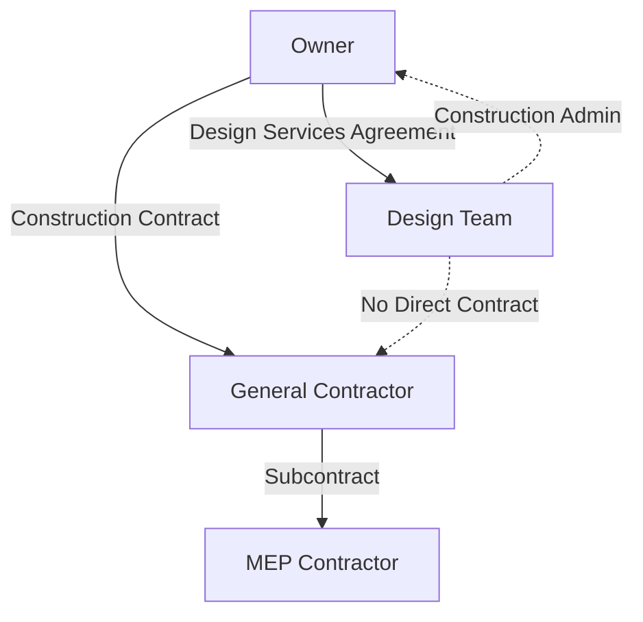
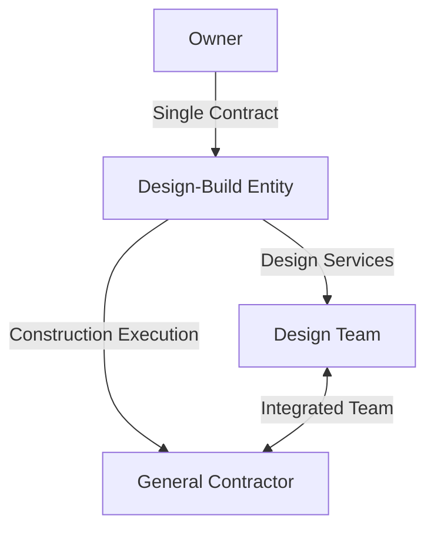
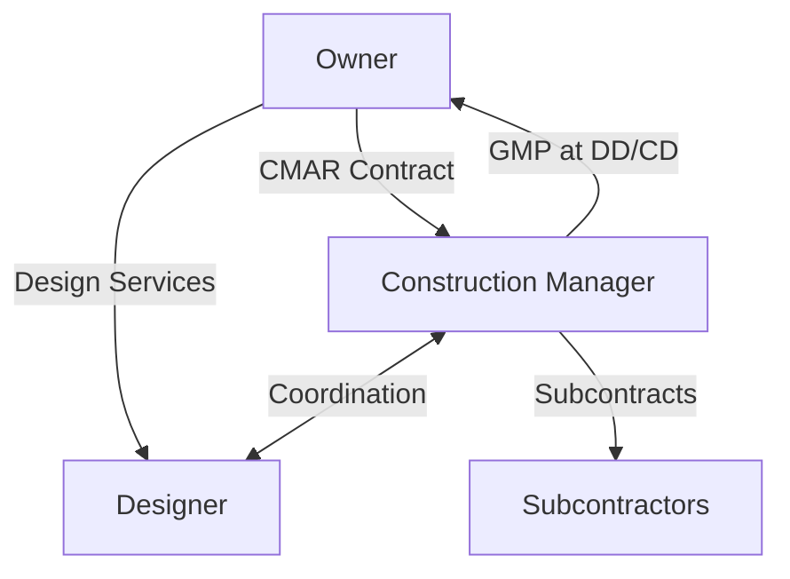
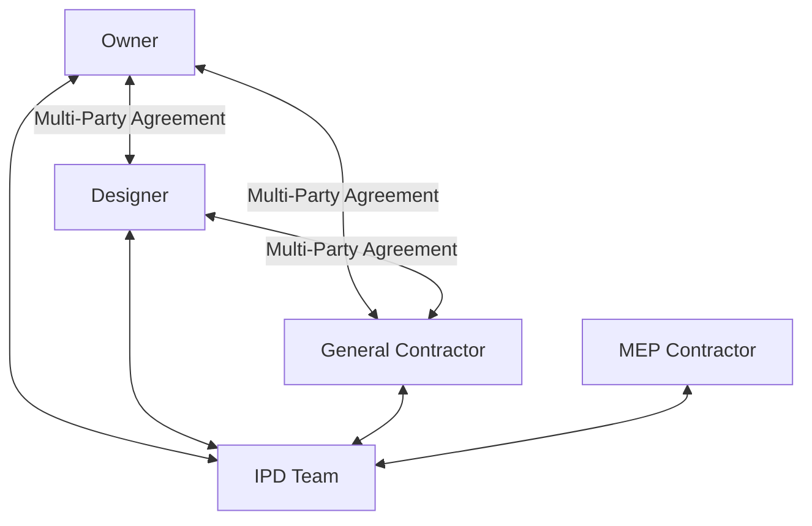

Project delivery method selection fundamentally determines contractual relationships, risk allocation, and collaboration structures that govern HVAC system design and construction. Each delivery method presents distinct implications for engineering scope, coordination responsibilities, and project outcomes.

## Delivery Method Fundamentals

Project delivery methods define three critical relationships:

**Owner-Designer relationship:** Scope of engineering services, design authority, liability structure

**Owner-Constructor relationship:** Construction contract type, price certainty, schedule guarantees

**Designer-Constructor relationship:** Collaboration timing, coordination responsibility, risk sharing

Traditional delivery separates design from construction; integrated delivery combines these functions under unified contracts promoting early collaboration.

## Design-Bid-Build (DBB)

The conventional delivery method featuring sequential phases: complete design, competitive bidding, construction execution.

### Contract Structure

**Key characteristics:**
- Owner holds separate contracts with designer and contractor
- No contractual relationship between designer and constructor
- Designer provides construction administration services to owner
- Competitive bidding based on 100% complete documents

### HVAC Engineering Scope

**Design phase deliverables:**
- Load calculations and equipment sizing (schematic design)
- System selection and preliminary layouts (design development)
- Complete construction documents with specifications (100% CD)
- Bidding support: addenda, clarifications, pre-bid meetings

**Construction phase deliverables:**
- Submittal review and approval
- RFI response and design clarifications
- Site observation and progress meetings
- Testing, adjusting, balancing review
- Commissioning support and system acceptance

### Risk Allocation

| Risk Category | Owner | Designer | Contractor |
|--------------|-------|----------|------------|
| Design errors/omissions | Shared | Primary | None |
| Cost escalation | Primary | None | None (after bid) |
| Schedule delays | Primary | Limited | Liquidated damages |
| Performance deficiencies | None | Professional liability | Warranty |
| Constructability issues | Shared | Partial | Claims potential |

### Advantages for HVAC Projects

**Design independence:** Engineer selects optimal systems without constructor influence, ensuring performance over cost minimization

**Competitive pricing:** Multiple bidders create price competition, typically yielding 5-10% cost savings over negotiated contracts

**Clear liability:** Separate design and construction responsibilities simplify dispute resolution

**Owner control:** Owner maintains direct relationships and decision authority throughout project

### Disadvantages for HVAC Projects

**Limited constructability input:** Contractor reviews design only after completion, missing opportunities for value engineering

**Sequential timeline:** Linear process extends overall project duration by 15-25% compared to fast-track methods

**Change order exposure:** Design modifications during construction generate change orders, adversely impacting cost and schedule

**Adversarial relationships:** Separation of design and construction creates conflicting incentives, reducing collaboration

### Optimal Applications

DBB suits projects requiring:
- Public sector compliance with competitive bidding statutes
- Well-defined scopes with minimal anticipated changes
- Standard HVAC systems with proven technologies
- Maximum price competition among qualified contractors
- Clear separation of design and construction liability

## Design-Build (DB)

Unified delivery method where single entity assumes responsibility for both design and construction under one contract.

### Contract Structure

**Key characteristics:**
- Owner contracts with single design-build entity
- Designer and contractor collaborate from project inception
- Integrated team shares risk and incentives
- Early pricing and schedule certainty

### HVAC Engineering Integration

**Early collaboration benefits:**
- Contractor provides real-time cost feedback during design
- Equipment lead times inform schedule development
- Constructability reviews occur concurrently with design
- Value engineering optimizes installed cost vs. performance

**Design progression:**
- Owner provides performance requirements (RFP stage)
- DB team proposes systems and pricing (proposal stage)
- Design development proceeds with constructor input (30-60% CD)
- Construction begins while design finishes (fast-track)

### Risk Allocation

| Risk Category | Owner | Design-Build Entity |
|--------------|-------|---------------------|
| Design errors/omissions | None | Full responsibility |
| Cost escalation | None (GMP) | Shared (cost-plus) |
| Schedule delays | Limited | Primary |
| Performance deficiencies | Specification-based | Warranty and liability |
| Constructability issues | None | Internal resolution |

### Advantages for HVAC Projects

**Accelerated delivery:** Overlapping design and construction reduces project duration by 20-30%

**Cost certainty:** Guaranteed Maximum Price (GMP) established early, typically at 60% design completion

**Constructability integration:** Contractor input during design improves installation efficiency and reduces field problems

**Single-point responsibility:** Owner benefits from unified accountability for design and construction performance

**Innovation opportunity:** Integrated team can propose alternative HVAC systems offering superior value

### Disadvantages for HVAC Projects

**Reduced owner control:** Design decisions involve contractor cost considerations, potentially compromising performance for price

**Limited competition:** Pricing occurs before design completion, reducing competitive pressure

**Design quality concerns:** Contractor incentive to minimize installation cost may limit design optimization

**Complex procurement:** RFP development requires detailed performance specifications to ensure quality

### Optimal Applications

DB excels when:
- Fast-track schedule provides significant owner value
- Project scope allows performance-based specifications
- Innovative HVAC solutions offer competitive advantage
- Private sector owner can negotiate with qualified teams
- Complex systems benefit from constructor input during design

## Construction Manager at Risk (CMAR)

Hybrid delivery engaging construction manager early for preconstruction services, then converting to at-risk constructor.

### Contract Structure

**Phased contracting:**
- Phase 1: Preconstruction services (fee-based)
- Phase 2: Construction services (GMP or cost-plus)

### Preconstruction Services

**CM provides:**
- Constructability reviews at SD, DD, CD milestones
- Cost estimating and value engineering
- Schedule development and phasing plans
- Subcontractor and vendor qualification
- Long-lead equipment procurement planning

**HVAC-specific services:**
- Equipment lead time analysis
- Prefabrication opportunity identification
- Site logistics for equipment rigging and installation
- Energy analysis cost-benefit evaluation

### Advantages for HVAC Projects

**Design independence maintained:** Engineer designs optimal systems while receiving constructor feedback

**Cost management:** Real-time cost estimating identifies budget issues before design completion

**Schedule optimization:** Early equipment procurement reduces critical path duration

**Collaborative environment:** All parties work toward project success without adversarial contracts

### Disadvantages for HVAC Projects

**Fee structure complexity:** Preconstruction services add 1-2% to project cost

**GMP negotiation:** CM may negotiate high contingency absent competitive pressure

**Relationship dependency:** Success requires trust and collaboration; conflicts reduce effectiveness

### Optimal Applications

CMAR suits:
- Complex institutional projects (hospitals, universities)
- Projects requiring early cost certainty with design quality
- Fast-track schedules with phased construction
- Sophisticated owners capable of managing CM relationship

## Integrated Project Delivery (IPD)

Collaborative delivery method aligning all parties through shared risk/reward and multi-party contracts.

### Contract Structure

**IPD principles:**
- Multi-party agreement binding owner, designer, contractors
- Shared risk pool: savings/overruns distributed per agreement
- Collaborative decision-making (owner, architect, engineer, contractors)
- Open-book cost management with transparency
- Early involvement of all key participants

### HVAC Engineering in IPD

**Integrated design process:**
- MEP contractor joins team during schematic design
- Engineer and contractor co-develop system concepts
- Real-time cost validation guides design decisions
- Prefabrication and modularization planned from inception

**Target Value Design (TVD):**

$$\text{Target Cost} = \text{Market Value} - \text{Required Profit}$$

Design team works to deliver project at or below target cost, sharing savings achieved.

### Risk/Reward Structure

**Shared outcomes:**
- Cost underrun: Split per agreement (e.g., 50% owner, 30% contractor, 20% designer)
- Cost overrun: Shared pain reduces profits but eliminates profit if exceeds threshold
- Performance incentives: Energy performance, schedule milestones, quality metrics

### Advantages for HVAC Projects

**Optimal solutions:** Collaborative design achieves best value across first cost, lifecycle cost, and performance

**Risk reduction:** Shared incentives eliminate adversarial behaviors and claim culture

**Innovation:** Team explores advanced HVAC technologies without traditional procurement barriers

**Lean integration:** IPD naturally incorporates lean construction principles (last planner system, pull planning)

### Disadvantages for HVAC Projects

**Contract complexity:** Multi-party agreements require sophisticated legal and financial structures

**Limited experience:** IPD remains uncommon; finding experienced partners challenging

**Cultural requirements:** Success demands trust, transparency, and collaboration—difficult to sustain under pressure

**Unsuitable for public sector:** Multi-party agreements and negotiated pricing conflict with public bidding requirements

### Optimal Applications

IPD appropriate when:
- Sophisticated private owner values collaboration and innovation
- Complex HVAC systems benefit from integrated optimization
- Project team has IPD experience and cultural alignment
- Performance outcomes (energy, IAQ) justify collaborative investment

## Delivery Method Selection Matrix

| Factor | DBB | DB | CMAR | IPD |
|--------|-----|----|----|-----|
| **Schedule Priority** | Low | High | Medium-High | High |
| **Cost Certainty Timing** | Late (bid) | Early (GMP) | Medium (60% CD) | Early (target) |
| **Design Quality Control** | High | Medium | High | Collaborative |
| **Innovation Potential** | Low | Medium | Medium | High |
| **Owner Sophistication** | Low | Medium | High | Very High |
| **Public Sector Suitability** | High | Medium | Medium | Low |
| **HVAC Complexity** | Standard | Standard | Complex | Very Complex |

## Progressive Design-Build

Emerging variant phasing DB engagement: early collaborative design, followed by GMP establishment at DD completion.

**Advantages over traditional DB:**
- Owner participates in design development before price commitment
- Competitive selection based on qualifications and fees, not preliminary design
- Design quality maintained through owner oversight during development

**Process:**
1. Select DB team based on qualifications (best value)
2. Collaborative design to 30-60% completion
3. Establish GMP based on developed design
4. Complete design and execute construction

Progressive DB combines DB speed with owner design involvement and cost validation.

## Procurement Strategy Recommendations

**Standard commercial office HVAC:** DBB for competitive pricing on proven systems

**Fast-track corporate headquarters:** DB or CMAR for schedule acceleration with quality HVAC

**Complex healthcare facility:** CMAR for constructability input on critical systems (OR ventilation, medical gas)

**High-performance institutional building:** IPD for integrated optimization of envelope and HVAC systems

**Public sector projects:** DBB (required) or CMAR (if statutes permit) for contractor input within competitive framework

Delivery method selection significantly impacts HVAC system outcomes—schedule, cost, performance, and owner satisfaction depend on aligning procurement strategy with project goals and constraints.

---

*Detailed subsections explore specific delivery methods, contract structures, risk allocation strategies, and HVAC-specific implementation considerations.*
