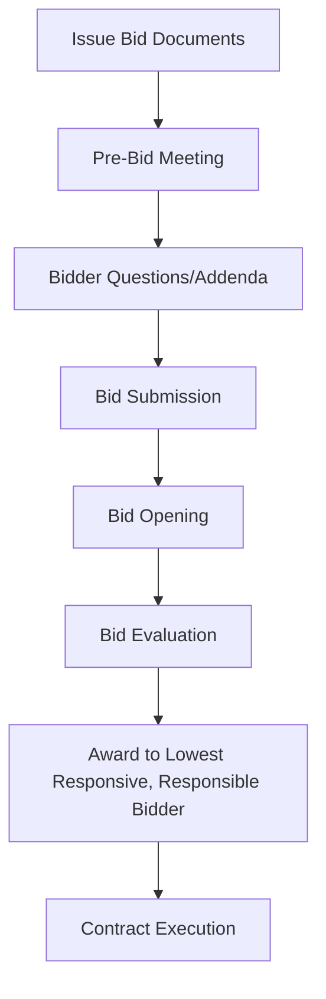
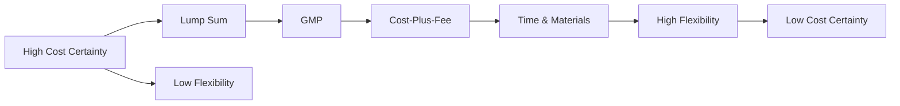

Procurement strategy and contract type selection determine pricing structure, risk allocation, and contractor selection methodology for HVAC construction. Effective procurement balances cost competition, quality assurance, schedule certainty, and risk management.

## Procurement Framework

HVAC procurement encompasses two critical decisions:

**Contractor selection method:**
- Competitive bidding (multiple contractors price complete design)
- Negotiated procurement (single contractor selected pre-pricing)
- Prequalification (limit bidders to qualified firms)

**Contract pricing structure:**
- Lump sum (fixed price for defined scope)
- Guaranteed Maximum Price (GMP with cost savings sharing)
- Cost-plus-fee (reimbursable costs plus fixed or percentage fee)
- Unit price (rates applied to measured quantities)
- Time and materials (hourly rates plus materials at cost)

## Competitive Bidding

The traditional procurement method where multiple contractors independently price complete contract documents.

### Competitive Bidding Process

**Bidding period:** Typically 3-4 weeks for mechanical construction

**Minimum bidders:** 3-5 bidders recommended for competitive pricing

### Advantages of Competitive Bidding

**Price competition:**
Studies show competitive bidding yields 5-12% cost savings compared to negotiated contracts on similar projects.

**Transparency:**
Public bidding process defensible to stakeholders and auditors

**Market validation:**
Multiple independent estimates confirm design reasonableness and budget accuracy

**Qualification verification:**
Prequalification ensures only capable contractors bid

### Disadvantages of Competitive Bidding

**Schedule constraints:**
Requires 100% complete design before pricing, extending project duration

**Limited collaboration:**
Contractor cannot provide constructability input during design

**Adversarial potential:**
Lowest bidder incentivized to maximize change orders and minimize quality

**Substitution pressure:**
Contractors propose cheaper alternatives during bid phase

### Optimal Applications

Competitive bidding appropriate when:
- Public sector procurement mandates competitive process
- Well-defined scope with standard HVAC systems
- Schedule permits complete design before construction
- Owner values price competition over early contractor collaboration
- Multiple qualified contractors available in market

## Negotiated Procurement

Single contractor selected before pricing, negotiates contract terms after selection.

### Selection Methodologies

**Qualifications-based selection (QBS):**
1. Evaluate contractor qualifications, experience, approach
2. Select best-qualified contractor
3. Negotiate scope and fee
4. Execute contract at fair and reasonable price

**Best value selection:**
1. Evaluate qualifications and preliminary pricing
2. Score proposals on:
   - Technical approach and qualifications (60-70%)
   - Price (30-40%)
3. Select highest-scoring proposer
4. Negotiate final terms

### Negotiation Process

**Scope definition:**
- Review design documents and clarify requirements
- Identify long-lead equipment and procurement strategy
- Establish performance criteria and quality standards
- Define owner-furnished vs. contractor-furnished items

**Pricing development:**
- Detailed cost breakdown: labor, materials, equipment, subcontracts
- Overhead and profit margins
- Escalation and contingency allowances
- Schedule of values for progress payments

**Terms negotiation:**
- Contract type (GMP, cost-plus, lump sum)
- Payment terms and retainage
- Schedule and liquidated damages
- Warranty provisions
- Change order procedures

### Advantages of Negotiated Procurement

**Early collaboration:**
Contractor provides constructability input during design (30-60% complete)

**Schedule acceleration:**
Fast-track construction overlaps design completion

**Innovation opportunity:**
Contractor proposes value engineering and alternative systems

**Relationship-based:**
Trust and collaboration versus adversarial bidding

### Disadvantages of Negotiated Procurement

**Limited price competition:**
Single-source pricing reduces competitive pressure (potential 8-15% cost premium)

**Complex negotiation:**
Requires sophisticated owner capable of evaluating fair pricing

**Risk of favoritism:**
Selection process must maintain transparency and fairness

**Scope creep potential:**
Negotiated contracts vulnerable to scope additions increasing cost

### Optimal Applications

Negotiated procurement suits:
- Fast-track schedules requiring early construction
- Complex HVAC systems benefiting from contractor input
- Design-build or CMAR delivery methods
- Private sector owners with procurement flexibility
- Markets with limited qualified contractors

## Prequalification

Screening process limiting bidders to qualified contractors before bid invitation.

### Prequalification Criteria

**Experience requirements:**
- Years in business (minimum 5-10 years typical)
- Similar project experience (type, size, complexity)
- Project references with performance verification
- Key personnel qualifications

**Financial capacity:**
- Bonding capacity adequate for project size
- Current backlog and available capacity
- Financial statements demonstrating stability
- Credit rating and banking references

**Technical capabilities:**
- In-house vs. subcontracted workforce
- Equipment and tooling inventory
- Safety record (EMR rate < 1.0 target)
- Quality control procedures

**Geographic presence:**
- Local office and service capability
- Travel distance from project site
- Regional market knowledge
- Warranty service availability

### Prequalification Process

**Step 1: Issue prequalification announcement**
- Project description and scope
- Owner and design team identification
- Prequalification criteria and submittal requirements
- Deadline for submissions

**Step 2: Evaluate submissions**
- Score each criterion quantitatively
- Interview top candidates if necessary
- Verify references and past performance
- Check licensing, bonding, insurance

**Step 3: Notify qualified bidders**
- Typically 5-7 contractors qualified
- Provide feedback to unsuccessful applicants
- Issue bid documents to qualified list

### Advantages of Prequalification

**Quality assurance:**
Eliminates unqualified bidders, reducing risk of contractor default or poor performance

**Reduced bid evaluation:**
All bidders meet minimum standards; award to lowest price among qualified

**Competitive balance:**
Sufficient competition (5-7 bidders) without excessive bid preparation waste (15+ bidders)

**Owner protection:**
Performance and payment bonds required only from qualified contractors

### Typical Requirements

Public sector threshold: Projects > $5M typically require prequalification

Prequalification validity: 1-2 years, requiring annual update

## Contract Types

### Lump Sum (Fixed Price)

Contractor agrees to complete defined scope for fixed price, regardless of actual costs.

**Contract structure:**

$$\text{Contract Price} = \text{Estimated Cost} + \text{Overhead} + \text{Profit} + \text{Contingency}$$

**Risk allocation:**
- Contractor assumes cost risk (material escalation, productivity, unforeseen conditions)
- Owner assumes scope risk (changes require change orders)

**Advantages:**
- Price certainty for owner at contract execution
- Contractor incentivized for efficiency (savings increase profit)
- Simple contract administration
- Competitive bidding drives lowest price

**Disadvantages:**
- Requires 100% complete design for accurate pricing
- Contractor includes contingency for unknowns (5-10% typical)
- Change orders expensive (contractor in strong negotiating position)
- Adversarial relationship potential (contractor maximizes changes, minimizes quality)

**Optimal applications:**
- Well-defined scope with complete design
- Standard HVAC systems with predictable costs
- Fixed budget requiring price certainty
- Competitive bidding environment

### Guaranteed Maximum Price (GMP)

Contractor guarantees not-to-exceed price while working on cost-reimbursable basis, often sharing savings.

**Contract structure:**

$$\text{GMP} = \text{Estimated Cost} + \text{Fee} + \text{Contingency}$$

**Cost categories:**
- **Reimbursable costs:** Labor, materials, equipment, subcontracts (actual costs)
- **General conditions:** Field supervision, temporary facilities, utilities
- **Fee:** Fixed amount or percentage for overhead and profit
- **Contingency:** Allowance for scope unknowns (5-15% depending on design completion)

**Savings sharing:**
If final cost < GMP, savings typically split:
- 50% owner / 50% contractor
- 60% owner / 40% contractor
- 75% owner / 25% contractor

Cost overruns above GMP absorbed by contractor (incentive for cost control)

**Advantages:**
- Price ceiling protects owner while allowing design completion
- Cost transparency (open-book accounting)
- Shared savings incentive for cost efficiency
- Earlier contractor engagement (GMP at 60-80% design)

**Disadvantages:**
- GMP negotiation complex, requires cost data verification
- Contractor may pad GMP absent competitive pressure
- Contingency often consumed regardless of need
- Owner monitoring required to prevent cost shifting

**Optimal applications:**
- Fast-track projects requiring early construction
- CMAR or design-build delivery
- Complex systems where complete design impractical before construction
- Sophisticated owner capable of cost monitoring

### Cost-Plus-Fee

Contractor reimbursed for all actual costs plus fee for overhead and profit.

**Fee structures:**

**Cost-plus-fixed-fee:**

$$\text{Contract Value} = \sum(\text{Actual Costs}) + \text{Fixed Fee}$$

Fee predetermined, independent of final cost (incentivizes efficiency)

**Cost-plus-percentage:**

$$\text{Contract Value} = \sum(\text{Actual Costs}) + (\text{Actual Costs} \times \text{Fee}\%)$$

Fee percentage of costs (disincentivizes efficiency—contractor profits from higher costs)

**Cost-plus-fee-with-GMP:**
Combines cost-plus flexibility with GMP protection (hybrid approach)

**Advantages:**
- Maximum flexibility for scope changes and fast-track construction
- No contingency padding (costs reimbursed as incurred)
- Contractor selection on qualifications, not price
- Transparent cost accounting

**Disadvantages:**
- No price certainty for owner (final cost unknown until completion)
- Percentage fee disincentivizes cost control
- Requires extensive owner oversight and cost auditing
- Difficult to establish fair fee percentage

**Optimal applications:**
- Emergency or fast-track projects where scope undefined
- Renovation work with extensive unknowns
- Owner with cost monitoring capability
- Trust-based relationship with qualified contractor

### Unit Price Contract

Contractor quotes rates per unit quantity; payment based on measured installation.

**Pricing structure:**

$$\text{Contract Value} = \sum(\text{Unit Price}_i \times \text{Quantity}_i)$$

**Example HVAC unit prices:**

| Item | Unit | Unit Price |
|------|------|------------|
| Galvanized ductwork | lb | $4.50/lb |
| Insulated copper pipe, 2" | LF | $28.00/LF |
| VAV terminal unit | EA | $850.00/EA |
| Chilled water pipe, 6" | LF | $95.00/LF |
| BAS control point | Point | $450.00/point |

**Measurement and payment:**
- Monthly measurement of installed quantities
- Payment application based on actual quantities × unit prices
- Final payment adjusted for as-built quantities

**Advantages:**
- Fair pricing for variable quantities (renovation, site utilities)
- Owner pays for actual installation, not estimates
- Contractor risk reduced for quantity uncertainty
- Simple change order pricing (use established unit prices)

**Disadvantages:**
- Contractor incentivized to maximize quantities installed
- Unit price verification complex (bundled labor and material)
- Measurement disputes potential
- Not suitable for fixed-scope new construction

**Optimal applications:**
- Renovation and retrofit projects with uncertain quantities
- Underground utilities and site piping
- Phased construction with variable scope
- Long-term service agreements (unit prices for anticipated work)

### Time and Materials (T&M)

Contractor paid for actual labor hours at agreed hourly rates plus materials at cost.

**Pricing structure:**

$$\text{Payment} = \sum(\text{Labor Hours} \times \text{Hourly Rate}) + \text{Materials Cost} + \text{Markup}$$

**Typical HVAC labor rates:**

| Craftsperson | Hourly Rate (includes burden) |
|-------------|------------------------------|
| Journeyman pipefitter | $85-$110/hr |
| Journeyman sheet metal worker | $80-$105/hr |
| HVAC technician | $75-$95/hr |
| Apprentice | $50-$70/hr |
| Foreman | $95-$120/hr |

Materials markup: 10-20% to cover procurement, handling, storage

**Advantages:**
- Maximum flexibility for undefined scope
- No cost estimating required before work authorization
- Simple contract execution for small projects
- Transparent cost accounting

**Disadvantages:**
- No cost certainty or budget control
- Contractor disincentivized from efficiency (profits from more hours)
- Potential for abuse without oversight
- Unsuitable for large, defined projects

**Optimal applications:**
- Small service and repair work
- Emergency response and troubleshooting
- Tenant improvement with minimal scope definition
- Short-duration specialty work

## Contract Selection Matrix

| Project Characteristic | Recommended Contract Type |
|----------------------|---------------------------|
| Complete design, fixed scope | Lump sum |
| 60-80% design, fast-track schedule | GMP |
| Complex renovation, unknown conditions | Cost-plus-fee with GMP |
| Variable quantities (site utilities) | Unit price |
| Small service work, undefined scope | Time and materials |
| Public sector, competitive bidding | Lump sum (competitive) |
| Private sector, early contractor input | GMP (negotiated) |
| High trust, sophisticated owner | Cost-plus-fixed-fee |

## Procurement Strategy Optimization

**Cost certainty vs. flexibility tradeoff:**

**Procurement recommendations:**

**Standard commercial office HVAC:** Competitive lump sum bidding for cost optimization

**Fast-track corporate headquarters:** Negotiated GMP with qualified contractor for schedule compression

**Complex healthcare facility:** CMAR with GMP after design development for quality and collaboration

**Renovation and retrofit:** Unit price or cost-plus-fee for scope uncertainty accommodation

**Emergency replacement:** Time and materials for immediate mobilization

Optimal procurement strategy aligns contract type and selection method with project goals, risk tolerance, schedule constraints, and market conditions, balancing cost competitiveness with quality assurance and flexibility.

---

*Subsections detail Bidding Methods, Contract Types, Prequalification Procedures, and Subcontractor Procurement Strategies for HVAC construction.*
