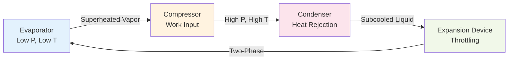
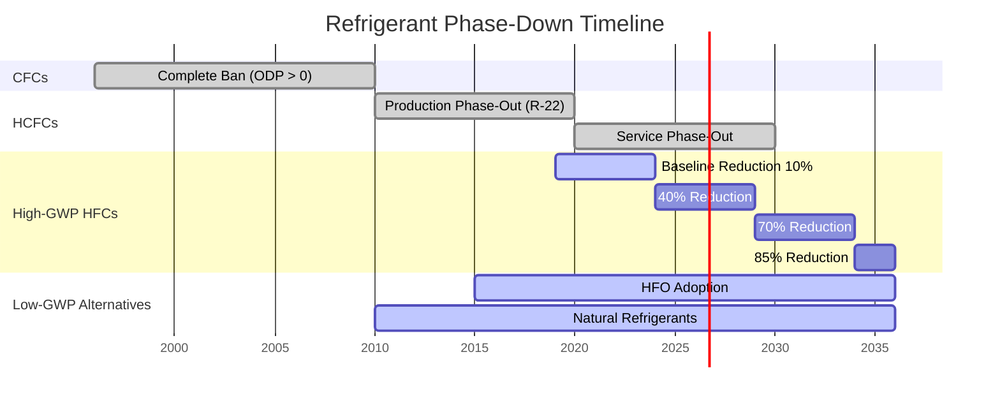

# Refrigeration Systems

Refrigeration systems transfer heat from low-temperature regions to high-temperature sinks through thermodynamic cycles, enabling food preservation, industrial processes, and environmental control. The fundamental principle involves phase-change heat transfer and mechanical work input to achieve temperatures below ambient conditions.

## Thermodynamic Foundation

### Reversed Carnot Cycle

The theoretical maximum coefficient of performance (COP) for refrigeration follows the reversed Carnot cycle operating between two thermal reservoirs:

$$
\text{COP}_{\text{Carnot}} = \frac{T_L}{T_H - T_L}
$$

Where $T_L$ is the absolute temperature of the refrigerated space and $T_H$ is the absolute temperature of heat rejection. This relationship reveals that refrigeration efficiency decreases as the temperature difference increases—requiring more work input for lower temperatures or higher ambient conditions.

### Vapor Compression Cycle

The practical vapor compression cycle dominates commercial and industrial refrigeration. The cycle consists of four primary processes:

The refrigeration effect (cooling capacity) is calculated as:

$$
q_{\text{ref}} = h_1 - h_4 = h_1 - h_3
$$

Where $h_1$ is the enthalpy at the evaporator outlet (superheated vapor) and $h_3$ is the enthalpy at the condenser outlet (subcooled liquid). The compressor work input is:

$$
w_{\text{comp}} = h_2 - h_1
$$

The actual COP for vapor compression systems:

$$
\text{COP}_{\text{actual}} = \frac{q_{\text{ref}}}{w_{\text{comp}}} = \frac{h_1 - h_4}{h_2 - h_1}
$$

Typical COP values range from 2.5 to 4.5 for commercial refrigeration and 3.5 to 6.0 for industrial ammonia systems, representing 40-60% of Carnot efficiency.

## Refrigeration Cycle Comparison

| Cycle Type | Typical COP | Temperature Range | Primary Applications | Energy Input |
|------------|-------------|-------------------|----------------------|--------------|
| Vapor Compression | 2.5 - 6.0 | -60°C to +15°C | Commercial, industrial, residential | Electrical/mechanical |
| Absorption (Single-Effect) | 0.6 - 0.8 | -5°C to +10°C | Waste heat recovery, gas-fired | Thermal |
| Absorption (Double-Effect) | 1.0 - 1.4 | 0°C to +15°C | High-grade heat sources | Thermal (140-180°C) |
| Adsorption | 0.3 - 0.6 | 5°C to +15°C | Solar cooling, low-grade heat | Thermal (60-90°C) |
| Thermoelectric (Peltier) | 0.3 - 1.0 | -20°C to +15°C | Small-scale, electronics | Electrical (DC) |
| Magnetic | 2.0 - 5.0 | -5°C to +15°C | Emerging technology | Electrical |

## Refrigerant Selection Criteria

Refrigerant properties fundamentally determine system performance, safety, and environmental impact. Key thermophysical properties include:

### Critical Thermodynamic Properties

**Saturation Pressure**: Refrigerants must maintain reasonable operating pressures. Low-side pressures above atmospheric prevent air infiltration, while high-side pressures below material limits ensure safety. For a 5°C evaporator and 40°C condenser:

| Refrigerant | Evaporator Pressure | Condenser Pressure | Pressure Ratio | Application |
|-------------|---------------------|--------------------| ---------------|-------------|
| R-134a | 349 kPa | 1017 kPa | 2.91 | Medium temp, automotive |
| R-404A | 375 kPa | 1544 kPa | 4.12 | Low temp, commercial |
| R-410A | 877 kPa | 2547 kPa | 2.90 | Air conditioning |
| R-717 (NH₃) | 509 kPa | 1554 kPa | 3.05 | Industrial, high efficiency |
| R-744 (CO₂) | 3980 kPa | Transcritical | N/A | Cascade, natural refrigerant |

**Latent Heat**: Higher latent heat of vaporization reduces required mass flow rate for a given cooling capacity, allowing smaller compressor displacement and piping.

$$
\dot{m}_{\text{ref}} = \frac{\dot{Q}_{\text{ref}}}{h_{\text{fg}}}
$$

### Environmental Regulations

Global refrigerant regulations follow a phase-down schedule based on Global Warming Potential (GWP):

ASHRAE Standard 34 classifies refrigerants by safety group (A1, A2L, A2, A3, B1, B2L, B2, B3) based on toxicity and flammability. Higher safety classifications require additional safety measures including refrigerant detection, mechanical ventilation, and reduced charge limits per ASHRAE Standard 15.

## System Components

### Compressor Performance

Compressor selection depends on volumetric efficiency $\eta_v$, isentropic efficiency $\eta_s$, and capacity modulation requirements. The actual mass flow rate:

$$
\dot{m}_{\text{actual}} = \eta_v \cdot \frac{\dot{V}_{\text{displacement}} \cdot \rho_1}{60}
$$

Where $\dot{V}_{\text{displacement}}$ is compressor displacement in m³/min and $\rho_1$ is suction vapor density. Volumetric efficiency decreases with increasing pressure ratio:

$$
\eta_v = 1 + C - C \left(\frac{P_2}{P_1}\right)^{1/n}
$$

Where $C$ is clearance volume fraction and $n$ is the polytropic exponent (typically 1.1-1.2 for refrigerants).

**Compressor Type Selection**:

| Compressor Type | Capacity Range | Efficiency | Modulation | Applications |
|-----------------|----------------|------------|------------|--------------|
| Reciprocating | 0.5 - 150 kW | 65-75% | Cylinder unloading, VFD | Small to medium commercial |
| Scroll | 1.5 - 70 kW | 70-80% | Digital, VFD | Residential, light commercial |
| Screw | 50 - 2000 kW | 70-85% | Slide valve, VFD | Industrial, process cooling |
| Centrifugal | 350 - 35,000 kW | 75-90% | Inlet guide vanes, VFD | Large chillers, industrial |

### Heat Exchanger Design

**Evaporator Effectiveness**: The evaporator must provide sufficient heat transfer area to achieve the required temperature difference between refrigerant and air/liquid:

$$
\dot{Q}_{\text{evap}} = UA \cdot \text{LMTD}
$$

Where $U$ is the overall heat transfer coefficient and LMTD is log mean temperature difference. For flooded evaporators with high refrigerant-side coefficients, air-side resistance dominates:

$$
\frac{1}{UA} \approx \frac{1}{h_{\text{air}} A_{\text{air}}}
$$

Finned-tube coils increase air-side area by factors of 10-20, with fin efficiency $\eta_f$ accounting for temperature drop along fins:

$$
\eta_f = \frac{\tanh(mL)}{mL} \quad \text{where} \quad m = \sqrt{\frac{hP}{kA_c}}
$$

**Condenser Heat Rejection**: Total condenser load includes compressor heat of compression:

$$
\dot{Q}_{\text{cond}} = \dot{Q}_{\text{ref}} + \dot{W}_{\text{comp}}
$$

Condenser selection depends on ambient conditions and water availability:

- **Air-cooled**: 10-15°C approach to ambient dry-bulb, no water consumption
- **Water-cooled**: 3-5°C approach to entering water, requires cooling tower or water source
- **Evaporative**: 5-8°C approach to ambient wet-bulb, 95% water savings vs. water-cooled

### Expansion Device Characteristics

Expansion devices reduce refrigerant pressure from condenser to evaporator pressure through throttling or controlled flow:

**Thermostatic Expansion Valve (TXV)**: Modulates refrigerant flow to maintain constant superheat (typically 4-7°C) at evaporator outlet. The valve opening force balance:

$$
F_{\text{bulb}} = F_{\text{spring}} + F_{\text{evaporator}}
$$

**Electronic Expansion Valve (EEV)**: Stepper motor or pulse-width modulation provides precise superheat control (±0.5°C) and faster response than TXV, improving system efficiency by 5-15%.

**Capillary Tube**: Fixed restriction creates pressure drop proportional to mass flow rate squared. Critical flow occurs when:

$$
\dot{m} = C_d A \sqrt{2 \rho_1 (P_1 - P_2)}
$$

Capillary tubes are charge-critical and require precise refrigerant charge for proper operation.

## Applications and Load Calculations

### Refrigeration Load Components

Total refrigeration load consists of multiple heat sources:

$$
\dot{Q}_{\text{total}} = \dot{Q}_{\text{product}} + \dot{Q}_{\text{transmission}} + \dot{Q}_{\text{infiltration}} + \dot{Q}_{\text{internal}} + \dot{Q}_{\text{respiration}}
$$

**Product Load**: Cooling from initial temperature $T_i$ to storage temperature $T_f$:

$$
\dot{Q}_{\text{product}} = \frac{m \cdot c_p \cdot (T_i - T_f)}{t_{\text{cooldown}}}
$$

For products crossing freezing point, add latent heat of fusion:

$$
Q_{\text{freeze}} = m \cdot w \cdot h_{\text{fg,water}}
$$

Where $w$ is water content fraction and $h_{\text{fg,water}}$ = 334 kJ/kg.

**Transmission Load**: Heat gain through insulated envelope follows Fourier's law:

$$
\dot{Q}_{\text{transmission}} = \frac{kA(T_{\text{ambient}} - T_{\text{storage}})}{L}
$$

ASHRAE Standard 90.1 specifies minimum insulation R-values for refrigerated spaces based on design temperature difference.

**Infiltration Load**: Air exchange through door openings introduces both sensible and latent heat. The sensible component:

$$
\dot{Q}_{\text{sens}} = \dot{V} \cdot \rho \cdot c_p \cdot (T_{\text{ambient}} - T_{\text{storage}})
$$

Latent heat from moisture condensation and frost formation often exceeds sensible heat in low-temperature applications.

**Respiration Load**: Living produce generates metabolic heat. Respiration rates vary exponentially with temperature following the Q₁₀ rule—doubling approximately every 10°C increase. High-respiration commodities like broccoli or strawberries can generate 50-150 W/tonne at 0°C.

### Temperature Classification

| Application Category | Temperature Range | Typical COP | Common Refrigerants |
|---------------------|-------------------|-------------|---------------------|
| High-Temperature | +2°C to +15°C | 3.5 - 5.0 | R-134a, R-513A, R-1234ze |
| Medium-Temperature | -5°C to +5°C | 2.5 - 4.0 | R-404A, R-448A, R-449A, R-407A |
| Low-Temperature | -25°C to -15°C | 1.8 - 2.8 | R-404A, R-507A, R-448A |
| Ultra-Low Temperature | -60°C to -30°C | 1.0 - 2.0 | Cascade R-508B/R-404A, CO₂/NH₃ |
| Cryogenic | < -60°C | 0.5 - 1.5 | Cascade, LN₂, mechanical |

## Energy Efficiency Strategies

**Multi-Stage Compression**: For large temperature lifts (> 50°C), two-stage compression with intercooling reduces compressor work:

$$
\text{COP}_{\text{2-stage}} = \frac{q_{\text{ref}}}{w_{\text{comp,1}} + w_{\text{comp,2}}}
$$

Optimal intermediate pressure for minimum work:

$$
P_{\text{intermediate}} = \sqrt{P_{\text{evap}} \cdot P_{\text{cond}}}
$$

**Subcooling**: Liquid subcooling below saturation temperature increases refrigeration effect without additional compressor work, improving COP by 1-3% per °C subcooling:

$$
\Delta \text{COP} \approx \frac{\Delta h_{\text{subcool}}}{h_1 - h_4} \times 100\%
$$

**Floating Head Pressure**: Reducing condensing temperature during cool ambient conditions decreases compression ratio and power consumption. Each 1°C reduction in condensing temperature saves approximately 2-3% compressor energy.

**Heat Recovery**: Extracting heat from high-pressure gas (desuperheating) or condenser provides useful heating at minimal additional cost, with heat recovery efficiency:

$$
\eta_{\text{HR}} = \frac{\dot{Q}_{\text{recovered}}}{\dot{Q}_{\text{rejection}}} \times 100\%
$$

## Standards and Safety

**ASHRAE Standard 15**: Safety Standard for Refrigeration Systems establishes machinery room requirements, refrigerant detector placement, emergency ventilation, and pressure relief sizing. Refrigerant charge limits vary by safety classification and occupancy type.

**ASHRAE Standard 34**: Designation and Safety Classification of Refrigerants provides nomenclature, purity specifications, and safety group assignments based on toxicity (A/B) and flammability (1/2L/2/3).

**IIAR Standards**: Industrial refrigeration standards for ammonia systems cover design (IIAR 2), startup and commissioning (IIAR 6), and maintenance (IIAR 9). Ammonia's B2L classification requires specialized training and safety protocols.

**Pressure Relief Sizing**: Per ASME Section VIII, relief valve capacity must handle fire exposure or blocked discharge scenarios:

$$
\dot{m}_{\text{relief}} = C \cdot K_d \cdot P_1 \cdot \sqrt{\frac{M}{Z \cdot T_1}}
$$

Where $C$ is discharge coefficient, $K_d$ is capacity correction factor, and $M$ is molecular weight.

## Browse Topics

Explore detailed subtopics within refrigeration systems:

- **[Refrigeration Cycles](./refrigeration-cycles/)** - Vapor compression, absorption, alternative cycles
- **[Refrigerants](./refrigerants/)** - Properties, selection, regulations, environmental impact
- **[Components](./components-detailed/)** - Compressors, heat exchangers, expansion devices, accessories
- **[Commercial Refrigeration](./applications/commercial-refrigeration/)** - Supermarkets, restaurants, ice machines
- **[Industrial Refrigeration](./applications/industrial-refrigeration/)** - Ammonia systems, large capacity, process cooling
- **[Food Processing](./food-processing/)** - Meat, poultry, produce, dairy, beverage refrigeration
- **[Cold Storage](./commodity-storage-requirements/)** - Warehouses, controlled atmosphere, commodity storage
- **[Transport Refrigeration](./applications/transport-refrigeration/)** - Trucks, rail, containers, marine

## Reference Standards

- **ASHRAE Handbook—Refrigeration** - Comprehensive refrigeration reference (SI and I-P editions)
- **ASHRAE Standard 15** - Safety Standard for Refrigeration Systems
- **ASHRAE Standard 34** - Designation and Safety Classification of Refrigerants
- **IIAR Standards** - Ammonia refrigeration design and safety (IIAR 2, 6, 9)
- **AHRI Standards 540/550/570** - Equipment ratings and performance testing
- **ISO 817** - International refrigerant designation and safety classification

---

*Refrigeration systems enable modern food preservation, industrial processes, and environmental control through precise application of thermodynamic principles and engineered heat transfer.*
