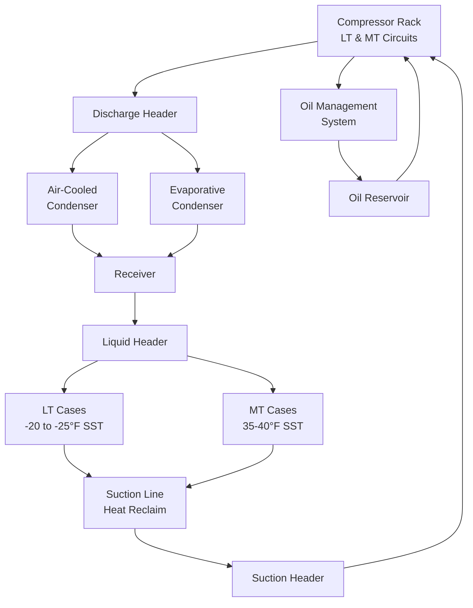

# Commercial Refrigeration Systems

Commercial refrigeration encompasses systems designed for food preservation, display, and storage in retail, foodservice, and distribution facilities. These systems operate continuously under varying load conditions while maintaining precise temperature control across low-temperature (LT), medium-temperature (MT), and high-temperature (HT) applications.

## Fundamental Refrigeration Cycle

Commercial refrigeration systems utilize the vapor-compression cycle, transferring heat from refrigerated spaces to ambient conditions through phase-change thermodynamics.

### Thermodynamic Analysis

The coefficient of performance (COP) quantifies refrigeration efficiency:

$$
\text{COP}_{\text{ref}} = \frac{Q_{\text{evap}}}{W_{\text{comp}}} = \frac{h_1 - h_4}{h_2 - h_1}
$$

Where:
- $Q_{\text{evap}}$ = refrigeration capacity (Btu/hr or kW)
- $W_{\text{comp}}$ = compressor power input (Btu/hr or kW)
- $h_1$ = enthalpy at compressor suction (Btu/lb or kJ/kg)
- $h_2$ = enthalpy at compressor discharge (Btu/lb or kJ/kg)
- $h_4$ = enthalpy at evaporator inlet (Btu/lb or kJ/kg)

Heat rejection at the condenser equals refrigeration effect plus compressor work:

$$
Q_{\text{cond}} = Q_{\text{evap}} + W_{\text{comp}} = \dot{m} (h_2 - h_3)
$$

## System Architectures

Commercial refrigeration employs distinct configurations based on capacity, application, and installation requirements.

### System Comparison

| System Type | Capacity Range | Refrigerant Charge | Energy Efficiency | Application |
|-------------|----------------|-------------------|-------------------|-------------|
| Self-contained | 200-5,000 Btu/hr | 1-8 lb | Moderate | Small retail, reach-ins |
| Remote condensing | 2,000-20,000 Btu/hr | 5-25 lb | Good | Walk-ins, medium facilities |
| Multiplex rack | 50,000-500,000 Btu/hr | 500-3,000 lb | Excellent (with controls) | Supermarkets, warehouses |
| Distributed DX | 10,000-100,000 Btu/hr | 50-200 lb | Very Good | Convenience stores |
| Secondary loop | 20,000-200,000 Btu/hr | 20-100 lb (primary) | Good | Facilities with charge restrictions |

### Multiplex Rack Systems

Centralized rack systems serve multiple evaporators across temperature zones, providing operational flexibility and efficiency optimization.

## Temperature Classifications

Commercial refrigeration operates across distinct saturation suction temperature (SST) ranges:

**Low-Temperature (LT):** -25°F to -15°F SST
- Frozen food storage and display
- Ice cream cabinets
- Blast freezers

**Medium-Temperature (MT):** 20°F to 35°F SST
- Fresh meat and dairy cases
- Produce coolers
- Walk-in coolers

**High-Temperature (HT):** 40°F to 50°F SST
- Air conditioning applications
- Beverage merchandisers
- Floral coolers

## Heat Rejection Methods

Condenser selection significantly impacts system performance and operating cost. ASHRAE Standard 15 governs refrigerant safety, while local codes may restrict water usage.

### Condenser Performance

Air-cooled condensers dominate commercial installations due to simplicity and maintenance advantages. Condensing temperature directly affects compressor power:

$$
\text{Power Ratio} = \frac{W_{\text{high}}}{W_{\text{low}}} \approx \left(\frac{P_{\text{cond,high}}}{P_{\text{cond,low}}}\right)^{0.28}
$$

For R-404A systems, reducing condensing temperature from 105°F to 95°F decreases compressor power by approximately 8-10%.

Evaporative condensers achieve lower condensing temperatures (15-20°F above wet-bulb vs 15-25°F above dry-bulb for air-cooled), improving COP by 15-25% in most climates. Water consumption ranges from 3-5 gallons per ton-hour depending on ambient conditions.

## Defrost Strategies

Frost accumulation on evaporator coils degrades heat transfer and airflow. Defrost method selection depends on operating temperature and application requirements.

### Defrost Method Selection

| Method | SST Range | Duration | Energy Penalty | Applications |
|--------|-----------|----------|----------------|--------------|
| Off-cycle | >32°F | 20-40 min | Minimal | MT cases, ambient infiltration |
| Electric | -40°F to 35°F | 15-45 min | 1.5-2.5 kW per circuit | LT/MT universal application |
| Hot gas | -40°F to 35°F | 20-60 min | Moderate | Rack systems, coordinated control |
| Water | 20°F to 35°F | 5-15 min | Low | Meat processing, high humidity |

Electric defrost energy consumption:

$$
E_{\text{defrost}} = P_{\text{heater}} \times t_{\text{defrost}} \times n_{\text{cycles/day}}
$$

Hot gas defrost reduces electrical load but requires careful control to prevent liquid floodback and ensure complete frost removal.

## Load Calculations

Refrigeration load comprises heat transfer through multiple mechanisms:

$$
Q_{\text{total}} = Q_{\text{transmission}} + Q_{\text{product}} + Q_{\text{infiltration}} + Q_{\text{internal}} + Q_{\text{defrost}}
$$

**Transmission Load:** Conduction through insulated boundaries using $Q = U \times A \times \Delta T$

**Product Load:** Sensible and latent heat removal from warm product entering refrigerated space

**Infiltration Load:** Humid air entering through door openings, calculated using psychrometric properties and exchange rates

**Internal Load:** Lighting, occupants, motors, and auxiliary equipment

**Defrost Load:** Heat added during defrost cycles that must be removed during refrigeration

ASHRAE Handbook—Refrigeration provides detailed calculation procedures for each component.

## Control Strategies

Advanced controls optimize energy consumption while maintaining product temperature integrity:

**Floating Head Pressure Control:** Reduces condensing temperature during cool ambient conditions, saving compressor energy while maintaining minimum pressure for liquid feed

**Suction Pressure Optimization:** Raises evaporator temperature within product safety limits, reducing lift and improving COP

**Variable Speed Drives (VFD):** Applied to compressors, condenser fans, and evaporator fans to match capacity with load

**Electronic Expansion Valves (EEV):** Provide precise superheat control across varying conditions, improving evaporator utilization

Modern rack systems achieve 15-30% energy savings through integrated control strategies compared to conventional constant-speed, fixed-setpoint operation.

## Refrigerant Considerations

Refrigerant selection balances thermodynamic performance, environmental impact, safety, and regulatory compliance. ASHRAE Standard 34 classifies refrigerants by flammability and toxicity.

**R-404A/R-507A:** Traditional low-temperature refrigerants (GWP ~3,900) facing regulatory phase-down

**R-448A/R-449A:** Lower-GWP replacements (GWP ~1,400) with similar performance characteristics

**R-744 (CO₂):** Natural refrigerant (GWP = 1) requiring transcritical or cascade systems for warm climates

**Hydrocarbons (R-290):** Excellent thermodynamic properties but flammability requires charge limitations per ASHRAE Standard 15

System conversions require compatibility analysis including lubricant selection, material compatibility, and pressure vessel ratings.

## Energy Efficiency Metrics

Commercial refrigeration efficiency assessment uses standardized metrics:

**Energy Efficiency Ratio (EER):** Steady-state efficiency at specified conditions

$$
\text{EER} = \frac{Q_{\text{evap}} \, (\text{Btu/hr})}{W_{\text{total}} \, (\text{W})}
$$

**Annual Walk-in Energy Factor (AWEF):** Integrated performance metric for walk-in coolers and freezers per DOE regulations

**Daily Energy Consumption (DEC):** Total energy per day for display cases, used in regulatory standards

High-efficiency systems employ optimized heat exchangers, variable-speed components, advanced defrost controls, and intelligent capacity modulation to minimize energy consumption across operating conditions.

