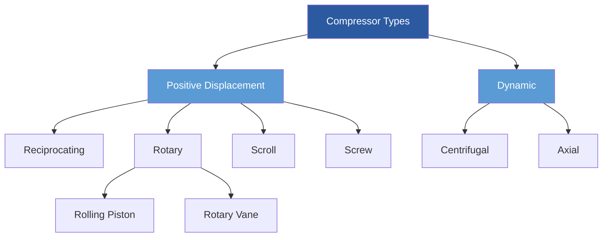

# Compressors in Refrigeration Systems

Compressors serve as the mechanical heart of vapor compression refrigeration systems, performing the critical function of elevating refrigerant pressure and temperature to enable heat rejection at the condenser. The compressor consumes the majority of system energy, typically 60-80% of total power input, making compressor selection and operation fundamental to system efficiency and performance.

## Fundamental Thermodynamic Process

The compression process transforms low-pressure, low-temperature refrigerant vapor from the evaporator into high-pressure, high-temperature vapor suitable for condensation. In an ideal isentropic compression, entropy remains constant (Δs = 0), but real compressors experience irreversibilities from friction, heat transfer, and pressure losses.

The ideal compression work per unit mass is:

$$W_{ideal} = h_2s - h_1 = c_p(T_2s - T_1)$$

Where $h_1$ is the suction enthalpy, $h_2s$ is the discharge enthalpy for isentropic compression, and $T_2s$ is the isentropic discharge temperature.

Actual compression work exceeds the ideal value due to irreversibilities:

$$W_{actual} = h_2 - h_1 = \frac{h_2s - h_1}{\eta_{isen}}$$

Where $\eta_{isen}$ is the isentropic efficiency, typically ranging from 0.65 to 0.85 depending on compressor type and operating conditions.

## Compressor Types and Operating Principles

### Reciprocating Compressors

Reciprocating compressors use piston-cylinder arrangements to compress refrigerant through mechanical displacement. The compression process follows a four-stroke cycle analogous to internal combustion engines: suction, compression, discharge, and re-expansion.

Volumetric efficiency accounts for the re-expansion of refrigerant remaining in clearance volume:

$$\eta_v = 1 + C - C\left(\frac{P_d}{P_s}\right)^{1/n}$$

Where $C$ is the clearance volume ratio (typically 0.02-0.05), $P_d$ is discharge pressure, $P_s$ is suction pressure, and $n$ is the polytropic exponent (1.1-1.3 for refrigerants).

**Key characteristics:**
- Capacity range: 0.5 to 200+ tons
- Pressure ratio capability: up to 10:1 single stage
- Part-load efficiency: Good with cylinder unloading
- Typical isentropic efficiency: 0.65-0.75

### Scroll Compressors

Scroll compressors employ two involute spiral elements—one fixed, one orbiting—to compress refrigerant through progressively smaller pockets moving from the outer edge toward the center discharge port. This continuous compression process produces smooth, pulsation-free operation.

The compression ratio is geometrically fixed by the scroll geometry:

$$r_v = \frac{V_{outer}}{V_{inner}} = \frac{2\pi(r_o^2 - r_i^2)h}{2\pi r_i^2 h} = \frac{r_o^2 - r_i^2}{r_i^2}$$

Where $r_o$ is the outer radius, $r_i$ is the inner discharge radius, and $h$ is scroll height.

**Key characteristics:**
- Capacity range: 1.5 to 50 tons
- Fewer moving parts than reciprocating
- Typical isentropic efficiency: 0.70-0.80
- Limited capacity modulation without additional mechanisms
- Lower noise and vibration

### Screw Compressors

Screw compressors use intermeshing helical rotors (male and female) to compress refrigerant as it travels axially through progressively decreasing volume between the rotors and housing. The built-in volume ratio is geometrically determined by the helix angle and port locations.

The built-in volume ratio must match the pressure ratio for efficient operation:

$$r_{v,built-in} = \left(\frac{P_d}{P_s}\right)^{1/\gamma}$$

Mismatch results in under-compression (requiring additional compression in discharge) or over-compression (throttling losses at discharge).

**Key characteristics:**
- Capacity range: 20 to 1000+ tons
- Continuous compression process
- Excellent part-load efficiency with slide valve modulation
- Typical isentropic efficiency: 0.75-0.85
- Oil injection required for sealing and cooling

### Centrifugal Compressors

Centrifugal compressors impart kinetic energy to refrigerant vapor through high-speed impeller rotation (10,000-30,000 RPM), then convert velocity to pressure in a diffuser. The Euler turbomachine equation governs the energy transfer:

$$h_2 - h_1 = \frac{U_2V_{t2} - U_1V_{t1}}{g_c}$$

Where $U$ is the impeller tip speed, $V_t$ is the tangential velocity component, and subscripts 1 and 2 denote inlet and outlet conditions.

**Key characteristics:**
- Capacity range: 100 to 10,000+ tons
- Pressure ratio per stage: 1.5-4.0:1
- Multiple stages required for high lifts
- Typical isentropic efficiency: 0.75-0.85
- Surge limits minimum operating capacity
- Oil-free compression available

## Compressor Performance Comparison

| Compressor Type | Capacity Range (Tons) | Efficiency (Isentropic) | Part-Load Performance | Maintenance | Noise Level |
|-----------------|----------------------|------------------------|----------------------|-------------|-------------|
| Reciprocating   | 0.5 - 200           | 0.65 - 0.75           | Good                 | High        | High        |
| Scroll          | 1.5 - 50            | 0.70 - 0.80           | Limited              | Low         | Low         |
| Screw           | 20 - 1000+          | 0.75 - 0.85           | Excellent            | Moderate    | Moderate    |
| Centrifugal     | 100 - 10,000+       | 0.75 - 0.85           | Good (VFD)           | Low         | Low         |

## Performance Factors and Selection Criteria

### Operating Envelope

Each compressor type has a defined operating envelope bounded by:
- **Maximum discharge temperature**: Typically 250-300°F to prevent oil breakdown and valve damage
- **Maximum pressure ratio**: Limited by mechanical stress and motor capacity
- **Minimum suction pressure**: Prevents motor overheating in hermetic units
- **Surge limit**: Centrifugal compressors only

### Capacity Modulation Methods

Capacity modulation efficiency directly impacts part-load performance:

**Reciprocating:**
- Cylinder unloading: Steps of 25%, 50%, 75%, 100%
- Hot gas bypass: Continuous but inefficient
- Variable speed (VFD): Continuous and efficient

**Scroll:**
- Digital scroll: On-off cycling with time averaging
- Variable speed (VFD): Continuous modulation
- Two-stage compression: Enhanced capacity range

**Screw:**
- Slide valve: Continuous from 10-100%, highly efficient
- Variable speed (VFD): Further efficiency improvement

**Centrifugal:**
- Inlet guide vanes: Pre-swirl reduces capacity 40-100%
- Variable speed (VFD): Most efficient, 10-100%
- Hot gas bypass: Emergency only, highly inefficient

### Motor and Drive Configurations

Compressor motor types affect reliability, efficiency, and serviceability:

**Open drive:** Separate motor connected via shaft coupling. Allows motor service without refrigerant recovery. Used in large industrial applications.

**Hermetic:** Motor and compressor sealed in welded housing. Refrigerant cooling of motor windings. Common in residential/light commercial. Not field-serviceable.

**Semi-hermetic:** Bolted housing allows motor access. Combines hermetic benefits with serviceability. Industrial and commercial applications.

## Efficiency Metrics and Standards

### Isentropic Efficiency

Isentropic efficiency compares actual work to ideal isentropic work:

$$\eta_{isen} = \frac{h_{2s} - h_1}{h_2 - h_1} = \frac{W_{ideal}}{W_{actual}}$$

ASHRAE Standard 23 establishes testing procedures for rating compressor efficiency under standardized conditions. Published rating points typically include AHRI Standard 540 conditions (35°F evaporating, 105°F condensing for air conditioning).

### Volumetric Efficiency

Volumetric efficiency relates actual refrigerant mass flow to displacement:

$$\eta_v = \frac{\dot{m}_{actual} \cdot v_1}{V_{displacement}}$$

Where $v_1$ is specific volume at suction, and $V_{displacement}$ is the swept volume per unit time.

Factors reducing volumetric efficiency include:
- Clearance volume re-expansion (reciprocating)
- Suction valve pressure drop
- Refrigerant heating in cylinder/rotor
- Internal leakage (worn components)

### Compression Efficiency

Overall compression efficiency combines mechanical and thermodynamic losses:

$$\eta_{compression} = \eta_{isen} \cdot \eta_{mechanical}$$

Mechanical efficiency accounts for friction losses in bearings, seals, and drive components. Typical values range from 0.85-0.95.

## Application Considerations

### Refrigerant Compatibility

Compressor design must accommodate refrigerant properties:
- **Pressure ratio**: High-lift applications (R-410A) require robust construction
- **Discharge temperature**: R-410A produces higher discharge temperatures than R-134a
- **Lubricity**: R-134a and HFOs require polyolester (POE) lubricants
- **Density**: Low-density refrigerants (R-123) require larger displacement

### System Integration

Proper compressor application requires attention to:
- **Suction superheat**: 10-20°F prevents liquid slugging
- **Oil return**: Minimum refrigerant velocity (700-1000 FPM vertical risers)
- **Vibration isolation**: Critical for reciprocating compressors
- **Crankcase heaters**: Prevent refrigerant migration during off-cycle
- **Capacity matching**: Evaporator and condenser must balance compressor capacity

### Sound and Vibration

Compressor noise stems from:
- Gas pulsations: Reciprocating and screw (requires mufflers)
- Mechanical vibration: Unbalanced forces
- Motor cooling fans: Airborne noise

ASHRAE Standard 15 establishes safety requirements including pressure relief and motor protection. Local codes may impose sound limits (typically 65-75 dBA at property line).

## Reliability and Maintenance

Common failure modes include:
- **Bearing failure**: Inadequate lubrication or contamination
- **Motor burnout**: Overload, single-phasing, or overheating
- **Valve failure**: Reciprocating compressors, liquid slugging damage
- **Seal failure**: Open drive compressors, refrigerant leakage
- **Oil contamination**: Moisture, acid, or particulate

Preventive maintenance extends compressor life:
- Regular oil analysis (acid number, moisture, metal content)
- Vibration monitoring (bearing condition)
- Suction and discharge pressure/temperature trending
- Electrical monitoring (voltage, current, power factor)
- Refrigerant charge verification

ASHRAE Guideline 3 establishes recommended practices for compressor monitoring and maintenance scheduling based on operating hours and conditions.

## Advanced Technologies

Modern compressor developments focus on efficiency and environmental performance:
- **Variable speed drives**: Improve part-load efficiency 15-30%
- **Two-stage compression**: Reduce discharge temperature, improve efficiency in high-lift applications
- **Magnetic bearings**: Eliminate oil lubrication in centrifugal compressors
- **Advanced materials**: Reduce weight and improve durability
- **Integrated electronics**: Condition monitoring and predictive maintenance

The compressor remains the most critical component in refrigeration system performance, efficiency, and reliability. Proper selection requires comprehensive analysis of capacity requirements, operating conditions, efficiency objectives, and lifecycle costs.

