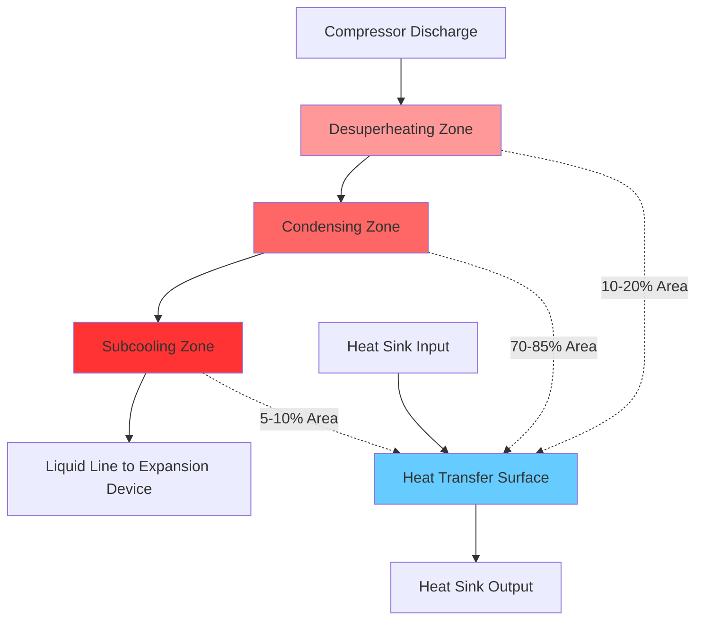

## Condenser Fundamentals

Condensers perform the critical function of rejecting heat absorbed in the evaporator plus the energy added by the compressor. This heat rejection occurs through the phase change of refrigerant vapor to liquid at elevated pressure and temperature. The condenser heat rejection rate determines overall system capacity and efficiency.

The total heat rejection in the condenser follows from energy balance:

$$Q_c = Q_e + W_{comp} = \dot{m}_r (h_2 - h_3)$$

where $Q_c$ is condenser heat rejection, $Q_e$ is evaporator capacity, $W_{comp}$ is compressor power input, $\dot{m}_r$ is refrigerant mass flow rate, and $h_2$, $h_3$ represent refrigerant enthalpies at condenser inlet and outlet respectively.

For typical vapor compression cycles, the condenser rejects 1.2 to 1.4 times the evaporator capacity, with the ratio increasing at higher compression ratios.

## Heat Transfer Process

The condensation process involves three distinct zones within the condenser:

### Desuperheating Zone

Superheated vapor entering from the compressor cools sensibly to saturation temperature. This zone typically accounts for 10-20% of total heat transfer area. The heat transfer coefficient remains relatively low due to single-phase vapor flow.

### Condensing Zone

The primary heat transfer occurs during phase change at constant saturation temperature. Film condensation on tube surfaces provides high heat transfer coefficients, typically 1000-3000 W/m²·K for horizontal tubes. This zone comprises 70-85% of total condenser area.

### Subcooling Zone

Liquid refrigerant cools below saturation temperature, providing margin against flash gas formation in the liquid line. Subcooling of 5-10°C is standard practice. This zone accounts for 5-10% of condenser area.

The overall heat transfer follows:

$$Q_c = UA \cdot LMTD$$

where $U$ is overall heat transfer coefficient (W/m²·K), $A$ is heat transfer surface area (m²), and $LMTD$ is log mean temperature difference (K):

$$LMTD = \frac{(T_{c,in} - T_{ambient,out}) - (T_{c,out} - T_{ambient,in})}{\ln\left(\frac{T_{c,in} - T_{ambient,out}}{T_{c,out} - T_{ambient,in}}\right)}$$

## Condenser Types

### Air-Cooled Condensers

Air-cooled condensers use ambient air as the heat sink, with finned tubes to enhance airside heat transfer. These condensers dominate residential and light commercial applications due to low installation cost and minimal maintenance requirements.

**Design characteristics:**
- Face velocities: 2.0-3.5 m/s through coil
- Fin spacing: 12-20 fins per inch
- Tube materials: copper tubes with aluminum fins
- Air temperature rise: 8-15°C
- Condensing temperature: ambient + 10-20°C

The airside heat transfer coefficient (15-30 W/m²·K) limits overall performance. Extended fin surfaces provide area ratios of 10:1 to 20:1 (fin area to tube area).

### Water-Cooled Condensers

Water-cooled condensers achieve superior heat transfer due to water's high thermal capacity and heat transfer coefficients. Shell-and-tube designs predominate in larger installations.

**Shell-and-tube configurations:**
- Horizontal shell with refrigerant condensing on tube exteriors
- Water velocities: 1.0-2.5 m/s through tubes
- Tube materials: copper, admiralty brass, cupro-nickel, or titanium
- Water temperature rise: 5-10°C
- Approach temperature: 2-5°C (condensing temp - leaving water temp)

The waterside heat transfer coefficient (2000-5000 W/m²·K) enables compact designs with condensing temperatures only 5-8°C above entering water temperature.

Fouling resistance must be considered in design:

$$\frac{1}{U} = \frac{1}{h_r} + R_{f,r} + \frac{t_w}{k_w} + R_{f,w} + \frac{1}{h_w}$$

where $R_f$ represents fouling factors (m²·K/W), typically 0.00009 for refrigerant side and 0.00018-0.00035 for water side per ASHRAE standards.

### Evaporative Condensers

Evaporative condensers combine heat and mass transfer by spraying water over refrigerant tubes while air flows through the unit. Evaporation of spray water provides enhanced cooling, approaching wet-bulb temperature rather than dry-bulb.

**Performance advantages:**
- Condensing temperature: wet-bulb + 8-12°C
- 5-10°C lower condensing temperature versus air-cooled at same ambient
- Water consumption: 2-5 L/h per kW of heat rejection
- Compact footprint compared to air-cooled designs

The heat rejection involves both sensible and latent components:

$$Q_c = \dot{m}_a c_{p,a} (T_{out} - T_{in}) + \dot{m}_w h_{fg} (W_{out} - W_{in})$$

where $\dot{m}_a$ is air mass flow, $\dot{m}_w$ is water evaporation rate, and $W$ is humidity ratio.

## Condenser Performance Comparison

| Parameter | Air-Cooled | Water-Cooled | Evaporative |
|-----------|------------|--------------|-------------|
| Condensing temp (35°C ambient) | 45-50°C | 38-42°C | 40-44°C |
| Overall U-value | 20-40 W/m²·K | 800-1200 W/m²·K | 400-700 W/m²·K |
| Initial cost (relative) | 1.0 | 1.5-2.0 | 1.3-1.6 |
| Water consumption | None | 40-60 L/h·kW | 2-5 L/h·kW |
| Maintenance requirement | Low | Medium-High | Medium |
| Typical efficiency (EER) | 9-11 | 13-16 | 11-14 |

## Capacity Control

Condenser capacity modulation maintains proper condensing pressure across varying load and ambient conditions:

### Face Area Control

Cycling or staging of fans on air-cooled condensers provides stepped capacity reduction. Variable speed drives enable continuous modulation with energy savings of 20-40% at part-load.

### Refrigerant Flooding

Reducing active condenser area by flooding tubes with liquid refrigerant decreases heat transfer capacity. This method provides smooth capacity reduction but reduces subcooling.

### Head Pressure Control

Maintaining minimum condensing pressure ensures proper expansion valve operation and oil return. Control methods include:
- Fan cycling with pressure switches
- Dampers restricting airflow
- Condenser flooding valves
- Hot gas bypass

ASHRAE Standard 15 requires minimum condensing pressure of approximately 690 kPa (100 psig) for R-22 systems to ensure 55 kPa minimum liquid pressure at expansion valves.

## Condenser Selection and Design

Key selection criteria include:

**Load calculations:**
- Design heat rejection: 1.25 × peak evaporator load
- Safety factor: 1.1-1.15 on calculated capacity
- Altitude derating: 4% per 300 m above sea level

**Temperature differences:**
- Air-cooled: TD = 10-20°C at design conditions
- Water-cooled: TD = 5-8°C, approach = 2-5°C
- Evaporative: TD = 8-12°C above wet-bulb

**Material selection:**
Corrosion resistance determines tube and fin materials based on operating environment and cooling medium chemistry. Coastal installations require enhanced corrosion protection.

## Performance Optimization

Maintaining condenser performance requires:

**Airside maintenance:**
- Coil cleaning to remove dirt, lint, and debris
- Fin straightening to restore airflow
- Fan belt tension and bearing lubrication
- Motor amperage verification

**Waterside maintenance:**
- Tube cleaning mechanical or chemical methods every 1-2 years
- Water treatment to control scale, corrosion, and biological growth
- Monitoring approach temperature as fouling indicator

**Refrigerant charge:**
- Proper charge provides rated subcooling (typically 5-10°C)
- Undercharge reduces capacity and may cause compressor damage
- Overcharge floods condenser, reducing effective area

Fouling reduces condenser capacity by increasing thermal resistance. A 0.4 mm scale deposit can reduce U-value by 50%, increasing condensing temperature 5-8°C and reducing system efficiency 15-25%.

## Conclusion

Condenser selection and operation directly impact refrigeration system performance, efficiency, and operating cost. Proper sizing, material selection, and maintenance ensure design condensing temperatures and optimal energy consumption throughout the system lifecycle. Understanding the heat transfer mechanisms and performance characteristics of each condenser type enables engineering decisions that balance first cost, operating efficiency, and maintenance requirements.