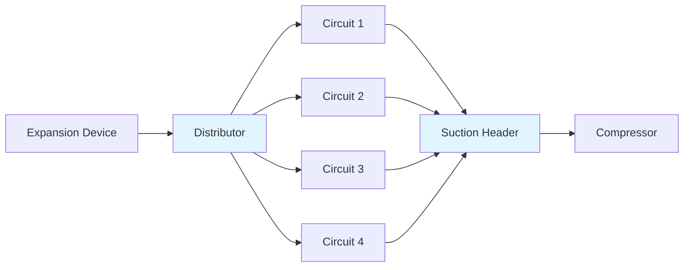

# Evaporators in Refrigeration Systems

Evaporators constitute the heat-absorbing component of refrigeration systems, where liquid refrigerant undergoes phase change to vapor while extracting thermal energy from the conditioned space or process fluid. The evaporator represents the primary heat transfer surface on the low-pressure side of the refrigeration cycle, operating at temperatures below the surrounding environment.

## Fundamental Heat Transfer Principles

The evaporator heat transfer process involves three distinct thermal resistances in series: convection from the air or fluid to the external surface, conduction through the tube wall and any frost layer, and nucleate boiling convection from the internal surface to the refrigerant.

The overall heat transfer equation governing evaporator performance:

$$Q_{evap} = U \cdot A \cdot \Delta T_{m}$$

Where:
- $Q_{evap}$ = evaporator capacity (W)
- $U$ = overall heat transfer coefficient (W/m²·K)
- $A$ = effective heat transfer area (m²)
- $\Delta T_{m}$ = mean temperature difference (K)

The overall heat transfer coefficient combines individual resistances:

$$\frac{1}{U} = \frac{1}{h_{air}} + \frac{t_{tube}}{k_{tube}} + \frac{t_{frost}}{k_{frost}} + \frac{1}{h_{ref}}$$

The refrigerant-side heat transfer coefficient during evaporation depends on flow regime, with nucleate boiling dominant at low vapor qualities and convective evaporation at higher qualities. The air-side coefficient varies with velocity, fin geometry, and whether the coil operates wet or dry.

## Evaporator Classification

### Direct Expansion (DX) Systems

Direct expansion evaporators meter liquid refrigerant through an expansion device directly into the coil, where it evaporates completely before reaching the outlet. The refrigerant exits as superheated vapor, typically with 4-6 K superheat for stable expansion valve control.

**Advantages:**
- Lower refrigerant charge
- Simpler system design
- Better oil return
- Suitable for packaged equipment

**Limitations:**
- Uneven refrigerant distribution in multicircuit coils
- Reduced heat transfer effectiveness due to superheat region
- Sensitive to load variations

### Flooded Evaporators

Flooded designs maintain liquid refrigerant throughout the heat transfer surface, with vapor separation occurring in an accumulator or surge drum. The refrigerant remains at saturation temperature across the entire evaporator length.

**Advantages:**
- Higher heat transfer coefficients
- Uniform surface temperatures
- Better capacity utilization
- Excellent for low-temperature applications

**Limitations:**
- Higher refrigerant charge
- Oil return challenges
- Requires liquid recirculation pump or gravity feed

## Evaporator Types and Applications

| Evaporator Type | Application | Temperature Range | Typical h (W/m²·K) |
|----------------|-------------|-------------------|-------------------|
| Bare tube | Liquid chillers | -5 to 15°C | 500-1000 |
| Plate fin | Air cooling | -40 to 10°C | 20-60 |
| Microchannel | Compact units | -10 to 10°C | 25-70 |
| Shell-and-tube | Process cooling | -30 to 15°C | 800-2000 |
| Flooded shell | Large chillers | 2 to 12°C | 1500-3500 |
| Plate heat exchanger | Glycol cooling | -20 to 10°C | 2000-5000 |

### Finned Tube Evaporators

Finned tube coils extend the air-side surface area to compensate for the low convective heat transfer coefficient of air. The fin efficiency determines the effectiveness of this extended surface:

$$\eta_{fin} = \frac{\tanh(m \cdot L)}{m \cdot L}$$

$$m = \sqrt{\frac{2 \cdot h_{air}}{k_{fin} \cdot t_{fin}}}$$

Where $L$ represents the fin height from tube centerline to fin edge. Aluminum fins with thickness 0.1-0.2 mm achieve efficiencies of 75-90% depending on fin spacing and geometry.

### Shell-and-Tube Evaporators

Shell-and-tube configurations position refrigerant in the shell side for flooded operation or tube side for DX service. Flooded shell-side operation provides superior heat transfer through nucleate boiling on enhanced tube surfaces.

Enhanced tubes with external fins, ridges, or porous coatings increase boiling heat transfer coefficients by 200-400% compared to smooth tubes. The Rohsenow correlation predicts nucleate boiling performance:

$$q'' = \mu_{l} \cdot h_{fg} \left[\frac{g(\rho_{l} - \rho_{v})}{\sigma}\right]^{1/2} \left[\frac{c_{p,l} \cdot \Delta T_{sat}}{C_{sf} \cdot h_{fg} \cdot Pr_{l}^{n}}\right]^{3}$$

## Refrigerant Distribution

Proper refrigerant distribution among parallel circuits maintains uniform evaporator surface temperatures and maximizes capacity. Poor distribution creates starved circuits operating at reduced capacity and overfed circuits with excessive superheat.

Distribution quality depends on:
- Distributor design (orifice size and number)
- Refrigerant quality entering distributor
- Feed line pressure drop
- Vertical vs. horizontal coil orientation

ASHRAE Standard 15 requires refrigerant distributors on DX coils with three or more circuits to ensure safety factor margins and prevent liquid slugging to compressors.

## Frost Formation and Defrost

Evaporators operating below 0°C with humid air accumulate frost on external surfaces. Frost acts as thermal insulation, reducing airflow and heat transfer. The frost layer thermal resistance increases linearly with thickness:

$$R_{frost} = \frac{t_{frost}}{k_{frost}}$$

Frost thermal conductivity ranges from 0.15-0.50 W/m·K depending on density, which varies from 100-600 kg/m³. Defrost becomes necessary when frost thickness reaches 3-6 mm or airflow decreases 15-20%.

### Defrost Methods

| Method | Energy Source | Application | Typical Duration |
|--------|--------------|-------------|------------------|
| Off-cycle | Ambient air | Above -10°C | 20-45 min |
| Hot gas | Compressor discharge | -40 to -10°C | 15-30 min |
| Electric | Resistance heaters | All temperatures | 20-40 min |
| Water | Sprayed water | Above -25°C | 10-20 min |
| Reverse cycle | Heat pump reversal | Above -15°C | 10-25 min |

Hot gas defrost diverts compressor discharge gas through the evaporator, condensing refrigerant inside tubes to transfer heat outward. Electric defrost provides precise control but consumes significant energy. ASHRAE Standard 72 establishes defrost testing procedures for rating and comparison.

## Capacity Modulation

Evaporator capacity responds to refrigerant temperature, airflow, and entering fluid conditions. The log mean temperature difference (LMTD) method calculates average driving force:

$$\Delta T_{m} = \frac{(T_{in} - T_{evap}) - (T_{out} - T_{evap})}{\ln\left[\frac{T_{in} - T_{evap}}{T_{out} - T_{evap}}\right]}$$

Face-splitting dampers, variable-speed fans, and refrigerant circuit staging modulate capacity to match load. Reduced airflow lowers capacity but increases dehumidification through colder coil temperatures and longer residence time.

## Performance Optimization

Maximizing evaporator effectiveness requires:

1. **Adequate refrigerant velocity** (1.5-3.5 m/s) to maintain oil entrainment and high heat transfer coefficients
2. **Proper superheat control** (4-6 K) balancing capacity utilization against compressor protection
3. **Sufficient air velocity** (2-2.5 m/s face velocity) for forced convection without excessive pressure drop
4. **Regular maintenance** removing dirt buildup that acts as insulation (cleaning restores 10-30% capacity)
5. **Optimized fin spacing** (2-4 mm for above freezing, 4-8 mm for frosting applications)

The evaporator represents approximately 25-35% of total refrigeration system cost but directly determines cooling capacity and efficiency. Proper selection and operation ensures design performance throughout system life.

## Selection Criteria

Evaporator selection requires matching capacity, physical constraints, and economic factors:

- Cooling load magnitude and profile
- Available temperature difference
- Space limitations and weight restrictions
- Refrigerant type and charge limits
- Operating temperature range
- Frosting conditions and defrost requirements
- Maintenance accessibility
- Initial cost versus operating efficiency
- Noise and vibration tolerance

Oversized evaporators provide lower operating costs through reduced pressure drop and improved heat transfer but increase first cost and refrigerant charge. Undersized units operate at higher temperature differences with elevated compression ratios and reduced system efficiency.

Reference ASHRAE Handbook—Refrigeration for detailed selection procedures, pressure drop calculations, and application-specific design guidance across the complete range of evaporator types and operating conditions.
