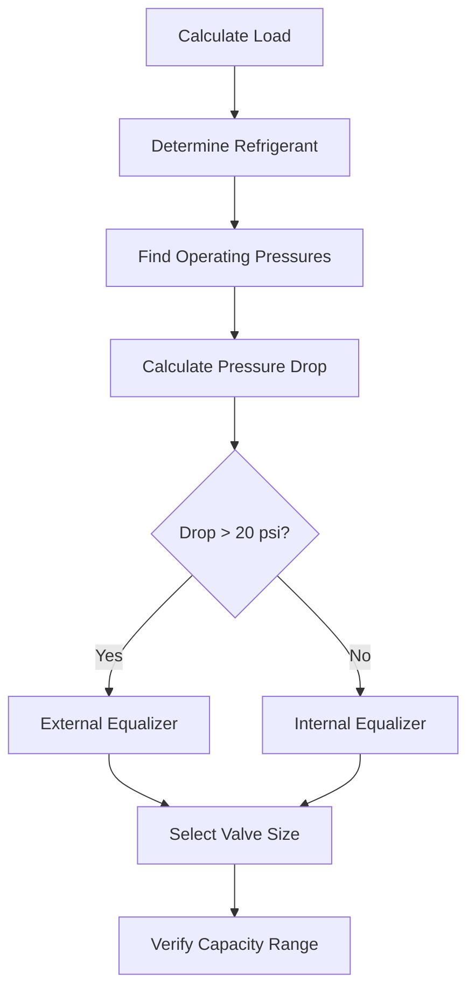

# Expansion Devices in Refrigeration Systems

Expansion devices regulate refrigerant flow from high-pressure liquid to low-pressure two-phase mixture, controlling superheat and matching evaporator load to compressor capacity. The expansion process is fundamentally isenthalpic, converting pressure energy to kinetic energy through throttling.

## Thermodynamic Fundamentals

The expansion process occurs at constant enthalpy across the device:

$$h_3 = h_4$$

Where subscript 3 represents the liquid line inlet and subscript 4 the evaporator inlet. The quality at the evaporator inlet is:

$$x_4 = \frac{h_4 - h_f}{h_{fg}}$$

The irreversible throttling process generates entropy:

$$\Delta s = s_4 - s_3 > 0$$

This entropy generation represents lost work potential, quantified by the loss of available energy in the expansion process.

## Capillary Tubes

Capillary tubes provide fixed restriction through small-diameter copper tubing, typically 0.031 to 0.099 inches inside diameter. Flow rate depends on upstream pressure, downstream pressure, and refrigerant subcooling.

### Design Equations

The mass flow rate through a capillary tube follows empirical correlations. For critical flow conditions (choked flow):

$$\dot{m} = C \cdot d^{2.5} \cdot \sqrt{\Delta P \cdot \rho_L}$$

Where:
- $C$ = empirical discharge coefficient (0.38-0.42 for refrigerants)
- $d$ = inside diameter (inches)
- $\Delta P$ = pressure differential (psi)
- $\rho_L$ = liquid refrigerant density (lb/ft³)

### Application Characteristics

| Parameter | Typical Range | Notes |
|-----------|--------------|-------|
| Inside Diameter | 0.031-0.099 in | Smaller for lower capacity |
| Length | 3-20 ft | Longer for higher restriction |
| Operating Pressure | 150-300 psig | System dependent |
| Subcooling Required | 5-15°F | Prevents flash gas |

Capillary tubes offer simplicity and low cost but cannot modulate capacity. Critical charge amount is necessary for proper operation across ambient conditions.

## Thermostatic Expansion Valves (TXV)

Thermostatic expansion valves modulate refrigerant flow to maintain constant evaporator superheat. The valve responds to three pressure forces acting on the diaphragm.

### Force Balance

The TXV operates based on force equilibrium:

$$P_{bulb} = P_{evap} + P_{spring}$$

Where:
- $P_{bulb}$ = bulb pressure (sensing superheat)
- $P_{evap}$ = evaporator pressure (internal equalizer) or suction line pressure (external equalizer)
- $P_{spring}$ = spring pressure (superheat setting)

### Capacity Rating

TXV capacity is rated in tons of refrigeration at standard conditions per AHRI Standard 750. The actual capacity is:

$$Q_{actual} = Q_{rated} \cdot \sqrt{\frac{\Delta P_{actual}}{\Delta P_{rated}}} \cdot \left(\frac{\rho_{actual}}{\rho_{rated}}\right)^{0.5}$$

### Valve Selection Criteria

### Sensing Bulb Installation

Bulb placement critically affects performance:

- **Horizontal suction lines**: Mount bulb at 4 or 8 o'clock position
- **Suction line diameter < 7/8"**: Mount bulb fully around line
- **Suction line diameter ≥ 7/8"**: Mount bulb on top (12 o'clock)
- **Location**: 6-12 inches downstream of evaporator outlet, upstream of external equalizer connection

## Electronic Expansion Valves (EEV)

Electronic expansion valves use stepper motors or pulse-width modulation to control refrigerant flow based on electronic signals from temperature and pressure sensors.

### Control Algorithms

Modern EEVs implement PI or PID control:

$$u(t) = K_p \cdot e(t) + K_i \int_0^t e(\tau) d\tau + K_d \frac{de(t)}{dt}$$

Where:
- $u(t)$ = control signal (valve position)
- $e(t)$ = error (actual superheat - target superheat)
- $K_p, K_i, K_d$ = proportional, integral, derivative gains

### Performance Advantages

| Feature | TXV | EEV |
|---------|-----|-----|
| Superheat Control | ±3-5°F | ±1-2°F |
| Response Time | 30-60 seconds | 5-15 seconds |
| Capacity Modulation | Limited | 0-100% |
| Efficiency Gain | Baseline | 5-15% improvement |
| Initial Cost | Low | High |
| Control Complexity | Mechanical | Electronic |

EEVs enable lower superheat operation, increasing evaporator capacity and system efficiency. The reduced superheat allows more evaporator surface for heat transfer while maintaining compressor protection.

## Float Valves

Float valves maintain constant liquid refrigerant level in low-pressure receivers or evaporators. Two configurations exist:

**High-Side Float**: Controls liquid level in high-pressure receiver, feeding multiple evaporators

**Low-Side Float**: Controls liquid level directly in evaporator, used in flooded systems

Float valves provide continuous liquid feed but require critical charge and large refrigerant inventory.

## Selection Methodology

Expansion device selection depends on application requirements:

1. **Calculate evaporator load** using ASHRAE Standard 15 load calculation procedures
2. **Determine operating conditions** including evaporator temperature, condenser temperature, and subcooling
3. **Select device type** based on:
   - Load variation requirements
   - Efficiency targets
   - Control precision needed
   - Cost constraints
4. **Size device** using manufacturer capacity tables at actual operating conditions
5. **Verify pressure drop** to ensure adequate liquid subcooling

## Superheat Setting

Proper superheat ensures complete evaporation without excessive compressor inlet temperature. Target superheat values:

| Application | Superheat Range | Rationale |
|-------------|----------------|-----------|
| Air Conditioning | 8-12°F | Balance efficiency and protection |
| Commercial Refrigeration | 6-10°F | Maximize capacity |
| Low-Temp Refrigeration | 4-8°F | Optimize evaporator performance |
| Heat Pumps (Cooling) | 10-15°F | Account for line losses |

Total superheat (at compressor inlet) must account for suction line temperature gain. Typical suction line superheat adds 5-10°F depending on line length and ambient conditions.

## Installation and Commissioning

Critical installation factors include:

- **Mounting orientation**: Follow manufacturer specifications
- **Liquid line sizing**: Maintain 5-10°F subcooling at expansion device inlet
- **Suction line sizing**: Limit pressure drop to 1-2°F saturation equivalent
- **Sensing element location**: Ensure proper thermal contact and insulation

Commission expansion devices by verifying superheat under design load conditions, adjusting spring pressure (TXV) or control parameters (EEV) to achieve target values specified in ASHRAE Handbook—Refrigeration Chapter 11.

## Performance Optimization

Expansion device performance directly impacts system efficiency. Optimize by:

- Maintaining adequate subcooling (10-15°F) to prevent flash gas
- Minimizing superheat while ensuring compressor protection
- Using electronic control for variable load applications
- Implementing capacity modulation matching evaporator load

The expansion device represents the critical control point in refrigeration systems, directly affecting capacity, efficiency, and reliability through precise refrigerant flow management.
