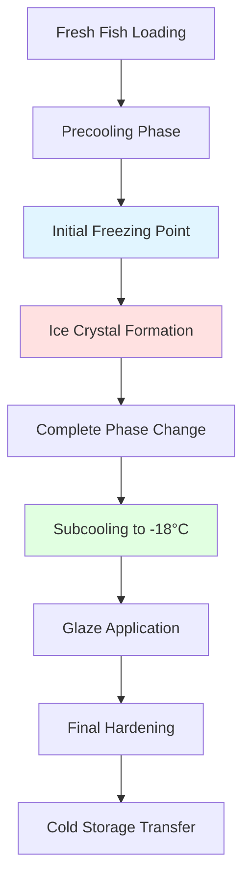
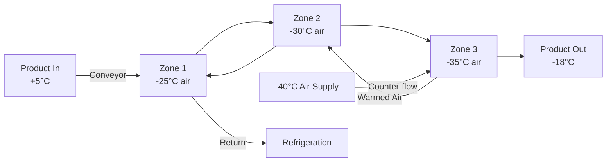

## Physical Principles of Air Blast Freezing

Air blast freezing relies on forced convection heat transfer to extract thermal energy from fish products. The freezing process involves three distinct thermal phases: sensible cooling above the initial freezing point, latent heat removal during phase change, and subcooling to final storage temperature.

The convective heat transfer rate governs freezing performance:

$$Q = h \cdot A \cdot (T_{\text{air}} - T_{\text{surface}})$$

where $h$ is the convective heat transfer coefficient (W/m²·K), $A$ is the product surface area (m²), and the temperature difference drives heat flow. The heat transfer coefficient depends critically on air velocity according to:

$$h = C \cdot v^{0.8}$$

where $C$ is a configuration-dependent constant and $v$ is air velocity (m/s). This non-linear relationship demonstrates why velocity increases yield diminishing returns above 5-6 m/s.

## Air Temperature Requirements

Blast freezer air temperatures typically range from -30°C to -40°C (-22°F to -40°F) for fish products. Lower temperatures provide faster freezing but increase refrigeration system costs and operating expenses.

### Temperature Selection Criteria

| Application | Air Temperature | Rationale |
|-------------|-----------------|-----------|
| Tuna, swordfish (large) | -35°C to -40°C | Thick cross-section requires maximum temperature differential |
| Salmon fillets | -30°C to -35°C | Moderate thickness, balance speed and cost |
| Shrimp, small fish | -25°C to -30°C | Thin profile freezes rapidly at higher temperatures |
| Glazed products | -30°C to -35°C | Post-glaze freezing requires adequate capacity |

The temperature differential between air and product surface creates the driving force for heat transfer. However, excessively low temperatures can cause surface cracking in whole fish due to thermal stress gradients.

## Air Velocity Optimization

Air velocity directly influences the surface heat transfer coefficient and therefore freezing rate. Typical blast freezer velocities range from 4 to 6 m/s (800-1200 ft/min) measured at product level.

### Velocity Impact Analysis

The relationship between velocity and freezing time follows:

$$t_f \propto \frac{1}{v^{0.8}}$$

Doubling air velocity from 2 to 4 m/s reduces freezing time by approximately 43%, while increasing from 4 to 8 m/s only reduces time by 25%. This diminishing return reflects the velocity exponent in the heat transfer correlation.

**Practical velocity ranges:**

- Minimum effective velocity: 3 m/s (avoids stagnant boundary layers)
- Optimal range: 4-5 m/s (balance between freezing rate and fan power)
- Maximum practical velocity: 6-7 m/s (limited additional benefit, high power consumption)

Higher velocities increase fan power consumption proportional to $v^3$, creating an economic optimization problem between reduced freezing time and increased energy costs.

## Freezing Time Calculations

Freezing time depends on product geometry, thermal properties, and process conditions. Plank's equation provides a simplified estimate for regular-shaped products:

$$t_f = \frac{\rho \lambda}{T_f - T_a} \left(\frac{P \cdot a}{h} + \frac{R \cdot a^2}{k}\right)$$

where:
- $\rho$ = density (kg/m³)
- $\lambda$ = latent heat of fusion (334 kJ/kg for water)
- $T_f$ = initial freezing point (typically -1°C to -2°C for fish)
- $T_a$ = air temperature (°C)
- $a$ = characteristic dimension (m)
- $h$ = surface heat transfer coefficient (W/m²·K)
- $k$ = thermal conductivity of frozen fish (1.8-2.2 W/m·K)
- $P$, $R$ = shape factors (0.5, 0.125 for infinite slab)

### Species-Specific Freezing Times

Typical freezing times at -35°C air temperature and 5 m/s velocity:

| Product | Thickness | Freezing Time | Final Center Temp |
|---------|-----------|---------------|-------------------|
| Cod fillets | 25 mm | 45-60 min | -18°C |
| Salmon steaks | 40 mm | 90-120 min | -18°C |
| Halibut fillets | 50 mm | 120-180 min | -18°C |
| Whole sardines | 30 mm | 60-90 min | -18°C |
| Tuna loins | 100 mm | 4-6 hours | -18°C |
| Shrimp (medium) | 15 mm | 20-30 min | -18°C |

Actual freezing times vary with fat content, moisture content, and product geometry. Fatty fish (salmon, mackerel) freeze slightly slower than lean fish (cod, haddock) due to lower water content and different thermal properties.

## Freezing Process Stages

### Critical Temperature Zones

The zone of maximum ice crystal formation (-1°C to -5°C) determines final product quality. Rapid transit through this range produces small ice crystals that minimize cellular damage:

$$\text{Crystal Size} \propto \frac{1}{\text{Freezing Rate}^{0.5}}$$

Fish frozen rapidly in blast freezers develop ice crystals 10-50 μm in diameter, compared to 100-200 μm for slow freezing methods. Smaller crystals preserve cellular structure and reduce drip loss upon thawing.

## Blast Freezer Design Configurations

### Tunnel Freezers

Continuous tunnel freezers use counter-flow or parallel-flow air distribution. Counter-flow arrangements expose warmest product to coldest air, maximizing thermodynamic efficiency:

### Batch Blast Rooms

Stationary batch freezers use cart-mounted trays with horizontal or vertical airflow. Vertical airflow through perforated trays provides uniform temperature distribution but requires careful product spacing.

**Design parameters:**
- Air changes: 60-120 per hour
- Product loading density: 100-150 kg/m³
- Tray spacing: 50-75 mm (allows adequate airflow)
- Evaporator capacity: 1.5-2.0 kW per kg/hr freezing capacity

## Quality Preservation Factors

### Ice Crystal Management

Freezing rate directly impacts ice crystal size distribution. The critical quality boundary occurs at approximately 5 cm/hr freezing rate (advancement of -5°C isotherm):

- Fast freezing (>5 cm/hr): Small intracellular crystals, minimal cell damage
- Slow freezing (<2 cm/hr): Large extracellular crystals, cellular dehydration and rupture

Air blast freezing typically achieves 3-8 cm/hr for thin products and 1-3 cm/hr for thick sections.

### Moisture Loss Control

Weight loss during freezing occurs through surface sublimation. The sublimation rate follows:

$$\frac{dm}{dt} = k_m \cdot A \cdot (P_{\text{surface}} - P_{\text{air}})$$

where $k_m$ is the mass transfer coefficient and $P$ represents water vapor partial pressures. Typical weight loss ranges from 0.5% to 2.0% depending on freezing time and air humidity.

**Minimization strategies:**
- Reduce freezing time (less exposure duration)
- Increase air relative humidity (limited by evaporator frosting)
- Apply protective glaze immediately after freezing
- Use packaging or film wrapping for thin products

### Protein Denaturation Prevention

Protein denaturation in fish muscle accelerates above -10°C. Rapid freezing minimizes time spent in the critical range where ice crystal growth and protein damage occur simultaneously. FDA guidelines recommend achieving -18°C center temperature within 4 hours for products up to 50 mm thickness.

## Operational Considerations

### Product Loading Configuration

Proper product spacing ensures adequate air circulation and uniform freezing. Insufficient spacing creates thermal short-circuits where air bypasses product:

- Minimum spacing: 25 mm between pieces
- Tray perforation: 25-40% open area
- Stack height: Limited to maintain air velocity above 3 m/s at product level
- Loading pattern: Staggered arrangement prevents air channeling

### Energy Consumption

Specific energy consumption for air blast freezing typically ranges from 250 to 400 kJ per kg of product frozen, depending on:

- Initial product temperature
- Final center temperature
- Air temperature differential
- Fan efficiency and motor sizing
- Evaporator defrost frequency

Lower air temperatures increase refrigeration energy but decrease freezing time, creating an optimization opportunity based on electricity costs and throughput requirements.

### Defrost Requirements

Evaporator coils accumulate frost from product moisture and air infiltration. Defrost intervals range from 4 to 8 hours of operation, with defrost duration of 20-40 minutes. Hot gas defrost minimizes temperature rise in the freezing chamber compared to electric or water defrost methods.

## Comparison with Alternative Freezing Methods

| Parameter | Air Blast | Plate Freezer | Immersion | Cryogenic |
|-----------|-----------|---------------|-----------|-----------|
| Freezing time (40mm fillet) | 90-120 min | 60-90 min | 30-45 min | 5-10 min |
| Capital cost | Moderate | High | Low | Moderate |
| Operating cost | Moderate | Low | Moderate | Very high |
| Product versatility | Excellent | Limited | Good | Excellent |
| Quality (ice crystals) | Good | Very good | Very good | Excellent |
| Weight loss | 1-2% | 0.2-0.5% | Minimal | 3-8% |

Air blast freezing offers the best combination of product versatility and capital cost, making it suitable for operations processing multiple product types and sizes.

## FDA and ASHRAE Standards

FDA Code of Federal Regulations (21 CFR 123) requires frozen fish products to be maintained at -18°C (0°F) or below. ASHRAE recommendations specify:

- Storage temperature: -23°C to -29°C for extended shelf life
- Freezing rate: Achieve -18°C center temperature within 2-4 hours for optimal quality
- Air circulation: Minimum 60 air changes per hour in blast freezer
- Temperature monitoring: Continuous recording with ±1°C accuracy

Properly designed air blast systems readily achieve these requirements while maintaining operational flexibility for varying product types and production schedules.

