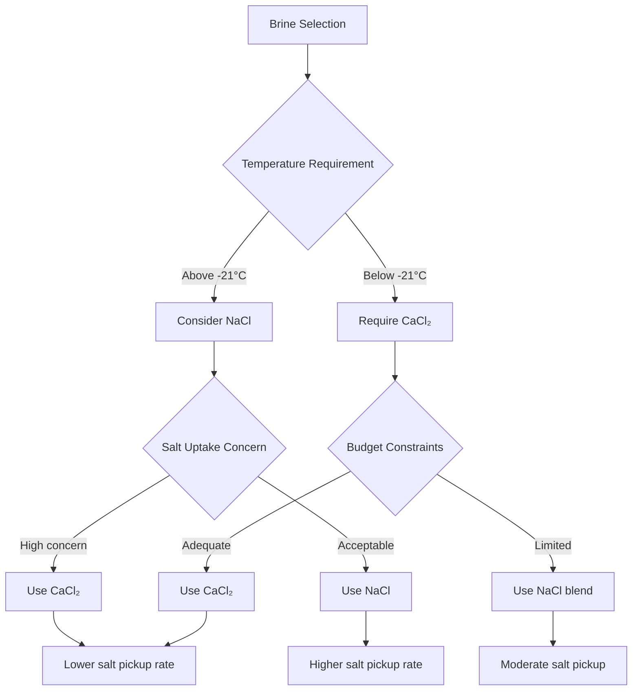
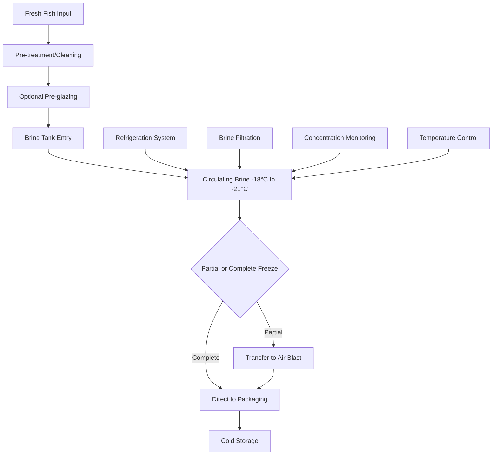

## Brine Immersion Freezing Fundamentals

Brine immersion freezing represents one of the most rapid freezing methods available for fish products, utilizing direct contact between the product and a refrigerated salt solution. The system achieves freezing rates 5 to 10 times faster than air blast methods due to the superior heat transfer coefficient of liquid immersion. The brine temperature typically operates between -18°C and -21°C (0°F to -6°F), selected based on the eutectic point of the salt solution and desired freezing rate.

The fundamental heat transfer advantage stems from the physical properties of liquid contact. While air blast freezing achieves surface heat transfer coefficients of 25-50 W/m²·K, brine immersion delivers coefficients of 250-850 W/m²·K, depending on brine circulation velocity and turbulence intensity.

## Heat Transfer Mechanism

The rate of heat extraction during brine immersion follows the transient conduction equation with convective boundary conditions:

$$\rho c_p \frac{\partial T}{\partial t} = k \nabla^2 T$$

The convective heat transfer at the fish surface is governed by:

$$q = h(T_s - T_\infty)$$

where $h$ is the convective heat transfer coefficient (250-850 W/m²·K for brine), $T_s$ is the surface temperature, and $T_\infty$ is the bulk brine temperature. The high heat transfer coefficient results from forced convection and the thermal properties of concentrated salt solutions.

The freezing time for a spherical fish approximates:

$$t_f = \frac{\rho L d}{8 h (T_f - T_b)} \left( 1 + \frac{Bi}{2} \right)$$

where $\rho$ is density, $L$ is latent heat of fusion (approximately 250-280 kJ/kg for fish tissue), $d$ is characteristic dimension, $T_f$ is initial freezing point, $T_b$ is brine temperature, and $Bi$ is the Biot number.

## Brine Types and Properties

### Sodium Chloride Brine

Sodium chloride (NaCl) brine represents the traditional and most economical option for fish immersion freezing. The eutectic point occurs at -21.1°C (-6°F) with 23.3% salt concentration by weight.

| Property | Value | Units |
|----------|-------|-------|
| Eutectic temperature | -21.1 | °C |
| Eutectic concentration | 23.3 | % by weight |
| Typical operating temperature | -18 to -21 | °C |
| Typical concentration | 20-24 | % by weight |
| Specific heat (20% solution) | 3.35 | kJ/kg·K |
| Density (20% solution) | 1150 | kg/m³ |
| Thermal conductivity | 0.54 | W/m·K |
| Corrosion potential | High | - |
| Cost | Low | Relative |

### Calcium Chloride Brine

Calcium chloride (CaCl₂) brine offers superior low-temperature performance and reduced corrosivity compared to sodium chloride. The eutectic point reaches -51°C (-60°F) at 29.8% concentration, permitting operation at lower temperatures without freezing.

| Property | Value | Units |
|----------|-------|-------|
| Eutectic temperature | -51.0 | °C |
| Eutectic concentration | 29.8 | % by weight |
| Typical operating temperature | -25 to -29 | °C |
| Typical concentration | 24-28 | % by weight |
| Specific heat (25% solution) | 2.93 | kJ/kg·K |
| Density (25% solution) | 1230 | kg/m³ |
| Thermal conductivity | 0.48 | W/m·K |
| Corrosion potential | Moderate | - |
| Cost | High | Relative |

## Brine Selection Comparison

## Salt Uptake Considerations

Salt uptake represents the primary disadvantage of brine immersion freezing. During immersion, salt migrates into the fish tissue through osmotic pressure differentials and diffusion. The rate of salt penetration follows Fick's second law:

$$\frac{\partial C}{\partial t} = D \frac{\partial^2 C}{\partial x^2}$$

where $C$ is salt concentration, $t$ is time, $D$ is the diffusion coefficient (typically 1-5 × 10⁻¹⁰ m²/s in fish tissue), and $x$ is depth into the tissue.

The amount of salt absorbed increases with:

- Immersion time (primary factor)
- Brine concentration
- Temperature (higher temperatures increase diffusion rate)
- Product fat content (lower fat = higher uptake)
- Product surface area to volume ratio

### Salt Uptake Mitigation Strategies

| Strategy | Mechanism | Effectiveness | Implementation |
|----------|-----------|---------------|----------------|
| Minimize immersion time | Reduce exposure duration | High | Optimal brine temperature control |
| Use calcium chloride | Lower osmotic potential | Moderate | CaCl₂ brine system |
| Pre-glaze product | Physical barrier | High | Water spray before immersion |
| Reduce brine concentration | Lower concentration gradient | Moderate | Balance with freezing point |
| Post-immersion washing | Remove surface salt | Moderate | Water spray immediately after |
| Vacuum packaging | Prevent further diffusion | High | Packaging immediately post-freezing |

Typical salt uptake ranges from 0.5% to 2.5% by weight, depending on exposure time and product characteristics. ASHRAE Refrigeration Handbook recommends minimizing immersion time to the period required to freeze the outer 10-15 mm of product, then transferring to air blast freezing to complete the process.

## Brine Immersion System Design

### Key System Components

**Brine Tank**: Constructed from stainless steel (304 or 316L) or fiberglass-reinforced plastic to resist corrosion. Tank sizing provides sufficient volume for thermal mass stability, typically 3-5 times the volume of product processed per batch.

**Circulation System**: High-velocity pumps maintain brine flow rates of 0.3-1.0 m/s past product surfaces. Flow velocity directly affects the convective heat transfer coefficient:

$$h = C \cdot Re^{0.8} \cdot Pr^{0.33} \cdot \frac{k}{D}$$

where $Re$ is Reynolds number, $Pr$ is Prandtl number, $k$ is thermal conductivity, and $D$ is characteristic length.

**Refrigeration System**: Direct expansion or flooded evaporator coils submerged in the brine tank. Evaporator temperature operates 3-5°C below brine temperature. Typical refrigeration capacity requirements range from 150-250 kW per ton of product processed hourly, accounting for product heat load, brine circulation pump heat, and system losses.

**Filtration System**: Continuous filtration removes fish scales, slime, and protein particles that accumulate during operation. Filter sizing provides turnover of total brine volume every 15-30 minutes.

## Temperature Control Requirements

Precise brine temperature control ensures consistent freezing rates and product quality. The control system maintains temperature within ±0.5°C of setpoint through:

- Multiple temperature sensors (minimum 3 per tank)
- Variable capacity refrigeration (hot gas bypass or variable speed compressor)
- Brine circulation rate modulation
- Automated refrigerant flow control

The relationship between refrigeration capacity and temperature stability:

$$\dot{Q}_{req} = \dot{m}_{product} c_{p,product} \Delta T + \dot{Q}_{losses} + \dot{Q}_{pump}$$

## Operational Advantages

Brine immersion freezing provides several distinct advantages for fish processing:

**Rapid Freezing Rate**: The 5-10× faster freezing compared to air blast results in smaller ice crystal formation. Ice crystal size inversely correlates with freezing rate according to nucleation theory. Smaller crystals cause less cellular damage, preserving texture and reducing drip loss upon thawing.

**Uniform Temperature Distribution**: Complete product immersion eliminates cold spots and temperature gradients common in air blast systems. Every surface receives identical heat transfer conditions.

**Surface Moisture Retention**: The liquid environment prevents surface dehydration and freezer burn. Unlike air blast systems where surface sublimation occurs, immersed products maintain surface moisture.

**Continuous Processing**: Conveyor-based immersion systems enable continuous product flow, improving throughput compared to batch air blast tunnels.

**Reduced Refrigeration Tonnage**: Despite higher heat transfer rates, the improved efficiency allows smaller refrigeration systems compared to achieving equivalent production rates with air blast freezing.

## Operational Challenges

**Corrosion Management**: Salt brines attack standard carbon steel, aluminum, and brass components. System construction requires stainless steel, plastic, or specialty alloys. Corrosion rates accelerate with:

- Higher brine concentration
- Elevated temperatures
- Presence of oxygen (dissolved air)
- Galvanic coupling of dissimilar metals

**Brine Maintenance**: Dilution from product-carried water and ice buildup requires periodic concentration adjustment. Continuous monitoring using:

- Specific gravity measurement (hydrometers or density sensors)
- Freezing point determination
- Conductivity measurement
- Refractometry

ASHRAE recommends maintaining concentration within ±1% of design value for consistent performance.

**Quality Control**: Regulatory compliance requires documentation of salt uptake levels. USDA and FDA guidelines limit sodium content in products labeled "low sodium" or "reduced sodium."

## Design Considerations Per ASHRAE

According to ASHRAE Refrigeration Handbook Chapter 29 (Food Freezing), brine immersion system design should address:

- Brine temperature maintained 2-3°C below required product center temperature
- Circulation velocity sufficient for Reynolds number > 10,000 (turbulent flow)
- Immersion time calculated to achieve desired freezing depth without excessive salt uptake
- Brine-to-product volume ratio minimum 3:1 for thermal stability
- Filtration capacity minimum 2× per hour total volume turnover
- Emergency shutdown procedures for brine spills or temperature excursions

The system energy efficiency factor (EEF) for brine immersion typically ranges from 0.25-0.35 kWh per kg of fish frozen, compared to 0.35-0.50 kWh/kg for air blast systems, representing a 30-40% energy advantage.

## Hybrid Freezing Approaches

Modern installations frequently employ hybrid systems combining brine immersion with air blast finishing to optimize both freezing speed and product quality while minimizing salt uptake:

1. Brine immersion for 5-15 minutes (freeze outer 10-15 mm)
2. Transfer to air blast tunnel at -35°C to -40°C
3. Complete freezing to -18°C center temperature
4. Post-freezing water glaze application

This approach achieves 60-70% of total freezing in the brine stage while limiting salt absorption to 0.3-0.8% by weight.

---

*Content based on ASHRAE Refrigeration Handbook principles and established fish processing refrigeration practices.*