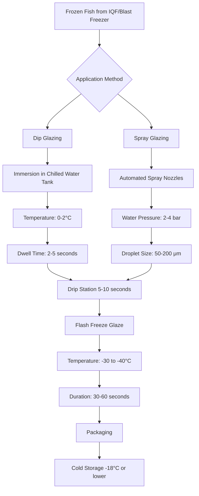

Ice glaze application forms a critical protective barrier on frozen fish products, preventing sublimation-driven moisture loss and oxidative degradation during frozen storage. The process involves coating frozen fish surfaces with a thin ice layer that serves as both a physical barrier and thermal buffer.

## Physics of Glaze Formation

The glaze formation mechanism depends on the thermal gradient between the frozen fish surface and the liquid water applied. When chilled water contacts a fish surface at temperatures below -18°C (0°F), rapid nucleation and ice crystal formation occur through heterogeneous nucleation on the fish surface.

The heat transfer during glazing follows:

$$Q = h \cdot A \cdot (T_{\text{water}} - T_{\text{surface}}) \cdot t$$

where $Q$ represents the heat transferred from water to frozen surface, $h$ is the convective heat transfer coefficient (typically 500-1500 W/m²·K for water contact), $A$ is the surface area, and $t$ is contact time.

The glaze thickness achieved depends on the thermal mass of the frozen product:

$$\delta_{\text{glaze}} = \frac{m_{\text{water}} \cdot c_p \cdot \Delta T}{\rho_{\text{ice}} \cdot A \cdot L_f}$$

where $\delta_{\text{glaze}}$ is glaze thickness, $m_{\text{water}}$ is water mass applied, $c_p$ is specific heat of water (4.18 kJ/kg·K), $\Delta T$ is temperature difference, $\rho_{\text{ice}}$ is ice density (917 kg/m³), and $L_f$ is latent heat of fusion (334 kJ/kg).

## Glaze Application Methods

### Dip Glazing Systems

Dip glazing involves immersing frozen fish products in chilled water tanks maintained at 0-2°C (32-36°F). The water temperature must remain above freezing to prevent ice buildup in the tank while being cold enough to minimize thermal shock to the frozen product.

**Tank Design Considerations:**
- Water circulation rate: 4-8 tank volumes per hour
- Temperature uniformity: ±0.5°C throughout tank
- Overflow system to maintain water level
- Continuous filtration to remove protein particles
- Refrigeration capacity to compensate for heat gain from products

The product residence time in the dip tank typically ranges from 2-5 seconds, sufficient to achieve target glaze percentages of 3-8% by weight.

### Spray Glazing Systems

Spray glazing utilizes automated nozzle arrays to apply fine water droplets onto frozen fish surfaces as products pass through on conveyors. This method offers superior control over glaze uniformity and weight.

**Spray System Parameters:**
- Nozzle pressure: 2-4 bar (30-60 psi)
- Droplet size: 50-200 μm mean diameter
- Water flow rate: 0.5-2.0 L/min per nozzle
- Nozzle spacing: 150-250 mm centers
- Multiple passes for uniform coverage

Smaller droplets (50-100 μm) provide more uniform coverage but require higher pressure and generate more overspray. Larger droplets (150-200 μm) reduce overspray but may create uneven coating.

## Glaze Weight Percentage

The glaze weight percentage represents the ratio of ice glaze mass to total product mass:

$$\text{Glaze} \% = \frac{m_{\text{glazed}} - m_{\text{net}}}{m_{\text{glazed}}} \times 100$$

FDA regulations require accurate declaration of net weight exclusive of glaze. Standard glaze percentages vary by product type:

| Product Type | Target Glaze % | Application Method | Purpose |
|--------------|----------------|-------------------|---------|
| Whole fish | 3-5% | Dip or spray | Basic protection |
| Fish fillets | 5-8% | Spray preferred | Enhanced protection |
| Fish portions | 4-6% | Spray | Uniform coating |
| Fish steaks | 5-7% | Dip or spray | Moisture retention |
| IQF shrimp | 8-12% | Spray glazing | High surface area protection |
| Fatty fish (salmon, mackerel) | 6-10% | Spray with antioxidant | Oxidation prevention |

Higher glaze percentages provide better protection but add cost and reduce package efficiency. The optimal glaze percentage balances product protection with economic considerations.

## Moisture Barrier Mechanism

The ice glaze functions as a mass transfer barrier, reducing sublimation rate according to Fick's first law:

$$J = -D \cdot \frac{\partial C}{\partial x}$$

where $J$ is the mass flux (sublimation rate), $D$ is the diffusion coefficient of water vapor through ice, and $\partial C/\partial x$ is the concentration gradient.

The ice glaze increases the effective diffusion path length, reducing the overall sublimation rate by:

$$\frac{J_{\text{glazed}}}{J_{\text{unglazed}}} = \frac{\delta_{\text{product}}}{\delta_{\text{product}} + \delta_{\text{glaze}}}$$

A 5% glaze (approximately 0.5-1.0 mm thickness) can reduce sublimation rates by 60-80% during the first 3-6 months of frozen storage.

## Glaze Adherence and Product Temperature

Optimal glaze adherence requires the frozen fish surface temperature to be below -12°C (10°F). At warmer surface temperatures, the ice glaze may not freeze instantly, leading to:

- Reduced adhesion and glaze sloughing
- Uneven coating distribution
- Increased drip loss during packaging
- Poor freeze integration with product surface

The critical temperature for immediate freeze-on occurs when the product surface temperature satisfies:

$$T_{\text{surface}} < T_{\text{freeze}} - \frac{Q_{\text{convection}}}{h \cdot A}$$

where $T_{\text{freeze}}$ is the freezing point of the glaze water (typically -0.5°C with additives) and the second term represents the thermal resistance.

## Antioxidant Addition

For fatty fish species, adding FDA-approved antioxidants to glaze water extends shelf life by preventing lipid oxidation. Common additions include:

- Sodium erythorbate: 0.1-0.5% concentration
- Ascorbic acid: 0.05-0.2% concentration
- Citric acid: 0.05-0.1% concentration (also pH adjustment)
- Sodium tripolyphosphate: 0.1-0.3% (moisture retention)

These compounds dissolve in the glaze water and become incorporated into the ice layer, providing antioxidant protection at the fish surface where oxidation initiates.

## Reglaze Operations

During extended frozen storage (>6 months), the ice glaze gradually sublimates, necessitating periodic reglazing to maintain protection. The reglaze interval depends on storage conditions:

| Storage Temperature | Storage RH | Reglaze Interval | Sublimation Rate |
|---------------------|-----------|------------------|------------------|
| -18°C (0°F) | 85-90% | 6-9 months | 0.1-0.2 g/m²/day |
| -23°C (-10°F) | 90-95% | 9-12 months | 0.05-0.1 g/m²/day |
| -29°C (-20°F) | 95-98% | 12-18 months | 0.02-0.05 g/m²/day |
| -35°C (-30°F) | 98%+ | 18-24 months | <0.02 g/m²/day |

Reglaze procedures follow the same application methods as initial glazing but may require slightly longer contact times to ensure adhesion to partially dehydrated surfaces.

## FDA Compliance Requirements

FDA regulations under 21 CFR 101.105(q) require that:

1. Net weight declarations exclude ice glaze weight
2. Glaze removal procedure uses tempered water (15-21°C) with gentle agitation
3. Average glaze percentage does not exceed reasonable commercial practice
4. Product labels accurately reflect net weight tolerances

Processors must establish validated glaze removal procedures and maintain records demonstrating compliance with net weight requirements.

## Storage Life Extension

Properly glazed frozen fish demonstrates significantly extended storage life:

- Unglazed: 3-4 months before quality degradation
- 3-5% glaze: 6-9 months storage life
- 6-8% glaze: 9-12 months storage life
- 8-10% glaze with antioxidants: 12-18 months storage life

The storage life extension results from reduced sublimation (preventing freezer burn), reduced oxidation (especially with antioxidant addition), and protection from mechanical damage during handling and transport.

## Process Control Parameters

Critical control points for glaze application include:

**Water Temperature Control:**
- Setpoint: 0-2°C (32-36°F)
- Tolerance: ±0.5°C
- Monitoring: Continuous RTD or thermocouple

**Product Surface Temperature:**
- Target: -18 to -25°C (0 to -13°F)
- Verification: IR thermometer spot checks
- Frequency: Every 30 minutes

**Glaze Weight Verification:**
- Method: Pre-glaze and post-glaze weighing
- Sample frequency: Every 15 minutes or per lot
- Acceptance range: Target ±1% absolute

Automated systems incorporate in-line weight scales that adjust spray duration or dip time to maintain target glaze percentages within specification.
