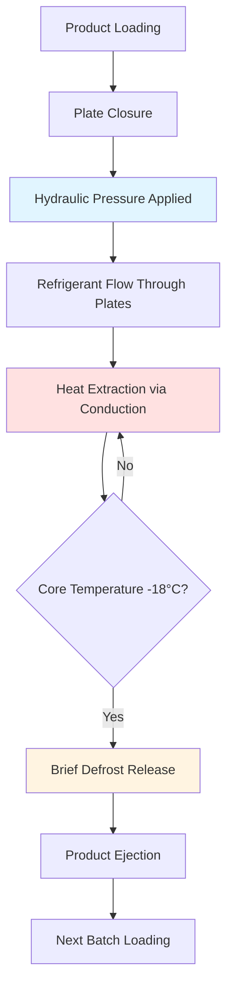
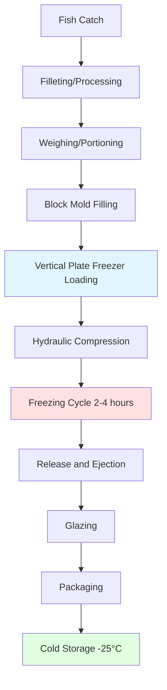

## Contact Freezing Principles

Plate freezers utilize direct conduction heat transfer by sandwiching fish products between refrigerated metal plates. This contact freezing method achieves superior heat transfer rates compared to air blast systems due to the fundamental difference in thermal conductivity between metal and air.

The heat transfer coefficient for plate freezing ranges from 100-400 W/(m²·K), compared to 10-50 W/(m²·K) for air blast systems. This dramatic improvement stems from conductive heat transfer eliminating the convective boundary layer resistance that dominates air freezing.

### Heat Transfer Mechanism

The overall heat transfer during plate freezing follows Fourier's law of conduction:

$$Q = \frac{k \cdot A \cdot (T_p - T_f)}{x}$$

Where:
- $Q$ = heat transfer rate (W)
- $k$ = thermal conductivity of fish (1.2-1.8 W/(m·K) for unfrozen, 2.0-2.4 W/(m·K) for frozen)
- $A$ = contact surface area (m²)
- $T_p$ = plate surface temperature (°C)
- $T_f$ = fish temperature (°C)
- $x$ = product thickness (m)

The contact resistance between plate and product significantly impacts freezing efficiency. Hydraulic pressure systems (2-10 bar) minimize air gaps and improve contact conductance from 200 W/(m²·K) to 800 W/(m²·K).

## Horizontal Plate Freezers

Horizontal plate freezers feature vertically-stacked refrigerated shelves with products loaded horizontally between plates. This configuration dominates land-based processing facilities due to ease of automation and high throughput capacity.

**Design Characteristics:**

| Parameter | Typical Range | Notes |
|-----------|---------------|-------|
| Plate spacing | 50-150 mm | Adjustable for product thickness |
| Number of plates | 12-40 shelves | Determines batch capacity |
| Plate dimensions | 1.0 x 1.5 m to 1.5 x 3.0 m | Standard sizes |
| Refrigerant | NH₃, R-404A, R-507A | Ammonia preferred for efficiency |
| Evaporation temperature | -40°C to -45°C | Lower than air blast systems |
| Hydraulic pressure | 3-7 bar | Ensures uniform contact |
| Freezing capacity | 1000-8000 kg/batch | Facility dependent |

### Freezing Time Calculation

Plank's equation provides freezing time estimation for plate freezers:

$$t_f = \frac{\rho L}{T_f - T_m} \left[\frac{Pa}{h} + \frac{Ra^2}{k}\right]$$

Where:
- $t_f$ = freezing time (s)
- $\rho$ = density (1040 kg/m³ for fish)
- $L$ = latent heat of fusion (250-280 kJ/kg for fish)
- $T_f$ = freezing medium temperature (°C)
- $T_m$ = initial freezing point (-1 to -2°C for fish)
- $P$ = dimensionless constant (0.5 for infinite plate)
- $R$ = dimensionless constant (0.125 for infinite plate)
- $a$ = half-thickness of product (m)
- $h$ = surface heat transfer coefficient (W/(m²·K))
- $k$ = thermal conductivity (W/(m·K))

For a 50 mm thick fish block at -40°C plate temperature:

$$t_f = \frac{1040 \times 270,000}{(-40) - (-1.5)} \left[\frac{0.5 \times 0.025}{300} + \frac{0.125 \times 0.025^2}{2.2}\right] \approx 2.1 \text{ hours}$$

## Vertical Plate Freezers

Vertical plate freezers position plates vertically with products inserted between adjacent plates. This configuration predominates in at-sea processing due to space efficiency and stability in vessel motion.

**Advantages for Marine Applications:**

- **Space efficiency:** Smaller footprint for vessel installation
- **Stability:** Vertical orientation better handles ship motion
- **Drainage:** Gravity-assisted removal of excess water/brine
- **Product quality:** Reduced deformation under hydraulic pressure

**Design considerations:**

| Feature | Horizontal | Vertical |
|---------|-----------|----------|
| Floor space | Larger | Compact |
| Loading | Manual or automated | Typically manual |
| Product ejection | Lift-out required | Gravity-assisted |
| At-sea suitability | Poor | Excellent |
| Throughput | Higher | Moderate |
| Capital cost | Higher | Lower |

## Block Freezing Applications

Plate freezers excel at producing uniform frozen fish blocks for further processing. Standard block dimensions (400 x 200 x 50-100 mm) facilitate efficient storage, transport, and subsequent cutting operations.

### Product Forms:

1. **Filleted blocks:** Skinless, boneless fillets arranged uniformly
2. **Minced blocks:** Mechanically separated fish for surimi production
3. **Interleaved blocks:** Fillets separated by polyethylene sheets
4. **Whole small fish:** Sardines, anchovies in block form

**Quality factors:**

The rapid freezing achieved by plate systems (cooling rate 5-20°C/hour through -1 to -5°C zone) produces small ice crystals (20-50 μm diameter) that minimize cellular damage. Air blast freezing produces larger crystals (50-150 μm) with greater drip loss upon thawing.

$$\text{Ice crystal size} \propto \frac{1}{\text{cooling rate}}$$

## At-Sea Processing Systems

Factory trawlers utilize vertical plate freezers to process and freeze catch immediately, maximizing product quality. Typical installations include 4-12 vertical plate freezers with total capacity 30-80 tonnes per 24-hour period.

**System integration:**

**Marine considerations:**

- **Refrigeration capacity:** 500-2000 kW for full processing line
- **Power supply:** Diesel generator sets with heat recovery
- **Seawater cooling:** Condenser systems using ambient seawater
- **Stability systems:** Gyroscopic mounts for freezer units
- **Corrosion protection:** Stainless steel construction (316L grade)

## Hydraulic Pressure Systems

Hydraulic rams apply uniform pressure across plate surfaces, crucial for achieving consistent thermal contact. Pressure must overcome product irregularities and flatten air pockets without crushing delicate fillets.

The contact conductance relationship follows:

$$h_c = C \cdot P^{0.6}$$

Where $h_c$ is contact conductance (W/(m²·K)), $P$ is applied pressure (Pa), and $C$ is an empirical constant dependent on surface roughness.

**Pressure optimization:**

| Product Type | Optimal Pressure | Rationale |
|--------------|------------------|-----------|
| Delicate fillets | 2-4 bar | Prevents crushing |
| Robust fillets | 4-7 bar | Maximizes contact |
| Minced blocks | 6-10 bar | Compacts material |

## Operational Efficiency

Plate freezer efficiency depends on minimizing non-productive time:

$$\text{Utilization} = \frac{t_f}{t_f + t_l + t_r}$$

Where:
- $t_f$ = freezing time
- $t_l$ = loading time (5-15 minutes)
- $t_r$ = release/defrost time (2-5 minutes)

Achieving 85-90% utilization requires automated loading systems and optimized defrost cycles. Brief plate surface warming (-40°C to -5°C for 60-90 seconds) breaks ice bonds without significant refrigeration capacity waste.

**Energy consumption:** Plate freezers consume 40-80 kWh per tonne of frozen product, approximately 30% more efficient than equivalent air blast systems due to reduced freezing time and better insulation efficiency.

## Quality Control Parameters

**Critical monitoring points:**

- Plate surface temperature uniformity (±2°C across all plates)
- Hydraulic pressure consistency (±0.3 bar variation)
- Product core temperature at release (≤ -18°C per ASHRAE guidelines)
- Contact time sufficiency (minimum 2 hours for 50mm blocks)
- Defrost cycle timing (excessive warming degrades efficiency)

ASHRAE Refrigeration Handbook Chapter 29 provides detailed guidance on plate freezer design and operation for fishery products, emphasizing the importance of maintaining product quality through controlled freezing rates and proper temperature management.

---

**References:**
- ASHRAE Refrigeration Handbook, Chapter 29: Fishery Products
- ASHRAE Handbook - Fundamentals, Chapter 10: Heat Transfer
