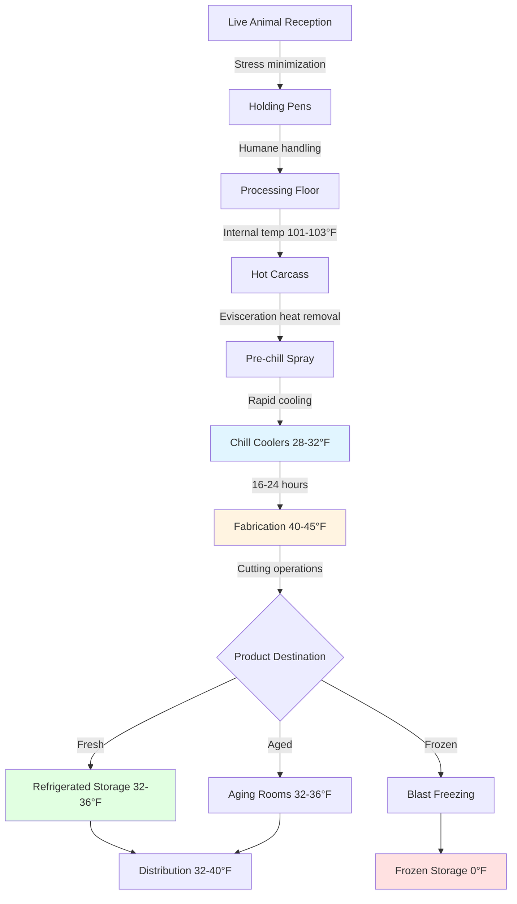

Meat processing refrigeration represents one of the most critical and complex applications in food safety engineering, requiring precise temperature control throughout multiple processing stages to prevent microbial growth while maintaining product quality. The thermodynamic challenges stem from the high heat removal rates necessary during rapid chilling, the phase transition properties of animal tissue, and the stringent regulatory requirements mandated by USDA Food Safety and Inspection Service (FSIS).

## Cold Chain Fundamentals

The meat processing cold chain maintains product temperatures from slaughter through retail distribution, with each stage engineered to control bacterial proliferation. The fundamental principle derives from the Arrhenius equation, which describes microbial growth rate dependency on temperature:

$$k = A e^{-E_a/(R T)}$$

where $k$ is the growth rate constant, $A$ is the pre-exponential factor, $E_a$ is activation energy (typically 50-80 kJ/mol for mesophilic pathogens), $R$ is the gas constant (8.314 J/mol·K), and $T$ is absolute temperature. This exponential relationship explains why reducing temperature from 40°F to 32°F produces dramatic reductions in bacterial doubling time—from approximately 2 hours to over 12 hours for common pathogens.

## Processing Stage Temperature Requirements

Meat processing facilities must manage distinct thermal zones, each with specific engineering requirements:

| Processing Stage | Target Temperature | Time Limit | Heat Load Characteristics |
|-----------------|-------------------|------------|---------------------------|
| Pre-chill holding | 38-42°F (3-6°C) | 2 hours max | Sensible heat removal |
| Rapid chilling | 28-32°F (-2 to 0°C) | 16-24 hours | Latent + sensible heat |
| Fabrication rooms | 40-45°F (4-7°C) | Continuous | Personnel + equipment heat |
| Aging rooms | 32-36°F (0-2°C) | 14-28 days | Minimal load, tight control |
| Frozen storage | 0°F (-18°C) or lower | Long-term | Infiltration + transmission |

### Heat Removal Calculations

The total refrigeration load during chilling combines sensible heat removal above freezing, latent heat of phase transition, and sensible heat below freezing. For beef carcasses, the calculation proceeds:

$$Q_{total} = m \left[ c_{p,above} (T_i - T_f) + h_{fg} x_f + c_{p,below} (T_f - T_{final}) \right]$$

where $m$ is carcass mass, $c_{p,above}$ is specific heat above freezing (approximately 3.35 kJ/kg·K for lean beef), $T_i$ is initial temperature (typically 101-103°F or 38-39°C), $T_f$ is freezing point (28-29°F or -2°C), $h_{fg}$ is latent heat of fusion (334 kJ/kg for water), $x_f$ is fraction frozen, $c_{p,below}$ is specific heat of frozen meat (approximately 1.68 kJ/kg·K), and $T_{final}$ is target temperature.

For a typical 700-lb (318 kg) beef carcass chilled from 101°F to 32°F without freezing:

$$Q = 318 \text{ kg} \times 3.35 \text{ kJ/kg·K} \times (38.3 - 0)\text{°C} = 40,800 \text{ kJ} = 38,700 \text{ BTU}$$

Distributed over 24 hours, this represents 1,612 BTU/hr per carcass, requiring substantial refrigeration capacity when multiplied across hundreds of carcasses in large facilities.

## Chilling System Design

### Evaporative Chilling Physics

Commercial meat chilling employs forced-air systems with controlled humidity. The evaporative potential from carcass surfaces provides significant cooling through latent heat transfer:

$$q_{evap} = h_m A_s (P_{sat,surface} - P_{air})$$

where $h_m$ is the mass transfer coefficient (function of air velocity), $A_s$ is surface area, and the pressure differential drives moisture evaporation. Typical chill coolers maintain 90-95% relative humidity to balance moisture loss (target 1.5-2.5% shrinkage) against cooling effectiveness. The convective heat transfer coefficient correlates with air velocity:

$$h_c = C \cdot v^{0.8}$$

where air velocities of 50-200 fpm provide optimal heat transfer without excessive surface drying or "crust freezing."

## USDA/FSIS Compliance Framework

FSIS regulations establish mandatory requirements under the Pathogen Reduction/Hazard Analysis Critical Control Points (HACCP) system. Key temperature control requirements include:

**Critical Control Points (CCPs):**
- Post-mortem chilling: Carcasses must reach internal temperatures preventing pathogen growth according to time-temperature tables in 9 CFR 318.17
- Ready-to-eat products: Maintain <40°F or >140°F at all times
- Cooling deviation limits: Maximum 1°F above setpoint for critical zones

**Monitoring Requirements:**
- Continuous temperature recording with calibrated instruments (±0.5°F accuracy)
- Multiple sensor placement: air temperature, product core temperature, return air
- Data retention: Minimum 1 year for regulatory review

**Verification Procedures:**
- Daily calibration checks using NIST-traceable standards
- Quarterly system performance validation
- Corrective action documentation for any temperature deviation

### Microbial Growth Prevention

The FSIS performance standards target 6.5-7.0 log reductions in Salmonella and E. coli O157:H7. Temperature control provides the primary intervention, with growth rates modeled by:

$$\log_{10}(N/N_0) = \frac{t}{\text{DT}}$$

where $N/N_0$ is the population ratio, $t$ is time, and $\text{DT}$ is decimal reduction time. At 32°F, DT values exceed 500 hours for most pathogens, while at 50°F, DT may be only 2-3 hours. This exponential sensitivity drives the engineering requirement for tight temperature control.

## Refrigeration System Selection

Meat processing facilities typically employ ammonia (R-717) central refrigeration plants due to superior thermodynamic efficiency and food-grade safety when properly designed. The coefficient of performance for meat chilling applications:

$$\text{COP} = \frac{Q_{evap}}{W_{comp}} = \frac{h_1 - h_4}{h_2 - h_1}$$

Modern systems achieve COP values of 3.0-4.5 for chilling applications, with evaporator temperatures of 18-22°F and condensing temperatures of 85-95°F. Multiple-stage compression with intercooling improves efficiency for frozen storage zones operating at -20°F to -40°F evaporator temperatures.

**System Design Comparison:**

| Configuration | Application | Advantages | Disadvantages |
|--------------|-------------|------------|---------------|
| Direct expansion | Small facilities | Lower initial cost | Limited flexibility |
| Liquid overfeed | Medium/large plants | Even temperature distribution | Complex controls |
| Two-stage compound | Frozen storage | Higher efficiency at low temps | Higher installation cost |
| Cascade systems | Ultra-low temperature | Optimal thermodynamic match | Maintenance complexity |

## Energy Optimization Strategies

Processing facilities consume 15,000-25,000 BTU per pound of processed meat, with refrigeration representing 40-60% of total energy. Physics-based optimization approaches include:

1. **Heat recovery:** Capturing condenser heat for hot water (120-140°F) provides COP improvements of 15-25%
2. **Economizer cycles:** Intermediate cooling reduces compressor work by $\Delta W = m \cdot (h_2 - h_{2s})$ where subscript s denotes isentropic process
3. **Variable-speed drives:** Matching compressor capacity to instantaneous load through $\dot{W} \propto N^3$ relationship (N = rotational speed)
4. **Thermal storage:** Ice banks or eutectic solutions shift electrical demand and reduce peak capacity requirements

The implementation of these strategies must balance energy savings against food safety imperatives—no efficiency measure can compromise temperature control reliability.

## Quality Considerations

Beyond safety compliance, refrigeration system design profoundly affects meat quality attributes. Rapid chilling prevents "cold shortening" in beef (contraction of muscle fibers if chilled below 50°F before rigor mortis completes), while excessive chilling rates cause surface freezing and moisture loss. Pork and poultry, with faster rigor onset, tolerate more aggressive chilling protocols.

The engineering challenge requires simultaneous optimization of microbial safety, weight retention, color stability, and tenderness—objectives with competing thermal requirements demanding sophisticated control strategies and multiple-zone cooling systems.

## References

- ASHRAE Handbook—Refrigeration, Chapter 31: "Meat Products"
- USDA FSIS 9 CFR 318: Regulations governing meat processing
- ASHRAE Standard 15: Safety standards for refrigeration systems
- NAMI (North American Meat Institute): Industry processing guidelines
