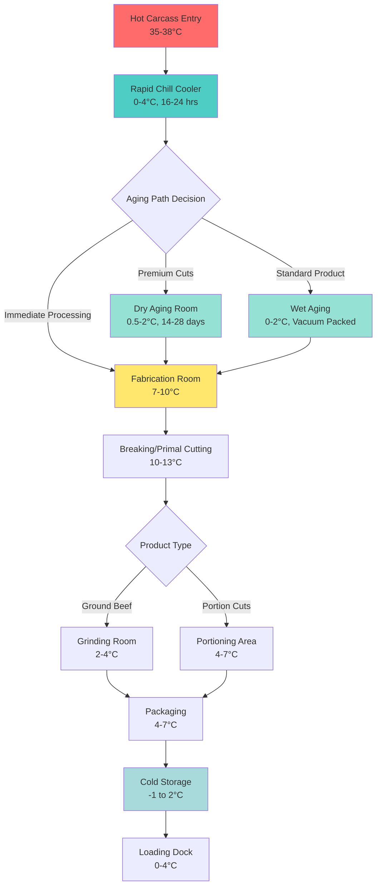
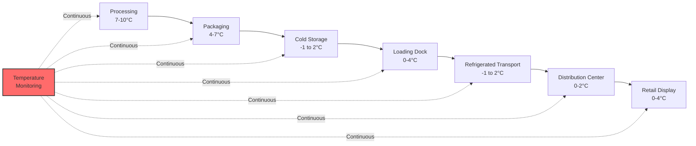

# Beef Processing Refrigeration Systems

Beef processing refrigeration systems represent one of the most demanding applications in food processing, requiring precise temperature and humidity control throughout multiple processing stages. The refrigeration load profile varies dramatically from the initial carcass chilling phase through aging, fabrication, and final packaging operations.

## Thermal Considerations in Beef Processing

The heat removal requirements in beef processing facilities are governed by the fundamental principles of heat transfer and the specific thermophysical properties of beef muscle tissue. The overall cooling load can be expressed as:

$$Q_{total} = Q_{product} + Q_{respiration} + Q_{infiltration} + Q_{equipment} + Q_{lights} + Q_{personnel}$$

For beef processing, the product load dominates, calculated using:

$$Q_{product} = \dot{m} \cdot c_p \cdot \Delta T + \dot{m} \cdot h_{fg}$$

where $\dot{m}$ represents the mass flow rate of beef (typically 500-2000 kg/hr for medium facilities), $c_p$ is the specific heat capacity of beef (approximately 3.54 kJ/kg·K above freezing), $\Delta T$ is the temperature differential, and $h_{fg}$ accounts for any phase change during freezing operations (approximately 250 kJ/kg for lean beef).

## Processing Stage Temperature Requirements

Different processing stages require distinct thermal environments to maintain product quality and comply with USDA Food Safety and Inspection Service (FSIS) regulations:

| Processing Stage | Temperature Range | Relative Humidity | Typical Duration | Heat Load Intensity |
|------------------|-------------------|-------------------|------------------|---------------------|
| Hot Carcass Entry | 35-38°C | 85-90% | Initial state | Extreme (15-20 kW/carcass) |
| Rapid Chilling | 0-4°C | 90-95% | 16-24 hours | High (8-12 kW/carcass) |
| Dry Aging | 0.5-2°C | 70-85% | 14-28 days | Low (0.5-1 kW/carcass) |
| Wet Aging | 0-2°C | 95-98% | 14-35 days | Very Low (0.3-0.5 kW/carcass) |
| Fabrication Room | 7-10°C | 50-60% | 2-6 hours/shift | Medium (3-5 kW/1000 kg) |
| Breaking Room | 10-13°C | 45-55% | Active processing | Medium-High (4-6 kW/1000 kg) |
| Ground Beef Production | 2-4°C | 60-70% | Continuous | High (6-8 kW/1000 kg) |
| Packaging Area | 4-7°C | 55-65% | Continuous | Medium (3-4 kW/1000 kg) |

## Carcass Chilling Dynamics

The post-slaughter chilling process is critical for both food safety and meat quality. USDA requires carcass temperature reduction to below 4°C within 24 hours for beef carcasses. The cooling rate follows Newton's Law of Cooling, modified for the complex geometry of beef carcasses:

$$\frac{dT}{dt} = -k \cdot A \cdot (T - T_{\infty})$$

where $k$ is the overall heat transfer coefficient (typically 8-12 W/m²·K for forced-air chilling), $A$ is the effective surface area (approximately 3.5-4.5 m² for a 300 kg carcass), $T$ is the instantaneous carcass temperature, and $T_{\infty}$ is the refrigerated air temperature.

The challenge lies in achieving rapid cooling to minimize bacterial growth while avoiding "cold shortening" (muscle contraction when temperature drops below 10°C before rigor mortis completion) and excessive moisture loss, which reduces saleable yield.

## Refrigeration System Architecture

## Aging Cooler Design Considerations

Aging represents a controlled enzymatic breakdown of muscle proteins that enhances tenderness and develops flavor complexity. The refrigeration system must maintain precise conditions:

**Dry Aging Requirements:**
- Temperature: 0.5-2°C (±0.3°C precision)
- Relative humidity: 70-85% (strict control to balance moisture loss and mold prevention)
- Air velocity: 0.5-1.5 m/s (promotes moisture evaporation and forms protective crust)
- Expected weight loss: 15-25% over 21-28 days

The moisture removal rate during dry aging can be calculated:

$$\dot{m}_{water} = h_m \cdot A \cdot (P_{sat,surface} - P_{air})$$

where $h_m$ is the mass transfer coefficient (approximately 0.008-0.012 kg/m²·s·Pa), and the vapor pressure difference drives evaporation.

**Wet Aging Requirements:**
- Temperature: 0-2°C (vacuum-packed in bags)
- Duration: 14-35 days
- No significant weight loss
- Reduced refrigeration load compared to dry aging

## Fabrication Room HVAC Design

Fabrication rooms where carcasses are broken into primals require careful environmental control to maintain worker comfort while preventing rapid product temperature rise. The design challenge involves:

1. **Temperature stratification management**: Warmer air at ceiling (14-16°C) for worker comfort, cooler air at work surface level (7-10°C)
2. **Air distribution**: High-velocity low-temperature (HVLT) supply diffusers directed away from workers
3. **Humidity control**: Dehumidification to 50-60% RH prevents condensation on cutting surfaces
4. **Ventilation**: Minimum 6-8 air changes per hour for odor control

The sensible heat ratio (SHR) for fabrication rooms typically ranges from 0.75-0.85:

$$SHR = \frac{Q_{sensible}}{Q_{sensible} + Q_{latent}}$$

## Cold Chain Management and Temperature Monitoring

USDA FSIS regulations mandate continuous temperature monitoring with documented verification. The time-temperature profile directly impacts bacterial growth according to the Arrhenius relationship:

$$k = A \cdot e^{-E_a/(R \cdot T)}$$

where $k$ is the bacterial growth rate constant, $A$ is the frequency factor, $E_a$ is the activation energy (typically 50-90 kJ/mol for psychrotrophic bacteria), $R$ is the gas constant, and $T$ is absolute temperature.

Each degree Celsius above optimal storage temperature approximately doubles the bacterial growth rate, emphasizing the critical importance of continuous cold chain integrity from processing through distribution.

## Equipment Selection Criteria

Refrigeration equipment for beef processing must address:

1. **Rapid heat removal**: Evaporator coils with capacity 20-30% above calculated load for quick pulldown
2. **Defrost cycles**: Automatic defrost every 4-6 hours in high-humidity chill coolers
3. **Compressor staging**: Multiple compressors with capacity modulation for varying loads
4. **Backup systems**: Redundancy for critical aging and storage coolers
5. **Energy recovery**: Heat reclaim from condenser for hot water (washing, sanitation)

The coefficient of performance (COP) for beef processing refrigeration systems typically ranges from 2.5-3.5:

$$COP = \frac{Q_{cooling}}{W_{compressor}}$$

Modern ammonia (R-717) and CO₂ (R-744) systems are preferred for their environmental profile and efficiency in industrial meat processing applications.

## Product Quality and Yield Optimization

Refrigeration system design directly impacts product yield and quality through:

- **Shrink control**: Proper humidity reduces moisture loss from 3-5% to 1-2% during chilling
- **Color retention**: Controlled temperature prevents premature browning (myoglobin oxidation)
- **Texture preservation**: Prevents ice crystal formation in muscle tissue
- **Shelf life extension**: Each degree reduction adds approximately 20-25% to storage life

The economic impact is significant: for a facility processing 200 carcasses daily (300 kg average), reducing shrink by 1% generates approximately $150,000-200,000 in annual savings at typical wholesale pricing.

## Regulatory Compliance and Documentation

USDA FSIS requires documented HACCP (Hazard Analysis and Critical Control Points) plans with refrigeration as critical control points (CCPs). Temperature logs must demonstrate:

- Carcass internal temperature ≤4°C within 24 hours post-slaughter
- Fabrication room temperatures maintained at ≤10°C
- Storage temperatures continuously ≤4°C
- Transport temperatures ≤4°C with no interruption exceeding 30 minutes

Non-compliance can result in product detention, facility suspension, or regulatory action.
