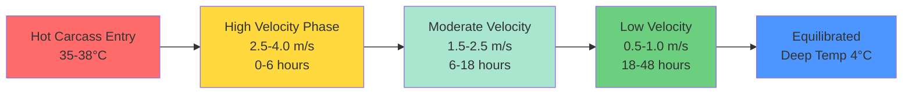
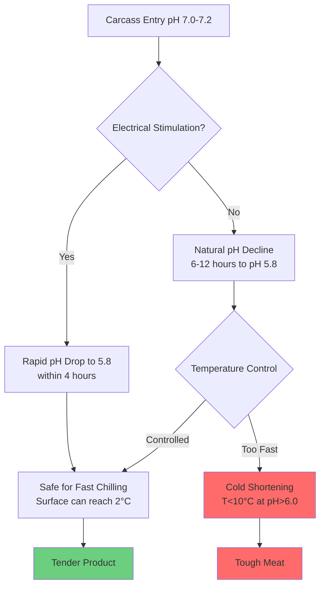

Beef carcass chilling represents one of the most thermally intensive unit operations in meat processing facilities. The process must remove substantial sensible and latent heat from large thermal masses while maintaining precise environmental control to prevent quality defects. Understanding the physics of heat transfer from carcasses, moisture migration dynamics, and muscle biochemistry is essential for proper refrigeration system design.

## Thermal Load Characteristics

Hot beef carcasses enter chill coolers at 35-38°C after slaughter and must reach deep muscle temperatures below 4°C within 24-48 hours depending on carcass weight. The heat removal process follows three distinct phases, each presenting different refrigeration demands.

**Initial Cooling Phase (0-6 hours)**

During the first 6 hours, surface temperatures drop rapidly while the carcass core remains near body temperature. Heat transfer is dominated by convection from the carcass surface and radiation to cooler walls. The heat flux during this period:

$$q'' = h_c(T_s - T_\infty) + \varepsilon\sigma(T_s^4 - T_w^4)$$

where $h_c$ is the convective heat transfer coefficient (typically 15-25 W/m²·K with proper air velocity), $T_s$ is surface temperature, $T_\infty$ is air temperature, $\varepsilon$ is surface emissivity (approximately 0.95 for beef), and $T_w$ is wall temperature.

**Intermediate Phase (6-18 hours)**

As the temperature gradient penetrates deeper into the muscle tissue, conduction through the carcass becomes the limiting mechanism. The thermal diffusivity of beef (approximately 1.4 × 10⁻⁷ m²/s) governs the cooling rate:

$$\frac{\partial T}{\partial t} = \alpha \nabla^2 T$$

This phase requires the highest sustained refrigeration capacity as the bulk of sensible heat is removed.

**Final Equilibration (18-48 hours)**

Deep muscle temperatures approach the setpoint asymptotically. Refrigeration load decreases substantially, consisting primarily of infiltration loads, product respiration, and conduction through insulation.

## Cooler Design Parameters

Optimal chill cooler operation balances competing objectives: rapid cooling to minimize microbial growth, controlled moisture loss, and prevention of cold shortening.

### Temperature Control

Chill room air temperature: **0-2°C**

This range provides adequate temperature differential for heat removal without creating excessive surface freezing. Air temperatures below -1°C increase the risk of surface ice crystal formation, which damages cell membranes and increases purge loss during subsequent processing.

Surface temperature must drop below 7°C within 12 hours to meet USDA pathogen reduction requirements, while deep muscle temperature must reach 4°C before fabrication to satisfy FSIS requirements for temperature control.

### Air Velocity Management

Air velocity over carcasses requires precise control throughout the chilling cycle:

The convective heat transfer coefficient varies with air velocity according to:

$$h_c = C \cdot v^n$$

where $v$ is air velocity, and for cylinders in crossflow (approximating hanging carcasses), $C \approx 8.6$ and $n \approx 0.6$ in SI units.

Variable-speed fans allow velocity reduction as chilling progresses, reducing shrinkage while maintaining adequate heat transfer. A three-stage velocity profile optimizes the cooling curve.

### Relative Humidity Control

Target range: **85-90%**

Humidity control balances two opposing requirements. Lower humidity increases the vapor pressure gradient, accelerating evaporative cooling but increasing shrinkage. Higher humidity reduces shrinkage but may promote surface moisture accumulation and microbial growth.

The evaporation rate from the carcass surface:

$$\dot{m}_e = h_m A (P_{sat,s} - P_\infty)$$

where $h_m$ is the mass transfer coefficient and $P_{sat,s}$ is the saturation pressure at surface temperature.

Achieving 85-90% RH typically requires evaporator coil temperatures only 3-5°C below room air temperature, necessitating large coil surface areas and high air circulation rates.

## Shrinkage Control

Weight loss during chilling represents direct economic loss and affects product yield. Shrinkage results from moisture evaporation and is influenced by air velocity, temperature differential, and exposure time.

| Chilling Protocol | Shrinkage Range | Quality Impact |
|-------------------|-----------------|----------------|
| Conventional (24h, high velocity) | 2.0-2.5% | Good appearance, some toughness risk |
| Slow chilling (48h, low velocity) | 1.5-2.0% | Minimal appearance, cold shortening risk |
| Spray chilling with water mist | 1.0-1.5% | Excellent yield, requires continuous spray |
| Ultra-fast chilling (blast freezing) | 2.5-3.5% | Surface case hardening, high shrinkage |

Acceptable shrinkage for conventional beef carcass chilling: **1.5-2.5%**

The total moisture loss can be estimated:

$$\Delta m = \int_0^t h_m A (P_{sat}(T_s) - \phi P_{sat}(T_a)) \, dt$$

where $\phi$ is relative humidity. Surface crusting during the first 6 hours creates a moisture barrier that reduces subsequent evaporation rates by 30-40%.

## Cold Shortening Prevention

Cold shortening occurs when pre-rigor muscle tissue is cooled below 10°C before ATP depletion, causing uncontrolled muscle contraction and severe toughness. This phenomenon is particularly problematic in beef due to large muscle mass and slow pH decline.

**Critical Temperature-pH Relationship**

$$\text{Cold Shortening Risk} = f(T, \text{pH}, \text{time post-mortem})$$

When muscle temperature drops below 10°C while pH remains above 6.0, calcium release from the sarcoplasmic reticulum triggers actin-myosin binding and contraction, reducing tenderness by up to 50%.

**Prevention Strategies**

1. **Controlled Cooling Rate**: Limit surface cooling during the first 6-8 hours post-mortem to allow glycolysis to proceed and pH to decline below 6.0 before deep muscle reaches 10°C.

2. **Electrical Stimulation**: Application of 300-500V electrical pulses immediately post-mortem accelerates pH decline through enhanced glycolysis, allowing faster chilling without cold shortening risk.

3. **Hot Boning**: Fabrication of carcasses within 2 hours post-mortem before rigor onset, followed by rapid chilling of smaller cuts that cool uniformly.

## Large Carcass Considerations

Mature beef carcasses weighing 300-450 kg present unique cooling challenges due to their unfavorable surface-to-volume ratio. The characteristic dimension for heat transfer analysis:

$$L_c = \frac{V}{A} \approx 0.15 \text{ m for heavy beef sides}$$

The Biot number indicates internal resistance importance:

$$Bi = \frac{h_c L_c}{k} = \frac{(20)(0.15)}{0.45} \approx 6.7$$

With $Bi > 0.1$, internal conduction resistance is significant, and temperature gradients within the carcass cannot be neglected. Heavy carcasses may require 36-48 hours to reach 4°C throughout.

**Split Hanging Configuration**

To improve cooling uniformity, carcasses are split along the vertebral column and hung with adequate spacing (minimum 300 mm between sides) to allow air circulation around all surfaces. The effective heat transfer area increases by approximately 40% compared to whole carcass hanging.

## Refrigeration System Design

Total refrigeration load calculation must account for:

$$Q_{total} = Q_{product} + Q_{respiration} + Q_{infiltration} + Q_{equipment} + Q_{lights} + Q_{people}$$

**Product Load** (typically 65-75% of total):

$$Q_{product} = m \cdot c_p \cdot \Delta T + m \cdot h_{fg} \cdot \text{shrinkage fraction}$$

For beef: $c_p \approx 3.5$ kJ/kg·K above freezing, $h_{fg} = 2450$ kJ/kg for water evaporation.

**Peak Load Timing**: Maximum refrigeration demand occurs 6-10 hours after carcass entry when the bulk of sensible heat removal occurs simultaneously with high respiration rates.

Design evaporator capacity for 125-150% of calculated steady-state load to handle peak conditions during hot carcass loading. Use multiple compressor staging or variable-speed drives to maintain efficiency during the reduced load periods of the chilling cycle.

## USDA Regulatory Requirements

FSIS requires establishments to demonstrate that their chilling processes achieve adequate pathogen reduction:

- Surface temperature below 7°C within 12 hours
- Deep muscle temperature below 4°C before fabrication begins
- Documentation of time-temperature profiles
- Validation that chilling protocols prevent pathogenic growth

Facilities must develop and validate Hazard Analysis and Critical Control Point (HACCP) plans that include critical limits for chill cooler temperature and time parameters.

## Conclusion

Effective beef carcass chilling requires integration of thermodynamics, heat transfer principles, and meat science. Proper refrigeration system design provides sufficient cooling capacity with controlled air delivery to achieve food safety objectives while minimizing shrinkage and preventing cold shortening. Variable-speed air circulation, humidity control, and monitoring of time-temperature profiles are essential for optimal operation.
