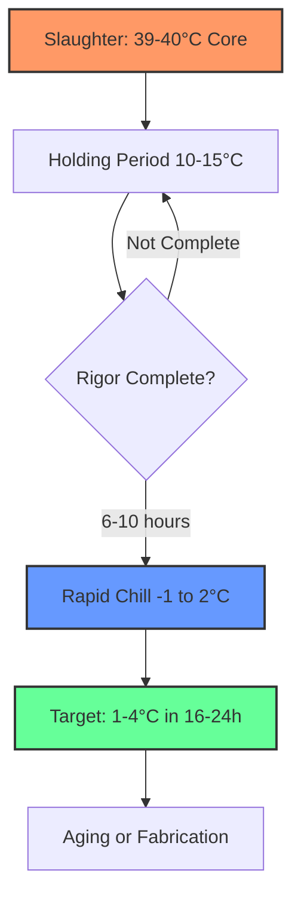
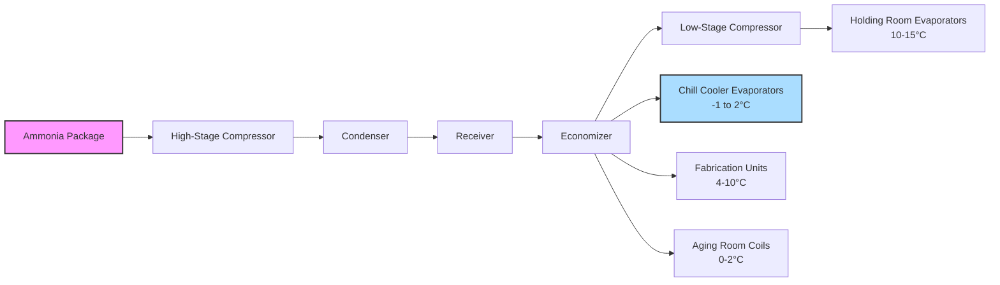

## Overview

Lamb processing refrigeration systems address unique thermal management challenges arising from smaller carcass mass, higher surface area-to-volume ratios, and distinct aging requirements compared to beef and pork. The reduced thermal mass of lamb carcasses (15-35 kg typical dressed weight) demands precise refrigeration control to prevent cold shortening while achieving rapid microbial growth suppression within USDA-FSIS regulatory timeframes.

## Carcass Characteristics and Thermal Properties

### Physical Properties

Lamb carcasses exhibit thermal properties that significantly influence refrigeration system design:

| Property | Value | Units | Notes |
|----------|-------|-------|-------|
| Specific heat (above freezing) | 3.18 | kJ/kg·K | Slightly lower than beef/pork |
| Specific heat (frozen) | 1.68 | kJ/kg·K | Below -1.5°C |
| Thermal conductivity | 0.41-0.48 | W/m·K | Varies with fat content |
| Density | 1050-1080 | kg/m³ | Average for muscle tissue |
| Initial post-slaughter temp | 39-40 | °C | Core temperature |
| Target chill temp | 1-4 | °C | Within 16-24 hours |

### Surface Area Impact

The higher surface area-to-volume ratio in lamb carcasses compared to beef significantly affects heat transfer rates. For a cylindrical approximation:

$\frac{A}{V} = \frac{2\pi r L + 2\pi r^2}{\pi r^2 L} \approx \frac{2}{r}$ (for long cylinders)

Smaller radius increases the ratio, accelerating heat transfer but also increasing susceptibility to surface moisture loss (shrink) and cold shortening if chilling rates exceed muscle fiber tolerance.

## Chilling Protocols and Cold Shortening Prevention

### Critical Temperature Zone

Cold shortening occurs when muscle tissue temperature drops below 10°C before rigor mortis completion (typically 6-10 hours post-slaughter). The phenomenon results from uncontrolled calcium release causing excessive myofibril contraction, producing tough meat.

The contraction force follows:

$F_{contraction} = k \cdot [Ca^{2+}] \cdot e^{-E_a/(R \cdot T)}$

Where calcium ion concentration and temperature govern actomyosin complex formation. Maintaining carcass temperatures above 10°C during the first 10-12 hours prevents this quality defect.

### Two-Stage Chilling Strategy

**Stage 1: Temperature Holding (0-10 hours)**
- Ambient temperature: 10-15°C (50-59°F)
- Air velocity: 0.25-0.5 m/s (low velocity)
- Relative humidity: 85-90%
- Objective: Allow rigor completion above critical temperature

**Stage 2: Rapid Chilling (10-24 hours)**
- Ambient temperature: -1 to 2°C (30-36°F)
- Air velocity: 1.0-2.0 m/s (higher velocity)
- Relative humidity: 90-95%
- Objective: Achieve target deep temperature rapidly

### Heat Transfer Analysis

The convective heat transfer rate from carcass surface follows Newton's law of cooling:

$q = h \cdot A \cdot (T_{surface} - T_{air})$

Where:
- q = heat transfer rate (W)
- h = convection coefficient (8-25 W/m²·K depending on air velocity)
- A = surface area (m²)
- T_surface = carcass surface temperature (°C)
- T_air = ambient air temperature (°C)

The convection coefficient increases with air velocity according to:

$h = C \cdot v^{0.8}$

Doubling air velocity increases h by approximately 75%, significantly accelerating cooling rates.

## Aging Requirements for Quality Development

### Wet Aging Protocol

Wet aging in vacuum packaging allows proteolytic enzyme activity to tenderize meat while preventing moisture loss. Optimal conditions:

| Parameter | Specification | Rationale |
|-----------|--------------|-----------|
| Temperature | 0-2°C (32-36°F) | Minimizes microbial growth while permitting enzyme activity |
| Duration | 7-14 days | Balances tenderness improvement vs. risk |
| Relative humidity | N/A | Vacuum sealed prevents moisture exchange |
| Air circulation | Minimal | Product packaged, no direct air contact |

### Dry Aging Protocol

Dry aging produces concentrated flavor and enhanced tenderness through controlled moisture evaporation and enzymatic activity. This method requires precise environmental control:

| Parameter | Specification | Rationale |
|-----------|--------------|-----------|
| Temperature | 0-2°C (32-36°F) | Enzyme activity without spoilage |
| Duration | 14-28 days | Extended aging for premium products |
| Relative humidity | 75-85% | Balance water loss vs. excessive drying |
| Air velocity | 0.5-1.0 m/s | Uniform drying, prevent surface case hardening |

The moisture loss rate during dry aging follows:

$\frac{dm}{dt} = h_m \cdot A \cdot (P_{sat,surface} - P_{air})$

Where:
- dm/dt = mass loss rate (kg/s)
- h_m = mass transfer coefficient (kg/m²·s·Pa)
- P_sat,surface = saturation vapor pressure at surface temperature (Pa)
- P_air = partial pressure of water vapor in air (Pa)

Typical shrink losses range from 8-15% for 14-21 day aging periods.

## Fabrication Room Temperature Control

### Operating Conditions

Lamb fabrication (cutting, trimming, portioning) requires temperatures balancing product safety, fat consistency, and worker comfort:

| Operation | Temperature Range | RH | Air Velocity |
|-----------|------------------|-----|--------------|
| Primary breakdown | 7-10°C (45-50°F) | 75-85% | 0.15-0.4 m/s |
| Fine cutting | 4-7°C (39-45°F) | 75-85% | 0.2-0.4 m/s |
| Packaging | 7-10°C (45-50°F) | 70-80% | 0.15-0.3 m/s |

Lower temperatures harden subcutaneous and intramuscular fat, facilitating cleaner cuts and reducing smearing during mechanical slicing operations.

### Refrigeration Load Components

The total refrigeration load in fabrication rooms includes:

$Q_{total} = Q_{product} + Q_{personnel} + Q_{equipment} + Q_{lights} + Q_{infiltration} + Q_{transmission}$

**Product Load:**
For 1000 kg/hour throughput warming from 2°C to 8°C average:

$Q_{product} = \frac{\dot{m} \cdot c_p \cdot \Delta T}{3600} = \frac{1000 \cdot 3.18 \cdot 6}{3600} = 5.3 \text{ kW}$

**Personnel Load:**
Each worker generates approximately 250-300 W sensible heat and 100-150 W latent heat at 7-10°C ambient. For 15 workers:

$Q_{personnel} = 15 \cdot 400 = 6.0 \text{ kW total}$

**Equipment Load:**
Band saws, grinders, conveyors, and packaging equipment contribute motor heat. Estimate 2-4 kW per major piece of equipment.

## Export Market Specifications

### Temperature Documentation Requirements

Export lamb to major markets (Middle East, Asia, Europe) mandates continuous temperature monitoring and documentation from slaughter through shipping:

| Market | Max Product Temp | Monitoring Frequency | Documentation Period |
|--------|-----------------|---------------------|---------------------|
| EU | 7°C (45°F) | Continuous digital | 3 years minimum |
| Middle East | 4°C (39°F) | Every 4 hours minimum | 2 years minimum |
| Japan | 5°C (41°F) | Continuous digital | 2 years minimum |
| China | 7°C (45°F) | Continuous digital | 2 years minimum |

### Halal Processing Considerations

Halal lamb processing for export markets requires religious compliance integrated with refrigeration protocols. Critical considerations:

1. **Bleeding efficiency**: Complete exsanguination before chilling begins
2. **Rapid chilling initiation**: Within 30-60 minutes post-slaughter
3. **Segregation**: Dedicated chillers prevent cross-contamination
4. **Traceability**: Temperature records linked to religious certification

## Refrigeration System Design

### Two-Stage Ammonia System

Large lamb processing facilities benefit from two-stage ammonia systems operating at optimized suction pressures for different temperature zones. The coefficient of performance improves with economizer intercooling:

$COP_{two-stage} = \frac{Q_L}{W_{low} + W_{high}}$

Compared to single-stage operation at the same evaporator temperature, two-stage systems achieve 15-25% efficiency improvement for temperatures below -10°C.

## Microbial Growth Control

Temperature remains the primary defense against pathogen proliferation. The lag phase before bacterial growth begins increases exponentially with temperature reduction:

$t_{lag} = t_0 \cdot e^{b(T_{ref} - T)}$

Where:
- t_lag = lag phase duration (hours)
- t_0 = reference lag time
- b = temperature coefficient (typically 0.15-0.25)
- T_ref = reference temperature (usually 20°C)
- T = storage temperature (°C)

Reducing storage temperature from 10°C to 2°C extends lag phase from approximately 2 hours to 12-18 hours for common spoilage organisms.

## Conclusion

Lamb processing refrigeration systems require integrated thermal management strategies addressing the species' unique physiological characteristics, smaller carcass dimensions, aging requirements, and international export specifications. Two-stage chilling protocols prevent cold shortening while ensuring rapid microbial growth suppression. Precise environmental control during aging and fabrication optimizes product quality, and comprehensive temperature documentation satisfies regulatory and market access requirements. Proper refrigeration system design balancing capacity, efficiency, and reliability ensures consistent product quality and food safety throughout the processing chain.
