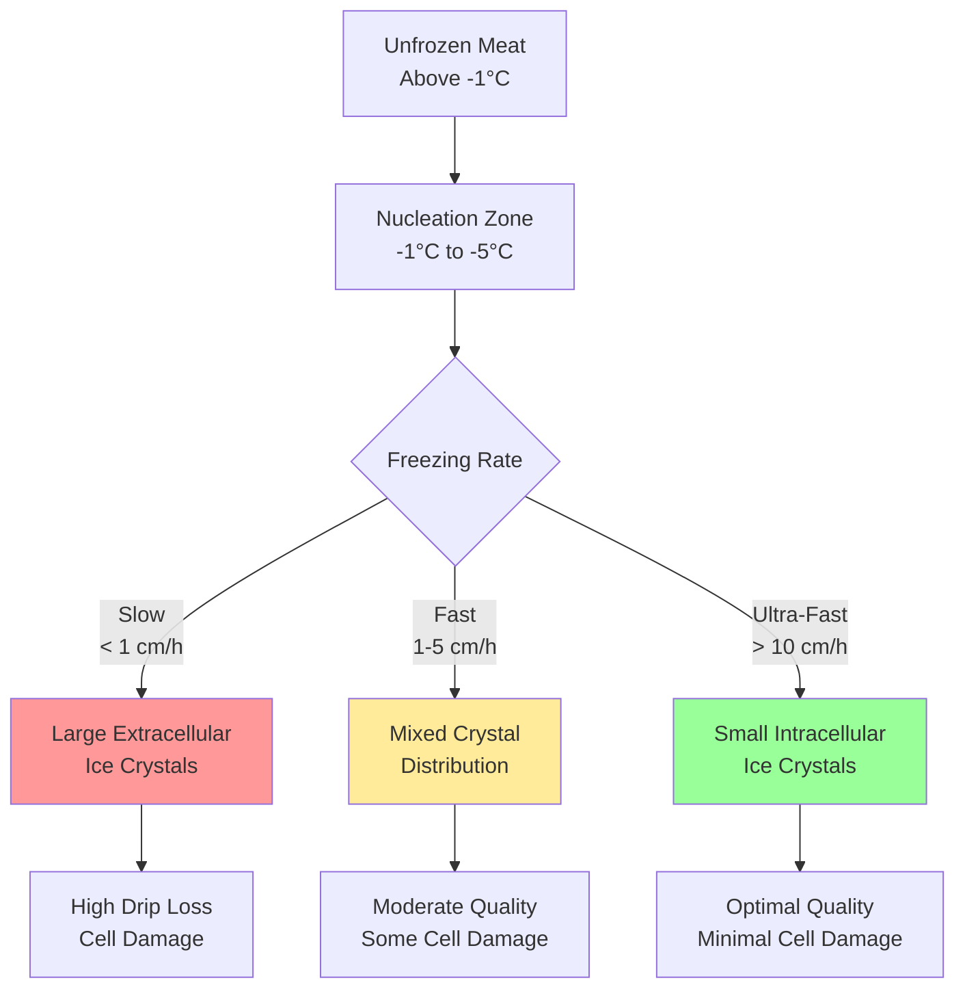
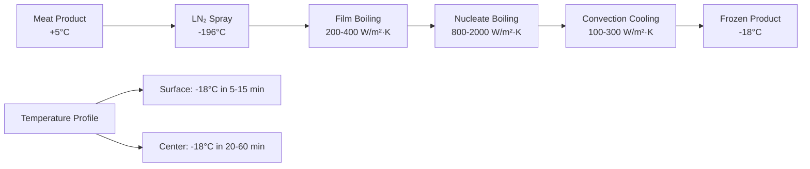

Meat freezing preserves product quality through controlled phase change of water within muscle tissue. The freezing method selected directly impacts ice crystal size, drip loss, texture retention, and microbial stability through heat transfer rate and temperature profiles.

## Freezing Rate Physics

Freezing rate determines ice crystal morphology within meat tissue. The heat transfer during freezing follows Fourier's law:

$$q = -k A \frac{dT}{dx}$$

where $q$ is heat transfer rate (W), $k$ is thermal conductivity (W/m·K), $A$ is surface area (m²), and $\frac{dT}{dx}$ is temperature gradient.

The freezing time for meat products can be estimated using Plank's equation:

$$t_f = \frac{\rho \Delta H}{T_f - T_m} \left(\frac{P \cdot d}{h} + \frac{R \cdot d^2}{k}\right)$$

where:
- $t_f$ = freezing time (s)
- $\rho$ = density (kg/m³)
- $\Delta H$ = latent heat of fusion (334 kJ/kg for water)
- $T_f$ = freezing medium temperature (°C)
- $T_m$ = initial freezing point of meat (-1.5 to -2.5°C)
- $P$, $R$ = shape factors (0.5, 0.125 for infinite slab)
- $d$ = thickness (m)
- $h$ = surface heat transfer coefficient (W/m²·K)
- $k$ = thermal conductivity (W/m·K)

### Ice Crystal Formation Mechanism

Ice nucleation in meat tissue occurs through two pathways:

1. **Homogeneous nucleation**: Spontaneous ice formation at temperatures below -40°C
2. **Heterogeneous nucleation**: Crystal formation on nucleation sites (proteins, cell membranes) at -1.5 to -5°C

Critical radius for stable ice nucleus formation:

$$r^* = \frac{2\sigma T_m}{L_f \rho_{ice} \Delta T}$$

where $\sigma$ is surface tension (0.032 J/m²), $L_f$ is latent heat, and $\Delta T$ is supercooling degree.

**Freezing rate classification (ASHRAE Handbook - Refrigeration)**:
- Slow: < 1 cm/h (large ice crystals, 50-200 μm)
- Fast: 1-5 cm/h (medium crystals, 20-50 μm)
- Quick: 5-10 cm/h (small crystals, 10-20 μm)
- Ultra-rapid: > 10 cm/h (microcrystals, < 10 μm)

## Blast Freezing Systems

Blast freezing uses high-velocity air at -30 to -40°C to achieve fast freezing rates through forced convection.

**Heat transfer coefficient calculation**:

$$h = \frac{Nu \cdot k_{air}}{L}$$

where Nusselt number $Nu$ correlates with Reynolds number:

$$Nu = C \cdot Re^m \cdot Pr^{1/3}$$

For air velocities of 3-6 m/s across meat products, $h$ ranges from 25-50 W/m²·K.

### Blast Freezer Design Parameters

| Parameter | Continuous Tunnel | Batch Cabinet | Spiral Belt |
|-----------|------------------|---------------|-------------|
| Air Temperature | -35 to -40°C | -30 to -40°C | -30 to -35°C |
| Air Velocity | 4-6 m/s | 3-5 m/s | 2-4 m/s |
| Freezing Time (10 cm) | 2-4 hours | 3-6 hours | 3-5 hours |
| Product Throughput | 2000-5000 kg/h | 500-2000 kg/batch | 1000-3000 kg/h |
| Energy Consumption | 250-350 kWh/tonne | 300-400 kWh/tonne | 280-350 kWh/tonne |
| Typical Heat Transfer | 35-45 W/m²·K | 25-35 W/m²·K | 30-40 W/m²·K |
| Ice Crystal Size | 30-60 μm | 50-100 μm | 40-80 μm |
| Drip Loss | 2-4% | 3-6% | 2.5-5% |

**Applications**: Portion-controlled cuts, ground meat patties, poultry parts, boxed primals

## Plate Freezing Systems

Plate freezers transfer heat through direct contact with refrigerated metal plates, achieving heat transfer coefficients of 150-300 W/m²·K.

Contact freezing heat transfer:

$$q = h_{contact} A (T_{product} - T_{plate})$$

Contact resistance at the interface:

$$R_{contact} = \frac{1}{h_{contact}} = \frac{\delta_{gap}}{k_{air}} + \frac{\delta_{frost}}{k_{frost}}$$

where typical $\delta_{gap}$ is 0.1-0.5 mm. Applied hydraulic pressure (20-50 kPa) minimizes air gaps.

### Plate Freezer Performance

| Characteristic | Horizontal Plate | Vertical Plate |
|----------------|------------------|----------------|
| Plate Temperature | -35 to -42°C | -35 to -40°C |
| Contact Pressure | 20-50 kPa | 15-30 kPa |
| Heat Transfer Coefficient | 200-300 W/m²·K | 150-250 W/m²·K |
| Freezing Time (5 cm) | 1.5-2.5 hours | 2-3 hours |
| Product Thickness Range | 25-100 mm | 30-120 mm |
| Energy Efficiency | 180-250 kWh/tonne | 200-280 kWh/tonne |
| Ice Crystal Size | 20-40 μm | 25-50 μm |
| Drip Loss | 1.5-3% | 2-4% |
| Typical Applications | Fish blocks, meat blocks | Retail packages |

**Advantages**:
- Superior heat transfer through conduction
- Uniform freezing across product surface
- Minimal dehydration (closed contact)
- Space-efficient vertical/horizontal configurations

**Limitations**:
- Requires flat, uniform product geometry
- Limited to packaged or block products
- Higher equipment cost per unit capacity

## Cryogenic Freezing Systems

Cryogenic freezing employs liquid nitrogen (LN₂ at -196°C) or liquid carbon dioxide (LCO₂ at -78°C) for ultra-rapid freezing rates exceeding 10 cm/h.

Heat transfer combines convection from vapor and boiling on product surface:

$$q_{cryo} = h_{conv}(T_s - T_{\infty}) + h_{boil}(T_s - T_{sat})$$

Boiling heat transfer coefficients reach 500-2000 W/m²·K during nucleate boiling phase.

### Cryogenic System Comparison

| Parameter | Liquid Nitrogen (LN₂) | Liquid CO₂ (LCO₂) | CO₂ Snow |
|-----------|----------------------|-------------------|----------|
| Cryogen Temperature | -196°C | -78°C | -78°C |
| Heat Transfer Peak | 1500-2000 W/m²·K | 800-1200 W/m²·K | 400-800 W/m²·K |
| Freezing Time (2.5 cm) | 5-15 minutes | 10-20 minutes | 15-30 minutes |
| Cryogen Consumption | 0.8-1.2 kg/kg product | 0.6-1.0 kg/kg product | 0.5-0.8 kg/kg product |
| Operating Cost | $0.40-0.60/kg | $0.25-0.40/kg | $0.20-0.35/kg |
| Ice Crystal Size | 5-15 μm | 10-25 μm | 15-35 μm |
| Drip Loss | 0.5-1.5% | 1-2% | 1.5-2.5% |
| Surface Dehydration | Minimal (< 0.5%) | Low (< 1%) | Low (< 1%) |

**Cryogenic advantages**:
- Microcrystalline ice structure (5-20 μm)
- Minimal cellular disruption
- Preservation of protein functionality
- Negligible oxidation (inert atmosphere)
- Flexible installation (no mechanical refrigeration)

**Economic considerations**:
Higher operating costs ($0.20-0.60/kg) versus mechanical freezing ($0.08-0.15/kg) offset by:
- Superior product quality and yield
- Reduced drip loss (0.5-2% vs 2-6%)
- Higher throughput per unit floor space
- Lower capital investment for small-scale operations

## Freezing Rate Effects on Meat Quality

The relationship between freezing rate and quality attributes:

$$\text{Drip Loss (\%)} = a + b \cdot \frac{1}{\text{Freezing Rate}}$$

where coefficients depend on muscle type and pre-freeze condition.

### Quality Impact Matrix

| Attribute | Slow Freeze | Fast Freeze | Ultra-Rapid Freeze |
|-----------|-------------|-------------|---------------------|
| Ice Crystal Size | 50-200 μm | 20-50 μm | 5-20 μm |
| Cell Membrane Damage | Severe | Moderate | Minimal |
| Drip Loss (Thaw) | 5-8% | 2-4% | 0.5-2% |
| Protein Denaturation | 15-25% | 8-15% | 3-8% |
| Color Retention | Poor | Good | Excellent |
| Texture Score (1-10) | 5-6 | 7-8 | 8-9 |
| Microbial Stability | 6-9 months | 9-12 months | 12-18 months |
| Oxidative Stability | 3-6 months | 6-9 months | 9-15 months |

**Physical mechanisms**:
1. **Extracellular freezing**: Large crystals form outside cells, creating osmotic gradient
2. **Cell dehydration**: Water migrates from cells, concentrating solutes
3. **Membrane rupture**: Ice crystals physically puncture cell membranes
4. **Protein denaturation**: Concentrated solutes denature proteins during slow freezing

Optimal freezing passes through maximum ice crystal formation zone (-1 to -5°C) in less than 30 minutes to minimize crystal growth.

---

**References**:
- ASHRAE Handbook - Refrigeration, Chapter 30: Meat Products
- ASHRAE Handbook - Refrigeration, Chapter 29: Thermal Properties of Foods
- Journal of Food Engineering: Ice crystal size distribution in frozen meat systems
- International Institute of Refrigeration: Recommendations for the Processing and Handling of Frozen Foods

