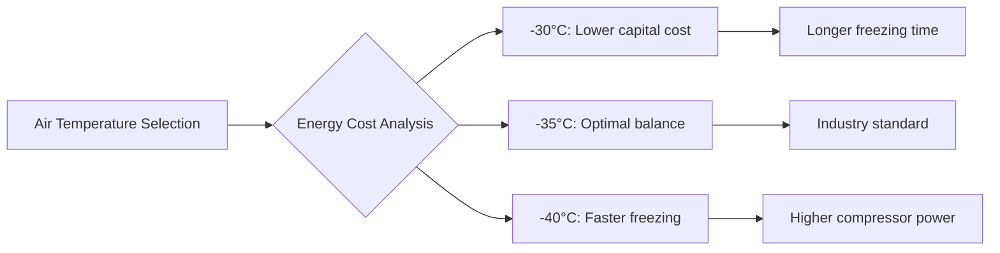
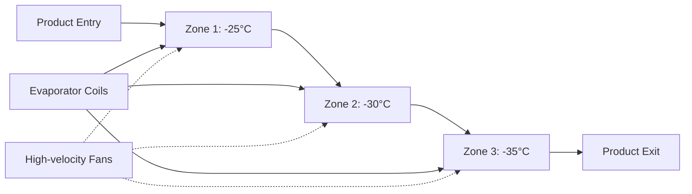
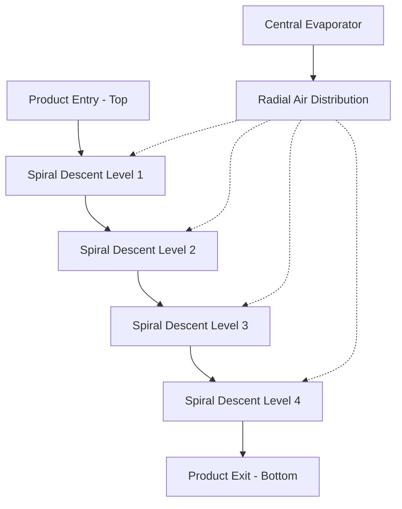

Blast freezing represents the most widely implemented rapid freezing technology in meat processing facilities. The method relies on forced convection heat transfer, where high-velocity cold air removes heat from product surfaces at rates sufficient to minimize ice crystal formation and preserve meat quality. Understanding the physics governing convective freezing enables proper system selection and operational optimization.

## Convective Heat Transfer Fundamentals

Heat removal during blast freezing occurs through forced convection, where air velocity directly influences the surface heat transfer coefficient. The relationship follows Newton's law of cooling:

$$q = h \cdot A \cdot (T_s - T_\infty)$$

Where $q$ is heat transfer rate (W), $h$ is convective heat transfer coefficient (W/m²·K), $A$ is surface area (m²), $T_s$ is surface temperature (K), and $T_\infty$ is air temperature (K).

The convective coefficient correlates with air velocity through empirical relationships. For turbulent flow over meat products:

$$h = C \cdot v^{0.8}$$

Where $C$ is a geometry-dependent constant and $v$ is air velocity (m/s). This exponent demonstrates that doubling air velocity increases heat transfer by approximately 74%, though with diminishing returns at higher velocities.

## Air Velocity Requirements

ASHRAE Refrigeration Handbook specifies blast freezer air velocities between 2.5 and 6 m/s, with optimal ranges depending on product configuration:

| Product Type | Air Velocity | Rationale |
|--------------|--------------|-----------|
| Packaged cuts | 2.5-3.5 m/s | Prevents package deformation |
| Unwrapped carcasses | 4-6 m/s | Maximizes surface heat transfer |
| Ground meat blocks | 3-4 m/s | Balances freezing rate with surface desiccation |
| Thin products (<25 mm) | 5-6 m/s | Achieves rapid through-freezing |

Velocities exceeding 6 m/s provide minimal additional heat transfer benefit while substantially increasing fan power consumption (proportional to $v^3$) and surface dehydration rates.

## Temperature Profiles and Operating Conditions

Blast freezer air temperatures typically range from -30°C to -40°C, establishing sufficient temperature differential to drive rapid heat removal. The temperature differential between air and product surface governs freezing rate:

$$\frac{dT}{dt} = \frac{h}{\rho c_p \delta}(T_\infty - T)$$

Where $\rho$ is density (kg/m³), $c_p$ is specific heat (J/kg·K), and $\delta$ is characteristic dimension (m).

Lower air temperatures accelerate freezing but increase refrigeration system operating costs and frost formation on coils. Economic optimization generally favors -35°C as a balance point:

## Freezing Time Calculations

Plank's equation provides first-order freezing time estimates for regular-shaped products:

$$t_f = \frac{\rho L}{T_f - T_\infty} \left[\frac{P \cdot d}{h} + \frac{R \cdot d^2}{k}\right]$$

Where:
- $t_f$ = freezing time (s)
- $\rho$ = density (kg/m³)
- $L$ = latent heat of fusion (334 kJ/kg for water)
- $T_f$ = freezing point (°C)
- $T_\infty$ = air temperature (°C)
- $P$, $R$ = shape factors (0.5, 0.125 for infinite slab)
- $d$ = thickness (m)
- $h$ = surface heat transfer coefficient (W/m²·K)
- $k$ = thermal conductivity of frozen product (W/m·K)

For a 100 mm beef slab with typical properties ($\rho$ = 1050 kg/m³, $k$ = 1.3 W/m·K, 75% moisture):

$$t_f = \frac{1050 \times 250}{-5 - (-35)} \left[\frac{0.5 \times 0.1}{25} + \frac{0.125 \times 0.01}{1.3}\right] = 8750 \times 0.003 = 145 \text{ minutes}$$

This calculation assumes $h$ = 25 W/m²·K at 4 m/s air velocity.

## Tunnel Freezer Configuration

Tunnel freezers utilize linear product flow through a refrigerated chamber with counterflow or parallel air circulation:

**Advantages:**
- Simple product handling via belt or trolley systems
- Easily scaled by extending tunnel length
- Accommodates irregular product sizes
- Lower capital cost per unit capacity

**Limitations:**
- Large floor space requirement (typically 20-40 m length)
- Air velocity variation across belt width
- Difficulty maintaining consistent air distribution

Tunnel freezers suit high-volume operations processing standardized products where floor space permits linear layouts.

## Spiral Freezer Configuration

Spiral freezers employ a helical conveyor within a cylindrical or rectangular chamber, maximizing capacity per floor area:

**Advantages:**
- Compact footprint (3-5 m diameter, 4-8 m height)
- Retention times adjustable via belt speed
- Efficient air circulation patterns
- Suitable for facilities with limited floor area

**Limitations:**
- Higher capital cost per unit capacity
- Complex belt tracking and maintenance
- Product height restrictions (typically <150 mm)
- Potential velocity variation from center to perimeter

Spiral configuration proves advantageous when freezing uniform products in space-constrained facilities requiring high throughput.

## System Performance Comparison

| Parameter | Tunnel Freezer | Spiral Freezer |
|-----------|----------------|----------------|
| Floor area | 80-150 m² per tonne/hr | 20-40 m² per tonne/hr |
| Air velocity uniformity | ±15-25% | ±10-20% |
| Product versatility | High | Medium |
| Capital cost | $800-1200/kW | $1200-1800/kW |
| Maintenance complexity | Low | Medium-High |
| Typical capacity | 1-10 tonnes/hr | 0.5-5 tonnes/hr |

## Heat Load Calculations

Total refrigeration load comprises product cooling, ambient infiltration, and fan heat:

$$Q_{total} = Q_{product} + Q_{infiltration} + Q_{fans}$$

Product heat load accounts for sensible cooling above freezing point, latent heat of fusion, and sensible cooling below freezing:

$$Q_{product} = \dot{m} \left[c_{p,unfrozen}(T_{initial} - T_f) + L + c_{p,frozen}(T_f - T_{final})\right]$$

For beef entering at 5°C and exiting at -18°C with 75% moisture content:

$$Q_{product} = \dot{m} \left[3.5 \times 10 + 250 + 1.8 \times 13\right] = \dot{m} \times 308.4 \text{ kJ/kg}$$

At 1000 kg/hr throughput, product load equals 85.7 kW. Adding infiltration (15-20%) and fan heat (10-15%) yields total evaporator capacity of approximately 115 kW.

## Operational Considerations

**Air Distribution Uniformity**: Computational fluid dynamics analysis reveals air velocity variations up to 40% in poorly designed systems. Proper plenum design and evaporator placement maintain velocity uniformity within ±15%.

**Frost Management**: Evaporator coil temperatures of -40°C to -45°C produce rapid frost accumulation. Hot gas defrost cycles every 6-12 hours maintain heat transfer efficiency.

**Product Spacing**: Minimum 25 mm clearance between products prevents air bypass and ensures adequate surface exposure. Stacking products reduces effective heat transfer area by 30-50%.

**Temperature Monitoring**: Multi-point temperature sensing throughout product mass verifies complete freezing. Center temperature below -18°C confirms food safety compliance.

ASHRAE guidelines recommend blast freezing as the primary rapid freezing method for most meat processing applications, balancing capital cost, operational flexibility, and product quality preservation.
