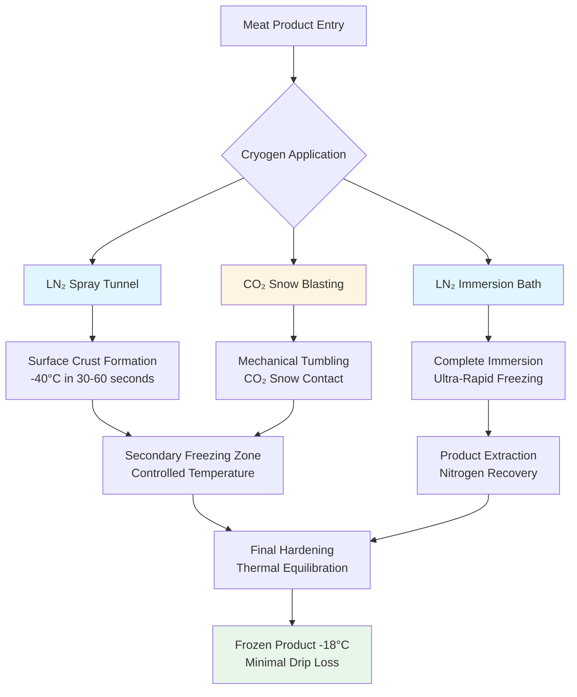

Cryogenic freezing represents the fastest commercial meat freezing technology, utilizing ultra-low temperature cryogens—liquid nitrogen (LN₂) at -196°C and carbon dioxide (CO₂) at -78°C—to achieve freezing rates 10 to 50 times faster than conventional mechanical systems. This ultra-rapid heat removal fundamentally alters ice crystal formation physics, preserving cellular structure and minimizing quality degradation.

## Cryogenic Media Fundamentals

### Liquid Nitrogen (LN₂)

Liquid nitrogen provides the coldest commercially available cryogen with exceptional heat transfer characteristics:

**Thermophysical Properties:**
- Boiling point: -196°C (-321°F) at atmospheric pressure
- Latent heat of vaporization: 199 kJ/kg
- Specific heat (liquid): 2.04 kJ/(kg·K)
- Density (liquid): 808 kg/m³ at boiling point

**Heat Transfer Mechanisms:**

The total cooling capacity involves sensible heating of liquid nitrogen followed by phase change:

$$Q = m_{N_2} \left[ c_p \Delta T + h_{fg} \right]$$

where $m_{N_2}$ is nitrogen mass flow, $c_p$ is specific heat, $\Delta T$ is temperature rise, and $h_{fg}$ is latent heat.

The dominant heat transfer occurs during boiling, where convective coefficients reach 5,000-15,000 W/(m²·K) compared to 20-50 W/(m²·K) for air blast freezing. This 100-300× enhancement drives ultra-rapid freezing.

### Carbon Dioxide (CO₂) Snow

CO₂ sublimes directly from solid to gas at atmospheric pressure:

**Thermophysical Properties:**
- Sublimation temperature: -78.5°C (-109.3°F)
- Latent heat of sublimation: 571 kJ/kg
- Triple point: -56.6°C at 5.18 bar
- Snow density: 1,560 kg/m³

CO₂ pellets or snow provide intermediate freezing rates between LN₂ and mechanical systems at lower cost than nitrogen. The sublimation enthalpy is 2.9× greater than nitrogen's vaporization enthalpy, providing significant cooling per unit mass.

## Freezing Rate Physics

### Ice Crystal Formation

Freezing rate fundamentally controls ice crystal size through nucleation and growth kinetics. The characteristic freezing time from initial freezing point to thermal center reaching -18°C defines the process:

$$t_f = \frac{\rho L d^2}{24 h (T_{\infty} - T_f)}$$

where $\rho$ is density, $L$ is latent heat, $d$ is thickness, $h$ is heat transfer coefficient, $T_{\infty}$ is cryogen temperature, and $T_f$ is freezing point.

**Cryogenic Advantage:**

The enormous temperature differential $(T_{\infty} - T_f)$ and extreme heat transfer coefficient $h$ reduce freezing time by orders of magnitude:

| Freezing Method | h [W/(m²·K)] | $\Delta T$ [°C] | Freezing Time† |
|-----------------|--------------|-----------------|----------------|
| Air blast (-40°C) | 25 | 40 | 120 min |
| Plate contact | 150 | 40 | 45 min |
| LN₂ immersion | 8,000 | 196 | 4 min |
| LN₂ spray | 5,000 | 196 | 6 min |
| CO₂ snow | 1,200 | 78 | 15 min |

† For 25 mm thick beef patty

### Nucleation Temperature Depression

Ultra-rapid cooling suppresses ice crystal growth by driving nucleation at significantly lower temperatures. The nucleation rate increases exponentially with supercooling:

$$J = A \exp\left(-\frac{\Delta G^*}{k_B T}\right)$$

where $\Delta G^*$ is nucleation energy barrier, inversely proportional to supercooling degree.

Cryogenic freezing achieves 10-15°C supercooling versus 1-3°C for slow freezing, producing 1,000× more nucleation sites. This creates numerous microscopic ice crystals (5-20 μm) rather than large damaging crystals (50-150 μm) that rupture cell membranes.

## Cryogenic System Configurations

### Spray Tunnel Systems

Liquid nitrogen spray tunnels represent the most common industrial configuration:

**Design Parameters:**
- Belt speed: 0.5-5 m/min
- Residence time: 3-15 minutes
- LN₂ consumption: 0.8-1.5 kg per kg product
- Product temperature reduction: 150-180°C

Spray nozzles atomize liquid nitrogen into fine droplets, maximizing surface area and heat transfer. Multi-zone tunnels provide:

1. **Pre-cooling zone**: -50°C, gentle cooling to avoid thermal shock
2. **Crust formation zone**: -100°C, rapid surface freezing
3. **Deep freezing zone**: -150°C, thermal center freezing
4. **Equilibration zone**: -40°C, temperature stabilization

### Immersion Freezing

Direct immersion in liquid nitrogen baths achieves maximum freezing rate:

**Operating Characteristics:**
- Product residence: 1-5 minutes
- LN₂ consumption: 1.2-2.0 kg per kg product
- Suitable for IQF portions, small products
- Nitrogen circulation required to prevent vapor blanketing

The Leidenfrost effect limits heat transfer when vapor film forms around warm product. Agitation and nitrogen circulation disrupt this film, maintaining nucleate boiling regime.

### CO₂ Snow Systems

Carbon dioxide systems inject liquid CO₂ through expansion nozzles, producing snow:

**Process Characteristics:**
- Expansion from 20 bar liquid to atmospheric snow
- Snow yield: ~45% of liquid CO₂ mass
- Mechanical tumbling promotes contact
- Lower capital cost than LN₂ systems

CO₂ systems typically operate at 60-70% of LN₂ operating cost but achieve slower freezing rates.

## Individual Quick Frozen (IQF) Applications

Cryogenic freezing excels at IQF production—individually frozen pieces that remain free-flowing:

**IQF Advantages:**
- Non-agglomerated products enable portion control
- Extended surface area maximizes cryogen contact
- Uniform freezing of irregular shapes
- Minimal product dehydration (<0.5% weight loss)

**Common IQF Meat Products:**
- Diced chicken breast
- Beef strips and cubes
- Pork medallions
- Formed patties and meatballs
- Sliced bacon

The ultra-rapid surface crust formation (30-60 seconds to -40°C surface temperature) prevents particles from adhering during subsequent freezing stages.

## Quality Preservation Mechanisms

### Minimal Drip Loss

Drip loss upon thawing directly correlates with ice crystal size. Large ice crystals physically rupture cell membranes and denature proteins, releasing intracellular fluid during thaw.

**Measured Drip Loss:**

| Freezing Method | Ice Crystal Size [μm] | Drip Loss [%] |
|-----------------|----------------------|---------------|
| Slow freeze (-20°C) | 100-150 | 8-12 |
| Air blast (-40°C) | 50-80 | 4-6 |
| Cryogenic LN₂ | 10-25 | 1-2 |
| Cryogenic CO₂ | 20-40 | 2-3 |

ASHRAE Handbook—Refrigeration (2022) reports cryogenic freezing reduces drip loss by 60-75% compared to conventional air blast freezing.

### Color and Texture Retention

The rapid freezing rate minimizes enzymatic activity and oxidation:

$$\text{Reaction Rate} = A \exp\left(-\frac{E_a}{RT}\right)$$

Ultra-rapid temperature reduction through the critical -5°C to -1°C zone (where most enzymatic degradation occurs) limits reaction time to seconds versus minutes, preserving:

- Myoglobin color stability (bright red beef, pink pork)
- Protein functionality and water-holding capacity
- Textural integrity and tenderness

### Microbial Quality

While freezing does not sterilize, ultra-rapid freezing through the mesophilic growth range (5-40°C) in <30 seconds prevents microbial multiplication during processing.

## Economic Considerations

### Cryogen Consumption

Theoretical minimum cryogen requirement equals product enthalpy change divided by cryogen cooling capacity:

$$m_{cryo} = \frac{m_{product} \left[ c_p \Delta T + L_{product} \right]}{c_{p,cryo} \Delta T_{cryo} + h_{fg,cryo}}$$

Practical consumption exceeds theoretical by 1.5-3× due to:
- Convective losses to ambient air
- Radiant heat gains
- Evaporative losses during handling
- Inefficient product-cryogen contact

**Typical Consumption Ratios:**

| Product Type | LN₂ [kg/kg] | CO₂ [kg/kg] |
|--------------|-------------|-------------|
| Thin patties | 0.8-1.2 | 1.2-1.8 |
| Diced meat (IQF) | 1.0-1.5 | 1.5-2.2 |
| Whole portions | 1.2-1.8 | 1.8-2.5 |

### Cost-Benefit Analysis

Cryogenic freezing operating costs typically run 3-5× higher than mechanical freezing per kg product frozen. However, economic justification derives from:

**Quantifiable Benefits:**
- Reduced drip loss: 4-8% weight retention = $0.10-0.30/kg revenue (premium meats)
- Extended shelf life: 25-35% increase in storage duration
- Premium pricing: 15-25% for superior quality products
- Reduced floor space: 75% smaller footprint than blast tunnels
- Lower capital investment: $100,000-300,000 vs $500,000-1,500,000 for equivalent mechanical capacity

**Hybrid Systems:**

Two-stage freezing combines cryogenic and mechanical methods:

1. Cryogenic crust formation (1-2 minutes, surface to -40°C)
2. Mechanical hardening in blast tunnel (30-60 minutes, center to -18°C)

This approach achieves 80-90% of quality benefits at 40-60% of full cryogenic operating cost by using expensive cryogen only for critical surface freezing phase.

## Safety and Environmental Considerations

**Oxygen Displacement:**

Nitrogen displaces oxygen in confined spaces. Adequate ventilation maintains >19.5% oxygen concentration. Continuous monitoring required in enclosed tunnels.

**Cryogenic Burns:**

Direct contact with LN₂ causes severe frostbite. Personnel protective equipment (PPE) includes insulated gloves, face shields, and cryogenic aprons.

**CO₂ Exposure:**

Time-weighted average exposure limit: 5,000 ppm (0.5%). Short-term exposure limit: 30,000 ppm (3%). Adequate ventilation and monitoring prevents asphyxiation risk.

**Environmental Impact:**

Nitrogen comprises 78% of atmosphere—releases cause no environmental harm. CO₂ systems may recover and recycle gas, though economic viability depends on scale and regional carbon pricing.

## References

- ASHRAE Handbook—Refrigeration, Chapter 29: Food Microbiology and Engineering (2022)
- ASHRAE Handbook—Refrigeration, Chapter 20: Meat Products (2022)
- International Institute of Refrigeration, Recommendations for Chilled Storage of Perishable Produce (2020)
