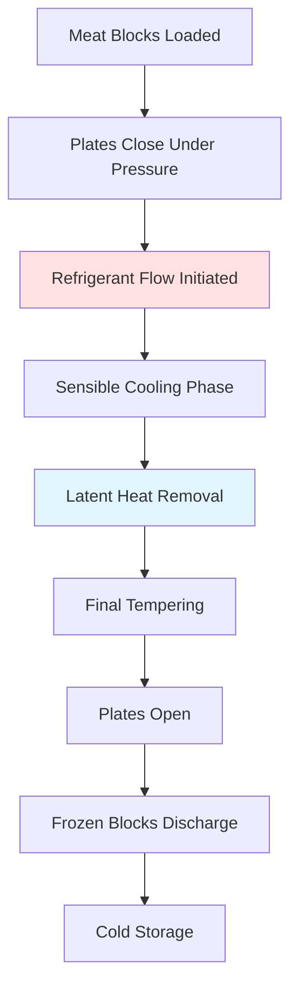

Plate freezing represents the most efficient method for freezing flat, uniformly-shaped meat products through direct conductive heat transfer. This technology achieves freezing rates 5-10 times faster than air blast systems by eliminating the air film resistance that dominates convective freezing processes.

## Operating Principles

Plate freezers operate by sandwiching meat products between refrigerated metal plates that serve as direct-contact heat exchangers. The fundamental advantage stems from the heat transfer mechanism—conduction through solid-to-solid contact provides thermal conductivity values of 0.4-0.5 W/(m·K) for meat compared to the effective conductivity of 0.02-0.03 W/(m·K) for air film boundary layers in blast freezers.

The refrigerant (typically ammonia or R-507A) flows through channels welded or machined into aluminum or stainless steel plates. Heat extraction occurs in three distinct phases: sensible cooling from initial temperature to freezing point, latent heat removal during phase change, and final sensible cooling to storage temperature.

## Contact Pressure Requirements

Effective heat transfer in plate freezing depends critically on contact pressure between the metal plates and meat surface. Air gaps as small as 0.1 mm create substantial thermal resistance that degrades performance.

**Optimal Pressure Ranges by Product Type:**

| Product Type | Contact Pressure | Purpose |
|--------------|------------------|---------|
| Ground meat blocks | 0.5-1.0 bar (7-15 psi) | Minimize air pockets without deformation |
| Meat patties | 0.3-0.7 bar (4-10 psi) | Maintain shape integrity |
| Sliced meat | 0.2-0.5 bar (3-7 psi) | Prevent crushing of delicate structure |
| Offal blocks | 0.6-1.2 bar (9-17 psi) | Ensure intimate contact with irregular surfaces |

The relationship between contact pressure and interfacial thermal resistance follows:

$$R_{contact} = \frac{1}{h_{contact}} = \frac{\delta_{gap}}{k_{air}} + \frac{1}{h_{surface}}$$

where $\delta_{gap}$ represents the effective air gap thickness (typically 0.05-0.3 mm), $k_{air}$ is thermal conductivity of air (0.024 W/(m·K) at 0°C), and $h_{surface}$ accounts for surface roughness effects.

Hydraulic systems provide uniform pressure distribution across the plate area. Pressure must be sufficient to collapse air pockets but below the threshold that causes product deformation or excessive moisture expression. For ground beef blocks, pressures above 1.5 bar can cause fat separation and texture degradation.

## Heat Transfer Analysis

The freezing time calculation requires analysis of transient heat conduction through the meat block. For rectangular geometry, Plank's equation provides a practical approximation:

$$t_f = \frac{\lambda \rho}{T_f - T_r} \left(\frac{P \cdot a}{h} + \frac{R \cdot a^2}{k}\right)$$

where:
- $t_f$ = freezing time (s)
- $\lambda$ = latent heat of fusion for meat (≈ 250 kJ/kg)
- $\rho$ = density of meat (1050-1100 kg/m³)
- $T_f$ = freezing point of meat (-1.5 to -2.5°C)
- $T_r$ = refrigerant temperature (-35 to -45°C)
- $a$ = half-thickness of product (m)
- $h$ = surface heat transfer coefficient (200-500 W/(m²·K) for plate contact)
- $k$ = thermal conductivity of frozen meat (1.8-2.2 W/(m·K))
- $P$ = geometric constant (0.5 for infinite slab)
- $R$ = geometric constant (0.125 for infinite slab)

For practical application, a 75 mm thick ground beef block at initial temperature of 5°C frozen between plates at -40°C:

$$t_f = \frac{250{,}000 \times 1070}{-1.5 - (-40)} \left(\frac{0.5 \times 0.0375}{300} + \frac{0.125 \times 0.0375^2}{2.0}\right)$$

$$t_f = \frac{267{,}500{,}000}{38.5} \left(0.0000625 + 0.0000879\right) = 6950 \times 0.0001504 = 1045 \text{ seconds} \approx 17.4 \text{ minutes}$$

This compares to 90-120 minutes for equivalent thickness in air blast freezing at the same temperature differential.

## Refrigerant Selection Criteria

Refrigerant choice impacts system efficiency, safety, and operational costs. The primary options for plate freezer applications include:

**Refrigerant Comparison for Plate Freezing:**

| Refrigerant | Evap. Temp. (°C) | Heat Transfer | Safety | Efficiency (COP) | Environmental |
|-------------|------------------|---------------|--------|------------------|---------------|
| Ammonia (R-717) | -40 to -45 | Excellent | Toxic, flammable | 1.8-2.2 | GWP = 0, ODP = 0 |
| R-507A | -40 to -45 | Good | Non-toxic | 1.5-1.9 | GWP = 3985, ODP = 0 |
| R-404A | -38 to -42 | Good | Non-toxic | 1.4-1.8 | GWP = 3922, ODP = 0 (phasing out) |
| CO₂ (R-744) | -45 to -50 | Excellent | Non-toxic | 1.6-2.0 | GWP = 1, ODP = 0 |

Ammonia remains the preferred choice for industrial meat processing facilities due to superior thermodynamic properties and zero global warming potential. The high latent heat of vaporization (1369 kJ/kg at -40°C) enables smaller refrigerant charge and reduced piping sizes compared to synthetic refrigerants.

Carbon dioxide is gaining adoption in cascade systems where CO₂ serves as the low-temperature stage (-45 to -55°C) with ammonia or propane as the high-temperature stage. This configuration provides excellent heat transfer while maintaining safety in food processing areas.

## Ground Meat Block Applications

Ground meat products represent the ideal application for plate freezing technology. The malleable nature of ground meat allows excellent plate contact, and the high surface area-to-volume ratio of individual blocks maximizes throughput.

**Typical Ground Meat Block Specifications:**

- Dimensions: 400 × 600 × 75 mm (standard), 300 × 500 × 100 mm (compact)
- Weight: 18-22 kg per block
- Fat content: 10-30% (affects freezing point and thermal properties)
- Initial temperature: 2-7°C (post-grinding)
- Final center temperature: -18 to -20°C

Freezing time for standard blocks ranges from 15-25 minutes depending on plate temperature, contact pressure, and fat content. High-fat content (>25%) extends freezing time due to lower thermal conductivity of fat (1.2 W/(m·K)) compared to lean tissue (1.9 W/(m·K)).

Product packaging influences performance significantly. Polyethylene film bags (0.1-0.15 mm thickness) add minimal thermal resistance ($R \approx 0.0005$ m²·K/W) but cardboard cartons create substantial insulation that negates the plate freezing advantage. Direct contact freezing of film-wrapped blocks is standard practice.

## System Design Considerations

Horizontal plate freezers typically contain 20-40 plates in a vertical stack with spacing adjusted by hydraulic cylinders. Each plate measures 600 × 1200 mm to 1000 × 2000 mm depending on product dimensions. Vertical plate freezers orient plates horizontally in a drawer configuration, facilitating easier loading but requiring more floor space.

The refrigeration load calculation must account for:

1. Product heat removal: $Q_{product} = m \cdot [c_p(T_i - T_f) + \lambda + c_{pf}(T_f - T_{final})]$
2. Packaging material heat: $Q_{packaging} = m_{pack} \cdot c_{pack} \cdot \Delta T$
3. Plate thermal mass: Negligible for continuous operation
4. Heat infiltration: 5-10% of product load for well-insulated units

For a system processing 2000 kg/hr of ground beef blocks:

$$Q_{total} = \frac{2000}{3600} \left[3.2 \times 7 + 250 + 1.8 \times 18\right] + 1.05 \times Q_{product}$$

$$Q_{total} = 0.556 \times [22.4 + 250 + 32.4] \times 1.05 = 0.556 \times 304.8 \times 1.05 = 178 \text{ kW}$$

This requires a refrigeration system with capacity of approximately 50 TR (tons of refrigeration) at -40°C evaporator temperature.

## Performance Optimization

Maximizing plate freezer efficiency requires attention to several operational parameters:

- Minimize loading/unloading time to maintain plate temperature
- Ensure uniform product thickness (±3 mm tolerance)
- Apply adequate contact pressure within first 30 seconds
- Maintain refrigerant temperature stability (±1°C)
- Implement automatic defrost cycles to remove frost buildup on plates

Frost accumulation on plate surfaces increases thermal resistance and requires periodic defrost. Hot gas defrost using high-pressure refrigerant vapor completes cycles in 10-15 minutes every 6-8 hours of operation.

## References

ASHRAE Handbook—Refrigeration (2022), Chapter 29: Food Freezing
ASHRAE Handbook—Refrigeration (2022), Chapter 31: Meat Products

---

*This technical content reflects established engineering principles for plate freezing systems in meat processing applications. Design and installation should follow applicable food safety regulations, ASHRAE standards, and manufacturer specifications.*