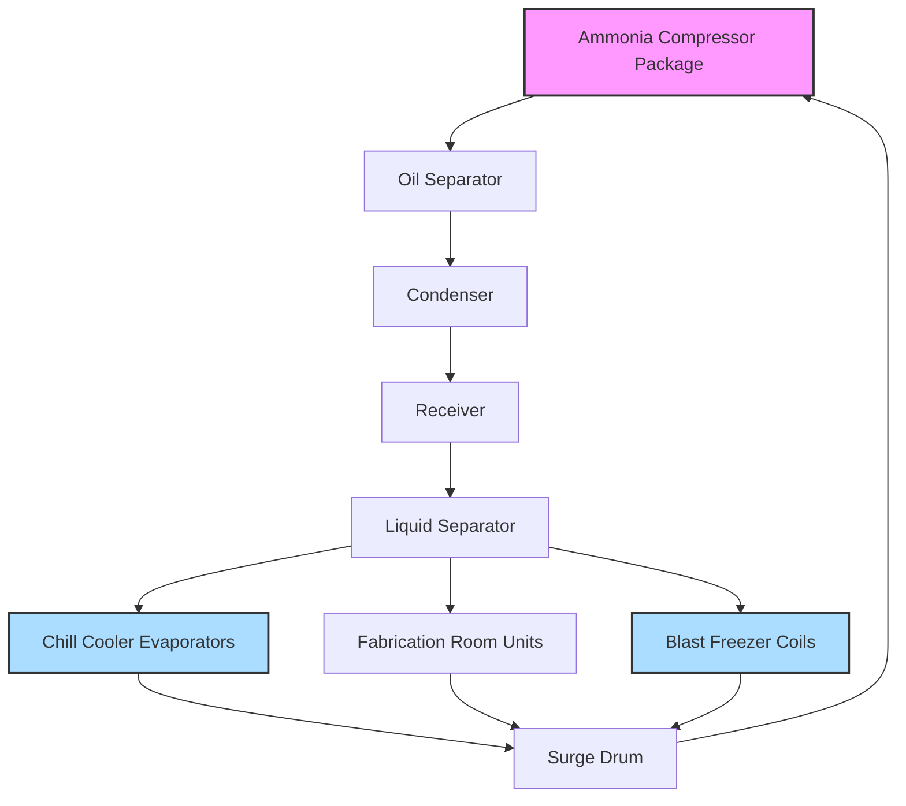

## Overview

Pork processing refrigeration requires precise temperature control across multiple processing stages to ensure food safety, maintain product quality, and optimize yield. The system must rapidly remove metabolic heat while preventing cold shortening and achieving target temperatures within strict time constraints defined by USDA-FSIS regulations.

## Temperature Requirements by Process Stage

### Kill Floor and Hot Side

Post-slaughter pork carcasses enter the refrigeration chain at approximately 38-40°C (100-104°F) internal temperature. The hot side environment requires careful environmental control to prevent microbial growth while facilitating inspection.

| Process Area | Ambient Temperature | Relative Humidity | Air Velocity |
|--------------|-------------------|------------------|--------------|
| Kill floor | 10-13°C (50-55°F) | 85-90% | 0.25-0.5 m/s |
| Pre-chill spray | 1-4°C (34-39°F) | 95-98% | Low velocity |
| Chill cooler | -1 to 2°C (30-36°F) | 90-95% | 0.5-1.5 m/s |
| Fabrication | 7-10°C (45-50°F) | 75-85% | 0.15-0.4 m/s |

### Chilling Time Requirements

ASHRAE Handbook—Refrigeration specifies target chilling rates to achieve 4°C (39°F) internal temperature within 16-24 hours for whole carcasses. The cooling rate depends on carcass mass, initial temperature, and heat transfer coefficient.

The heat removal rate follows:

$Q = m \cdot c_p \cdot \frac{dT}{dt}$

Where:
- Q = heat removal rate (kW)
- m = carcass mass (kg)
- c_p = specific heat of pork (3.35 kJ/kg·K above freezing)
- dT/dt = temperature change rate (K/s)

## Heat Load Calculations

### Product Load

The product heat load dominates in pork chill coolers. For a typical facility processing 500 head per shift at 95 kg average carcass weight:

$Q_{product} = \frac{m_{total} \cdot c_p \cdot \Delta T}{t_{chill}}$

For a 20-hour chill cycle from 38°C to 4°C:

$Q_{product} = \frac{47,500 \text{ kg} \cdot 3.35 \text{ kJ/kg·K} \cdot 34 \text{ K}}{72,000 \text{ s}} = 75.1 \text{ kW}$

### Respiration Load

Fresh pork carcasses continue metabolic activity post-slaughter, generating heat through enzymatic processes. The respiration heat generation rate averages 0.15-0.25 W/kg for the first 24 hours:

$Q_{respiration} = 47,500 \text{ kg} \cdot 0.20 \text{ W/kg} = 9.5 \text{ kW}$

### Infiltration and Transmission Load

Chill cooler infiltration occurs through door openings for carcass loading, personnel access, and imperfect seals. Using the air change method:

$Q_{infiltration} = \frac{ACH \cdot V \cdot \rho_{air} \cdot \Delta h}{3600}$

Where:
- ACH = air changes per hour (typically 1-2 for well-managed coolers)
- V = cooler volume (m³)
- ρ_air = air density (kg/m³)
- Δh = enthalpy difference between outside and inside air (kJ/kg)

## Refrigeration System Design

### Evaporator Selection

Pork chill coolers typically employ unit coolers with 4-6°C (7-11°F) temperature difference (TD) between refrigerant and air to prevent excessive surface moisture loss while maintaining adequate heat transfer. The required evaporator capacity accounts for:

1. **Product load** (60-70% of total)
2. **Respiration load** (8-12% of total)
3. **Infiltration** (10-15% of total)
4. **Transmission** (5-8% of total)
5. **Equipment and lighting** (2-5% of total)

Apply a safety factor of 1.10-1.15 for design capacity.

## Air Distribution Strategy

### Counterflow Principle

Optimal chill cooler design uses counterflow air movement where coldest air contacts nearly-chilled product and warmest air contacts incoming hot carcasses. This maximizes the log mean temperature difference (LMTD):

$LMTD = \frac{\Delta T_1 - \Delta T_2}{\ln(\Delta T_1 / \Delta T_2)}$

Where ΔT₁ and ΔT₂ represent temperature differences at opposite ends of the heat exchanger.

### Air Velocity Control

Excessive air velocity accelerates moisture loss (shrink), while insufficient velocity prolongs chilling time. Target velocities vary by zone:

- **Entry zone (hot carcasses)**: 1.0-1.5 m/s for rapid surface cooling
- **Middle zone**: 0.75-1.0 m/s for continued heat removal
- **Exit zone (nearly chilled)**: 0.5-0.75 m/s to minimize shrink

## Fabrication Room Conditions

Pork fabrication (cutting, trimming, packaging) requires temperatures of 7-10°C (45-50°F) to maintain product quality while providing acceptable working conditions. Lower temperatures increase fat hardness, facilitating cleaner cuts and reducing bacterial growth rates.

The refrigeration load in fabrication rooms includes:

1. **Product heat gain**: Chilled product warming from handling
2. **Personnel heat**: 250-350 W per worker (sensible + latent)
3. **Equipment heat**: Motors, conveyors, packaging equipment
4. **Lighting**: LED systems reduce load versus traditional fixtures
5. **Infiltration**: From adjacent spaces and loading areas

## Microbiological Control

Temperature directly affects bacterial growth rates. The growth rate constant follows the Arrhenius relationship:

$k = A \cdot e^{-E_a/(R \cdot T)}$

Where:
- k = growth rate constant
- A = frequency factor
- E_a = activation energy
- R = universal gas constant
- T = absolute temperature (K)

Maintaining temperatures below 7°C reduces most pathogen growth to negligible levels. Each 10°C reduction in storage temperature decreases bacterial growth rate by approximately 50-70%.

## Energy Efficiency Strategies

### Variable Frequency Drives

Implementing VFDs on evaporator fans allows air velocity modulation based on product temperature profiles. As carcasses approach target temperature, reducing fan speed from 100% to 60% can decrease energy consumption by 40-50% while preventing excessive shrink.

### Hot Gas Defrost

Evaporator coils operating below 0°C accumulate frost, reducing heat transfer efficiency. Hot gas defrost systems use discharge gas from compressors to rapidly melt frost, minimizing downtime compared to electric or off-cycle defrost methods.

### Compressor Capacity Control

Modern ammonia screw compressors with variable slide valves or variable speed drives match refrigeration capacity to actual load, eliminating inefficient on-off cycling and reducing power consumption during partial load operation.

## Food Safety Considerations

USDA-FSIS 9 CFR 416.5 mandates continuous temperature monitoring in all refrigerated spaces. The refrigeration system must maintain chill cooler temperatures sufficient to achieve 4°C (40°F) or below within regulatory time limits. Temperature deviation alarms should trigger at +2°C above setpoint with immediate notification to QA personnel.

Critical control points include:
- Post-slaughter chill initiation time
- Carcass deep temperature verification
- Cooler air temperature uniformity
- Product hold time before fabrication
- Cold chain maintenance through distribution

## Conclusion

Pork processing refrigeration systems demand careful integration of thermodynamic principles, food safety requirements, and operational efficiency. Proper system design ensures regulatory compliance, maintains product quality, minimizes shrink losses, and optimizes energy consumption across the entire processing facility.
