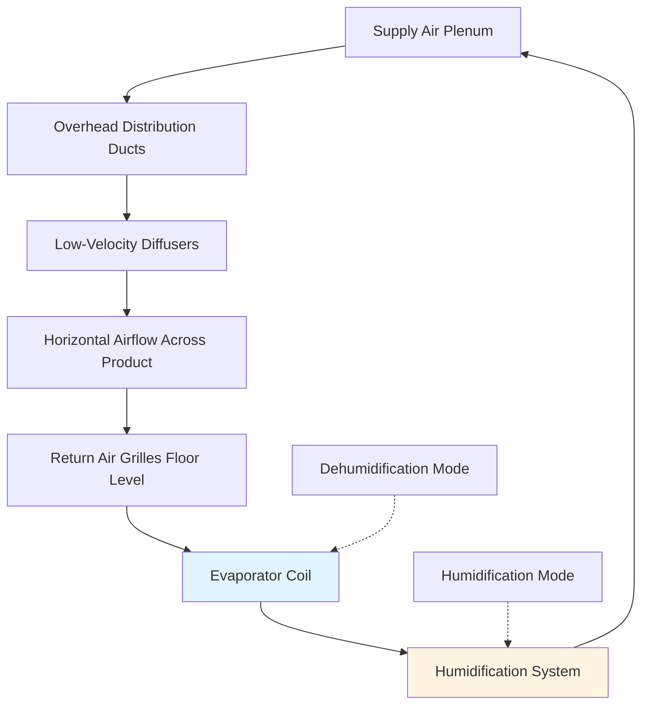
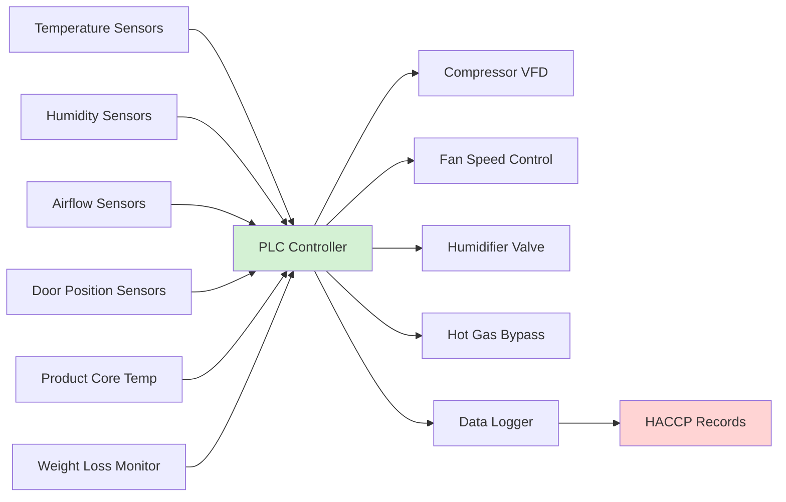

## Environmental Control Requirements

Pork curing operations demand precise environmental control to facilitate salt penetration, moisture equilibration, and microbial stability. The curing process involves complex mass transfer phenomena where temperature and humidity directly influence diffusion rates and product quality.

### Temperature Control Zones

Curing room design incorporates multiple temperature zones based on product type and curing stage:

| Curing Type | Temperature Range | Relative Humidity | Duration | Application |
|-------------|------------------|-------------------|----------|-------------|
| Dry Curing | 2-4°C | 65-75% | 14-90 days | Prosciutto, country ham |
| Wet Curing | 0-2°C | 85-95% | 3-10 days | Bacon, city ham |
| Equilibrium Curing | 2-4°C | 75-85% | 7-21 days | Whole muscle products |
| Drying Phase | 12-18°C | 65-75% | 30-180 days | Dry-cured sausages |
| Smoking Operations | 24-60°C | 40-60% | 2-8 hours | Flavor development |

### Psychrometric Considerations

The relationship between dry bulb temperature, wet bulb temperature, and relative humidity governs moisture migration from meat surfaces. The water activity equilibrium follows:

$$a_w = \frac{p}{p_0} = \frac{RH}{100}$$

where $a_w$ is water activity, $p$ is vapor pressure at the meat surface, and $p_0$ is saturation vapor pressure at the given temperature.

Weight loss during curing results from moisture diffusion, calculated using Fick's first law:

$$J = -D \frac{\partial C}{\partial x}$$

where $J$ is diffusion flux (kg/m²·s), $D$ is diffusion coefficient (m²/s), and $\frac{\partial C}{\partial x}$ is concentration gradient.

## Refrigeration Load Analysis

Cooling loads in curing rooms differ from conventional cold storage due to metabolic heat generation, salt dissolution reactions, and batch loading patterns.

### Heat Load Components

**Product Load:**

$$Q_{product} = m \cdot c_p \cdot \Delta T$$

where $m$ is product mass (kg), $c_p$ is specific heat of curing meat (3.2-3.6 kJ/kg·K), and $\Delta T$ is temperature change.

**Respiration Load:**

Fresh pork generates metabolic heat even under refrigeration:

$$Q_{resp} = 0.08 \text{ to } 0.15 \text{ W/kg at 2-4°C}$$

**Infiltration Load:**

Personnel access and door openings introduce warm, humid air. For a curing room with volume $V$ (m³) and air changes per hour $ACH$:

$$Q_{infiltration} = \frac{V \cdot ACH \cdot \rho_{air} \cdot \Delta h}{3600}$$

where $\Delta h$ is enthalpy difference (kJ/kg) between ambient and room air.

## Air Distribution Systems

Proper air circulation ensures uniform temperature and humidity distribution while preventing surface case hardening.

### Airflow Velocity Requirements

Surface air velocity must be controlled to prevent excessive moisture removal:

- **Dry Curing:** 0.1-0.3 m/s (gentle circulation)
- **Wet Curing:** 0.3-0.5 m/s (moderate circulation)
- **Drying Phase:** 0.5-1.0 m/s (active moisture removal)

Air turnover rates typically range from 15-40 air changes per hour, depending on product density and hanging configuration.

## Humidity Control Systems

Maintaining precise humidity levels requires both humidification and dehumidification capabilities.

### Humidification Methods

**Steam Injection:**
- Provides rapid response
- Clean vapor source required
- Energy input: 2260 kJ/kg water vaporized

**Evaporative Pads:**
- Lower energy consumption
- Requires continuous water treatment
- Cooling effect must be compensated

**Ultrasonic Atomization:**
- Fine droplet generation (1-10 μm)
- Minimal thermal impact
- Higher equipment cost

### Dehumidification Approaches

**Refrigeration-Based:**

Moisture removal capacity follows:

$$m_{water} = \frac{Q_{latent}}{h_{fg}} = \frac{V \cdot \rho \cdot (W_1 - W_2) \cdot ACH}{3600}$$

where $W_1$ and $W_2$ are humidity ratios (kg water/kg dry air) before and after dehumidification.

**Desiccant Systems:**

Employed in low-temperature applications where refrigeration coils would frost. Regeneration energy:

$$Q_{regen} = 3000 \text{ to } 4200 \text{ kJ/kg water removed}$$

## Evaporator Design Considerations

Evaporator selection impacts both temperature control and humidity maintenance.

### Coil Configuration

| Parameter | Dry Curing | Wet Curing | Impact |
|-----------|------------|------------|--------|
| Fin Spacing | 6-8 mm | 4-6 mm | Frosting prevention vs. heat transfer |
| TD (Coil Δt) | 3-5°C | 5-8°C | Humidity control vs. capacity |
| Face Velocity | 1.5-2.0 m/s | 2.0-2.5 m/s | Moisture removal rate |
| Defrost Frequency | 1-2/day | 2-4/day | Frost accumulation rate |

The temperature difference between refrigerant and air must be minimized in dry curing to prevent excessive moisture removal:

$$RH_{leaving} \approx RH_{entering} - \left(\frac{TD}{T_{dewpoint} - T_{air}}\right) \times 100$$

## Control System Architecture

Modern curing rooms employ integrated control systems monitoring multiple parameters.

### Control Sequences

**Standard Operation:**
1. Maintain setpoint temperature ± 0.5°C
2. Modulate humidity via humidification/dehumidification
3. Adjust airflow based on product load
4. Log conditions at 15-minute intervals

**Defrost Cycle:**
1. Temperature rise initiation at 0.5°C above setpoint
2. Hot gas or electric defrost for 15-30 minutes
3. Drain period 5-10 minutes
4. Resume normal operation with fan delay

## Energy Optimization Strategies

Curing operations represent significant energy consumption due to extended cycle times and humidity control requirements.

### Load Management

**Batch Scheduling:**
Grouping similar products reduces temperature and humidity cycling. Energy savings range from 15-25% compared to random loading.

**Night Setback:**
Limited application due to product sensitivity, but drying rooms can implement 2-3°C setback during low-activity periods.

### Heat Recovery

**Condenser Heat Utilization:**

Available heat from refrigeration condenser:

$$Q_{condenser} = Q_{evaporator} + W_{compressor}$$

Applications include:
- Hot water generation for sanitation (60-80°C)
- Drying room heating during cold weather
- Smoke house preheat air

Typical COP for heat recovery systems: 3.5-4.5

## Sanitation and Equipment Selection

USDA-FSIS requirements mandate specific construction and materials for meat processing refrigeration.

### Material Requirements

- **Evaporator Coils:** 304 or 316 stainless steel
- **Drain Pans:** Sloped 1:50 minimum, sealed construction
- **Ductwork:** Smooth interior, welded seams
- **Insulation:** Closed-cell foam, NSF-approved facing

### Cleaning Protocols

High-humidity environments promote microbial growth on cooling equipment. Weekly sanitation includes:
- Coil cleaning with approved antimicrobial agents
- Condensate pan disinfection
- Air filter replacement or cleaning
- Drain line flushing with quaternary ammonium compounds

## Safety Monitoring

Critical control points (CCPs) in curing operations include temperature, humidity, and time monitoring per HACCP requirements.

**Temperature Monitoring:**
- Primary sensors calibrated quarterly (±0.3°C accuracy)
- Redundant sensors for alarm verification
- Chart recorders or electronic data logging

**Humidity Verification:**
- Calibration against saturated salt solutions
- Monthly verification checks
- Alarm settings: ±5% of setpoint

**Product Safety Limits:**
- Maximum time above 4°C: 2 hours cumulative
- Minimum drying time for water activity reduction
- Surface moisture control to prevent Listeria growth

## Design Recommendations

Based on ASHRAE Handbook—Refrigeration and industry best practices:

**Cooling Capacity:**
Size evaporators for 150-200% of calculated load to accommodate humidity control requirements and batch loading.

**Compressor Selection:**
Variable capacity systems (VFD scroll or reciprocating) provide superior temperature control compared to on/off cycling.

**Refrigerant Choice:**
- R-404A: Traditional choice, being phased out (GWP 3922)
- R-448A: Lower GWP alternative (GWP 1387)
- R-744 (CO₂): Cascade systems for environmental compliance (GWP 1)

**Insulation Values:**
Minimum R-30 (RSI-5.3) for walls and ceiling, R-40 (RSI-7.0) for floors to maintain stable conditions and reduce condensation risk.

The precision required in pork curing operations demands careful integration of refrigeration capacity, air distribution, and humidity control to achieve consistent product quality while maintaining food safety standards.
